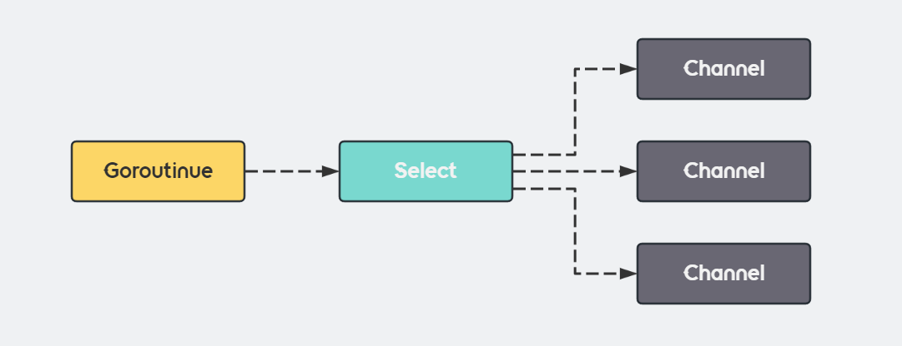
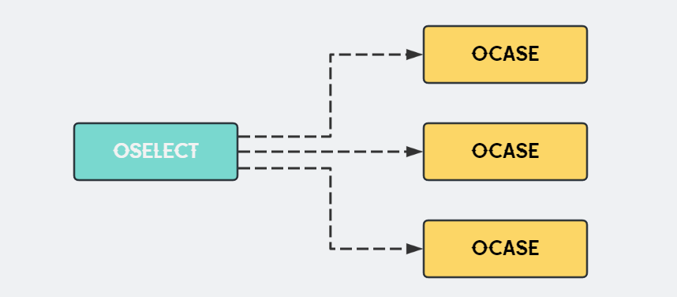
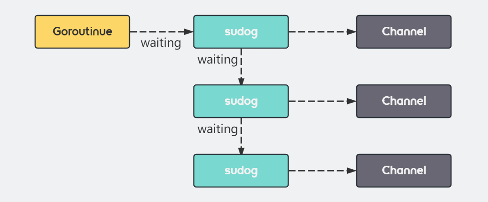

大家好，我是小❤，一个漂泊江湖多年的 985 非科班程序员，曾混迹于国企、互联网大厂和创业公司的后台开发攻城狮。

## 1. 引言

今天呢，咱们来聊聊 Go 语言的那点事儿，尤其是咱们在并发处理中常用的 select 语句，它可是处理并发时的一把利剑！



Go 语言的 select 语句，仿佛是编程世界中的一位冷静的裁判，当多个通道（channel）全都争着抢话语权的时候，它就会站出来，公平地判决谁应当先发声。

换句话说，**select 可以在多个通道之间等待并选择可用的通道执行操作。**

你得这么看select语句——它是并发编程领域里的一块重要的拼图，没有这块，你画出的并发图景就不完整。

首先，我们来看一个简单的示例：

``` go
select {
case <-chan1:
  // 操作1
case data := <-chan2:
  // 操作2
case chan3 <- data:
  // 操作3
default:
  // 默认操作
}
```

还别说，这几行代码，简单明了，但它背后可是隐藏着深邃的并发处理智慧：

1. select 可以在 channel 上进行非阻塞的收发操作；
2. 当存在可以收发的 channel 时，会直接处理该 channel 对应的 case；

2. 如果没有任何通道准备好，它就会执行 default 子句（如果有的话）；

3. 如果连 default 都没得，那它就会那么静静站着，不厌其烦地等待，直到有一个通道准备好。

优雅！这是使用过 select 语句后，我心中的感叹。就像你有了一块功能强大的瑞士军刀，可以灵活地应对各种野外求生的情况。

在代码中，**select 语句也可以灵活地处理多个通道的并发操作，避免使用复杂的同步工具实现并发操作**。


##  2. select 机制

讲科技，不能光有干巴巴的代码堆砌，还得有历史沉淀（反正以前历史老师是这么教的 :）。

而我们现在探讨的是 Go 语言里的 select 思想，**它最初源自于网络 IO 模型中的 select，其精华在于 IO 多路复用。**

想象一下，有那么一刻，你需要同时倾听来自世界各地的广播，这可不是一件简单的事儿。然而，这正是 go 中的 channel 和 select 的日常所在：致力于协调多个渠道的信息流，也只有在这里，才有 “通道争鸣” 的景象。


### 2.1 Go select 特性

让我们像切洋葱一样，一层层地剥开 select 神秘的外衣：

1. **每个案例必须是个通道**：这是规定，没得商量，像是一场形式各异的对话，总得有人发声，对吧？
2. **所有被发送的通道表达式先被求值**：这就像是通道们排着队，等待裁判 select 逐一审视。
3. **如果有多个符合条件，select 公平地随机挑一个执行**：这也是 select 魅力之一所在，我们下文会从代码层面探讨这个特性。
4. **如果没有通道准备好，执行 default 子句（如果有的话）**：和网络选择一样，咱不能干等着，得找点事做。
5. **没有 default，select 就等着，也许数秒，也许是永恒**：如果没有 default，那也只能干等着了，考验裁判耐心的时刻。
6. **通道关闭时，读取会导致死循环**：这像是一个已经倒闭的电台，但你的收音机还在不断尝试调频接收信号。
7. **空的 select 会造成死锁**：这就是没有对话的对话框，静默的无声世界。


### 2.2 特性验证

接下来，咱们通过一系列实验来检验真实世界中 select 的行为。

#### 1）select 已关闭通道和空通道场景

##### 再来看以下代码：

```go
func main() {
	c1, c2, c3 := make(chan bool), make(chan bool), make(chan bool)
	go func() {
		for {
			select {
			// 保证c1一定不会关闭，否则会死循环此case
			case <-c1:
				fmt.Println("case c1")

			// c2可以防止出现c1死循环的情况
                        // 如果c2关闭了(ok==false)，将其置为nil，下次就会忽略此case
			case _, ok := <-c2:
				if !ok {
					fmt.Println("c2 is closed")
					c2 = nil
				}

			// 如果c3已关闭，则panic(不能往已关闭的channel里写数据)
			// 如果c3为nil，则ignore该case
			case c3 <- true:
				fmt.Println("case c3")

            case v <- c4:
                fmt.Println(v)
			}       
            
		}
	}()
	time.Sleep(10 * time.Second)
}
```

当 channel 关闭以后，`case <- chan` 会接收该通信对应数据类型的零值，所以会出现死循环。


#### 2）带 default 语句实现非阻塞读写

```go
select {
    case <- c1:
    fmt.Println(":case c3")
    // 当c1没有消息时，不会一直阻塞，而是进入default
    default:
    fmt.Println(":select default")
}
```

注意，Go 语言的 select 和 Java 或者 C 语言的 switch 还不太一样：switch 中一般会带有 default 判断分支，但 select 使用时，**外层的 for 循环和 default 不会同时出现，否则会发生死锁**。


#### 3）select 实现定时任务

```go
func main() {
    done := make(chan bool)
    var selectTest = func() {
       for {
          select {
             case <-time.After(1 * time.Second):
             fmt.Println("Working...")
             case <-done:
             fmt.Println("Job done!")
         }
      }
   }
    go selectTest()

    time.Sleep(3 * time.Second)
    done <- true
    time.Sleep(500 * time.Microsecond)
}
```

这个例子模拟的是一个简易的定时器，**每隔一秒钟它都会打印 "Working..." 直到我们通过关闭 done 通道告诉它 "任务完成"**。

这样的模式在你需要定时检查或者定时执行一些任务时非常有用！

代码运行结果：

> Working...
>
> Working...
>
> Job done!

注意，如果定时器的另外 case 分支是上面已关闭 channel 场景，可能会出现异常，如下所示：

```go
func main() {
	done := make(chan bool)
	t := time.Now()
	var selectTest = func() {
		for {
			select {
			case <-time.After(100 * time.Microsecond):
				fmt.Println(time.Since(t), " time.After exec, return!")
				return
                         case <-done:
                         	fmt.Println("over")
			}
		}
	}
        // 关闭 chan
	close(done)
	go selectTest()

	time.Sleep(2 * time.Second)
}
```

我们在并发执行之前就 `close(done)` 关闭了 Channel，不妨猜一下这段代码会输出什么，答案是：

> ...
>
> over
>
> over
>
> over
>
> 601.3938ms  time.After exec, return!

这是因为：done 已经被关闭了，所以当执行 `case <-done` 语句时会死循环此 case 分支。但是，为什么还会执行退出 case，而且 `return` 时，时间来到了 `601.3938ms` 呢？

从上面代码中定时器 case 100 ms 执行一次，我们不难得知，**程序退出时是第 6 次执行 select 语句**，这里面究竟有什么魔法呢？

让我们接着往下看！


#### 多个 case 满足读写条件

上文已经描述过，如果多个 case 满足读取条件时，select 会随机选择一个语句执行。

让我们用代码来详细描述一下：

```go
func main() {
    done := make(chan int, 1024)
    tick := time.NewTicker(time.Second)
    var selectTest = func() {
       for i := 0; i < 10; i++ {
          select {
             case done <- i:
             fmt.Println(i, ", done exec")
             case <- tick.C:
             fmt.Println(i, ", time.After exec")
         }
          time.Sleep(500 * time.Millisecond)
      }
   }
    go selectTest()

    time.Sleep(5 * time.Second)
}
```

这个例子开启了一个 `goroutine` 协程来运行 `selectTest` 函数，在函数里面 for 循环 10 次执行 select 语句。并且，select 的两个分支 `case done <- i` 和 `case <- tick.C` 都是可以执行的。

这时候，我们看一下执行结果：

> 0 , done exec
>
> 1 , done exec
>
> 2 , time.After exec
>
> 3 , done exec
>
> 4 , time.After exec
>
> 5 , done exec
>
> 6 , done exec
>
> 7 , done exec
>
> 8 , time.After exec
>
> 9 , done exec

注意，以上结果多次运行的打印顺序可能不一致，是正常现象！

我们可以发现，原本写入 done 通道的 2、4 和 8 不见了，说明在循环的过程中，select 的两个分支 `case done <- i` 和 `case <- tick.C` 都是执行了的。

因此，这就验证了当多个 case 同时满足时，select 会随机选择一个执行。这个设计是由于某个 case 出现饥饿问题，而某个前面的 case 一直在执行。

为了避免这种现象，让每个 case 都能公平竞争，所以在十多年前 Go 新增 select 引入时提交并一直保留至今，虽然中途有过细微的变更，但整体语义没有变化。


## 3. 底层原理

Go语言中 `select`用于处理多个通道（channel）的发送和接收操作，但在 Go 语言的源代码中没有直接对应的结构体。

因此，`select`通过`runtime.scase`结构体表示其中的每个 case，该结构体包含指向通道和数据元素的指针：

```go
type scase struct {
	c    *hchan         // chan
	elem unsafe.Pointer // data element
}
```


### 编译器

编译时，`select` 语句被转换成 `OSELECT` 节点，持有 OCASE 节点集合，每个 OCASE 代表一个可能的操作，包括空（对应 `default`）。



根据情况不同，编译器会优化`select`的处理过程。优化处理的情况分为：

1. 不存在任何 case 的 select：直接阻塞，使用 `runtime.block` 函数使当前协程（goroutine）进入永久休眠状态。
2. 只有一个 case 的 select：改写成单个 if 条件语句。
3. 有一个 case 是 default 的两个 case 的 select：被视为非阻塞操作，分别优化为非阻塞发送或接收。
4. 多个 case：通过运行时函数 `runtime.selectgo` 处理，从几个待执行的 case 中选择一个。

非阻塞操作进行相应的编译器重写，发送使用 `runtime.selectnbsend` 函数进行非阻塞发送，接收方面有两种函数处理单值和双值接收。


### 运行时



运行时，`runtime.selectgo`函数通过以下几个步骤处理 select：

1. 初始化阶段，决定 case 的处理顺序。
2. 遍历 case，查找立即就绪的 Channel，如果有则立即处理。
3. 如果没有立即就绪的 Channel，将当前 Goroutine 加入到所有相关 Channel 的收发队列中，并挂起。
4. 当某个 case 就绪时（Channel 收到数据或有空间发送数据），调度器唤醒挂起的 Goroutine，查找并处理对应的 case。


## 4. 小结

本文中，我们谈到了 Go 语言里 `select` 的基本特性和实现，提到了`select`与直接 Channel 操作的相似性，以及通过 `default` 支持非阻塞收发操作。

我们还揭示了`select` 底层实现的复杂性——需要编译器和运行时支持。

通过以上不难得知，Go 的 `select` 语句在不同场景下的行为和实现是比较奇妙的，这也是 Go 独特的数据结构，其背后的设计与优化策略都需要我们对 Go 底层有着比较完善的认知。

好了，由于篇幅有限，本文到这里就结束了，如果觉得文章有所启发或收获，不妨点赞、分享，加入在看，这对我是最大的鼓励！

如果你有任何问题或想了解更多，也随时在评论区提问，谢谢你的阅读！

ღ( ´･ᴗ･` )比心

我是小❤，我们下期再见。