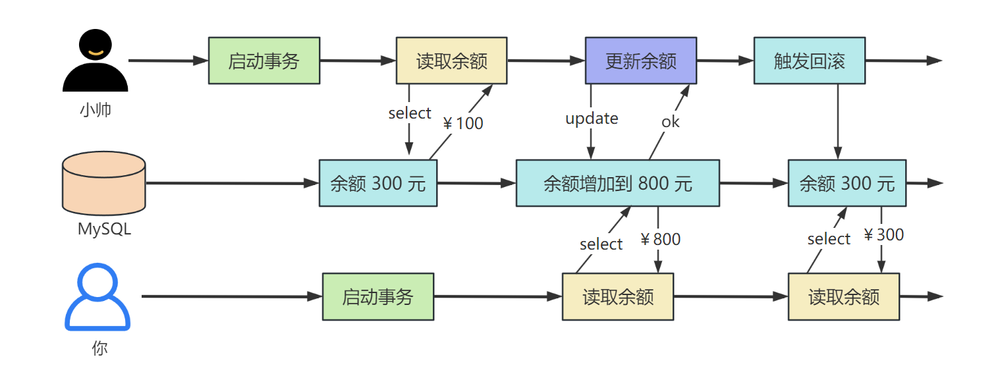

## 1. 引言

大家好，我是小❤，一个漂泊江湖多年的 985 非科班程序员，曾混迹于国企、互联网大厂和创业公司的后台开发攻城狮。

最近小❤在梳理我之前的面试资料时发现，面试过程中，基本上都会问到 MySQL 数据库相关的知识点。

而 MySQL 中，问得最多的就是事务、隔离级别以及 MVCC 这几个，无论是互联网大厂、小厂，甚至是国企，它们的覆盖率竟高达 80%。

其实面试官也知道，八股文谁都会背，但是可以说明白，甚至说透彻的候选人却是凤毛麟角。

所以今天小❤就带大家来解锁那些藏在 MySQL 底层的黑科技：事务与隔离级别。

## 2. 事务

### 2.1 直播打赏

首先，让我们来谈谈事务。

事务就像一场魔法表演，它可以**确保一系列数据库操作要么全部执行成功，要么一点都不执行。**

比如你在看直播时，想打赏 500 块给美女主播，需要扣除你的账户余额，并同时增加美女主播的账户金额。

如果转账的两个操作中的一个失败，那你就可能损失金钱或者让金钱消失不见，美女主播也就收不到钱了。

这时，事务就派上用场了。

它可以保证这两个操作要么同时成功，要么同时失败，绝不会出现一半成功一半失败的尴尬局面。

所以，我们**总结一下：**

* Q：数据库为什么要有事务？

* A：为了保证业务正常运转，数据最终一致。

> 不明白什么是最终一致性的，可以看看我之前的这篇文章：[深入浅出：分布式、CAP 和 BASE 理论](http://mp.weixin.qq.com/s?__biz=MzI5Nzk2MDgwNg==&mid=2247484896&idx=1&sn=60dd09486fc9ecc652af917d8a311419&chksm=ecac51e9dbdbd8ffc10b79699ea7e4a8fb00aabc743b15cc5c3311970a9e3046592cbb879364#rd)

### 2.2 事务特性

明白了什么是事务，以及为什么需要事务。接下来我们聊一聊事务的 4 个特性：**原子性、一致性、隔离性和持久性**，简称 ACID。

#### 原子性（Atomicity）

原子性是指**事务包含的操作要么全部成功，要么全部不成功**。

比如 A、B 账户的初始余额为 800 元，100元。此时，A 向 B 转账 500 元，那么分解开来就是 A 账户减 500 元，B 账户加 500 元。

最终结果是 A 账户余额为 300 元，B 账户余额为 600 元。这两个账户余额更新的操作，要么全部执行，要么都不执行。

拿给美女主播打赏的例子，原子性可以保证：要么钱还在，要么钱转到主播账户上并收获主播的一声**谢谢哥哥**！

#### 一致性（Consistency）

**事务执行前，和执行后都会保持一致性状态**。

A、B 账户在转账后，会发生两种情况：

1. 钱转到 B 账户里了，这时 A、B 账户分别为 300、600 元；
2. 钱转出去的过程中数据库网络断开，事务回滚了，A、B 账户还是 800、100 元。

无论怎样，事务发生前后，A、B 银行账户的总额都应该为 900 元，这就是前后一致性。

#### 隔离性（Isolation）

隔离性是当多个用户并发访问数据库时，不管是不是操作同一个库、还是同一张表，数据库为每一个用户开启的事务，不能被其他事务的操作所干扰，多个并发事务之间也要相互隔离。

比如，A 向 B 转账的时候，不管别人怎么转账，都不会影响他们的交易。

拿给美女主播打赏的例子，隔离性就是：不管有多少人在给主播打赏，都不会影响你转钱的事务，也就不会影响主播叫你一声**好哥哥**！

#### 持久性（Durability）

**一个事务一旦被提交了，那么对数据库中的数据的改变就是持久性的【即保存到磁盘里】**，即便是在数据库系统遇到故障的情况下也不会丢失提交事务的操作。 

拿给美女主播打赏的例子，持久性就是：你只要给主播转了钱，钱就进了她的账户，无论收获主播的多少声**谢谢好哥哥**，钱也回不来了。

好，我们**总结一下：**

* Q：为什么事务有这几大特性？

* A：我们要保证事务的数据一致性，就需要一些手段来实现，这几种手段就是事务的几个特性。

它们分别是原子性、一致性、隔离性和持久性，其中**一致性是目的，而原子性、一致性和隔离性都是为了实现数据一致性的手段**。

## 3. 事务并发和隔离

### 事务并发

并发是指计算机系统或程序在同一时间内同时处理多个任务或操作的能力，也就是允许多个用户进程去处理同一块临界区。

> 想从进程或处理器的角度来理解并发的，可以看我之前的这篇文章：GPM调度模型

拿打赏主播来举例，并发就是多个观众都想打赏主播，如果你们一起转钱，那主播的账户余额该怎么修改呢？

这里的任务就是转账，用户进程就是负责交易的服务器进程，临界区就是主播账户的存储空间。

如果出现了事务并发，就会带来一些意想不到的问题，例如常见的**脏写、脏读、重复读和幻读**。

### 脏写

脏写是指：在事务并发的时候，**一个事务可以修改另外一个正在进行中的事务的数据，这可能会导致一个写的事务会覆盖另外一个写的事务数据**。

当你和小帅一起给美女主播打赏时，你打赏了 500 块，小帅打赏了 1000 块，在写入数据库的时候，你写入的数据被小帅的数据给覆盖了。

最后导致的结果就是，你钱没了，而美女主播在直播间说的是**谢谢小帅哥哥**的打赏！

### 事务隔离

500 块钱没了，美女主播还不理你，你很伤心，但是不知道怎么办？

别难过！事务隔离可以帮你。

MySQL 提供了事务隔离级别，包括：**读未提交、读已提交、可重复读以及串行化**，来解决事务中各种并发问题，专治各种不开心。

### RU - 读未提交（Read uncommitted）

RU（读未提交）是指，如果一个事务开始写数据，则另外一个事务不允许同时进行写操作，但允许其他事务读取此行数据。

RU 可以排他写，但是不排斥读线程实现。

这种隔离级别解决了上面的脏写问题，但可能会出现**脏读，即事务 B 读取到了事务 A 未提交的数据**。

你想给美女主播打赏 500 块，发现银行卡余额只有 300 块，这时你想到了前几天找你借了 500 块钱的小帅，于是让小帅还钱。

小帅非常清楚数据库的事物隔离机制，知道你处于 RU 的事务隔离级别。于是说马上还你钱，这时出现了以下情况：

* 小帅：开启事务 A，给你转钱 500，事务未提交；

* 你：开启事务 B，查询余额，发现余额已经加了 500，于是把小帅的借条撕掉，并准备给主播打赏；
* 小帅：看到借条已经没了，于是撤销事务 A。他的钱一分没少，而你只读到了他事务 A 里的余额，但是真实的余额没有增加，即发生了脏读；
* 你：打赏付款时余额不足，损失了价值 500 块钱的借条。

你非常失望，打算和小帅绝交，然后继续学习剩下的隔离机制，看看怎么避免脏读发生。

### RC - 读已提交（Read committed）

该隔离级别在一个事务进行数据写入时，不允许别的事务对该行数据进行访问（包括读写）。这样就可以保证事务读到的数据一定是已经提交了的，**解决了脏读的问题**。

但是 RC 会出现**不可重复读**的问题，比如：事务 A 需要读取两次数据，在读取完第一次数据后，有另一个事务 B 对该数据进行的更新并提交事务。

此时事务 A 再次读取该数据时，数据已经发生了改变，即**事务中两次读取的数据不一致**。

小帅为了挽回友情，给你转了 520 块钱，但是他觉得只还你 500 块就可以，所以让你还他 20 块钱。

你这会忙着看美女主播，没有时间转钱，他建议你把银行卡的账号密码告诉他，他只转 20。

为了保险起见，你打开了一个事务去查询银行卡余额，并告诉了小帅密码，接下来发生了如下场景：

* 你：开启事务 A，查询银行卡余额为 820；
* 小帅：开启事务 B，提款 800，并提交了事务 B；
* 你：在事务 A 中再次查询余额时，发现银行卡只有 20 块钱了，发生了不可重复读。

不仅被借的钱没拿到，又损失了 280 块钱，你越想越气，骂了小帅一顿。然后继续学习隔离机制，看看怎么防止不可重复读的问题。

### RR - 可重复读（ Repeatable read）

在同一个事务内，多次读取同一个数据，在这个事务还未结束时，其他事务不能访问该数据（包括读写）。

这种隔离级别下**解决了脏读和不可重复读**的问题，但是可能会出现**幻读**。

如事务 A 在多次读取数据时，有另一个事务 B 在数据行中间插入或删除了数据，此时事务 A 再次读取时，可能会发现数据的行数变了。

简单来说，**RR - 可重复读可以保证当前事务不会读取到其他事务已提交的 `update` 操作，但无法感知其他事务的 `insert 和 delete` 操作**。

小帅知道你不会再借钱了，还被你骂了一顿，心中不忿。就想着用你的银行账号搞事情，于是发生了接下来的场景：

* 你：开启事务 A，想查询一下刚才交易了几次，事务里看到结果是 2 次；
* 小帅：开启事务 B，发现已经不能修改你的余额数据，就索性往你的银行卡里面写入了 100 次交易记录，交易金额高达数千万，提交事务 B；
* 你：在事务 A 里面继续查询交易次数，发现变成了 102 次；

这时，警察叔叔找上门了，说有人举报你恶意洗黑钱，需要协助调查一下。

还好，经过一番解释和通过银行数据库的日志调查，发现是有人恶意篡改交易记录，你平安无事回到了家。

这时，你痛定思痛，惊觉交友不慎！于是沉下心来继续学习隔离机制。

### 可串行化（Serializable）

该隔离级别下，事务只能依次执行，**解决了脏读、不可重复读和幻读**的问题。但是代价较高，性能很低，一般很少使用。

在这种情况下，每次有观众和你一样想给主播打赏，都需要排队等候，直到前面的交易事务完全结束。

这时，你了解到事务的奇妙和隔离的重要，于是打算好好学习数据库，不再看美女主播跳舞了。而小帅，却迷失在*面向局子编程*的路上越走越远。

## 4. 小结

我们总结一下，数据库通过隔离级别解决了事务并发出现的各种问题：

* RU，读未提交解决了脏写问题，但可能出现脏读；
* RC，读已提交解决了脏读问题，但可能出现不可重复读；
* RR，可重复读解决了不可重复读的问题，但可能出现幻读；
* Serializable，串行化解决了幻读的问题，但性能很低。

> MySQL 是怎么实现事务隔离性的呢？

答案是加锁。事务级别越高，解决的并发事务问题越多，同时也意味着加的锁就越多。

锁的个数对比：RU-读未提交 < RC-读已提交 < RR-可重复读 < Serializable-串行化。

但是，频繁的加锁可能会导致读取数据的时候没办法修改，修改数据的时候没办法读取，极大的降低了数据库读写性能，就像串行化的隔离级别那样。

所以，为了权衡数据安全和性能，MySQL 数据库默认使用的是 RR，即可重复读的隔离级别。

