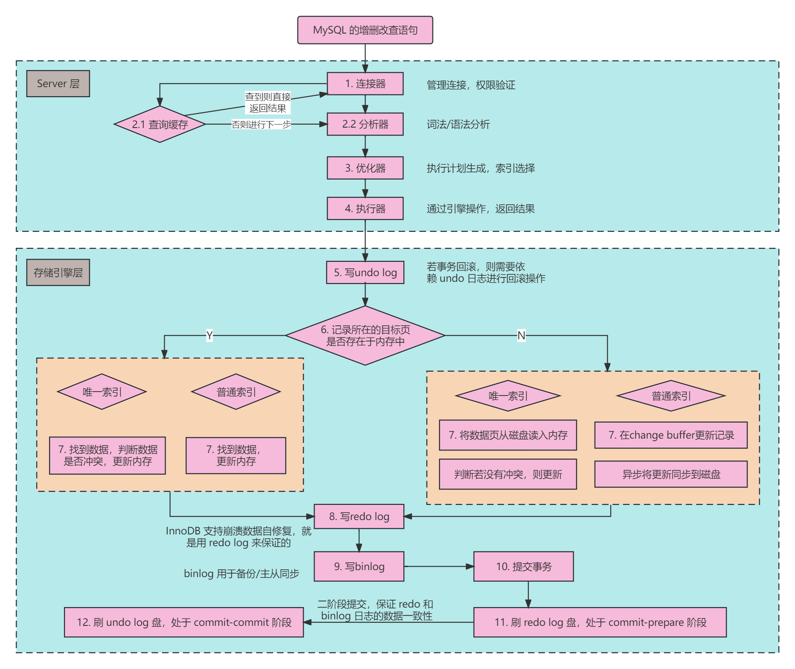
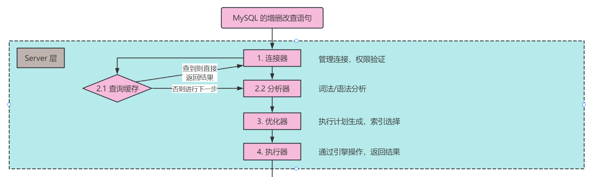
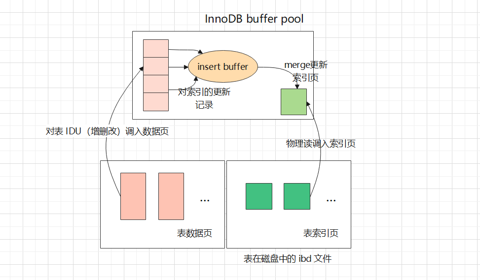
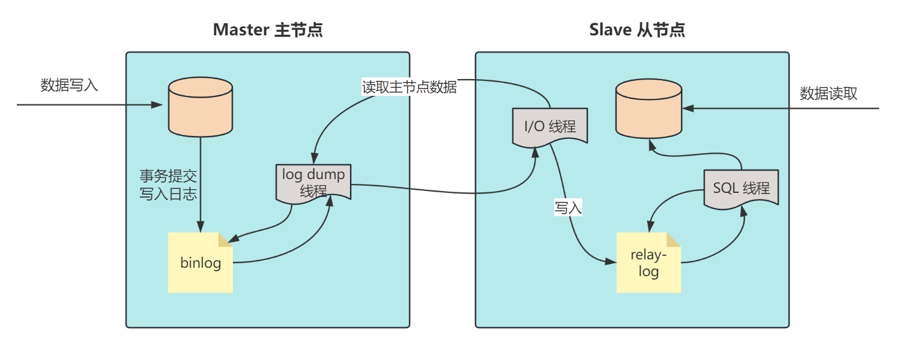

## 1.引言

大家好，我是小❤，一个漂泊江湖多年的 985 非科班程序员，曾混迹于国企、互联网大厂和创业公司的后台开发攻城狮。

最近发现，不管是初入职场，还是已经工作很多年的开发同学。虽然接触数据库（尤其是 MySQL）很长时间了，但**对于 SQL 语句的执行过程都知之甚少，或者一知半解**。

而 MySQL 的执行流程也确实是一个复杂的过程，它涉及多个组件的协同工作，故而在面试或者工作的过程中很容易陷入误区。

### SQL 执行过程

所以，这篇文章我将以 MySQL 常见的 InnoDB 存储引擎为例，为大家详细介绍 SQL 语句的执行流程。从连接器开始，一直到事务的提交和数据持久化。

先来看一张图：

首先，客户端会与 MySQL Server 连接，并发送增删改查语句，Server 收到语句后会创建一个解析树，进行优化。

优化器优化语句时，会**评估各种索引的代价，选择合适的索引**，然后通过执行器调用 InnoDB 引擎的接口来执行语句。

## 2. 具体执行流程

### 1. 连接器（Connection Manager）

MySQL 的执行流程始于连接器。当客户端请求与 MySQL 建立连接时，连接器负责处理这些连接请求。

它验证客户端的身份和权限，然后分配一个线程来处理该连接。**MySQL 每个连接线程会创建一个会话（session）**，在这个会话中，客户端可以发送 SQL 语句进行增删改查等操作。

### 2. 分析器（Parser）

一旦连接建立，客户端可以发送待执行的 SQL 语句。

这些 SQL 语句首先被送到分析器，分析器的任务是**解析 SQL 语句，确定其语法是否正确**，并将其转化为一个内部数据结构，以供 MySQL 后续使用。

如果 SQL 语句有语法错误，分析器将返回错误信息给客户端。

### 3. 优化器（Optimizer）

一旦 SQL 语句被成功解析，接下来进入优化器的领域。

优化器的任务是评估该 SQL 语句不同的执行计划，并选择最优的执行计划。它会考虑哪些索引可用，哪种连接方法效率最高，以及如何最小化查询的成本。

### 4. 执行器（Executor）

执行器接收到优化器生成的执行计划后，它开始执行实际的查询操作。

执行器会按照执行计划中的步骤，调用 InnoDB 引擎层的逻辑并从数据表中获取数据，然后进行**排序、聚合、过滤**等操作。

最终，执行器将结果返回给客户端。

### 5. 写 undo log

当执行器执行修改数据的操作时，MySQL 的 InnoDB 引擎首先会开启事务，为这些修改生成 undo log（也叫回滚日志）。

回滚日志用于**记录修改前的数据，以便在事务回滚时恢复原始数据**。如果事务执行失败，MySQL 可以使用undo log 来撤销已经进行的修改。

### 6. 记录缓存（Record Cache），查找索引

MySQL 使用记录缓存来存储从数据表中读取的数据行，这个**缓存可以加速对频繁读取的数据的访问，避免了每次都要从磁盘读取的开销**。

当数据存在于内存中时，只需要更新内存即可；反之则可能需要从磁盘中读取数据，再更新磁盘数据。

这取决于 MySQL 的索引类型，可分为两种：

- 唯一索引：索引列的值唯一，非主键的唯一索引允许有空值，主键索引不允许空值；
- 普通索引：没有特殊限制，允许重复值和空值；

当 SQL 操作数据到达这一步时，InnoDB 首先会判断数据页是否在内存中：

- 在内存中，判断更新的索引是否是唯一索引。如果是唯一索引，则判断更新后是否破坏数据的一致性，不会的话就直接更新内存中的数据页；如果是非唯一索引，**直接更新内存中的数据页**。
- 不在内存中：判断更新的索引是否是唯一索引。如果是唯一索引，由于需要保证更新后的唯一性，所以需要立即把数据页从磁盘加载到内存，然后更新数据页；如果是非唯一索引，则将数据更新的操作**记录到 change buffer，它将在在空闲时异步更新到磁盘**。

#### change buffer

**change buffer 是 InnoDB 引擎的特性之一**，在 MySQL 5.5 之前，change buffer 的主要作用是提高数据插入的性能，又被称作 insert buffer。

我们知道，当非聚集索引插入时，数据会按主键的顺序存放，所以**叶子节点可能需要离散地访问数据索引页，每次索引页更新时，都需要刷新磁盘**。而每次读写磁盘的时间都会很久，故而导致插入性能较低。

而 insert buffer 开启后，会先判断聚集索引页是否存在于缓冲池中，如果有，直接插入；如果不在，先放入一个插入缓冲区进行排序，再以一定的频率合并（merge）更新索引页。

如图所示，insert buffer 将多次操作合并起来，以减少随机 I/O，减少和磁盘交互的操作，从而提升整体的性能。

MySQL5.5 之后，逐渐加入了数据删除和修改的缓冲类型，统一叫 change buffer。

**一言概之，change buffer 主要作用是将二级索引的增删改（IDU）操作缓存下来，以减少随机 I/O，达到操作合并的效果。**

由于唯一索引需要立即 IO 到磁盘，以保证数据不冲突，因此唯一索引没有 change buffer 机制。

### 8. 写 redo log

在 SQL 执行的过程中，InnoDB 还会记录所有的数据修改操作到 redo log（重做日志）中。

重做日志是一个循环写入的日志文件，它记录了事务的每个步骤，以确保数据的持久性。如果系统崩溃， InnoDB 可以根据 redo log 来恢复未提交的事务，以保持数据的一致性。

注意，**redo log 分为 prepare 和 commit 两个状态**。在事务执行的过程中，InnoDB 把数据页的更改写入到 redo log 时，其状态为 prepare 状态。

### 9. 写 binlog，提交事务

除了 redo log，MySQL 还会记录 binlog（二进制日志）。

二进制日志记录了所有执行的 SQL 语句，而不仅仅是数据修改，这对于数据复制和恢复非常重要，因为它可以确保不仅数据的状态被恢复，连同执行的SQL操作也能被还原。

当 InnoDB 引擎层写好 redo log 后，会通知 MySQL Server 层已将更新操作已经执行完成。这时，MySQL Server 将执行的 SQL 写入到 binlog，然后通知 InnoDB 将 redo log 置为 commit 状态，事务提交成功。

注意，一个**事务提交成功的判断依据在于是否写入到 binlog 日志中**。若已写入，即便 MySQL Server 崩溃，之后也可以根据 redo log 和 binlog 进行恢复。

## 3. redo log 和 binlog

上面说到了，当事务提交时，分为两个阶段，我们总结一下：

1. 数据更新时，先更新内存中的数据页，将更新操作写入到 redo log 中，此时 redo log 进入 prepare 状态。并通知 MySQL Server 更新执行完了，随时可以提交；
2. MySQL Server 根据持久化的模式是 STATEMENT 还是 ROW，决定将更新的 SQL 还是数据行写入到 binlog，然后调用 InnoDB 的接口将 redo log 设置为 commit 状态，更新完成。

细心的同学可能会问了，为什么 binlog 只需要提交一次，而 redo 要提交两次？而已经有 redo log了，还需要 binlog 干啥？

要解答这个问题，得从两种日志的本质区别说起。

### redo log

用于记录 InnoDB 引擎下事务的日志，支持崩溃数据自修复。

**如果只写 binlog，而不写 redo log，当 MySQL 发生故障宕机时，就可能会丢失最近执行的事务数据。**

### binlog

binlog 记录了 MySQL Server 层对数据库执行的所有更改操作，用于数据归档、数据备份及主从复制等。

如果写了 redo log 直接提交，不经过 prepare 阶段，那么这个过程在发生故障时，如果 MySQL 部署了主从节点，**主节点可以根据 redo log 恢复数据，但从节点就无法同步这部分数据**。

从上图可以看出，MySQL 主从复制时，主要依赖 Master 节点的 binlog，Slave 节点的 relay-log 和 3 个重要线程。

#### log dump线程

当从节点连接主节点时，主节点会为其创建一个 **log dump 线程，用于读取和发送 binlog 内容**。在读取 binlog 中时，log dump 线程会对主节点上的 bin-log 加锁，直到读取完成，锁释放。

主节点会为自己的每一个从节点创建一个 log dump 线程。

#### I/O线程

当从节点绑定主节点时，会创建一个 **I/O 线程用来连接主节点，请求主库中的 binlog**。

当主库的 log dump 线程发送的日志被监听到以后，I/O 线程会把日志保存到 **relay-log（中继日志）**中。

#### SQL线程

**SQL 线程负责监听并读取 relay-log 中的内容，解析成具体的操作并进行重放，使其和主数据库保持一致。**每次执行完毕后相关线程会进行休眠，等待下一次唤醒。

从库会在一定时间间隔内探测主库的 bin-log 日志是否发生变化，如有变化，则开启 IO 线程，继续执行上述步骤。

### 结语

感谢阅读观看，我们下期再见！

欢迎点赞分享，收藏加入在看。

