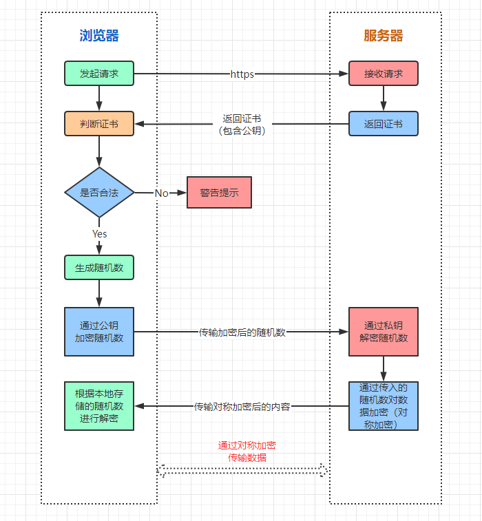
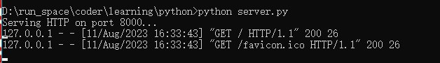
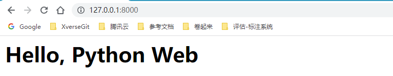
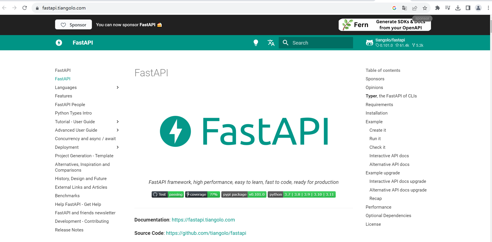
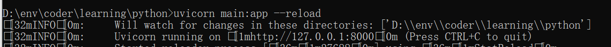
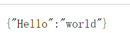
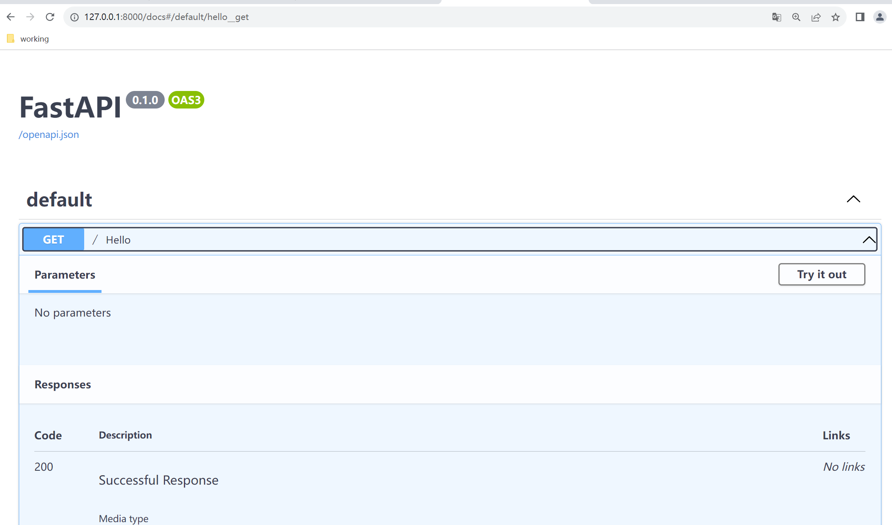
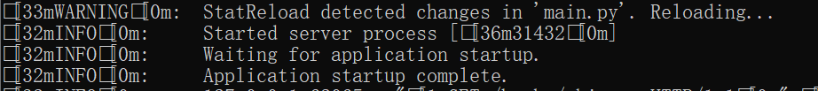
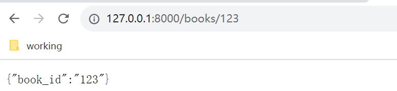
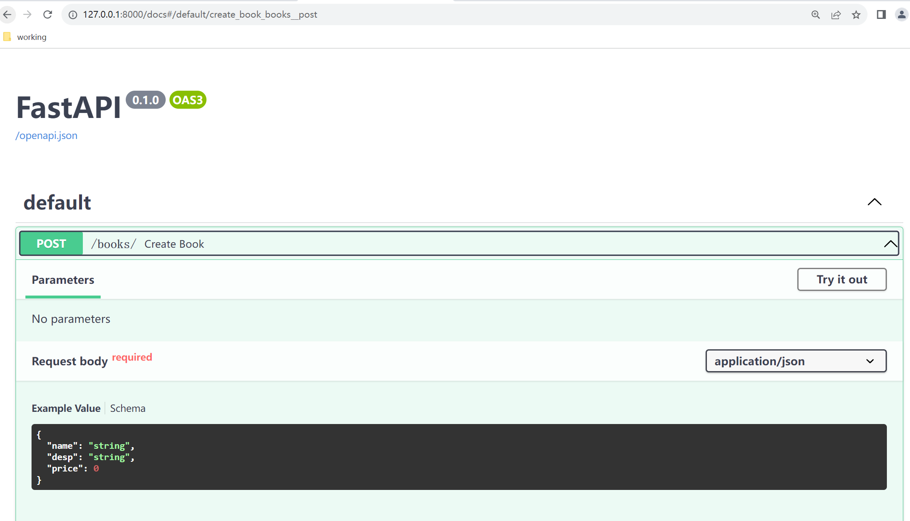

目录

> 1. 引言
> 3. Web后端开发
> 4. Python框架对比
> 4. FastAPI应用
> 5. 总结


## 1. 引言

学完了 Python 入门的上中篇内容，接下来是使用场景最为广泛的 Web 开发知识。

> 时光机：[Python入门篇（上）](http://mp.weixin.qq.com/s?__biz=MzI5Nzk2MDgwNg==&mid=2247484497&idx=1&sn=4ef211b62caa60d97dd1fd26c2898f8d&chksm=ecac5058dbdbd94e68dce8034f01765370ba8fbc30436b998b12e786bde294923612532e8ac4#rd)、[Python入门篇（中）](http://mp.weixin.qq.com/s?__biz=MzI5Nzk2MDgwNg==&mid=2247484501&idx=1&sn=f913e2a8811f35f3d694cfe492327845&chksm=ecac505cdbdbd94a6f04d347be615f9ebe2c14ce934da15c22a3bb38906da38474e147a71422#rd)

随着近年来，互联网技术的飞速发展，再加上移动端应用的突飞猛进，可以说真正让程序开发站在时代的风口，在飞速前行。

程序开发从应用产品的角度上，一般可分为以下两种。


### 1.1 桌面应用程序开发

这是一种比较基本的传统的软件开发方式，是基于 C/S（Client-Server）架构模式的软件体系。

最开始，互联网还没有那么广泛时，基本都是 Client-Server 架构，即每个互联网应用都是一个软件包。我们比较熟悉的有 PhotoShop、QQ 等桌面程序。


它们使用到的开发语言有 C、C++、Java、C# 等，在桌面应用程序开发过程中，我们常常需要考虑的是语言的跨平台性以及软件的多平台支持，比如常见的操作平台 Windows、Linux、MacOS。我们开发一款桌面应用软件，一般需要考虑对这几类操作系统的支持。


### 1.2 web应用程序开发

后来，由于应用程序的更新升级非常迅速，3 天一小版本，5 天一大版本，频繁升级，让用户很不开心。因此，软件开发者就开始想办法，不然这么玩下去应用得凉，于是如今很流行的 BS（Browser/Server）架构上场了。

BS 架构最核心的点在于，应用程序还是部署在服务器上，但是访问它们只需要浏览器的 Web 页面来请求就可以了。这让用户们纷纷鼓掌欢迎，毕竟，电脑/手机装不了太多应用软件，但装个浏览器还是 So easy 的，何况在访问网页时还不需要频繁的升级软件。


一个 Web 互联网产品中，基本上会分为 web UI 设计、Web 后端开发以及 Web 前端/小程序端开发。其中 Web 前端开发主要是页面开发，如今成熟的互联网产品都是前后端分离，至于前后端融合开发的产品开发者（又叫全栈开发）不是没有，而是在大型的互联网产品中相对比较少见。


像小❤以前做传统软件的开发时，就用到了 Java+Spring+JSP+HTML 进行全栈开发，不过那都是过去了，目前 All in 后端开发也挺好的。毕竟咱打工人的觉悟就是：俺是一块砖，哪里需要往哪搬~

现在，你应该已经了解 Web 开发的重要性了，Python 作为一门解释型脚本语言，开发效率很高，所以非常适合用来做 Web 后端开发。

知道了我们现在流行的网络通信模式是 Web 通信（即 BS 架构），现在我们来了解一下 Web 通信的原理。


## 2. Web后端开发

### 2.1 web通信机制

学过计算机网络的都知道（没学过也不要紧），浏览器和服务器的交互是通过 HTTP 网络协议来进行通信的。当我们在网页上输入一个网址，或者点击一个链接时，一个 HTTP 请求就从你的浏览器发送到了目标服务器。



这个是浏览器通过 HTTPs（= HTTP+数据加密+身份认证+完整性保护）协议访问服务器的过程，如图我们不难看出，所谓上网其实就是对网络资源的请求。

这个请求包括一个标识所需资源的唯一 URL，可以理解为网址，但在服务器中它是一个定义资源的唯一路径。

比如 www.baidu.com 对应的百度公司的服务器中，可能映射了一个唯一的网络进程，当你在百度搜索框里输出要查询的内容时，请求就通过网络传输到了一台服务器上，服务器上的 Web 应用处理完请求后，就回复给浏览器一个 HTTP 响应信息。这个响应信息里面就包括了请求的状态（是否成功），请求的内容等。

随后，浏览器通过响应的内容，渲染出我们看到的搜索完成的页面，一次 HTTP（或 HTTPs）请求就结束了。


### 2.2 Python进行Web开发

说了这么多，那我们作为开发者，如何在服务器上部署自己的应用为用户提供网络服务呢？

别着急，Python 为我们提供了规范的接口，只需要实现一个标准的 HTTP 处理函数即可。首先，我们在电脑中随便选取一个目录，编写 `hello.py` 文件：

``` python
def application(env, start_resp):
    start_resp('200 OK', [('Content-Type', 'text/html')])
    return [b'<h1>Hello, Python Web</h1>']
```

然后在同一个目录下，再编写一个 `server.py` 文件，来启动服务器：

``` python
# 从wsgiref模块导入make_server包
from wsgiref.simple_server import make_server
# 导入我们自己编写的application函数
from hello import application

# 创建一个服务器，IP地址为空，端口是8000，处理函数是application
httpd = make_server('', 8000, application)
print('Serving HTTP on port 8000...')
# 监听HTTP请求
httpd.serve_forever()
```

这时候，我们通过 `cmd` 进入命令行，在刚才的文件目录下执行 `python server.py`，就启动好我们自己的服务器了：



当命令行打印 `Serving HTTP on port 8000...` 就代表服务启动成功了，如果启动失败，我们需要检查一下 `8000` 端口是否被其他程序占用，或者在 `server.py` 里面换一个端口再启动。


随后，我们打开任意浏览器，在地址栏输入 `127.0.0.1:8000`，就可以看到如下页面：



此时，属于我们自己的 BS 架构就完成搭建成功了，是不是很简单！


## 3. Python框架对比

上面我们已经实现了一个最简单的服务器，但是离真正上线可用还有一段距离，因为我们的 Web 应用最终的目标是给用户提供服务，而提供服务就必须要接收用户的实时请求，根据请求的内容回复不同的资源。

那么我们如何高效处理用户入参，并快速响应资源呢？

### 3.1 Web框架，提升开发效率的工具

答案是 Web 框架，它可以用来帮助我们提升效率，节省时间，避免处理一些底层的细节。目前业界做 Web 开发，99.9% 的程序员会选用合适 Web 框架助力。

简单来说，如果我们用 Python 开发 Web 应用，所有的代码都得自己手动敲，1000 行的代码用了 Web 框架后，可能只需要 100 行。

### 3.2 常见的Web框架

在 Python 领域，开发 Web 应用最主流的框架是 FastAPI、Django 和 Flask，它们都非常优秀。

尤其是 FastAPI，是用于构建 Web API 的现代、开源、快速、高性能的 Web 框架，它基于Python 3.6+ 标准类型提示，支持异步，正如它的名字，FastAPI 就是为构建快速的 API 而生。

Django 生态很丰富，但是模块较重，用起来相对比较笨重；而 Flask 简单易用，但是对开发人员的要求比较高，否则 Web 应用的代码容易引起安全漏洞。

基于三者的特定对比，我们接下来选择最年轻且性能较高的 FastAPI 来入门。


## 4. FastAPI应用

### 4.1 什么是FastAPI？



> FastAPI 中文参考文档：https://fastapi.tiangolo.com/zh/

FastAPI 是 Python 开发的一个开源 Web 框架，几乎包括了 Web 应用的所有内容，可用于快速搭建高性能、优雅的网站应用。最主要的是，FastAPI 提供了 Web 开发经常使用到的模块，包括自动生成接口文档等，使开发者能够专注业务部分。


### 4.2 使用FastAPI搭建我们的Web应用

首先，我们安装 fastapi 的三方包：

``` python
pip install fastapi uvicorn
```

编写一个 `main.py` 文件：

``` python
from fastapi import FastAPI
#创建一个FastAPI实例，一般用app做实例名，后续运行时会用到这个名称
app = FastAPI()
# 创建一个路径操作，当为"/"时，可以直接访问服务器，如127.0.0.1:8000
# 如果路径为 “/hello"，则需要在路径加上，如127.0.0.1:8000/hello
# 在HTTP协议中，一般用特定的方法执行不同的任务，比如get、post、put、delete
@app.get("/")
def hello():
    # 接口返回内容，这里可以是一个dict，或者是str、int，甚至是一个list
    return {"Hello":"world"}
```


然后在命令行进入该文件目录，运行：

``` python
uvicorn main:app --reload
```

其中，`uvicorn` 代表通过该命令启动文件，`main` 指代 main.py 文件，`app` 指在 main.py 里面通过 `app = FastAPI()` 创建了 app 对象，`--reload` 让服务器在更新代码后重新启动，仅在调试时使用该选项。



可以看到，运行成功了，自动监听本地的 8000 端口。

于是我们打开浏览器，访问 `127.0.0.1:8000`，出现以下页面：



不难看出，用 FastAPI 启动的 Web 服务器，代码更为简洁。同时，FastAPI 还可以自动根据接口参数自动生成<a href="https://github.com/swagger-api/swagger-ui">Swagger</a>文档，只需访问 `127.0.0.1:8000/docs`：



这样，我们第一个用 FastAPI 启动的服务器就成功运行起来了，不难看出这比手敲代码方便很多。


### 4.3 框架常见能力

**接口入参**

如果我们想要在接口添加入参，可以在路径定义变量：

``` python
from fastapi import FastAPI

app = FastAPI()

@app.get("/books/{book_id}")
def read_book():
    return {"book_id":book_id}
```

我们将以上内容保存在 `main.py` 文件中时，由于之前启动加了 `--reload` 参数，服务会重新启动：



此时，我们在浏览器中访问地址 `http://127.0.0.1:8000/books/123`：



可以看到，接口入参已经被接收，并返回给浏览器了。

除此之外，FastAPI 还很方便地支持 Body 传参，顺序传参，默认传参等能力。可以说，Web 开发上，FastAPI 已经帮我们做到了即拿即用，我们只需要调用它封装好的模块包就可以了。


**Body请求体**

除了在接口路径获取参数以外，FastAPI 给我们提供的三方包里面还可以友好支持获取「请求体」参数。

编写 `main.py` 文件：

``` python
from fastapi import FastAPI
from pydantic import BaseModel
# 新增一个书籍Book的数据结构，继承自BaseModel类
class Book(BaseModel):
    name: str
    desp: str
    price: float

app = FastAPI()
# 定义一个post接口，接收一本书的信息
@app.post("/books/")
async def create_book(book: Book):
    return book
```

当我们启动服务器时，`127.0.0.1:8000/books` 接口就会接收请求体作为 JSON 读取，然后转换为对应的数据结构。注意，我们传入的 JSON 需要和定义保持一致，比如：

``` json
{
    "name":100,
    "desp":"一本书",
    "price":88
}
```

其中，name 为 str 类型，但是我们传了 100 是整型，所以接口会报错。

同时，在开发过程中，我们可以随时打开 Swagger 文档【127.0.0.1:8000/docs】，查看接口定义：



这样，我们在传入参数时，可以先参考接口文档，防止数据结构或字段格式出错。


## 5. 小结

到这期为止，Python 入门篇就大概结束了。我们先是从 Python 的语言特性，基本数据类型到 Python 常用操作，到本期内容的 Web 开发，相信一起走完的同学可以开始上手工作了。

后面，我们会结合 Python 语言的数据处理能力，一起和大家学一些 GitHub 上的高 Star 项目。比如股票处理，游戏开发，还有其它和 AI 大模型相关的应用。敬请期待！