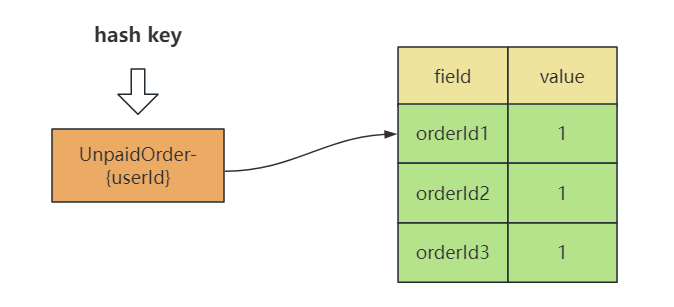
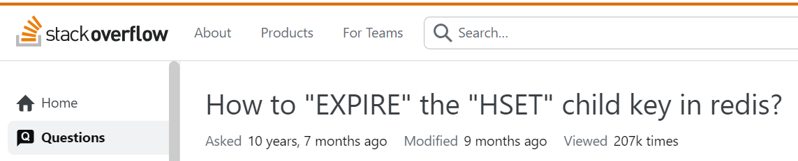
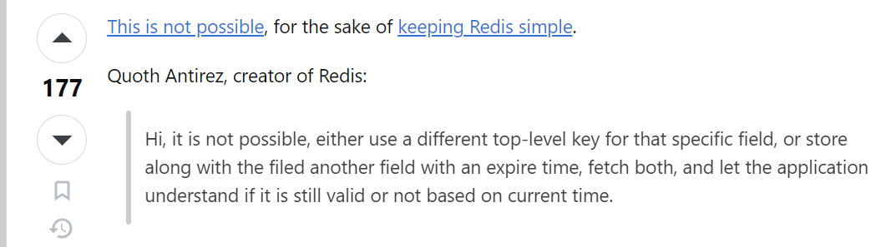
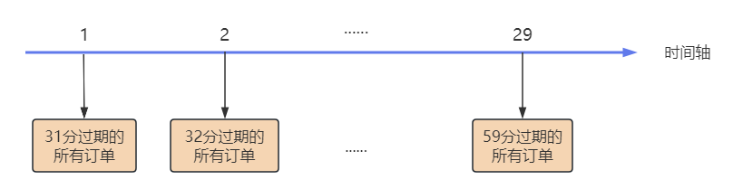
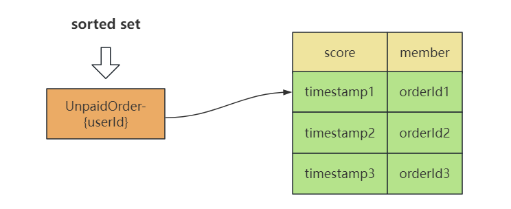
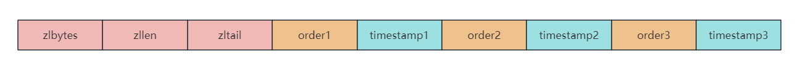
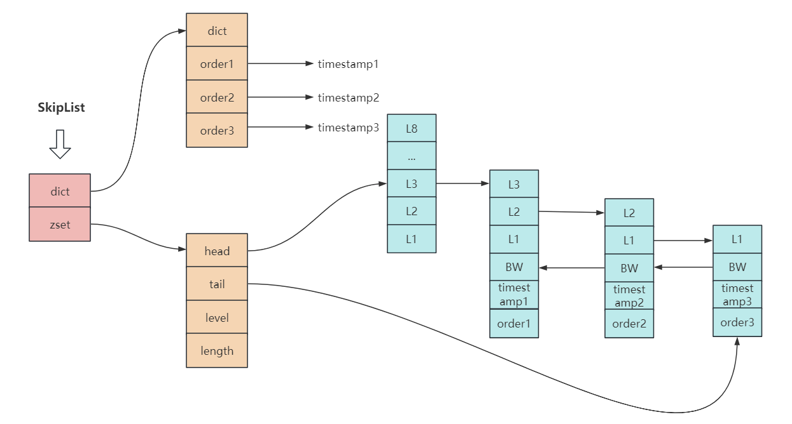

大家好，我是小❤，一个漂泊江湖多年的 985 非科班程序员，曾混迹于国企、互联网大厂和创业公司的后台开发攻城狮。

## 1. 引言

### 1.1 消费队列

这天，小❤在购买火车票时，发现如果存在一个未支付的订单时，就不能再进行购票了。如果把待支付的订单放在一个队列里面，那么队列的长度就只能是 1.

正好最近用 Redis 比较多，于是，我突发奇想，如何用 Redis 原生的数据结构实现一个简易版的延时消费队列呢？

业务状态图如下：


并且，需要保证队列的长度是可控的，比如，我们只允许用户有 3 个未支付的订单。


### 1.2 Redis实现

Redis，作为一款高性能的缓存和数据存储数据库，一直以来都是后台开发者的得力助手。

如果用 Redis 作为消费队列，那么我们可以用到的数据结构有：List、Hash 和 Set。在上述的业务场景中，由于我们只需要关注 `orderId`（订单 ID），因此这三个数据结构都是可用的。

比如，用 `hash` 来存储时，我们可以将 key 设置为 `UnpaidOrder-{userId}`，每个 field 都是一个订单。



但是，我们现在面临一个挑战：每个订单的存活时长是不同的，分为手动消费和定期删除的逻辑。

* 订单 1 手动支付后，需要将 orderId1 从列表中删除；
* 订单 2 半小时内还未支付，就自动过期，用户还可以继续提交订单到未支付状态；

**所以在 List、Set 或者 Hash 结构中，每个 field 都需要设置单独的过期时间。**

这是一个常见而又棘手的问题，本文将从互联网业务中常见的解决方案入手，来深入探讨一下 Redis 的底层实现。


## 2. 常见方案

在实际业务中，我们经常会遇到这样的场景：需要统计某些字段的个数，并且这些字段的过期时间是不同的。

就上述场景而言，我们需要统计用户的未支付订单数，但是每个订单数的过期时间是不同的。

在这种情况下，我们需要在业务中手动删除过期的字段，或者让它们自动过期。


### 2.1 为单独的 field 设置过期？

我们知道，Redis 里面暂时没有接口给 List、Set 或者 Hash 的 field 单独设置过期时间，只能给整个列表、集合或者 Hash 设置过期时间，这样，**当 List/Set/Hash 过期时，里面的所有 field 元素就全部过期了**。

但这样并不满足需求。

小❤尝试在网上找一些已知方案，其中有一个 `Stack Overflow` 的问题帖子和我面临的很相似：



图来源：Stack Overflow，Redis 中如何给 HSET 的孩子key（指 field）设置过期时间？

但是，帖子下面却无意中看到了 Redis 作者的回答：



中文翻译如下：

> 嗨，这是不可能的，要么为该特定字段使用不同的顶级 key，要么与提交的字段一起存储另一个具有过期时间的字段，然后同时获取这两个字段，并让应用程序了解它是否仍然有效（基于当前时间）。

大意就是，不可能，除非你同时把 field 和过期时间都存下来，然后在程序里面判断它是否过期。

这真是布袋里失火，很烧包！


### 2.2. 设置整体过期时间

既然 Redis 创始人都这么说了，Redis 是不可能为单独的 field 设置过期时间，那我们首先考虑的就是给整个 `List/Set/Hash` 设置过期时间。

这样的做法简单粗暴，但却很难满足每个字段单独设置过期时间的需求。

于是，我思前想后，既然每个订单的过期时间不一样，那我们是否可以根据时间来创建不同的集合，将同一时间过期的订单放在同一个集合里面：



然后，**分别为不同的集合设置 TTL，当订单过期未支付时，订单会随着集合的过期而在同一分钟内被删除。**

但是这样的问题是，每次新增订单时，都得把过去 30 分钟的集合全部遍历一遍，查询是否有该用户的订单，再判断用户的未支付订单数有没有超量。

并且，以分钟创建集合，可能存在一个问题：用户的订单本来在 01 秒就过期了，但是在 59 秒才被删除。

如果以秒来创建集合，30 分钟又需要创建 1800 个集合，就更难管理了，所以对集合设置整体过期时间不太可行。

那有没有更优雅的实现方式呢？


### 2.3 zset 结合 score实现

当然是有的！

Redis 除了常用的 List/Set/Hash 结构，它还有一个专门用来排序的数据结构 zset。

而基于 Redis 的 Zset（即 Sorted Set，排序集合）结构，就可以通过 Score 来表示过期时间，我们可以轻松地实现每个 Field 的单独过期。



具体实现为：

1. 每当新增一个待支付订单，就将当前时间的 `Unix timestamp` 加上过期时间 30min 作为 `score` 设置到这个元素上，这样，`sorted set` 会根据这个过期时间戳对元素排序存储；
2. 当订单被支付后，**根据 userId 和 orderId 去删除 sorted set 里的待支付订单**；
3. 同时，在程序里新增一个定时任务，每隔一秒去删除当前时间已过期的订单。


### 2.4 底层实现

用 Redis 的 zset 一方面可以很方便地实现了对每个字段的单独过期，不再受整个 Key 的过期时间限制，提高了灵活性。

另一方面，Redis 的 zset 操作是十分高效的，不会给系统带来显著的性能压力。

这得益于 zset 底层的数据结构，Zset 底层实现采用了 **ZipList（压缩列表）和 SkipList（跳表）**两种实现方式，当满足：

- Zset 中保存的元素个数小于 128（可通过修改 zset-max-ziplist-entries 配置来修改）
- Zset 中保存的所有元素长度小于 64byte（通过修改 zset-max-ziplist-values 配置来修改）

两个条件时，Zset 采用 ZipList 实现；否则，用 SkipList 实现。


#### ZipList 实现



`ZipList` 是一个数组的形式，存储数据时分为**列表头部分和数据部分**，列表头部分有 3 个元素：

- zlbytes：表示当前 list 的存储元素的总长度
- zllen：表示当前 list 存储的元素的个数
- zltail：表示当前 list 的头结点的地址，通过 zltail 就是可以实现 list 的遍历

数据部分以键值对的方式依次排列，键存储的是实际 `member`，值存储的是 member 对应的分值（`score`）。 


#### SkipList 实现



SkipList 分为两部分：

1. dict 部分是由字典实现（其实就是 HashMap，里面放了成员到 score 的映射）；
2. zset 部分使用跳跃表实现（存放了所有的成员，解决了 HashMap 中 key 无序的问题）。

从图中可以看出，dict 和 zset 都存储数据。

但实际上 dict 和 zset 最终使用的指针都指向了同一份成员数据，即数据是被两部分共享的，为了方便表达将同一份数据展示在两个地方。 


### 2.5 代码实现

当我们插入一个过期时间到 zset 时，Redis 会自动帮我们排好序，我们只需要在程序中新增一个定时任务，比如：每秒执行一次删除任务，**删除时间戳从 0 到当前时间戳的 score 值即可**。

伪代码如下：

``` sh
# 1. 创建新的待支付订单时，查询zset个数
count = zcard UnpaidOrder-{userId}

# 2. 判断未支付订单个数
if count >= 3:
	return

# 3. 新增订单
zadd UnpaidOrder-{userId} redis.Z{Score: {timestamp1}, Member: {order1}}

# 4.1 订单支付后，从 set 中删除未支付订单
zrem UnpaidOrder-{userId} order1

# 4.2 过期时间到了，从 set 中删除未支付订单
zremrange UnpaidOrder-{userId} 0 {current_timestamp}
```


## 3. 结语

通过合理的数据结构选择和巧妙的应用，我们成功地解决了为 List、Set 和 Hash 结构中的字段设置单独过期时间的问题。

这个方案在实际项目中得到了验证，并取得了显著的效果。对比其它的延时队列，或者 etcd 的 field 过期方案，**Redis 的实现相对而言更为便捷，理解起来也更为简单。**

希望这个方案能够在你的项目中派上用场，提高开发效率，更好地应对实际需求。如果你有更多关于 Redis 使用的问题，也欢迎在评论区交流讨论。


愿你在 Redis 的世界里愈发游刃有余，取得更多技术的新突破。

我是小❤，我们下期再见！