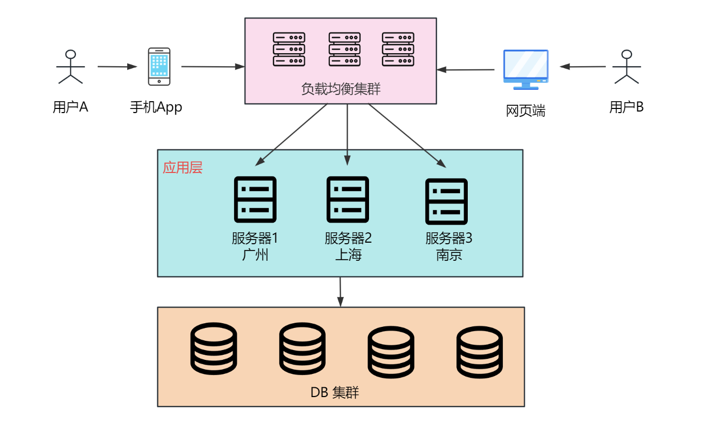
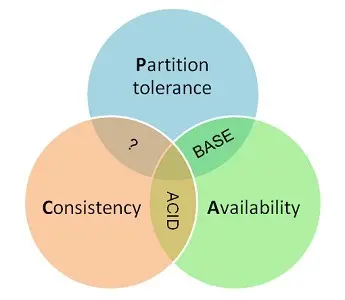
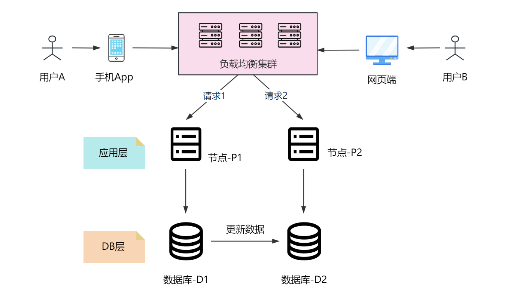

## 1. 引言

大家好，我是小❤，一个漂泊江湖多年的 985 非科班程序员，曾混迹于国企、互联网大厂和创业公司的后台开发攻城狮。

在计算机科学领域，分布式系统是一门极具挑战性的研究方向，也是互联网应用中必不可少的优化实践，而 **CAP 理论和 BASE 理论则是分布式系统中的两个关键的概念**。

今天，小❤将带大家深入浅出地探讨这些概念，帮助大家更好地理解分布式系统的奥秘。

## 2. 什么是分布式系统

首先，让我们来谈谈分布式系统。你可以将分布式系统想象成一个庞大的计算机网络，由多个计算机或服务器节点组成，它们可能分布在不同的地理位置上。

如图所示，应用层的三个节点都发布在不同的城市。**这些节点之间可以相互通信和协作，共同完成复杂的任务**。

想象一下，你是一名团队领导，有一项任务需要完成。如果你独自一人完成，可能需要花费很长时间。

但如果你将任务分解成几个子任务，分派给你的团队成员，他们可以**并行工作**，更快地完成任务。这就是分布式系统的核心思想。

## 3 CAP理论

接下来，让我们谈谈 CAP 理论，它是分布式系统设计中非常重要的一个原则。

CAP 是指在分布式系统中，**Consistency（一致性）、Availability（可用性）和 Partition tolerance（分区容错性）**这三个基本原则。

### C - 一致性（Consistency）

一致性意味着无论你从分布式系统的哪个节点读取数据，你都会获得相同的数据副本，它确保了数据的准确性。

在分布式系统中，广泛的一致性分为三种，分别是强一致性、弱一致性和最终一致性。

#### 强一致性

强一致性要求用户在分布式系统中访问数据时，不管是哪个节点的响应，数据都应该完全一致。

比如在订单系统中球鞋库存还剩 10 双，张三刚买了一双球鞋，数据更新完成后，接下来李四看到的球鞋数量就只有 9 双，否则就可能会出现超卖的情况。

但这需要更多的时间和精力来协调，就像李四在买鞋的时候，必须排队先等张三的购买动作结束后才可以继续，效率较低。

#### 弱一致性

弱一致性是指，在分布式系统中的数据被更新后，也允许让后续的访问拿到更新之前的老数据。

就像参加聚会一样，每个人都有自己的钟表。各自的钟表时间可能会有点不一样，但是这不影响大家聚在一起玩耍。

弱一致性提高了业务的效率，但有时会导致一些混乱，想象一下如果聚会人员的时间差太多，就会陷入长久的等待。

#### 最终一致性

最终一致性是弱一致性的特殊形式，要求系统的数据更新完成，在一段时间以后，后续的所有访问都能拿到最新的数据。

这就像朋友圈的消息传播。当你发了一条消息，它不会立刻被所有朋友看到，但最终，每个人都会看到相同的消息。

一般的业务系统基于性价比的考量，绝大多数都是采用**最终一致性**作为分布式系统的设计思想。

而 **CAP 理论里的一致性，则要求是强一致性**。正如官方文档中描述的那样：`All nodes see the same data at the same time`，所有节点在同一时间内数据完全一致。

### A - 可用性（Availability）

可用性意味着分布式系统的每个请求都应该得到响应，而且应该在有限的时间内完成。

可用性确保了系统的稳定性和可靠性，它描述的是系统能够很好地为用户服务，不会出现用户操作失败或者访问超时的情况，影响用户体验。

即官方所说`Reads and writes always succeed`，服务在正常响应时间内一直可用。

### P - 分区容错性（Partition Tolerance）

分区容错性是指**系统能够在网络分区或通信故障的情况下继续运行**，也就是节点之间的网络通信出现故障了，或者系统中的某一个节点出问题了，我们仍然需要保证业务系统可用。

即 `The system continues to operate despite arbitrary message loss or failure of part of the system`，分布式系统在遇到某个节点或者网络分区故障时，仍然能够对外提供满足一致性或可用性的服务。

## 4. CAP 的特点

### 4.1 分区容错的重要性

这时，有分布式基础的同学可能就会问了，CAP 理论确实很重要，但是这三个特性似乎不能同时满足，是吧？

没错，这就是 CAP 理论的核心观点。

CAP 理论告诉我们，在一个分布式系统中，我们最多只能同时满足其中 2 个特性，而无法同时满足 3 个。

为什么 C，A，P 三者不可兼得？首先，我们得知道，在分布式系统中，由于网络不可靠，为了保证服务可以时刻对外提供服务，所以**分区容错性是一定要保证的**。

试想如果只有一个分区，谈分布式就没有意义了。而多个分区，一定会有分区的故障问题，分布式系统中保证分区容错就变成最基本的诉求了。

所以现在我们只需**考虑在分区容错的基础上，能否同时满足一致性和可用性**，我们可以用反证法来证明。

### 4.2 AP Or CP

假设现在有两个分区 P1 和 P2，分区上都有同一份数据 D1 和 D2， 现在它们是完全相同的。

接下来，有一个请求 1 访问了 P1，更改了 D1 上的数据。然后又有一个请求 2 访问了 P2，去访问 D2 的同一份数据。

这时，我们需要权衡。

#### 先保证一致性

如果先保证满足一致性和分区容错，即 CP。

这个过程很容易出现：D1 已经更新数据，但是查询 D2 时，数据返回的还是老数据。

为了保证 D2 和 D1 数据完全一致，必须在更新 D1 数据时给 P2 上的 D2 数据上锁，等待 D1 更新完成后再同步更新 D2。

这个过程中，锁住的 D2 就没法给请求 2 实时响应，也就是违背了 P2 上的可用性。

所以在满足一致性的前提下，CAP 无法同时满足。

#### 先保证可用性

如果先保证满足可用性和分区容错，即 AP。

可用性要求 P1 和 P2 都可以实时响应，因此在 D2 刚更新完还未同步给 D1 时，两个 DB 的数据是不一致的，也就违背了 P1 和 P2 上的数据一致性。

所以在满足可用性的前提下，CAP 亦无法同时满足。

### 4.3 CAP 如何权衡

CAP 三者不可兼得，该怎么选择呢？一般根据我们的业务可以有以下选择。

#### 满足一致性和分区容错CP

保证分区的强一致性（C），不要求可用（A）。

相当于请求到达某个系统之前，需要等待数据完全同步以后，才会得到系统的数据响应，一般在数据需严格保持一致的金融系统中会使用这种模式。

#### 满足可用性和分区容错AP

保证分区的可用性（A），不要求强一致性（C）。

当请求访问某个分区的数据时，可能拿到未同步的老数据，这种模式一般只要求数据满足最终一致性，进而保证系统响应速度和高可用。

AP 在业界使用范围较广，比如著名的 BASE 理论（下文会细讲）。

#### 满足可用和一致性AC

上文已经说过，分布式系统中无法同时保证系统的强一致性（C）和可用性（A）。

这是因为分布式系统中的分区是客观存在无法避免的，而单体系统中的数据库可以通过事务保证数据的一致性和可用性，比如 MySQL 中事务的四大特性（原子性、一致性、隔离性和持久性，简称 ACID）。

## 5. BASE 理论

BASE 理论是当今互联网分布式系统的实践总结，它的核心思想在于，既然在分布式系统中实现强一致性的代价太大，那不如退而求其次。

只需要各应用分区在提供高可用服务的基础上，尽最大能力保证数据一致性，也就是保证数据的**最终一致性**。

BASE 理论是 CAP 中保证分区容错（P）的前提下，对可用性（A）和一致性（C）的权衡，它由 **Basically Available（基本可用），Soft State（软状态），Eventually-Consistent（最终一致性）**三方面构成，简称 BASE 理论。

分布式系统中，CAP 理论提供了一个理论框架，而 BASE 理论则提供了一种实际操作的指导原则。

### 5.1 基本可用

BASE 理论认为，分布式系统在面临故障或异常情况时，可以选择降低性能或一致性要求，以保持基本的可用性。

这意味着系统可能会出现一些短暂的不一致性，但最终会达到一致状态。

正如一个银行系统的系统设计，一般有功能需求和非功能需求，我们首先需要保证核心功能需求的基本可用性。

#### 功能需求

在银行系统里，用户提款、转账等交易模块就是核心功能，是用户的基本需求，不能出问题。

而非核心功能可以出现异常，但需要保证在一段时间内修复。

#### 非功能需求

非功能需求是指用户业务不依赖的其它需求，比如性能相关的：要求用户转账在 0.5 秒内完成，但是由于网络延迟等原因，可以延迟响应至1~2 秒。

由于系统出现此类异常，从而影响了系统的高可用性，但核心流程依然可用，即基本可用性。

### 5.2 软状态

软状态是指**系统服务可能处于中间状态**，数据在保证一致性的过程中可能延迟同步，但不会影响系统的可用性。

比如我们在购买火车票付款结束之后，就可能处在一个既没有完全成功，也没有失败的中间等待状态。用户需要等待系统的数据完全同步以后，才会得到是否购票成功的最终状态。

BASE 理论认识到，在分**布式系统中，状态可能会随时间变化而软化，而不是立即达到一致状态**。

这意味着我们需要容忍一些状态的不确定性，比如我们在火车票候补排队时是不确定是否可以候补成功的。

### 5.3 最终一致性

最终一致性是 BASE 理论的核心思想。它指出，**分布式系统可以在一段时间内保持不一致状态，但最终会收敛到一致状态。**

它不像强一致性那样，需要分区数据保证实时一致，导致系统数据的同步代价过高。也不像弱一致性那样，数据更新后不保证数据一致，导致后续的请求只能访问到老数据。

当前业界的分布式系统，甚至关系数据库系统的数据，大都是用最终一致性实现的。比如 MySQL 的主从备份，就是在一段时间内通过 `binlog` 日志和监听线程让从库和主库的数据保持最终一致。

总的来说，BASE 理论其实就是牺牲了各节点数据的强一致性，允许不同节点的数据在一段时间内不一致，来获得更高的性能和高可用性。

在单体系统中，数据库还能通过 ACID 来实现事务的强一致性，但分布式事务需要考虑节点通信的延迟和网络故障。

所以，BASE 理论是我们在实际的分布式系统中经常使用的方案。