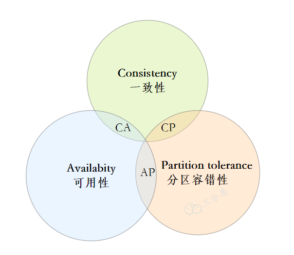

## CAP 理论

CAP 是指在分布式系统中，Consistency（一致性）、Availability（可用性）和 Partition tolerance（分区容错性）这三个基本原则，最多只能同时满足其中的 2 个。

#### 1）CAP 的概念

**一致性C**

一致性分为三种，分别是强一致性、弱一致性和最终一致性：

- 强一致性：对于关系型数据库，要求更新过的数据后续访问都能看到。比如在订单系统中球鞋库存还剩 10 双，张三刚买了一双球鞋，数据更新完成后，接下来李四看到的球鞋数量就只有 9 双，否则就可能会出现超卖的情况；
- 弱一致性：系统中的数据被更新后，可以容忍后续的访问拿到更新之前的数据，也就是后续的部分访问或者全部访问可能会读到未同步的数据；
- 最终一致性：是弱一致性的特殊形式，要求系统的数据更新完成，在一段时间以后，后续的所有访问都能拿到最新的数据。比如订单系统中抢商品，可以给抢购留一个缓冲期，用户买完商品付了钱，提醒用户等待一段时间。一段时间以后，数据同步完成，告诉用户商品是否抢购成功：若成功，则订单完成，准备发货；若失败，则给用户操作退款。

一般的业务系统基于性价比的考量，绝大多数都是采用“最终一致性”作为分布式系统的设计思想。

而 CAP 理论里的“一致性”，则要求是强一致性。正如官方文档中描述的那样："All nodes see the same data at the same time"，所有节点在同一时间内数据完全一致。

**可用性A**

可用性描述的是系统能够很好地为用户服务，不会出现用户操作失败或者访问超时的情况，影响用户体验。

即 "Reads and writes always succeed"，服务在正常响应时间内一直可用。

**分区容错性P**

**分区**从广义上来讲是指某个业务系统的多个节点，为了解决系统的单点故障问题，分布式系统中一定需要多个分区来保证系统的高可用。

分区容错性是指多个分区，也就是节点之间的网络通信出现故障了，或者系统中的某一个节点出问题了，我们仍然需要保证业务系统可用。

即 "The system continues to operate despite arbitrary message loss or failure of part of the system"，分布式系统在遇到某个节点或者网络分区故障时，仍然能够对外提供满足一致性或可用性的服务。

#### 2）CAP 的证明

为什么 C，A，P 三者不可兼得？首先，我们得知道，在分布式系统中，**分区容错性是一定要保证的**。

试想如果只有一个分区，谈分布式就没有意义了；而多个分区，一定会有分区的故障问题，分布式系统中保证分区容错就变成最基本的诉求了。所以现在我们只需考虑在分区容错的基础上，能否同时满足一致性和可用性。

假设现在有两个分区 P1 和 P2，分区上都有同一份数据 D1 和 D2， 现在它们是完全相同的。接下来，有一个请求 A 访问了 P1，更改了 D1 上的数据；然后又有一个请求 B 访问了 P2，去访问 D2 的同一份数据：

- 满足一致性，那要求 D2 和 D1 数据完全一致，那必须在更新 D1 数据时给 P2 上的 D2 数据上锁，等待 D1 更新完成后再同步更新 D2。但这个过程中，锁住的 D2 肯定就没法给请求 B 实时响应，也就是违背了 P2 上的可用性；
- 满足可用性，就要求 P1 和 P2 都可以实时响应，因此 D2 和 D1 最新的数据肯定是不一致的，也就违背了 P1 和 P2 上的数据一致性。

可以看出，在保证分区容错的前提下，一致性和可用性不能同时满足。

#### 3）CAP 如何权衡

CAP 三者不可兼得，该怎么选择呢？一般根据我们的业务可以有以下选择：

- CP without A：保证分区的强一致性（C），不要求可用（A）。相当于请求到达某个系统之前，需要等待数据完全同步以后，才会得到系统的数据响应，一般在数据需严格保持一致的金融系统中会使用这种模式；
- AP without C：保证分区的可用性（A），不要求强一致性（C）。当请求访问某个分区的数据时，可能拿到未同步的老数据，这种模式一般只要求数据满足最终一致性，进而保证系统响应速度和高可用，在业界使用范围较广，比如著名的 BASE 理论（下节细讲）。
- CA without P：同时保证系统的强一致性（C）和可用性（A），在分布式系统中不成立，因为分区是客观存在而无法避免的，而单体系统中的数据库可以通过事务保证数据的一致性和可用性。

## 4. BASE 理论

BASE 理论是当今互联网分布式系统的实践总结，它的核心思想在于，既然在分布式系统中实现强一致性的代价太大，那不如退而求其次：只需要各应用分区在提供高可用服务的基础上，尽最大能力保证数据一致性，也就是保证数据的**最终一致性**。

BASE 理论是 CAP 中保证分区容错（P）的前提下，对可用性（A）和一致性（C）的权衡，它由 Basically Available（基本可用），Soft State（软状态），Eventually-Consistent（最终一致性）三个词组构成。

#### 1）基本可用

一个系统的可能出现非**核心**功能需求或者**非功能需求**的异常，其中：

- 非核心功能需求：比如一个银行系统，它的提款、转账等交易模块就是核心功能，是用户的基本需求，不能出问题；而非核心功能可以出现异常，但需要保证在一段时间内修复。
- 非功能需求：比如银行转账需要在 0.5 秒内完成，但是由于网络延迟等原因，可以延迟响应至1~2 秒。

由于系统出现此类异常，从而影响了系统的高可用性，但核心流程依然可用，即基本可用性。

#### 2）软状态

软状态是指系统服务可能处于中间状态，数据在保证一致性的过程中可能延迟同步，但不会影响系统的可用性。比如我们在购买火车票付款结束之后，就可能处在一个既没有完全成功，也没有失败的中间等待状态。用户需要等待系统的数据完全同步以后，才会得到是否购票成功的最终状态。

#### 3）最终一致性

最终一致性强调的是系统所有的数据副本，在经过一段时间的同步后，最终能够达到一个一致的状态。它不像强一致性那样，需要分区数据保证实时一致，导致系统数据的同步代价过高；也不像弱一致性那样，数据更新后不保证数据一致，导致后续的请求只能访问到老数据。

在实际的业务系统中，最终一致性包含以下 5 种场景：

- 因果一致性（Causal consistency），如果节点 A 更新完某个数据后通知了节点 B，那么 A 和 B 接下来的访问数据都可以拿到最新的值，而其它和 A 没有因果关系的节点则可能会访问到老数据；
- 读自己所写（Read your writes），某个节点更新后的数据自身总是可以访问到，其它节点可能需要一段时间后再同步；
- 会话一致性（Session consistency），在一个会话当中，系统中的所有节点都可以读到最新的数据，实现会话中的 "读自己所写"；
- 单调读一致性（Monotonic read consistency），当从某个节点中读出了最新值，系统中的其它节点就必须保证读到的值是最新的；
- 单调写一致性（Monotonic write consistency），系统需要保证同一个节点上的写操作顺序执行。

当前业界的分布式系统，甚至关系数据库系统的数据，大都是用最终一致性实现的。比如 MySQL 的主从备份，就是在一段时间内通过 binlog 日志让从库和主库的数据保持最终一致。

总的来说，BASE 理论其实就是牺牲了各节点数据的强一致性，允许不同节点的数据在一段时间内不一致，来获得更高的性能和高可用性。

在单体系统中，数据库还能通过 ACID 来实现事务的强一致性，但分布式事务需要考虑节点通信的延迟和网络故障。所以，BASE 理论常常是我们在实际业务系统中考量的方案。