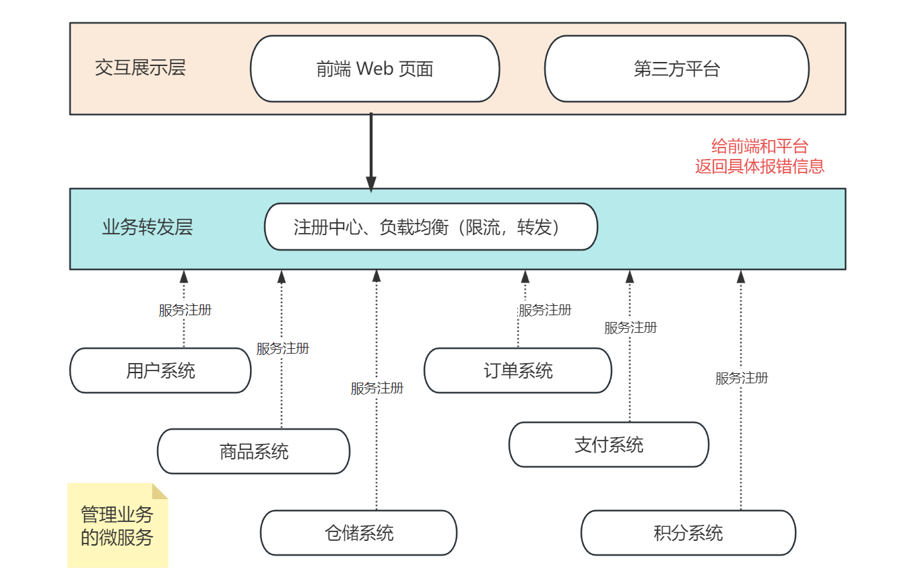
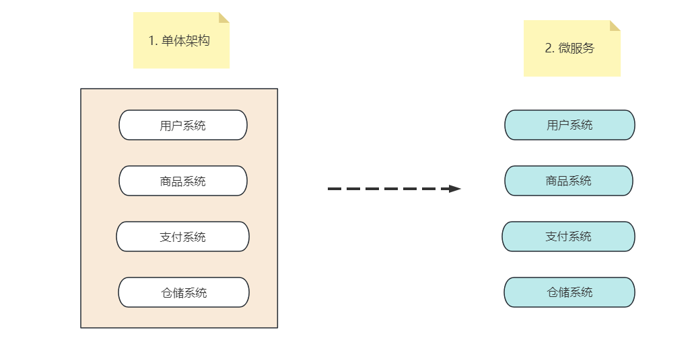
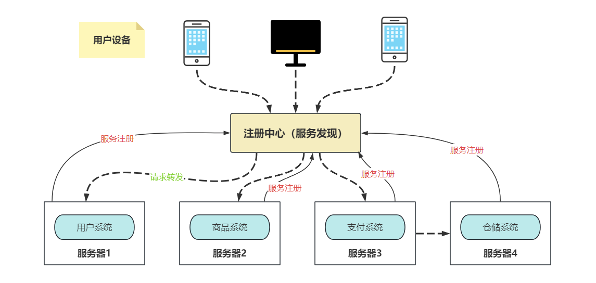
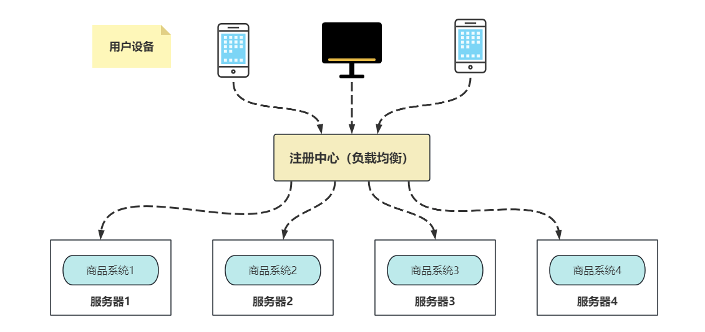

**目录**

> 1. 引言
> 2. 为什么需要微服务
> 3. 服务发现
> 4. 服务间通信
> 5. 微服务拆分

# 1. 引言

## 1.1 微服务的地位

当前互联网界，不管是做 2B 端【面向企业】，还是 2C 端【面向个人用户】产品，微服务开发已经是遍地开花，单体结构的系统大多只存在于传统软件和中大型国企架构里。

但是，你真的了解微服务吗？我们来看一则后台开发工程师的招聘 JD 里，关于微服务的要求：

> **候选人需熟练使用微服务框架，深刻理解微服务原理及运行机制，并对服务拆分，服务间调用，服务治理有着独特的见解。**

## 1.2 什么是微服务

微服务的定义有很多，官方说法如下：

> 微服务是**一种开发软件的架构和组织方法**，其中软件由通过明确定义的 API 进行通信的小型独立服务组成， 这些服务由各个小型独立团队负责。 微服务架构使应用程序更易于扩展和更快地开发，从而加速创新并缩短新功能的上线时间。

通俗来说，微服务就是一种**架构模式**，或者说是一种**架构风格**。它提倡的是将**单一的应用程序划分为一些更小的服务，每个服务独立进行管理**，服务和服务之间互相配合、协调，最终给用户提供快速迭代的上线产品。

比如一个电商系统，可能会包含用户、商品、仓储、订单、支付以及积分系统等微服务：

今天我们就来详细聊一聊微服务，以及微服务相关的面试题型。看了这篇文章之后，不管是大小公司的面试，只要问到微服务就是赚到。

# 2. 为什么需要微服务

## 2.1 单体架构的问题

最开始，没有微服务的时候，互联网界的应用程序都使用了单体架构，即系统下所有的模块都放进一个服务中。

通常，这些服务小则几个、大则几十个模块，团队数十人一起进行开发。此时，单体架构的问题逐渐暴露出来：

1. 系统间通常以 API 方式互相访问，耦合紧密导致难以维护扩展；
2. 各业务领域需要采用相同技术栈，难以快速应用新技术，比如都用 Java 或 PHP；
3. 系统修改必须整个系统一起部署/升级，运维复杂且容易出错；
4. 系统负载增加时，难以水平扩展；
5. 系统一处出现问题，可能会影响整个系统，出现连带问题。

于是，2012 年微服务概念被提出，作为加快 Web 和移动应用程序开发的一种方法，开始备受关注。

时间来到 2015 年，越来越多的互联网社区、论坛、以及互联网巨头开始使用微服务，从 2018 年起，越来越多的中小型企业也开始进行微服务架构升级。

到 2023 年的今天，据最新市场研究报告表明，市面上 95% 的应用程序都已经使用微服务架构进行开发。

## 2.2 微服务的缺点

### 1）代码复杂度高

**微服务间通过 HTTP、RPC 等方式交互**，相对于单体架构下的 API 形式，需要考虑被调用方故障、过载、消息丢失等情况，代码逻辑更复杂。

微服务间的事务性操作，需要解决分布式事务的问题，可能需引入二阶段、最大努力通知等思路来解决。

各微服务之间存在少部分功能（或数据库字段）重合，但又无法提取成微服务时，通常需要重复开发，或者做数据冗余，增加了开发和维护成本。

### 2）运维任务重

上线时，可能有服务耦合的关系，需要依次有序地进行服务部署。最常见的情况是，A 服务调用 B 服务的接口，即 A 依赖 B，上线时就必须先升级 B 系统，后升级 A 系统。

而且，由于系统独立，故需要一个设计良好的监控系统对各个微服务运行状态进行监控。**实时监控是为了防止业务系统中有模块临时掉链子，影响整体业务的使用**。

### 3）影响性能

相对单体架构，各微服务之间 REST、RPC 通信时延更高，特别是调用链路比较长的时候。

而且当业务链长时，问题排查较为困难，如果涉及到多个服务都出现 BUG，问题排查就更为复杂了。

## 2.2 微服务的特点&原理

虽然微服务有着单体架构不存在的缺点，但它让功能模块高内聚、低耦合的优势特性，足以让我们忍受这些去接纳它。除此之外，微服务还具备以下特点：

### 1）单一职责

一般按业务逻辑划分微服务，每个微服务仅负责归属自己业务领域的功能，逻辑清晰，模块内聚性高。比如上述的用户系统、商品系统、订单系统、支付系统等，每个模块都有各自的业务特点。

### 2）自治

微服务是独立的实体，可以独自进行部署、升级，各微服务之间通过 REST/RPC 等形式的标准接口进行通信。且微服务可以用不同的技术栈实现，其它模块不受影响。

最常见的，现在很多算法模块用了 Python 实现，后台业务使用 Go 或者 Java 实现，**当后台模块需要调用算法模块的接口时，只要定义好了 API 接口的协议，就可以友好进行 API 调用**。

通过隔离、熔断等技术保证某一个微服务异常时不影响别的模块，这也是微服务自治的兜底策略。

### 3）可扩展

业务增长，可以单独对某一个模块进行横向或纵向扩展，方便实现弹性伸缩，和灰度发布等。

在不同业务场景下，不同模块的压力是不一致的，比如电商系统的限时秒杀业务下：商品系统和仓储系统就承受了大部分流量压力，而支付系统可能就会比较轻松。

为了应对类似场景，我们可以**将商品系统和仓储系统的模块分布到多台机器部署，将流量压力平分到不同的业务机器上，缓解模块的高并发压力**。

### 4）灵活组合

微服务架构下，可以通过组合已有的微服务达到功能重用的目的。虽然这在单体架构下也可以实现，但不同的组合可能让单体架构模块间的交互变得越来越复杂，最终让系统混乱不堪。

# 3. 服务发现

## 3.1 服务治理

应用从单体架构向微服务演进的过程中，由于细粒度的微服务应用数大幅度增长，微服务之间的**服务发现、负载均衡、熔断限流**等服务治理需求显著提高。

微服务场景下，每个服务有多个实例，需要一种机制将请求的服务名解析到对应的服务实例地址上，这就需要服务发现和负载均衡机制。

## 3.2 服务发现

服务发现包含两部分：

- 服务注册：各服务名将服务实例的信息发送到注册中心，并提供心跳机制保证服务在线；
- 服务发现：从注册中心获取服务对应的实例列表。

服务发现的 3 种常见策略：

1. ETCD 做注册中心，各服务模块将服务名和实例信息注册到 ETCD，并保持自己的租约不过期，维持服务在线；
2. Redis 做注册中心，各模块维持一个定时器，定期向注册中心模块发送实例信息和时间，注册中心模块根据心跳时间和网络波动时间，得出最大超时时间。如果某模块很久都没将心跳消息包发送至注册中心，就将其踢出服务集群；
3. Istio 服务注册与发现，由控制面 Pilot 和数据面 Envoy 协作完成，Pilot 通过 K8s APIServer 接口获取 service 和 endpoint 等服务资源信息，将其转换为 xDS 消息下发给数据面的 Envoy 组件。Envoy 收到请求后根据配置的负载均衡策略，选择一个服务实例进行请求转发。

> Istio简述：Istio 是一个开源的服务网格平台，它可以控制微服务之间数据的共享方式。Istio 的架构分为数据面 Envoy 和控制面 Pilot。
>
> 数据面上，通过在环境中部署 sidecar 边车代理，即可为服务添加 istio 支持。该 sidecar 与服务共存，但是对代码无侵入，它的作用是和其它代理进行路由请求。这些代理共同构成了一个服务网格，可拦截微服务之间的网络通信。
>
> 控制面上，负责管理和配置代理来实现流量转发，此外它还可以配置一些检测组件，对服务进行实时监控。
>
> 此外，Istio 还提供了流量管理、安全防护、可监控性的代理，使得微服务向云原生应用转型变得更容易。

## 3.3. 负载均衡

### 1）什么是负载均衡

负载均衡一般和**服务发现**配合使用，从服务发现解析的实例中选择一个实例发起请求，这个过程用到了负载均衡策略。

如上图，当业务部署了 4 台商品系统的服务，当请求到达注册中心时，**注册中心会根据不同的负载均衡算法将请求打到不同的服务器上**，以保证每台机器的负载量不会太高而影响性能。

### 2）负载均衡算法

将均衡转发比作老师发糖，其中老师是注册中心，学生是服务器。负载均衡算法就是老师采取一种方式给学生发糖，既不能让学生饿着，也不能只给一个学生吃糖【血糖太高了也不好】。

#### **1、轮询法**

将请求按顺序轮流分配到后端服务器上，均衡对待每一台后端服务器，不关心服务器的连接数和当前系统负载。

用老师发糖的比喻来看，轮询法就是挨个给学生发糖，学生1、学生2、学生3......雨露均沾，每个学生得到糖果的个数几乎相等。

#### **2、随机法**

随机选择一台机器进行访问，由概率统计得知，当调用次数越多，其分配调用越接近平均，也就是轮询的结果。

用老师发糖的比喻来看，随机法就是老师每次发糖前抓阄来决定发糖给谁，每个学生得到糖果的个数不确定。但是从概率学上说，当请求量很多时，其结果接近于平均，类似掷骰子、或者扔硬币。

#### **3、加权轮询法**

根据服务器的硬件配置和负载，给性能高、负载低的机器加上更高的权重，使得权重高的机器更容易被访问到。

当请求数量很大时，每个服务处理的请求数量之比会趋向于权重之比。

用老师发糖的比喻来看，加权轮询法是看老师的喜好来发糖，这里的权重可以看做是学生的分数。老师可能会给 90 分以上的学生 3 颗糖，给 75 分以上的学生 2 颗糖，60 分以上的学生 1 颗糖，不及格的学生就分不到糖果。

每个学生得到糖果的个数比例是根据权重来计算的，所以当请求数越多时，每个学生得到的糖果数和权重之比就越接近。

#### **4、源地址哈希法**

获取客户端的 IP 地址，通过 hash 取模的方式访问某一个服务器。当后端服务器列表和 hash 算法不变时，同一个客户端每次请求都会映射到同一台服务器上。

用老师发糖的比喻来看，源地址哈希法就是老师每次将同样产地或者同样品牌的糖果都发给一个学生，比如：将喜之郎的糖都给学生1，将上好佳的糖都给学生2，以此类推...... 每个学生得到糖果数取决于对应品牌的糖果个数。

# 4. 服务间调用

我们上述在介绍微服务特点时已经介绍：**微服务间通过 HTTP、RPC 等方式交互**。

HTTP（HyperText Transfer Protocol，超文本传输协议） 和 RPC（Remote Procedure Call，远程过程调用），前者是一种协议，后者是一种方法，两者都常用于服务调用。

RPC 主要工作在 TCP 协议之上（也可以是 HTTP），而 HTTP 工作在 HTTP 协议之上，而 HTTP 又基于 TCP 传输层协议之上，所以 RPC 天然比 HTTP 更轻量，效率更胜一筹。

## 4.1 HTTP

### 1）简介

HTTP 服务开发即开发 RESTful 风格的服务接口，在接口不多、系统之间交互较少的情况下，是一种信息传递的常用通信手段。

### 2）优势

HTTP 接口的优点是简单、直接、开发方便，且利用现成的 HTTP 协议就可以进行传输。服务开发时，约定一个接口文档，严格定义输入和输出，明确接口的请求方法和参数即可进行开发。

## 4.2 RPC

### 1）简介

**首先我们得知道 RPC 是什么？**

> RPC（Remote Procedure Call，远程过程调用）是一个**计算机通信协议**。该协议允许运行于一台计算机的程序调用另一个地址空间（通常为一个开放网络的一台计算机）的子程序，而程序员就像调用本地程序一样，无需额外地为这个交互作用编程（无需关注细节）。——维基百科

很多非专业的人员看到这一大段解释肯定都懵了，我最开始也一样。其实想要真正弄懂 RPC 也不难，咱们只要知道它是一个通信协议，即一个通信双方都需要遵守的格式或约定。

### 2）特性

可能有些人还是疑惑：既然都是通信协议，那程序交互和应用开发时，我们该选择 HTTP（HyperText Transfer Protocol，超文本传输协议）还是 RPC 协议呢？

这就得从它们两者的属性区别说起了，主要从以下 4 点来考量：

#### 传输协议

- RPC 是一种基于 TCP 传输层或者 HTTP2 应用层的通信协议；
- HTTP 只基于 HTTP 协议，包括 HTTP1.x（即 HTTP1.0、1.1） 和 HTTP2，目前很多浏览器默认使用 1.x 来访问服务器数据。

#### 性能消耗（从数据类型对比）

- RPC，可以基于 gRPC（一种 RPC 框架）实现高效的二进制传输；
- HTTP，大部分是通过 json 来实现的，字节大小和序列化都比 gRPC 更消耗性能。

#### 负载均衡

- RPC，基本都自带了负载均衡策略；
- HTTP，需要配置 Nginx，HAProxy 来实现。

#### 传输效率

- RPC，使用自定义的 TCP 协议，可以让请求报文体积更小，或者使用 HTTP2 协议，也可以很好的减少报文的体积，提高传输效率；
- HTTP，如果是基于 HTTP1.x 的协议，请求中会包含很多无用的内容；如果是基于 HTTP2.0，那么简单的封装后是可以作为 RPC 来使用的，这时标准 RPC 框架更多的优势是服务治理。

### 3）流行的 RPC 框架

- gRPC：基于 HTTP2.0 协议，底层使用了 Netty 框架；
- Thrift：跨语言的服务开发框架，通过代码生成器来节省一系列基础开发工作；
- Dubbo：协议和序列化框架都可以插拔。

## 4.3 HTTP 和 RPC 的区别

综上对比，我们不难发现，**RPC 从性能消耗和传输效率，以及负载均衡等方面都比 HTTP 强一些**。这时细心的朋友可能已经发现了，那为啥我们常见的系统和网站都是用的 HTTP 协议，不改成 RPC 通信呢？

举个通俗的例子，HTTP 好比普通话，RPC 好比地方方言，比如粤语，西南一带的云南话、贵州话、四川话。

讲普通话，好处就是谁都听得懂，大部分国人都会讲，所以 **HTTP 具有一定的通用性**。讲方言，好处是可以更精简、更保密、更加可定制，坏处就是要求“说”方言的另一方（特指 client 端）也要懂，而且一旦大家都说一种方言了，换方言就困难了。

所以 **RPC 一般用于公司内部的服务调用**，比如阿里巴巴的淘宝系统中的 A 服务和 B 服务之间。

最近新兴的微服务概念更加强调独立、自治、灵活，而 RPC 限制较多。因此微服务框架中，一般都采用 HTTP 的 RESTful 方式调用，除非对效率要求较高的系统。

# 5. 服务拆分

通过上述描述，我们从微服务简介、服务治理、服务发现和服务间通信几个层面，想必大家已经熟悉了微服务的基本特性。

那作为一个架构师/中高级程序员，我们如何去区分各模块的边界问题，怎么拆分微服务呢？

接下来介绍微服务拆分常见的三种方式：

## 5.1 业务领域

按业务领域拆分微服务（也叫垂体拆分），如用户、商城、订单业务模块，如果有相同功能需要聚合，则进行下沉到单独微服务，统一调用。

通过业务拆分微服务的好处是，内聚性高，业务之间不容易耦合。

## 5.2 功能定位

按功能定位拆分微服务（也叫水平拆分），如登录注册、用户购物、积分兑换等。如果有同一个模块被多个功能用到，可以进一步拆分微服务，统一调用。

通过功能定位拆分微服务的好处是，开发效率高，不同功能的测试和使用比较独立。

对用户来说，在使用某一类系统功能时，往往都是调用同一个微服务的 API，更能避免连带问题和分布式事务问题出现。

## 5.3 重要程度

按重要程度拆分微服务，区分核心与非核心模块，如：电商系统里面订单模块核心，物流模块非核心。区分是否为核心模块的关键点在于：

1. 是否不可缺失。如电商系统里面，用户最关注的功能莫过于网上购物，订单是保存用户购物记录的核心业务，自然是很重要的。

2. 用户关注度高，即流量大，可以为系统带来曝光度。对于这样的模块（例如电商展示模块），会极大影响用户对于整体产品质量的评判，也是极为重要的。

除此之外，业界就微服务拆分这个话题已经有相对完善的系统设计方法论，比如有名的 DDD（Domain-driven design，领域驱动设计）。

它的原理是通过事件风暴建立领域模型，合理划分**领域逻辑和物理边界**，建立领域对象及服务矩阵和服务架构图，定义符合 DDD 分层架构思想的代码结构模型，保证业务模型与代码模型的一致性。

由于个人理解和文章篇幅有限，在这里就不展开论述了。想要了解的朋友可以点个关注，后续有时间安排一下。并且个人最新文章都会放在同名 WXGZH 里，里面有超多学习资料和技术类、成长类的电子书，你还不去看一下嘛！

我是小❤，下期文章再见！

