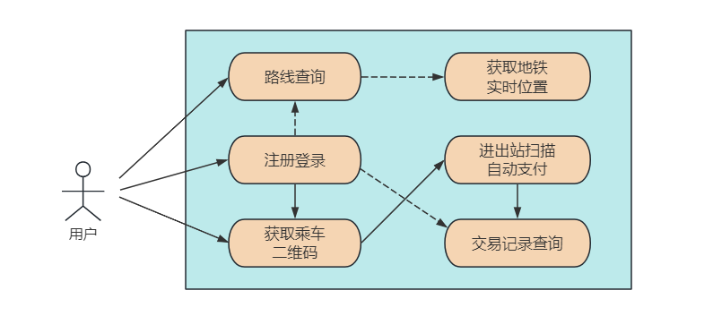
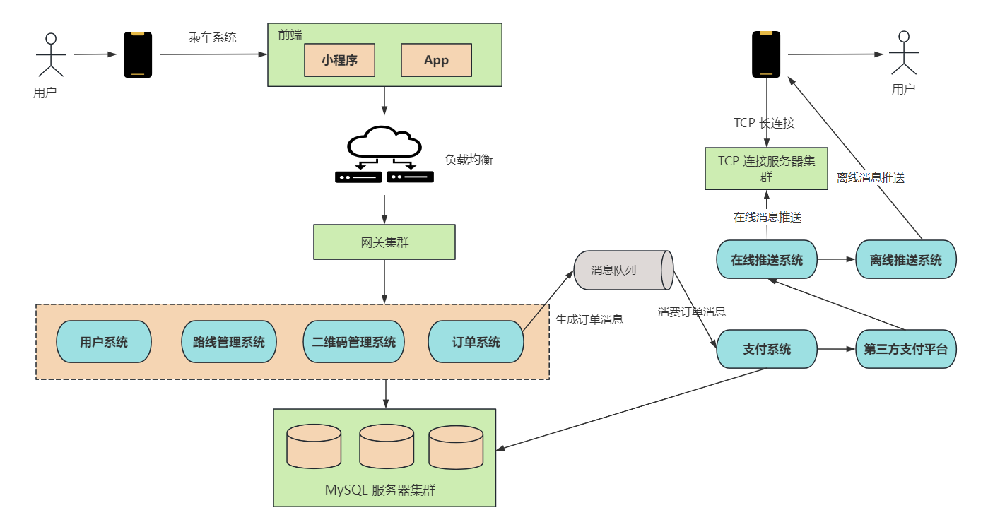
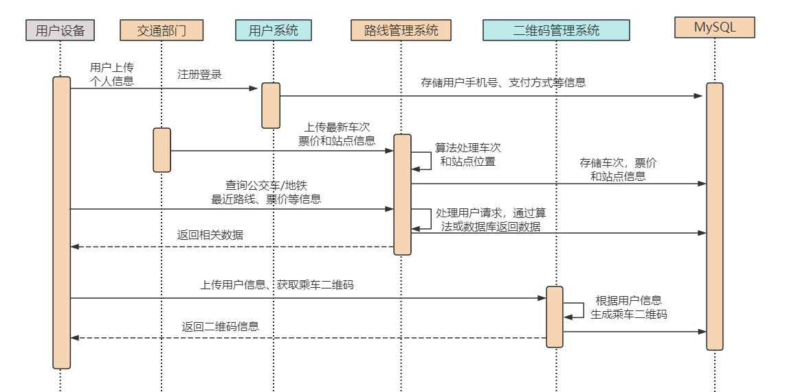
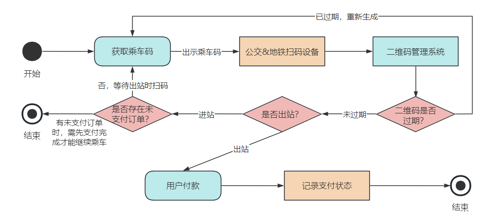
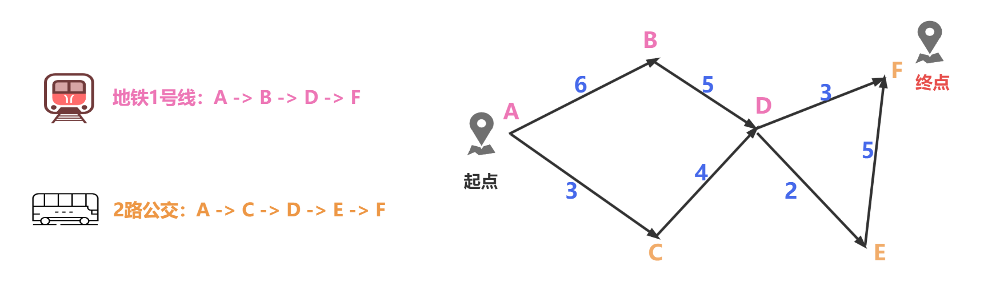
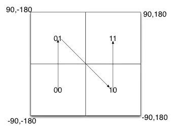

# 1. 引言

## 1.1 上班通勤的日常

“叮铃铃”，“叮铃铃”，早上七八点，你还在温暖的被窝里和闹钟“斗智斗勇”。

突然，你意识到已经快迟到了，于是像个闪电侠一样冲进卫生间，速洗漱，急穿衣，左手抄起手机，右手拿起面包，边穿衣边啃早餐。

这个时候，通勤的老难题又摆在了你面前：要不要吃完这口面包、刷牙和洗脸，还是先冲出门赶车？

好不容易做出了一个艰难的决定——放下面包，快步冲出门。你拿出手机，点开了熟悉的地铁乘车App或公交地铁乘车码小程序。

**然后，一张二维码在屏幕上亮了起来，这可是你每天通勤的“敲门砖”。**

你快步走到地铁站，将手机二维码扫描在闸机上，"嗖"的一声，闸机打开，你轻松通过，不再需要排队买票，不再被早高峰的拥挤闹心。你走进地铁车厢，挤到了一个角落，拿出手机，开始计划一天的工作。


## 1.2 公交&地铁乘车系统

正如上文所说，人们只需要一台手机，一个二维码就可以完成上班通勤的所有事项。

那这个便捷的公交或地铁乘车系统是如何设计的呢？它背后的技术和架构是怎样支撑着你我每天的通勤生活呢？

今天让我们一起揭开这个现代**都市打工人通勤小能手**的面纱，深入探讨**乘车系统的设计与实现**。

在这个文章中，小❤将带你走进乘车系统的世界，一探究竟，看看它是如何在短短几年内从科幻电影中走出来，成为我们日常生活不可或缺的一部分。


# 2. 需求设计

## 2.1 功能需求



- **用户注册和登录：** 用户可以通过手机应用或小程序注册账号，并使用账号登录系统。
- **路线查询：** 用户可以查询地铁的线路和站点信息，包括发车时间、车票价格等。
- **获取乘车二维码：** 系统根据用户的信息生成乘车二维码。
- **获取地铁实时位置：** 用户可以查询地铁的实时位置，并查看地铁离当前站台还有多久到达。
- **乘车扫描和自动支付：** 用户在入站和出站时通过扫描二维码来完成乘车，系统根据乘车里程自动计算费用并进行支付。
- **交易记录查询：** 用户可以查询自己的交易历史记录，包括乘车时间、金额、线路等信息。


## 2.2 乘车系统的非功能需求

乘车系统的用户量非常大，据《中国主要城市通勤检测报告-2023》数据显示，一线城市每天乘公交&地铁上班的的人数普遍超过千万，平均通勤时间在 45-60 分钟，并集中在早高峰和晚高峰时段。

所以，设计一个热点数据分布非均匀、人群分布非均匀的乘车系统时，需要考虑如下几点：

- **用户分布不均匀**，一线城市的乘车系统用户，超出普通城市几个数量级。
- **时间分布不均匀**，乘车系统的设计初衷是方便上下班通勤，所以早晚高峰的用户数会高出其它时间段几个数量级。
- **高并发：** 考虑到公交车/地铁系统可能同时有大量的用户在高峰时段使用，系统需要具备高并发处理能力。
- **高性能：** 为了提供快速的查询和支付服务，系统需要具备高性能，响应时间应尽可能短。
- **可扩展性：** 随着用户数量的增加，系统应该容易扩展，以满足未来的需求。
- **可用性：** 系统需要保证24/7的可用性，随时提供服务。
- **安全和隐私保护：** 系统需要确保用户数据的安全和隐私，包括支付信息和个人信息的保护。


# 3. 概要设计

## 3.1 核心组件



- **前端应用：** 开发手机 App 和小程序，提供用户注册、登录、查询等功能。
- **后端服务：** 设计后端服务，包括用户管理、路线查询、二维码管理、订单处理、支付系统等。
- **数据库：** 使用关系型数据库 MySQL 集群存储用户信息、路线信息、交易记录等数据。
- **推送系统：** 将乘车后的支付结果，通过在线和离线两种方式推送给用户手机上。
- **负载均衡和消息队列：** 考虑使用负载均衡和消息队列技术来提高系统性能。


## 3.2 乘车流程

### 1）用户手机与后台系统的交互

交互时序图如下：



**1. 用户注册和登录：** 用户首先需要在手机应用上注册并登录系统，提供个人信息，包括用户名、手机号码、支付方式等。

**2. 查询乘车信息：** 用户可以使用手机应用查询公交车/地铁的路线和票价信息，用户可以根据自己的出行需求选择合适的线路。

**3. 生成乘车二维码：** 用户登录后，系统会生成一个用于乘车的二维码，这个二维码可以在用户手机上随时查看。这个二维码是城市公交系统的通用乘车二维码，同时该码关联到用户的账户和付款方式，用户可以随时使用它乘坐任何一辆公交车或地铁。


### 2）用户手机与公交车的交互

交互 UML 状态图如下：



1. **用户进站扫码：** 当用户进入地铁站时，他们将手机上的乘车码扫描在进站设备上。这个设备将扫描到的乘车码发送给后台系统。
2. **进站数据处理：** 后台系统接收到进站信息后，会验证乘车码的有效性，检查用户是否有进站记录，并记录下进站的时间和地点。
3. **用户出站扫码：** 用户在乘车结束后，将手机上的乘车码扫描在出站设备上。
4. **出站数据处理：** 后台系统接收到出站信息后，会验证乘车码的有效性，检查用户是否有对应的进站记录，并记录下出站的时间和地点。


### 3）后台系统的处理

1. **乘车费用计算：** 基于用户的进站和出站地点以及乘车规则，后台系统计算乘车费用。这个费用可以根据不同的城市和运营商有所不同。
2. **费用记录和扣款：** 系统记录下乘车费用，并从用户的付款方式（例如，支付宝或微信钱包）中扣除费用。
3. **乘车记录存储：** 所有的乘车记录，包括进站、出站、费用等信息，被存储在乘车记录表中，以便用户查看和服务提供商进行结算。
4. **通知用户：** 如果有需要，系统可以向用户发送通知，告知他们的乘车费用已被扣除。
5. **数据库交互：** 在整个过程中，系统需要与数据库交互来存储和检索用户信息、乘车记录、费用信息等数据。


# 3. 详细设计

## 3.1 数据库设计

- **用户信息表（User）**，包括用户ID、手机号、密码、支付方式、创建时间等。
- **二维码表 (QRCode)**，包括二维码ID、用户ID、城市ID、生成时间、有效期及二维码数据等。
- **车辆&地铁车次表 (Vehicle)**，包括车辆ID、车牌或地铁列车号、车型（公交、地铁）、扫描设备序列号等。
- **乘车记录表 (TripRecord)**，包括记录ID、用户ID、车辆ID、上下车时间、起止站点等。
- **支付记录表 (PaymentRecord)**，包括支付ID、乘车记录ID、交易时间、交易金额、支付方式、支付状态等。

以上是一些在公交车&地铁乘车系统中需要设计的数据库表及其字段的基本信息，后续可根据具体需求和系统规模，还可以进一步优化表结构和字段设计，以满足性能和扩展性要求。

详细设计除了要设计出表结构以外，我们还针对两个核心问题进行讨论：

* 最短路线查询

* 乘车二维码管理


## 3.2 最短路线查询

根据交通部门给的公交&地铁路线，我们可以绘制如下站点图：



假设图中的站点有 A-F，涉及到的交通工具有地铁 1 号线和 2 路公交，用户的起点和终点分别为 A、F 点。我们可以使用 Dijkstra 算法来求两点之间的最短路径，具体步骤为：

| 步骤 | 已遍历集合                                                   | 未遍历集合                                                   |
| ---- | ------------------------------------------------------------ | ------------------------------------------------------------ |
| 1    | 选入A，此时最短路径 A->A = 0，再以 A 为中间点，开始寻找下一个邻近节点 | {B、C、D、E、F}，其中与 A 相邻的节点有 B 和 C，AB=6，AC=3。接下来，选取较短的路径节点 C 开始遍历 |
| 2    | 选取C，A->C=3，此时已遍历集合为{A、C}，以 A 和 C 为中间点，开始寻找下一个邻近节点 | {B、D、E、F}，其中与 A、C 相邻的节点有 B 和 D，AB=6，ACD=3+4=7。接下来，选取较短的路径节点 B 开始遍历 |
| 3    | 选取B，A->B=6，此时已遍历集合为{A、C、B}，A 相邻的节点已经遍历结束，开始寻找和 B、C 相近的节点 | {D、E、F}，其中与 B、C 相邻的节点有 D，节点 D 在之前已经有了一个距离记录（7），现在新的可选路径是 ABD=6+5=11。显然第一个路径更短，于是将 D 的最近距离 7 加入到集合中 |
| 4    | 选取D，A->D=7，此时已遍历集合为{A、C、B、D}，寻找 D 相邻的节点 | {E、F}，其中 DE=2，DF=3，选取最近路径的节点 E 加入集合       |
| 5    | 选取 E，A->E=7+2=9，此时已遍历集合为{A、C、B、D、E}，继续寻找 D 和 E 相近的节点 | {F}，其中 DF=3，DEF=2+5=7，于是F的最近距离为7+3=10.          |
| 6    | 选取F，A->F=10，此时遍历集合为{A、C、B、D、E、F}             | 所有节点已遍历结束，从 A 点出发，它们的最近距离分别为{A=0，C=3，B=6，D=7，E=9，F=10} |


在用户查询路线之前，交通部门会把公交 & 地铁的站点经纬度信息输入到**路线管理系统**，并根据二维的空间经纬度编码存储对应的站点信息。

我们设定西经为负，南纬为负，所以地球上的经度范围就是[-180， 180]，纬度范围就是[-90，90]。如果以本初子午线、赤道为界，地球可以分成 4 个部分。



根据这个原理，我们可以先将二维的空间经纬度编码成一个字符串，来唯一标识用户或站点的位置信息。再通过 Redis 的 GeoHash 算法，来获取用户出发点附近的所有站点信息。

GeoHash 算法的原理是**将一个位置的经纬度换算成地址编码字符串，表示在某个矩形区域，通过这个算法可以快速找到同一个区域的所有站点**。

一旦获得了起始地点的经纬度，系统就可以根据附近的站点信息，调用路线管理系统来查找最佳的公交或地铁路线。

一旦用户选择了一条路线，导航引擎启动并提供实时导航指引。导航引擎可能会使用地图数据和 GPS 定位来指导用户前往起止站点。


## 3.3 乘车二维码管理

乘车码是通过 QR 码（Quick Response Code）技术生成的，它比传统的 Bar Code 条形码能存更多的信息，也能表示更多的数据类型，如图所示：


二维码的生成非常简单，拿 Go 语言来举例，只需引入一个三方库：

``` go
import "github.com/skip2/go-qrcode"

func main() {
	qr,err:=qrcode.New("https://mp.weixin.qq.com",qrcode.Medium)
	if err != nil {
		log.Fatal(err)
	} else {
		qr.BackgroundColor = color.RGBA{50,205,50,255} //定义背景色
		qr.ForegroundColor = color.White //定义前景色
		qr.WriteFile(256,"./wechatgzh_qrcode.png") //转成图片保存
	}
}
```


以下是该功能下用户和系统之间的交互、二维码信息存储、以及高并发请求处理的详细说明：

1. **用户与系统交互：** 用户首先在手机 App 上登录，系统会验证用户的身份和付款方式。一旦验证成功，系统根据用户的身份信息和付款方式，动态生成一个 QR 码，这个 QR 码包含了用户的标识信息和相关的乘车参数。
3. **二维码信息存储：** 生成的二维码信息需要在后台进行存储和关联。通常，这些信息会存储在一个专门的数据库表中，该表包含以下字段：
   - 二维码ID：主键ID，唯一标识一个二维码。
   - 用户ID：与乘车码关联的用户唯一标识。
   - 二维码数据：QR码的内容，包括用户信息和乘车参数。
   - 生成时间：二维码生成的时间戳，用于后续的验证和管理。
   - 有效期限：二维码的有效期，通常会设置一个时间限制，以保证安全性。
3. **高并发请求处理：** 在高并发情况下，大量的用户会同时生成和扫描二维码，因此需要一些策略来处理这些请求：
   - **负载均衡：** 后台系统可以采用负载均衡技术，将请求分散到多个服务器上，以分担服务器的负载。
   - **缓存优化：** 二维码的生成是相对耗时的操作，可以采用 Redis 来缓存已生成的二维码，避免重复生成。
   - **限制频率：** 为了防止滥用，可以限制每个用户生成二维码的频率，例如，每分钟只允许生成 5  次，这可以通过限流的方式来实现。

总之，通过 QR 码技术生成乘车码，后台系统需要具备高并发处理的能力，包括负载均衡、缓存和频率限制等策略，以确保用户能够快速获得有效的乘车二维码。

同时，二维码信息需要被安全地存储和管理，比如：加密存储以保护用户的隐私和付款信息。

> 不清楚限流的，可以看我之前的这篇文章：[若我问到高可用，阁下又该如何应对呢？](https://mp.weixin.qq.com/s?__biz=MzI5Nzk2MDgwNg==&mid=2247484680&idx=1&sn=42d76236dfaf5220fa09c1f36eb1d421&chksm=ecac5101dbdbd81706efd91490aa69ec56d9f92687f664cf48f52f64709ce1b5f10eaa0e3b2a#rd)


# 4. 乘车系统的发展

## 4.1 其它设计

除此之外，公交车或地铁的定位和到站时间计算可能还涉及定位设备、GPS 系统、NoSQL 数据库、用户 TCP 连接管理系统等核心组件，并通过实时数据采集、位置处理、到站时间计算和信息推送等流程来为用户提供准确的乘车信息。

同时，自动支付也是为了方便用户的重要功能，可以通过与第三方支付系统的集成来实现。


## 4.2 未来发展

公交车/地铁乘车系统的未来发展可以包括以下方向：

- **智能化乘车：** 引入智能设备，如人脸自动识别乘客、人脸扣款等。
- **大数据分析：** 利用大数据技术分析乘车数据，提供更好的服务。

在设计和发展过程中，也要不断考虑用户体验、性能和安全，确保系统能够满足不断增长的需求。


由于篇幅有限，文章就到此结束了。

希望读者们能对公交&地铁乘车系统的设计有更深入的了解，并和小❤一起期待未来更多的交通创新解决方案叭~

如果觉得这篇文章有趣或者有所启发，不妨点赞、分享，让更多人了解这个有趣的领域吧！

我是小❤，我们下期再见！