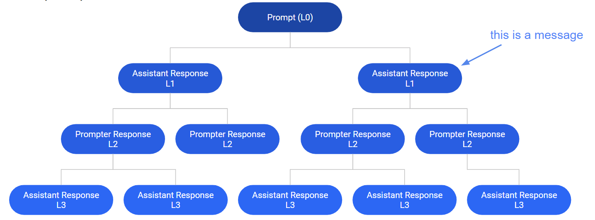
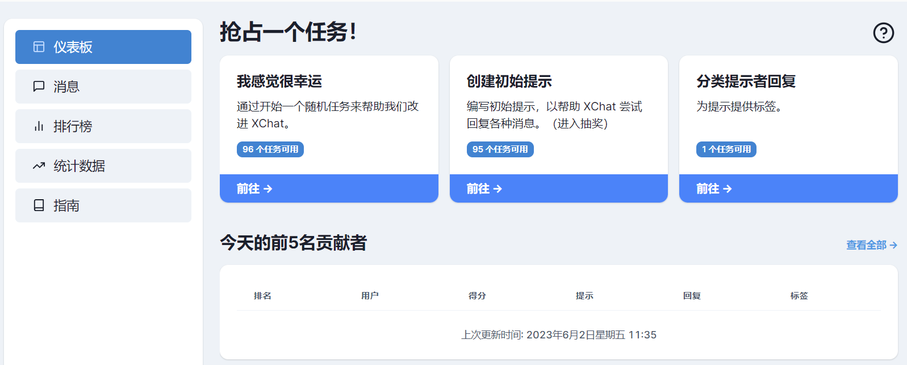

目录

> 1. 机器学习
> 2. 标注系统
> 3. 系统任务的数量
> 4. 系统任务的流转
> 5. 总结

## 1. 机器学习

### 1.1 什么是机器学习

顾名思义，计算机程序或者系统无需人类的直接帮助和干预，通过自我学习，从而为人类提供问题解答的能力和见解。通俗来说，就是创建一个人工智能（简称 AI）模型，让它像人类一样自学，让某方面的知识水平快速提升的过程。

不同的是，AI 只需要短时间内的自学，就可以达到甚至超过人类水平。比如之前的 AlphaGo 只学了 9 天的围棋，就可以击败韩国九段棋手，胜率高达 99%，学神无疑了。

### 1.2 人工智能并不智能

虽然 AI 的学习能力很强，在人类看来就是学神的水平。

但有趣的是，大部分圈外人员，包括我很长时间都不了解一个常识：那就是，人工智能本身并不智能，例如机器学习，通常依赖低薪众包工人进行手工标注和微调，它们才能继续学习。

而我最近又正好在研究大模型相关的**数据标注**，所以把最近梳理的一些标注相关的知识点和各位分享一下。

### 1.3 什么是数据标注

数据标注是对数据进行归因、标记或分类的过程，以帮助机器学习算法理解和分类它们需要处理的信息。这个过程在 AI 的模型训练中至关重要，可以让 AI 可以准确理解各种数据类型，例如图像、音频文件、视频片段或文本。

目前的**决策式 AI**（例如抖音或淘宝的推荐系统，特斯拉的智能驾驶等），**生成式 AI**（例如 OpenAI 的ChatGPT，百度的文心一言等）都离不开标注这一步，而目前所有的标注都依赖大量的标注人员，或者机器标注后由人力进行筛选。

下面给大家分享一个文本标注的 GitHub 标注项目。

## 2. 标注系统

这个标注系统叫开放助手（Open Assistant），是一个旨在让每个人都能访问基于聊天的语言大模型项目。

这个项目在 GitHub 上已经开源了，:star:在短短的几个月已经突破了 32k，有兴趣的可以关注一下：https://github.com/LAION-AI/Open-Assistant。

在这个标注系统上，可以模拟机器学习的几个过程，包括对话树扩展、会话标注及最终的打分，然后筛选出分数最高的对话，继续学习。

### 2.1 对话树

在标注系统中，对话树是最基础的数据结构，它模拟了机器学习的对话过程，其结构如下：

一、树的根节点为**初始指令**，即一个用户（Prompt）给出的第一句话，可能是一个提示，也可能抛出了一个问题。

二、然后是**聊天机器人给出回复**，聊天机器人基于不同的处理维度，包括自身的知识水平，归纳总结能力等，会对用户的问题给出回复（Assistant Response）。

三、当聊天机器人给出回复后，**用户继续询问**（Prompt Response），此时的对话树已经有来有回了。

四、接着再由**聊天机器人给出回复**（Assistant Response），继续扩充这棵对话树。

当对话树的节点，或者用户不再回复时，这棵对话树就算结束了。但是，这些聊天机器人会根据所有已生成的对话树，即和所有用户的对话来继续学习，以让自己变得更聪明，对话时的答案更优一些。

### 2.2 任务

除了对话树，任务（Task）也是标注系统中一个很重要的数据结构，对话树及其节点的更新就是通过一个个不同的任务完成。标注系统的任务有如下类型：

* 初始化提示（initial_prompt）任务：系统要求以用户的身份来创建一个初始指令，这个初始指令可能是寻求概念的解释，一个代数运算问题，或者是文章创作类的要求，即**用户提出了一个问题；**
* 标注初始指令（label_initial_prompt）：让标注人员来对初始指令进行标注，当多个人员标注完成后，开始由聊天机器人来回复这个初始提示，即**让标注人员来筛选掉不健康的问题，比如违法犯罪类的，政治敏感类的问题；**
* 聊天机器人回复（assistant_reply）：用训练中的聊天机器人来回复初始指令，可以视作是第一次问题的解答，处于对话树的第二层。**这步是由不同的 AI 根据自身的知识水平，来回复用户的问题；**
* 标注聊天机器人的回复（label_assistant_reply）：对聊天机器人回复用户指令/回复的内容进行标注，标注合格的回复即可进行下一轮对话或进行排序任务（足够多人标注合格）。**标注人员对 AI 的回复进行筛选和打分，最终选出回复最优秀的 AI，继续训练（可以理解为养蛊，把不合格的淘汰掉）；**
* 以用户身份回复（prompter_reply）：以用户的身份回复聊天机器人的消息，对应对话树会增加一个节点，即**由用户继续问问题**；
* 标注用户的回复（label_prompter_reply）：对用户回复聊天机器人的内容进行标注，标注合格后即可进行下一轮对话，**标注用户的问题，把不健康，无意义的信息筛选掉**；
* 对用户的回复进行排序（rank_prompter_replies）：当许多用户回复后，每个用户的标注结果都是合格的，这时**标注人员对用户回复的文本质量进行排序，并选出一些最优的回复供机器人学习；**
* 对聊天机器人的回复进行排序（rank_assistant_replies）：同理，通过**排序打分，选出聊天机器人中最优的回复，让其它机器人的模型接着学习和训练；**
* 随机任务：系统随机选择一个以上任务，让标注人员完成。

## 3. 系统任务的数量

对话树的状态流转及其节点扩充是由一个个不同的任务来完成的，由于处于不同状态的会话树数量不一致，所以展示在页面上的不同类型的任务数量也不一致。

### 1. 随机任务的数量（random）

随机任务数（页面上展示为“我感觉很幸运”，这是系统 BUG 提示，不用管）是所有任务类型的总数，当选择做随机任务时，系统会随机选择一棵会话树，执行相应的任务。

### 2. 以用户身份编写指令的任务数（initial_prompt）

为了减少在更新数据表时发生的写冲突，系统会限制活跃的对话树数量，当前可以继续激活的对话树数量就是以用户身份编写指令的任务数。

这个数量由两个指标共同控制：

- 指标 1 为剩余可创建的对话树数量，加上已创建完成并且可以继续增长（growing）的对话树数量；
- 指标 2 为当前还可以等待排队的对话树数量；

最后，以用户身份编写指令的任务数量取两个指标的更小值。

**简单来说，这个数量就是用户可以并发问问题的个数。**

### 3. 标注用户初始指令的任务数（label_initial_prompt）

对话树在用户编写初始指令以后，需要对这些初始指令进行标注。所以，标注用户初始指令的任务数为当前正在活跃，状态为初始等待标注（initial_prompt_review）的，且用户的标注次数低于配置值的对话树数量。

当多个用户对某个对话树标注完成，且标注结果合格以后。对话树的状态变为增长态（growing），标注用户初始指令的任务数减 1。

**一言概括，这个数量就是可以让标注人员进行标注初始问题的总个数。**

### 4. 以聊天机器人的身份回复的任务数（assistant_reply）

当 **3）把用户初始指令完成标注** 以后，需要对会话树进行回复，首先会以助手的身份回复。因此，以聊天机器人的身份回复的任务数量是当前正在活跃的，处于增长（growing）状态的，创建角色为初始提示者（prompter）的对话树数量。

**这个就是 AI 可以回复已标注问题的总个数（当然，在系统里，人工用户也可以模拟 AI）。**

### 5. 标注聊天机器人的回复的任务数（label_assistant_reply）

当 **4）以聊天机器人的身份回复对话树** 以后，需要对这些回复进行标注。因此，标注聊天机器人回复的任务数量为当前正在活跃的，会话树状态正在增长（growing）的，且低于配置值的对话树数量。这些对话树叶子节点的创建角色为聊天机器人（assistant）。

**一言概括，这个数量就是可以让标注人员进行标注 AI 回复的总个数。**

### 6. 以用户身份回复的任务数（prompter_reply）

当 **5）把聊天机器人的回复完成标注** 以后，如果标注结果合格，需要继续对会话树进行回复，此处会以用户的身份回复。

因此，以用户的身份回复的任务数量是当前正在活跃的，处于增长（growing）状态的对话树数量，这些对话树叶子节点的创建角色为聊天机器人（assistant）。

### 7. 标注用户的回复的任务数（label_prompter_reply）

当 **6）以用户的身份回复对话树** 以后，需要对这些回复继续进行标注。

因此，标注用户回复的任务数量为当前正在活跃的，会话树状态正在增长（growing）的，且低于配置值的对话树数量，这些对话树叶子节点的创建角色为用户（prompter）。

### 8. 对聊天机器人/用户回复进行排序的任务数（rank_assistant_replies/rank_prompter_replies）

当标注完成后，如果对话树的节点（包括根节点和叶子节点）数量达到目标值以后，对话树的状态被置为排序中（ranking）。

因此，需进行排序的任务数量为当前正在活跃的，状态为排序中的对话树数量。排序任务分为两种：

1. 如果对话树的叶子节点为用户回复，则对用户的回复进行排序；
2. 如果对话树的叶子节点为聊天机器人回复，则对聊天机器人的回复进行排序。

## 4. 标注系统任务流转

### 1）以用户身份编写指令

当以用户身份编写指令前，会先做一些基础校验，比如用户鉴权，该用户最近一段时间的排队任务数是否超过限制值，对话树的剩余创建数量是否充足等。

若某一项基础校验未通过，则终止流程；否则，开始编写初始指令。

当用户完成编写初始指令的任务后，会把初始指令的详细信息（如：文本、用户名、角色-prompter、时间等）作为一条新的对话消息存入数据库，并生成一棵新的对话树，此时对话树为初始化提示（initial_prompt_review）状态。

### 2）标注用户初始指令

当对话树被创建完成之后，需要对用户初始指令进行标注。

标注前，也要做一些基础校验，比如用户鉴权，该用户最近一段时间的排队任务数是否超过限制值，标注用户初始指令的剩余任务数量是否充足等。

若某一项基础校验未通过，则报错返回；否则，开始标注用户初始指令。

接着从会话树里面**随机选择**一个需要进行初始指令标注（prompts_need_review）的对话树，对初始提示的句子进行标注评分。

打标的维度常见有：

- 是否为垃圾邮件；
- 不是中文，不适当的，包含PII，仇恨言论，或包含性内容；

评分维度有：

- 质量高低、创意水平、幽默程度、礼貌程度、暴力程度

当标注提交后，系统会保存每个用户的标注结果，并且根据标注的具体情况【比如：是否举报，是否点赞等】将标注结果存入不同的表中。

接下来判断该对话树标注用户初始指令的次数是否达到配置值，若已达到一定的标注次数，则开始对初始指令这个子节点进行评分。

注意：当前评分只根据是否为垃圾邮件，和语言不通（不是中文）来计算分数。

> 分数计算方法：假设该对话树的初始指令一共有 3 个用户进行标注，其中 1 个用户标注了是垃圾邮件，其余两个用户标注不是垃圾邮件，标注为垃圾邮件的比例为 1/3。同理，如果有 1 个用户标注了初始指令为语言不通，其余两个用户未标注语言不通，则标注语言不通的比例为 1/3。标注的总分为 0.34（1-1/3-1/3）分。

最终，标注分值超过配置值（默认为 0.6）时，将根节点的打标结果置为合格并存表开始下一步，否则置为不合格，将对话树置为低分抛弃（aborted_low_grade）状态，不再继续后续的流程。

### 3）以聊天机器人的身份回复

当初始指令被标注完成以后，对话树转为增长（growing）状态，此时对话树可以被聊天机器人回复。

当以聊天机器人的身份回复初始指令前，会先做一些基础校验，比如用户鉴权，该用户最近一段时间的排队任务数是否超过限制值，对话树的剩余回复数量是否充足等。

若某一项基础校验未通过，则终止流程；否则，会随机选取某个已标注初始指令完成，且为增长状态的会话树进行回复。

当聊天机器人回复任务后，会把回复的详细信息（如：文本、用户名、角色-assistant、时间等）作为一条新的对话消息存入数据库表，并更新当前聊天机器人的回复任务为已做（done）。

### 4）标注聊天机器人的回复

当聊天机器人回复初始指令以后，需要对回复进行标注。

标注前，也要做一些基础校验，比如用户鉴权，该用户最近一段时间的排队任务数是否超过限制值，标注聊天机器人回复的剩余任务数量是否充足等。

若某一项基础校验未通过，则报错返回；否则，从会话树里面**随机选择**一个需要进行聊天机器人回复标注（reply_need_review）的对话树，开始标注聊天机器人的回复。

除了和标注初始指令相同的打标维度，标注聊天机器人回复的打标维度增加了：

- 作为提示任务的回答，它是否是一个糟糕的回答？

评分维度增加了：

- 有帮助的程度

当标注提交后，系统会保存每个用户的标注结果，并且根据标注的具体情况【比如：是否举报，是否点赞等】将标注结果存入不同的表中。

接下来判断该对话树标注用户初始指令的次数是否达到配置值，若已达到一定的标注次数，则开始对机器人回复这个子节点进行评分。

注意：和标注初始化指令一样，当前评分也只根据是否为垃圾邮件，和语言不通（不是中文）来计算分数。

最终，当标注分值超过配置值（默认为 0.6）时，将根节点的打标结果置为合格并存表开始下一步，否则置为不合格，将对话树置为低分抛弃（aborted_low_grade）状态，不再继续走后续的流程。

当标注完成后，判断当前会话树的节点数量是否已达到一定的数量，若达到目标值，则将会话树的状态置为排序（ranking）状态。

### 5）以用户身份回复

当机器人回复被标注完成以后，对话树继续增长，接着以用户身份回复来扩展子节点。

当以用户的身份扩展对话树前，会先做一些基础校验，比如用户鉴权，该用户最近一段时间的排队任务数是否超过限制值，对话树的剩余回复数量是否充足等。

若某一项基础校验未通过，则终止流程；否则，会随机选取某个机器人回复已标注完成，且为增长状态的会话树进行回复。

当聊天机器人回复任务后，会把回复的详细信息（如：文本、用户名、角色-assistant、时间等）作为一条新的对话消息存入数据库表，并更新当前用户的回复任务为已做（done）。

### 6）标注用户的回复

当用户回复了对话树以后，需要继续对用户回复进行标注。

标注前，也要做一些基础校验，比如用户鉴权，该用户最近一段时间的排队任务数是否超过限制值，标注用户回复的剩余任务数量是否充足等。

若某一项基础校验未通过，则报错返回；否则，从会话树里面**随机选择**一个需要进行用户回复标注（reply_need_review）的对话树，开始标注用户的回复文本。

和标注初始指令相同，标注用户回复的打标维度有：

- 是否为垃圾邮件；
- 不是中文，不适当的，包含PII，仇恨言论，或包含性内容；

评分维度有：

- 质量高低、创意水平、幽默程度、礼貌程度、暴力程度

当标注提交后，系统会保存每个用户的标注结果，并且根据标注的具体情况【比如：是否举报，是否点赞等】将标注结果存入不同的表中。

接下来判断该对话树标注用户回复的次数是否达到配置值，若已达到一定的标注次数，则开始对用户回复这个子节点进行评分。

注意：和标注初始化指令一样，当前评分也只根据是否为垃圾邮件，和语言不通（不是中文）来计算分数。

最终，当标注分值超过配置值（默认为 0.6）时，将根节点的打标结果置为合格并存表开始下一步，否则置为不合格，将对话树置为低分抛弃（aborted_low_grade）状态，不再继续走后续的流程。

当标注完成后，判断当前会话树的节点数量是否已达到一定的数量，若达到目标值，则将会话树的状态置为排序（ranking）状态；否则对话树继续增长，循环 3）至 6）步。

### 7）对聊天机器人回复进行排序

当在完成 **4）标注聊天机器人的回复** 任务后，若会话树进入排序状态，我们就需要对聊天机器人的回复进行排序。

排序前，会做一些基础校验，比如用户鉴权，该用户最近一段时间的排队任务数是否超过限制值，排序聊天机器人回复的剩余任务数量是否充足等。

若某一项基础校验未通过，则报错返回；否则，从会话树里面**随机选择**一个等待聊天机器人回复排序（incomplete_rankings）的对话树，开始排序任务。

排序时，需要对聊天机器人的多个回复的正确性和有效性进行排名。

当排序结果提交后，系统会保存每个用户的排序结果，并将排序的消息节点的排序数量加 1，将排序操作记录到日志表中。

当某个对话树节点的聊天机器人回复排序次数超过配置值时，开始对该对话树的排序进行打分排名，此时对话树的状态为准备打分状态（ready_for_scoring）。

通过算法进行排序后，计算出对话树子节点的聊天机器人回复排名，如果打分过程顺利完成，对话树更改为准备导出（ready_for_export）状态；否则，如果打分过程中出错，对话树将被置为打分失败（scoring_failed）状态。

## 5. 总结

除了文本标注，我们在 AI 模型训练时还会接触到图片、音频以及视频标注，这些标注工作是由大量的标注员工来完成。但是，随着 AI 和 GPT 如火如荼，国内外大模型遍地开花，以后的标注可能都会交给机器人去做，标注这件事会慢慢变得更智能，更自动化。

据市场研究表明，AI 目前在娱乐媒体领域的应用以**内容分发**为主，在**内容生产阶段有部分辅助应用**，后期将走向**大规模辅助**内容创作甚至**大规模替代人类创作**。

* 机器辅助人阶段：生成式 AI 大幅度降低内容生产成本和门槛，为内容公司降本增效，现有大模型公司有
  望获得更高利润；
* 机器“替代”人阶段：用户只需要输入指令便可以得到AI创作的所需内容，内容分发环节重要性下降，现有
  互联网娱乐巨头面临从“精准提供符合用户需求的内容”到“提供符合用户需求的内容生产工具”的挑战。

说人话就是，现在这些 AI 是我们保饭碗的工具，以后它们可能就是和我们抢饭碗的工具！

而我们在 AI 发展如此迅速的情况下，必须时刻保持学习，让这些生成式的模型作为我们的生产力工具，提升自己的核心竞争力，而非被 AI 代替！

