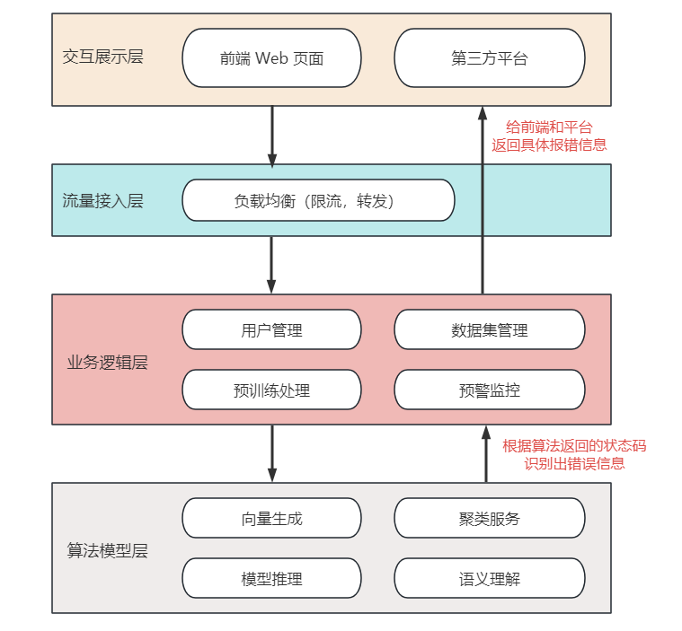
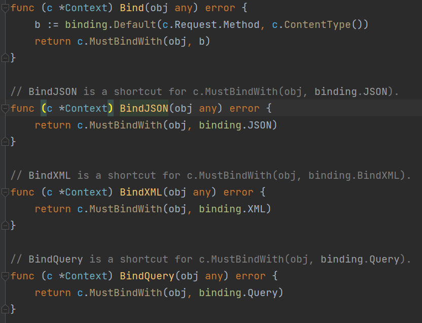
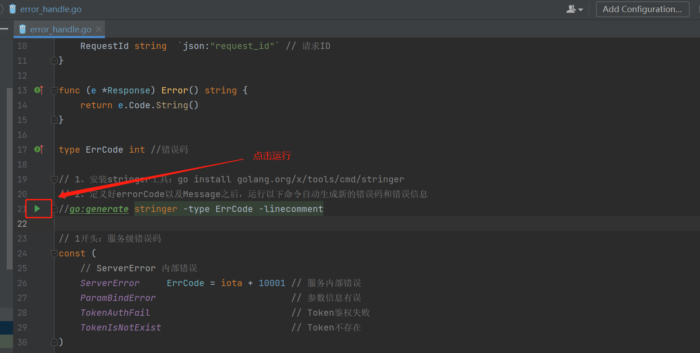

# 1.引言

## 1.1 背景

最近在做一个和前端、第三方平台（可以简单理解为公司别的部门或者客户软件）直接交互的服务，涉及到用户注册、登录、数据处理等模块。架构图大概如下：



拿到需求后，结合团队内部熟悉的技术栈，我们确定了后台服务【业务逻辑层】使用 Golang 语言来开发，用到的框架有 Gin 来做 HTTP 交互，Swaggo 自动生成接口文档，Redis 和 MySQL 作为 K-V 和 DB 存储。

值得注意的是，应用要求我们**对第三方平台和 Web 端的错误具体化和规范化**，比如：Web 端的错误码信息给到第三方平台也是可用的。

所以，错误码的规范设计与管理成了我们首要解决的问题。


## 1.2 特性

Go 语言本身提供了比较简单的错误处理机制：`error 类型`。error 是一个接口类型，定义如下：

``` go
type error interface {
	Error() string
}
```

error 的使用在代码中随处可见，比如：数据库三方包 Gorm 自动增表，Gin 获取参数等：

``` go
// AutoMigrate run auto migration for given models
func (db *DB) AutoMigrate(dst ...interface{}) error {
	return db.Migrator().AutoMigrate(dst...)
}
```



除了 Go 本身和三方包的使用，我们可以也通过 `errors.New()` 实现具体的错误信息：

``` go
func div(a, b int) (float, error) {
    if b == 0 {
        return 0, errrors.New("除数不能为0")
    }
    return float(a)/float(b)
}
```

但是，新的问题又来了。

如果我们每次遇到相同的错误，都用类似的 `errors.New()` 定义一次。不仅会有很多重复代码，而且在梳理我们的错误信息给 Web 端开发或者第三方平台时，会非常困难。

**想象一下，10 万行的代码，一个一个去找 `errors.New()` 信息，多少有点不体面了！**

# 2.定义错误码和消息

## 2.1 错误码设计规范

于是我们想到把错误信息统一管理起来，用错误码的方式去唯一化标识。即：**一个错误码对应一条错误信息**，每次需要时直接用错误码就行了。

业界的错误码一版采用 `5~7` 位整型数字（节省空间）的常量来定义，故我们采用 **5 位数字错误码，中文错误信息**，根据业务模块来划分错误码范围。

### 模块说明

| 模块   | 说明                                                |
| ------ | --------------------------------------------------- |
| 1\**** | 1开头为服务级错误码，如服务内部错误，参数信息有误等 |
| 2\**** | 2开头：业务模块级错误码                             |
| 201\** | 201开头为数据集模块的错误码                         |
| 202\** | 202：用户管理模块                                   |
| 203\** | 203：预训练管理模块                                 |


## 2.2 错误码定义

新建 `err_code` 包，新增 `error_handle.go` 文件：

``` go
package err_code

import "github.com/pkg/errors"

// Response 错误时返回自定义结构
// 自定义error结构体，并重写Error()方法
type Response struct {
	Code      ErrCode `json:"code"`       // 错误码
	Msg       string  `json:"msg"`           // 错误信息
	RequestId string  `json:"request_id"` // 请求ID
}
```

新增错误码和错误信息：

``` go
type ErrCode int //错误码

// 定义errorCode
const (
	// ServerError 1开头为服务级错误码
	ServerError    ErrCode = 10001
	ParamBindError ErrCode = 10002

	// IllegalDatasetName 2开头为业务级错误码
	// 其中数据集管理为201开头
	IllegalDatasetName ErrCode = 20101 // 无效的数据集名称
	ParamNameError     ErrCode = 20102 // 参数name错误

	// IllegalPhoneNum 用户管理模块：202开头
	IllegalPhoneNum         ErrCode = 20201 // 手机号格式不正确
	IllegalVerifyCode       ErrCode = 20202 // 无效的验证码
	PhoneRepeatedRegistered ErrCode = 20203 // 手机号不可重复注册
	PhoneIsNotRegistered    ErrCode = 20204 // 该手机号未注册
	PhoneRepeatedApproved   ErrCode = 20205 // 手机号不可重复审批
	PhoneIsNotApproved      ErrCode = 20206 // 该手机号未审批

	// IllegalModelName 预训练模块：203开头
	IllegalModelName 20301 // 非法模型名称
)
```


## 2.2 Map 映射错误信息

根据错误码，我们使用 Map 映射来定义**中文错误信息**：

``` go
// 定义errorCode对应的文本信息
var errorMsg = map[int]string{
	ServerError:          "服务内部错误",
	ParamBindError:     "参数信息有误",
	IllegalDatasetName: "无效的数据集名称",
	ParamNameError:     "参数name错误",
	IllegalPhoneNum:    "手机号格式不正确",
	IllegalModelName:   "非法模型名称",
}

// Text 根据错误码获取错误信息
func Text(code int) string {
	return errorMsg[code]
}

// NewCustomError 新建自定义error实例化
func NewCustomError(code ErrCode) error {
	// 初次调用得用Wrap方法，进行实例化
	return errors.Wrap(&Response{
		Code: code,
		Msg:  code.String(),
	}, "")
}
```

使用错误码信息：

``` go
// CheckMobile 检验手机号
func CheckMobile(phone string) bool {
	// 匹配规则
	// ^1第一位为一
	// [345789]{1} 后接一位345789 的数字
	// \\d \d的转义 表示数字 {9} 接9位
	// $ 结束符
	regRuler := "^1[345789]{1}\\d{9}$"

	// 正则调用规则
	reg := regexp.MustCompile(regRuler)

	// 返回 MatchString 是否匹配
	return reg.MatchString(phone)

}

// 保存手机号
func savePhoneNum(phone string) error {
    if phone == "" || !CheckMobile(phone) {
        	// 无效的手机号
		return NewCustomError(err_code.IllegalPhoneNum)
	}
}
```

这样，我们的错误码机制就有效建立起来了，好处在于：

* 解决了错误信息难以管理的问题：都在一个 `err_code` 包里，一眼就可以知道服务有哪些错误信息，**方便收集和错误定位**；
* 解决了错误码参差不齐，随意定义的问题：根据业务模块划分不同数字范围的错误码，**根据错误码就可以知道是哪个模块的问题，避免撕逼扯皮**；

但是，有聪明好学的朋友可能发现了。每次定义一个新的错误码，都需要加错误码数字和 Map 映射错误信息，有没有更简洁的方式去定义呢？

答案当然是有！作为一个常常都想偷懒的程序员，**简洁高效自动化**才是我们追求的目标。


# 3.自动化生成错误码和错误信息

## 3.1 stringer

`stringer` 是 Go 语言开源的一个工具包，安装命令为：

> go install golang.org/x/tools/cmd/stringer

除了工具包，我们还需要借助 Go 的 `iota` 计数器，进行常量数字自动累加：

> PS：`iota` 是 **go 语言的常量计数器**，只能在常量的表达式中使用。
>
> 其值从０开始，在 const 中每新增一行 iota 自己增长１，其值一直自增１直到遇到下一个 const 关键字，其值才被重新置为０。


## 3.2 定义错误信息

```go
package err_code

import "github.com/pkg/errors"

// Response 错误时返回自定义结构
// 自定义error结构体，并重写Error()方法
type Response struct {
   Code      ErrCode `json:"code"`       // 错误码
   Msg       string  `json:"msg"`        // 错误信息
   RequestId string  `json:"request_id"` // 请求ID
}

func (e *Response) Error() string {
   return e.Code.String()
}

type ErrCode int //错误码

// 1、安装stringer工具：go install golang.org/x/tools/cmd/stringer
// 2、定义好errorCode以及Message之后，运行以下命令自动生成新的错误码和错误信息
//go:generate stringer -type ErrCode -linecomment

// 1开头：服务级错误码
const (
	// ServerError 内部错误
	ServerError     ErrCode = iota + 10001 // 服务内部错误
	ParamBindError                         // 参数信息有误
	TokenAuthFail                          // Token鉴权失败
	TokenIsNotExist                        // Token不存在
)

// 2开头：业务模块级错误码
const (
	// IllegalDatasetName 数据集模块
	IllegalDatasetName ErrCode = iota + 20101 // 非法数据集名称
)

// 201开头：用户管理模块
const (
	// IllegalPhoneNum 无效的手机号
	IllegalPhoneNum         ErrCode = iota + 20201 // 手机号格式不正确
	IllegalVerifyCode                              // 无效的验证码
	PhoneRepeatedRegistered                        // 手机号不可重复注册
	PhoneIsNotRegistered                           // 该手机号未注册
	PhoneRepeatedApproved                          // 手机号不可重复审批
	PhoneIsNotApproved                             // 该手机号未审批
)

// 202开头：预训练模块
const (
	// IllegalModelName 无效的模型名称
	IllegalModelName ErrCode = iota + 20301 // 非法模型名称
)

// NewCustomError 新建自定义error实例化
func NewCustomError(code ErrCode) error {
	// 初次调用得用Wrap方法，进行实例化
	return errors.Wrap(&Response{
		Code: code,
		Msg:  code.String(),
	}, "")
}
```

通过上述对错误码的定义**const 常量+错误码名称+错误信息注释**，其中 `iota` 会自动进行常量累加，`ParamBindError` 为 `10002`，`TokenAuthFail` 为 `10003`：

```go
// 1开头：服务级错误码
const (
   // ServerError 内部错误
   ServerError     ErrCode = iota + 10001 // 服务内部错误
   ParamBindError                         // 参数信息有误
   TokenAuthFail                          // Token鉴权失败
   TokenIsNotExist                        // Token不存在
)
```

我们可以运用两种方式生成错误码映射的错误信息。


### 1）在 `Goland` 中运行 `stringer` 工具




### 2）执行命令运行 `stringer` 工具

我们对 `err_code/error_handle.go` 文件执行如下命令：

> go generate internal/protocols/err_code/error_handle.go

便可以新生成一个 `errcode_string.go` 文件，文件中是 `err_code` 和 `err_msg` 的映射：

```go
// Code generated by "stringer -type ErrCode -linecomment"; DO NOT EDIT.

package err_code

import "strconv"

func _() {
   // An "invalid array index" compiler error signifies that the constant values have changed.
   // Re-run the stringer command to generate them again.
   var x [1]struct{}
   _ = x[ServerError-10001]
   _ = x[ParamBindError-10002]
   _ = x[TokenAuthFail-10003]
   _ = x[TokenIsNotExist-10004]
   _ = x[IllegalDatasetName-20101]
   _ = x[IllegalPhoneNum-20201]
   _ = x[IllegalVerifyCode-20202]
   _ = x[PhoneRepeatedRegistered-20203]
   _ = x[PhoneIsNotRegistered-20204]
   _ = x[PhoneRepeatedApproved-20205]
   _ = x[PhoneIsNotApproved-20206]
   _ = x[IllegalModelName-20301]
}

const (
   _ErrCode_name_0 = "服务内部错误参数信息有误Token鉴权失败Token不存在"
   _ErrCode_name_1 = "非法数据集名称"
   _ErrCode_name_2 = "手机号格式不正确无效的验证码手机号不可重复注册该手机号未注册手机号不可重复审批该手机号未审批"
   _ErrCode_name_3 = "非法模型名称"
)

var (
   _ErrCode_index_0 = [...]uint8{0, 18, 36, 53, 67}
   _ErrCode_index_2 = [...]uint8{0, 24, 42, 69, 90, 117, 138}
)

func (i ErrCode) String() string {
   switch {
   case 10001 <= i && i <= 10004:
      i -= 10001
      return _ErrCode_name_0[_ErrCode_index_0[i]:_ErrCode_index_0[i+1]]
   case i == 20101:
      return _ErrCode_name_1
   case 20201 <= i && i <= 20206:
      i -= 20201
      return _ErrCode_name_2[_ErrCode_index_2[i]:_ErrCode_index_2[i+1]]
   case i == 20301:
      return _ErrCode_name_3
   default:
      return "ErrCode(" + strconv.FormatInt(int64(i), 10) + ")"
   }
}
```

这样，我们就不用再手动去新建 Map 维护映射关系了！

> 注意：每次新增、删除或修改错误码之后，都需要执行 `go generate` 生成新的映射文件 `errcode_string`。此文件是错误码和错误信息的映射文件，不要修改！


# 4.错误码实践

综上，我们已经定义好了错误码信息。接下来，我们用一个`用户注册`的接口来简单示范下使用方式。

`go.mod` 一部分依赖包如下：

```go
module wanx-llm-server

go 1.20

require (
    github.com/gin-gonic/gin v1.9.1
    github.com/pkg/errors v0.9.1
    github.com/spf13/viper v1.16.0
    github.com/swaggo/gin-swagger v1.6.0
    github.com/swaggo/swag v1.16.1
    go.uber.org/zap v1.25.0
    golang.org/x/arch v0.4.0 // indirect
    golang.org/x/tools v0.12.0 // indirect
    google.golang.org/protobuf v1.31.0 // indirect
    gorm.io/driver/mysql v1.5.1
    gorm.io/gorm v1.25.4
)
```

新增 `main.go` 作为服务启动入口，代码如下：

```go
package main

import (
   "flag"
   "fmt"
   "os"

   "go.uber.org/zap"
   _ "wanx-llm-server/docs"
   "wanx-llm-server/internal/cmd"
   "wanx-llm-server/internal/global"
   "wanx-llm-server/internal/initialize"
   util "wanx-llm-server/internal/utils"
)

// @title 大模型平台服务
// @version 1.0
// @description 大模型平台服务
func main() {
   configPath := flag.String("conf", "./config/config.yaml", "config path")
   flag.Parse()

   // 初始化配置
   err := initialize.Init(*configPath)
   if err != nil {
      global.Logger.Error("server init failed", zap.Any(util.ErrKey, err))
      fmt.Printf("server init failed, %v\n", err)
      os.Exit(1)
   }

   // 创建一个gin路由引擎
   r := cmd.SetupRouter()

   // 启动HTTP服务，默认在0.0.0.0:8088启动服务
   addr := fmt.Sprintf(":%v", 8088)
   if err := r.Run(addr); err != nil {
      global.Logger.Error(fmt.Sprintf("gin run failed, %v", err))
      return
   }
}
```

`server.go` 作为 `HTTP` 请求入口，关键代码如下：

``` go
func SetupRouter() *gin.Engine {
    r := gin.Default()
    r.POST("/api/v1/user/register", userRegister)
    return r
}

// @Tags 用户管理模块
// @Summary 注册新用户
// @Description 注册新用户
// @Accept json
// @Produce json
// @Param request body user.RegisterUserReq true "用户注册参数json"
// @Success 200 {object} user.RegisterUserResp  "用户注册响应json"
// @Router /api/v1/user/register [post]
func userRegister(c *gin.Context) {
	requestId := c.Writer.Header().Get("X-Request-Id")
	resp := &err_code.Response{RequestId: requestId}

	defer func() {
		if resp.Code != 0 {
			c.JSONP(http.StatusOK, &user.GenerateCodeResp{Response: resp})
		}
	}()

	req := &user.RegisterUserReq{}
	err := c.BindJSON(req)
	if err != nil {
		errors.As(err_code.NewCustomError(err_code.ParamBindError), &resp)
		return
	}

        // 接口具体实现
	err = service.RegisterUser(requestId, req)
	if err != nil {
		// 默认错误码
		if !errors.As(err, &resp) {
			errors.As(err_code.NewCustomError(err_code.ServerError), &resp)
		}
		return
	}

	c.JSONP(http.StatusOK, &user.RegisterUserResp{
		Response: resp,
		Data:     user.RegisterUser{State: service.RegisteredState},
	})
}
```

`service/user.go` 实现具体业务，关键代码如下：

``` go
 // RegisterUser 接口具体实现
func RegisterUser(requestId string, req *user.RegisterUserReq) error {
	if req.Phone == "" || !CheckMobile(req.Phone) {
		return err_code.NewCustomError(err_code.IllegalPhoneNum)
	}

	// 手机验证码校验
	smsOBj := &sms.SMS{
		Phone:      req.Phone,
		Code:       req.Code,
		CodeExpire: global.Config.CodeSMS.VerifyCodeExpire,
	}
	codePass, msg, err := smsOBj.VerifyCode(global.RedisClient)
	if err != nil {
		return err_code.NewCustomError(err_code.ServerError)
	}

	// 验证码未通过
	if !codePass {
		return err_code.NewCustomError(err_code.IllegalVerifyCode)
	}

	exist, err := (&model.ApprovedTable{}).IsExistByPhone(req.Phone)
	if err != nil {
		return err_code.NewCustomError(err_code.ServerError)
	}

	// 已注册
	if exist {
		return err_code.NewCustomError(err_code.PhoneRepeatedRegistered)
	}

	ur := &model.UserApproved{
		Phone: req.Phone,
		State: RegisteredState,
	}

	_, err = (&model.ApprovedTable{}).Insert(ur)
	if err != nil {
		return err_code.NewCustomError(err_code.ServerError)
	}
	return nil
}
```

示例中，通过直接对错误码的调用，我们避免了频繁的抛出和接收错误，然后再进行 `error_code` 拼装的步骤。

#### 完结，撒花！谢谢你阅读到这♪(･ω･)ﾉ