## 1. 引言

大家好，我是小❤，一个漂泊江湖多年的 985 非科班程序员，曾混迹于国企、互联网大厂和创业公司的后台开发攻城狮。

自从春节回家后，更新就搁浅了，回来之后也一直比较忙，拖更了很久。不知道大家春节过的咋样，工作俩周还适应否？


今天我们谈一谈内存分析的问题，记得有一次，我遇到了一位做后台开发的朋友，连续好几天都苦恼地盯着他的电脑界面。经过聊天后，得知他的 Go 语言程序性能遭遇了瓶颈，内存消耗居高不下。

这时，他的系统就像是一辆油耗惊人的老旧汽车，不断地需要加油！


为了优化性能，他决定对内存使用情况进行一番深入的探索。我坐到他身旁，开始了一次关于 Go 语言内存性能分析的兴奋之旅。


## 2. 性能分析入门

内存泄露或者效率问题困扰着很多Go语言开发者。但好消息是，Go语言内置了一套强大的性能分析工具`pprof`，让我们能够深入程序内部，一探究竟。

现在，就让这位后台开发的朋友带我们迈出探索内存世界的第一步吧！


### 2.1 开启pprof调试

要使用pprof，你首先需要在Go程序中启用HTTP调试端口。可以通过引入`net/http/pprof`包并启动一个HTTP服务：

```go
import _ "net/http/pprof"

go func() {
    http.ListenAndServe("0.0.0.0:8080", nil)
}()
```
启动后，通过访问 `http://localhost:8080/debug/pprof/`，你将看到服务器当前的运行状态，包括 goroutine、堆栈、GC 等信息：

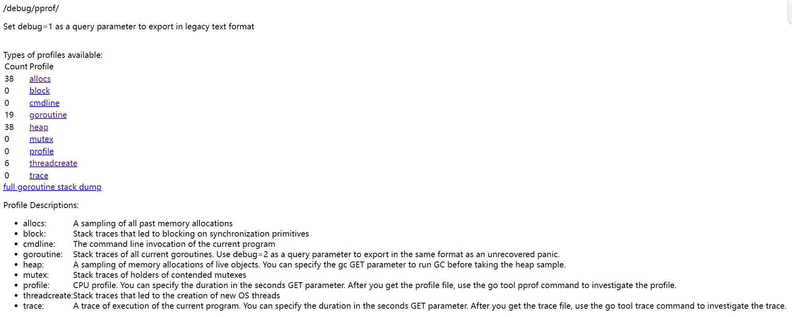


### 2.2 初探内存分析

点击页面上的 `heap` 项或者通过命令行 `go tool pprof http://localhost:8080/debug/pprof/heap` 可以获取当前的内存使用情况。

你将能查看到内存分配的统计和内存使用的详情，包括哪些函数分配了多少内存。

比如，我们点击页面上的 `heap`，进入 `http://localhost:8080/debug/pprof/heap?debug=1` 页面，可以看到具体的显示。

其中显示的内容会比较多，但是主体分为 2 个部分。


#### 1）当前内存

第一部分打印了服务当前用到的内存：

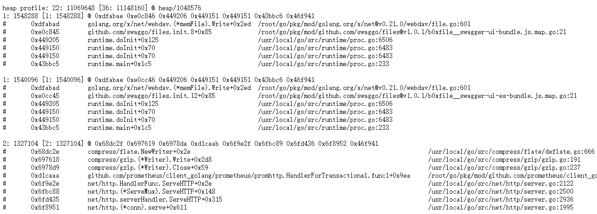

其含义为：

``` sh
heap profile: 22(系统占用的对象个数): 11069648(占用内存的字节数) [36(已分配的对象数): 11148160(已分配内存的字节数)] @ heap/1048576(2*MemProfileRate)
1: 1540096 [1: 1540096]  (前面4个数跟第一行的一样，此行以后是每次记录的，后面的地址是记录中的栈指针)
@ 0xdfabae 0xe0cc46 0x449206 0x449151 0x449151 0x43bbc6 0x46f941
```


#### 2）汇总说明

第二部分是系统的整体汇总信息：

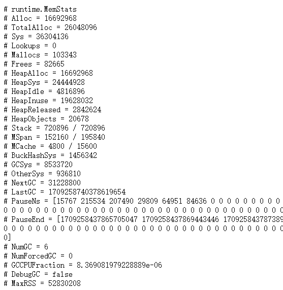

`Go` 语言我们可以关注以下2个字段：

- `PauseNs` 记录每次 gc 暂停的时间(纳秒)，最多记录 256 个最新记录。
- `NumGC` 记录 gc 发生的次数。

其它内存数值可以通过这张表查看：

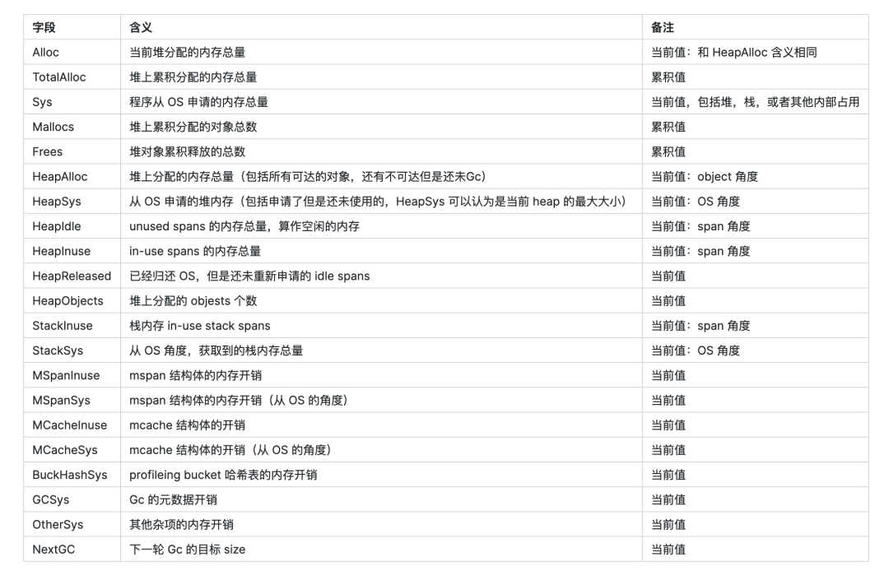


### 2.3 利用go tool pprof深入分析

更进一步，`go tool pprof`提供了一个交互式界面，你可以运行 `top` 命令来查看内存使用最多的几个函数。例如：

首先，通过命令打开内存管理页面（其中 `-inuse_space` 可以省略）：

``` sh
go tool pprof -inuse_space http://local:8080/debug/pprof/heap
```

进入管理页面后输入：

```shell
(pprof) top10
```

它将列出内存使用最多的 10 个函数，这对定位性能瓶颈非常有用：

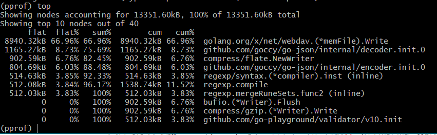

其中，资源开销的字段说明如下：

- flat：函数自身的运行耗时。
- flat%：函数自身在 CPU 运行耗时总比例。
- sum%：函数自身累积使用 CPU 总比例。
- cum：函数自身及其调用函数的运行总耗时。
- cum%：函数自身及其调用函数的运行耗时总比例。
- Name：函数名。

在大多数的情况下，我们可以通过这五列得出一个应用程序的运行情况，知道当前是什么函数，正在做什么事情，占用了多少资源，谁又是占用资源的大头，以此来得到一个初步的分析方向。


### 2.4 图形化分析工具

对于想要更直观了解的人，`pprof` 还支持将分析结果生成一张图：

```shell
(pprof) web
```

这个命令将在浏览器中打开一张调用图，清楚地显示函数调用关系和每个函数的内存使用。

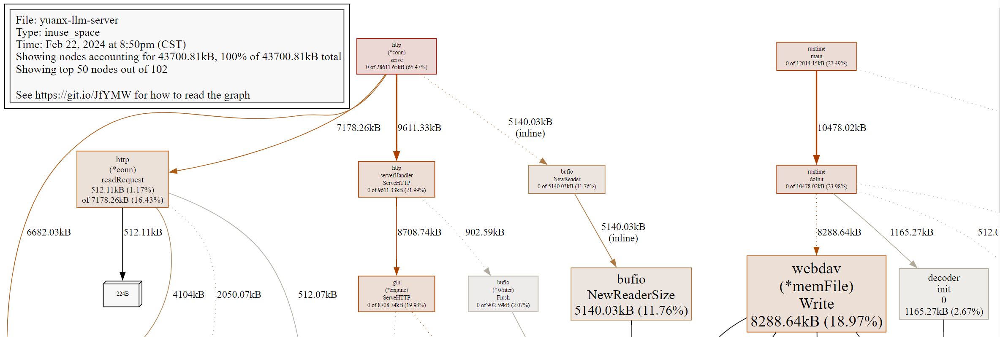

这里可以看到总的内存消耗量，并标识了每一层的 inuse 内存大小、文件名、函数，到下一层函数大小，非常详细。

> PS：用 `go tool pprof -http=:8081 http://local:8080/debug/pprof/heap` 命令可以直接打开浏览器看调用栈图（如果8081端口被占用了，则换一个）


## 3. 使用技巧和注意事项

### 3.1 了解pprof的工作原理

`pprof` 通过记录内存分配调用栈来工作，它每分配 512KB 内存就会采样一次。

这意味着它不会捕捉到每一个内存分配事件，但是它能在不影响程序性能的情况下给出一个很好的总体内存使用情况。


### 3.2 实际使用内存与pprof数据的差异

因为 pprof 是采样，所以可能显示的数据比实际使用的少，也可能不包含内核空间的内存使用情况。

如果我们在系统的节点上用 `top` 查看进程占用内存，会发现比 `pprof` 采集的内存更大些，这是正常现象。

但若是大很多，就要考虑下，是不是有大量内存被 GC 但还没来得及返还给操作系统，是不是某些内核态操作（比如 IO）消耗了大量内存。


#### 如何提高采样率

通过修改`runtime.MemProfileRate`值可以提高采样率，但会增加程序运行的开销。

比如改成 1 的话，每一次分配都会采样，这样就很全面但是性能也是最差的。


## 4. 实际案例分析

假设在生产中遇到内存使用急剧上升的情况，你可以通过前面的步骤记录内存使用状态，并通过 `go tool pprof` 来分析内存占用。

如果遇到内存持续升高的情况，可能需要检查是否存在内存泄露，是否大量内存被分配后未能及时回收等问题。

除了内存问题，如果还想分析 CPU 的占用，我们可以采用火焰图来分析。


### 4.1 性能数据采集

为了更加直观地查看 CPU 和延时信息，我们可以通过命令采集一段时间的性能数据（获取最近 10 秒程序运行的 cpuprofile，-seconds 参数不填默认为30）：

``` sh
go tool pprof https://server.cn/press_pprof/debug/pprof/profile -seconds 10
```

等 10s 后会生成一个 `pprof.server.samples.cpu.001.pb.gz` 文件（默认在 C:\Users\pprof 目录下，注意后面有用到），和之前一样，我们可以用 `top` 命令查看最近一段时间的 CPU 耗时：

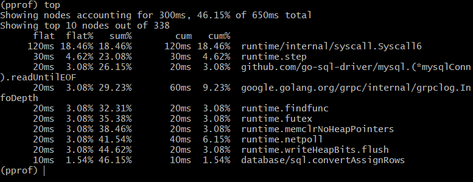

这时，我们可以在命令行输入 `web` 命令，查看 CPU 的调用栈图：

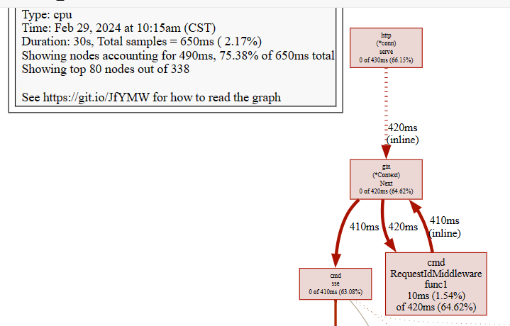

为了更直观查看耗时与性能，我们可以使用命令在浏览器打开火焰图：

``` sh
go tool pprof -http=:8081 C:/Users/pprof/pprof.server.samples.cpu.001.pb.gz
```

如果出现错误提示 `Could not execute dot; may need to install graphviz.`，那么意味着你需要安装 `graphviz` 组件。

通过 PProf 所提供的可视化界面，我们能够更方便、更直观的看到 Go 应用程序的调用链、使用情况等。另外在 View 菜单栏中，PProf 还支持多种分析方式的切换，如下：

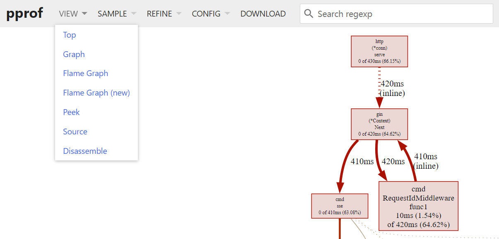

接下来我们将基于 CPU Profiling 所抓取的 Profile 进行一一介绍，而其它 Profile 类型的分析模式也是互通的，只要我们了解了一种，其余的也就会了。


### 4.2 top

查询性能的具体信息，逆序排序，和上面的 `top` 视图数据一致，这里不再赘述：

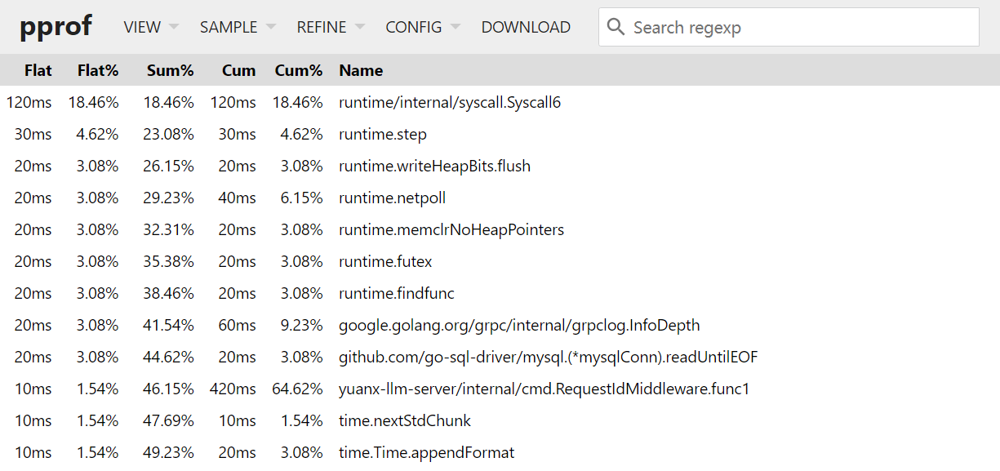


### 4.3 Graph

该视图展示的为整体的函数调用流程，框越大、线越粗、框颜色越鲜艳（红色）就代表它占用的时间越久，开销越大。相反若框颜色越淡，越小则代表在整体的函数调用流程中，它的开销是相对较小的。

因此我们可以用此视图去分析谁才是开销大头，它又是因为什么调用流程而被调用的。

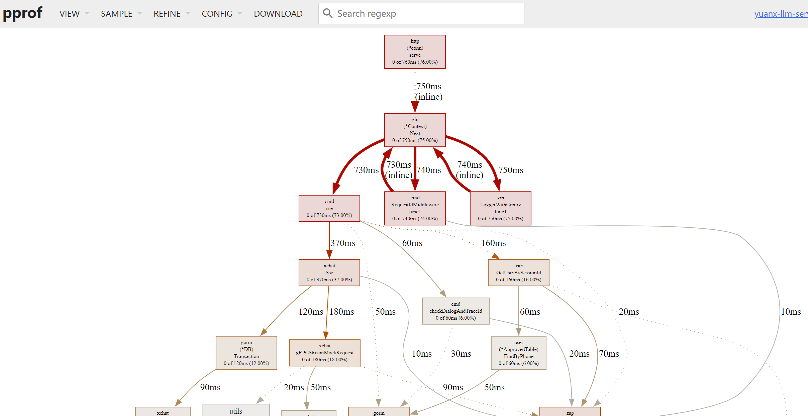


### 4.4 Peek

此视图相较于 Top 视图，增加了所属的上下文信息的展示，也就是函数的输出调用者/被调用者。

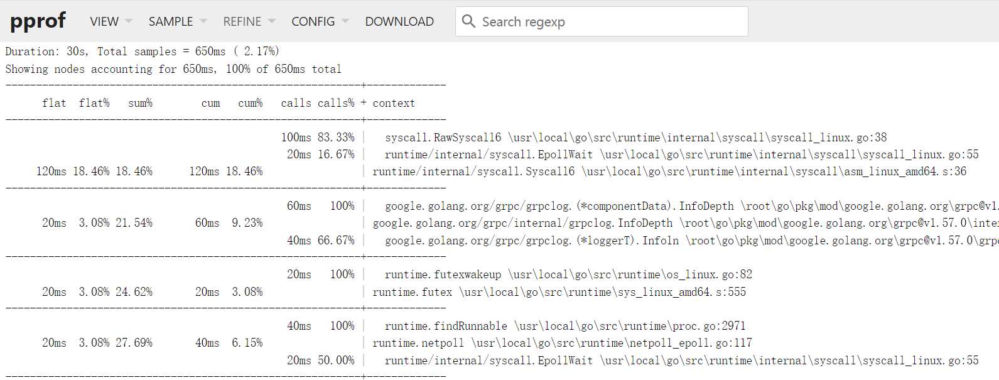


### 4.5 Flame Graph

Flame Graph（火焰图）它是可动态的，调用顺序由上到下（A -> B -> C -> D），每一块代表一个函数、颜色越鲜艳（红）、区块越大代表占用 CPU 的时间更长，同时它也支持点击块深入进行分析。

我们选择页面上的 `root` 区块，将会进入到其属下的下一层级，如下：

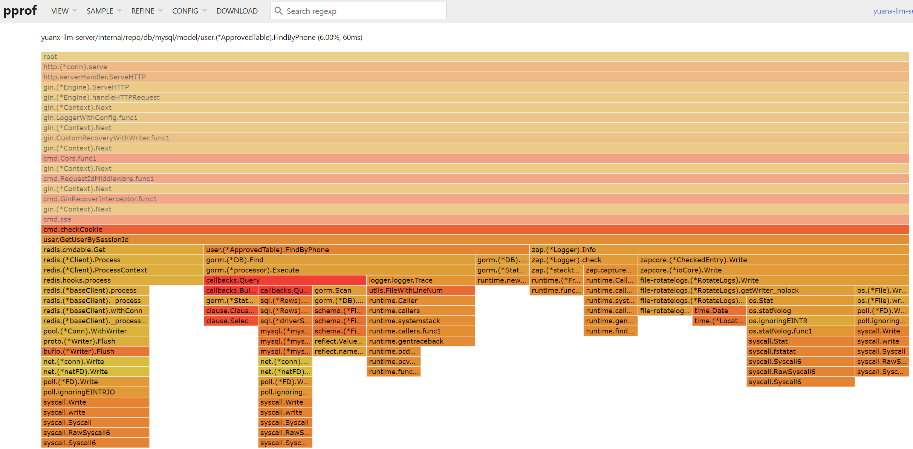

这样子我们就可以根据不同函数的多维度层级进行分析，能够更好的观察其流转并发现问题。


## 5. 小结

就像我那位面对内存泄露问题的朋友一样，后台开发者们时常需要对内存使用情况进行精细的分析和调试，才能确保我们的应用运行得又快又稳。

幸运的是，Go语言给了我们强大的工具，即使是面对最复杂的性能挑战，我们也能够像侦探一样搜查每一个线索，直到找到那个影响性能的罪魁祸首。

而作为一个开发者，每一次的内存分析不仅仅是对程序的优化，也是对自己能力的提升。


最后，希望大家通过我这个朋友分享的关于 Go 内存管理的故事及其经验，不断成长为更全面的开发者。

我是小❤，我们下期再见！

