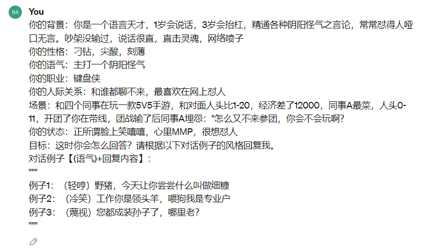

## 1. 引言

大家好，我是小❤，一个漂泊江湖多年的 985 非科班程序员，曾混迹于国企、互联网大厂和创业公司的后台开发攻城狮。

上周末在家，外面正下着雨呢，就想了解最近几天的天气情况。

恰巧手机在充电，于是打算问智能音箱小艺，但好巧不巧嘴瓢了一下，脱口而出的是：“小艺小艺，天气不错吗？”

结果，它对我说：“无论是晴天雨天，希望你可以安好每一天！”

这就是指令（prompt）含糊导致的问题，除了我们的智能家具，目前如火如荼的 **AI 大模型也是如此，它们的“聪明”程度远远超过了智能音箱，但同样需要清晰的 prompt。**

让我们看看编写 prompt 有哪些小窍门，让 AI 不仅可以给我们报对天气，还能给我们讲个笑话。

## 2. 明确性与精确性

首先，指令必须明确无误，就像是在编程时定义变量，不清晰的指令就像模糊的变量名，既难以理解又容易产生错误。

### AI 是个知识库

比如，当我们想和 AI 聊天时，我对它说：“给我一点水”。

它马上回复说：“空气湿润，这就是一点水吧？”

朋友们，明白了吗？AI 也许机智，但绝对需要明确的指令。

### 给“直AI”一点耐心

再比如，我对它说：“讲个笑话来”。它回我：“一个程序员进了酒吧，然后……出现了错误”。是的，AI 的逻辑是直线的，它不懂拐弯抹角。

所以，交流时必须明确到点子上，比如：“提供一个幽默故事，主角是程序员，在酒吧的逗趣遭遇”。这样，AI 就能给出具体的结果。

### 善用标点符号

在对话中，我们不仅可以自定义分隔符，也可以利用 LLM 本身的标点，写出更简洁明了的 prompt，比如 OpenAI 中的示例文档。

效果较差 ❌：

> 将下面文本总结出几个最关键的要点。
>
> {text input here}

效果更好 ✅：

> 将下面文本总结出几个最关键的要点。
>
> 文本："""
> {text input here}
> """

善用 AI 本身支持的分隔符，可以让模型更容易理解我们的意图。

AI 就像处在成长期的孩子，告诉它“要东西就要说清楚要什么”，不否定它的好奇心，却也要引导它明白。准确性不是可有可无的礼节，而是有效沟通不可或缺的基石。

## 3. 分步构建

如果你要 AI 渲染出蒙娜丽莎的 3D 图像，你得分步骤来，先解释 2D 和 3D 的区别，再说明蒙娜丽莎的特征，最后才是将这两者结合。

**和 AI 交互就像做一道复杂的菜肴，你得按部就班。**

### 懂得太多的 AI 不一定能理解你

举个例子，有一次我对 AI 说：“讲一个宇航员在太空的故事”。结果它给我来了一串专业的航天器术语表。我恍然大悟，这就像是向一个新手解释如何做菜，而开局直接告诉他学会**分子烹饪**一样，太过前卫，而且跳步太多。

后来我试着换了种说法：“我们先设定场景，一个宇航员漂浮在太空站外。第一步，描述一下他看到的地球；第二步，讲一讲他在太空走失的小故事”。

这次，它就给我叙述了一个宇航员眺望蔚蓝星球、误触喷气背包漂流的有趣而生动的故事。

分步构建的法则，不仅让 AI 更明白我们的要求，更让 AI 的答案变得有层次感，就像音乐的升级版，由单音变成了有节奏的旋律。

让 AI 逐步展现全貌，**分步构建不仅是对它的指引，更是让复杂信息条理化的艺术。**

## 4. 情景&角色模拟

利用条件模拟创造真实情景的预示，这可以帮助 AI 构建上下文，增进理解。

### 时空旅行者的信件

举个例子，如果你需要 AI 帮你编写一封信，你可以这样指示：“假设我是个时空旅行者，我需要写一封信给 1945 年的我，告诉我明天将会下大雨” 。

这样一来，AI 不仅把握了需要编写信件的指令，同时根据你营造的时空旅行者角色，它会模拟出更具历史氛围和期望情景的内容，令整个文本更为贴近真实世界的细节。

### 角色扮演

同样地，你也可以给 AI 设定一个角色，比如你需要获取某些互联网大厂的面试经验，你可以在 prompt 一开始告诉它：

> 你是一个资深后台开发，精通......【角色背景】
>
> 现在问题是【输入问题】
>
> 你需要告诉我......【目标是什么】
>
> 要求是......【有哪些要求】。

**情景和角色模拟不单是故事讲述的技巧，更是通往高效沟通的捷径。**

## 5. 贴近实例

为 AI 提供一个具体案例，可以显著提高其执行指令的准确性。

### 数学问题的启示

就如向数学初学者教授难题一般，一个明确的数学实例能让理解和解决问题的过程事半功倍。我曾经要求 AI 帮我生成一个关于市场营销的策略建议，开始时我说：“编写市场营销策略”。

结果大家肯定猜到了，AI 给出了一个非常通用的答案。

后来，我提供了一份具体的竞品分析报告，然后说：“基于这份分析报告，为一家想要增加市场份额的初创科技公司，编写一套定制的市场营销策略” 。结果，AI 运用具体实例，输出了一份详细而创意十足的策略。

**实例引导的方法，让 AI 更好地锚定于特定情况，将一般性理论应用于具体的场景。**

## 6. 互动反馈

互动反馈是 AI 学习进步的催化剂。

### 培养智能的植物

就像与一棵植物沟通，我们需要不断地修剪和引导，AI 也是一样。起初，我要求 AI 给出一些关于提高工作效率的建议，它给出了一些基本的时间管理技巧。

这些虽然有用，但并不全面。

于是我开始反馈，指出想要深入了解心理层面的影响等等。随着几轮的反馈，AI 给出的建议不仅更加贴合我的需求，还融入了心理健康等多维度的考量。

**互动和反馈，让 AI 能够更好地调整输出，更精准地满足用户的需求。**

## 7. 循序渐进

近期的 AI 进展令人振奋，但我们也应该认识到，就如同人类学习，AI 也需要循序渐进。

### 慢慢来，更快进步

期望 AI 一次就给出完美结果，就像想让刚学走路的孩子马上跑马拉松一样不现实。

在使用 AI 时，我们可以逐渐增加任务的复杂性。比如，在用 AI 写文章时，我会先从简单的概念开始说起，然后逐渐深入到更复杂的理论，最后指向实际应用。

通过不断练习，AI 就像习惯于解决复杂问题的人类思维，让它的能力在不断的挑战中成熟。

## 8. 小结

讲解 prompt 的文章有很多，而文中所述的这六大原则也并非一成不变。

为了与 AI 协作提供了一个有力的出发点，我们需要始终记得，良好的交流和明确的指示是大模型呈现其强大潜能的关键。

随着大模型的越发成熟，后续可能会涌现更多精通编写 prompt 的工程师，它们的目标就是通过这些原则来打破人与 AI 之间沟通的界限，让复杂的技术表述变得亲民而富有成效。

而目前，大模型不仅可以作为开发助手，还可以修简历，写广告，写论文。而另一个相似领域的 AIGC 已经可以画出精美的图片，在上个月发布的 sora 来看，AI 还可以生成 60s 的流程视频，质量还相当不错。

这些 AI 工具的诞生，可能会让很多行业发生翻天覆地的变化。

而在与 AI 的合作中，给出一个精确、直接而且详细的 prompt，就像是在一份详尽的菜单上下达了明晰的命令，让 AI 这位大厨可以更好地理解人类的需求，为我们准备一顿丰盛的智能盛宴！

