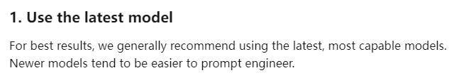
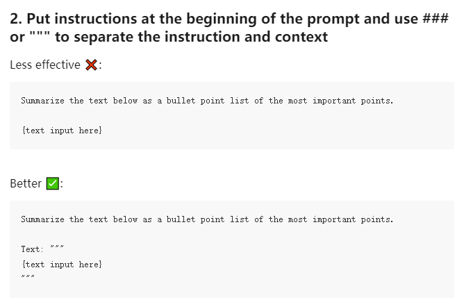
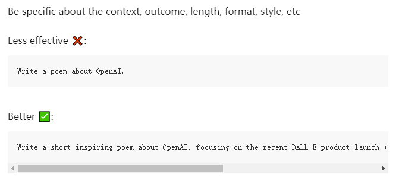
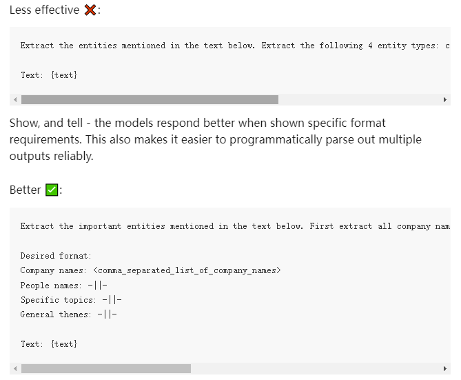
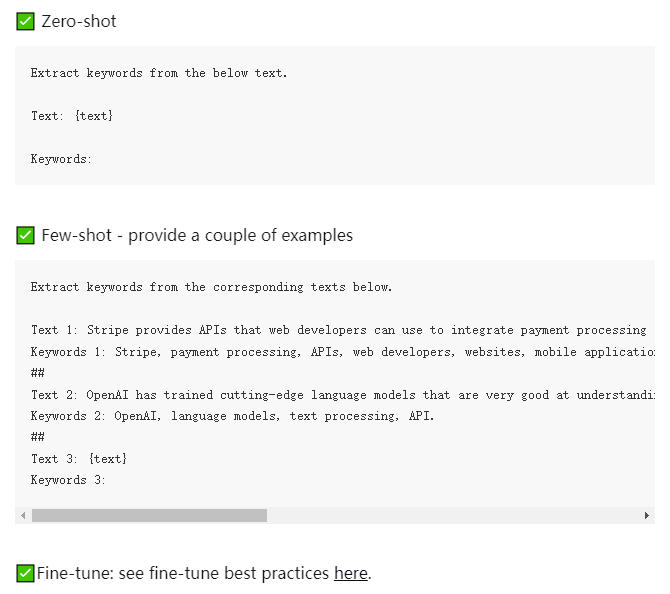
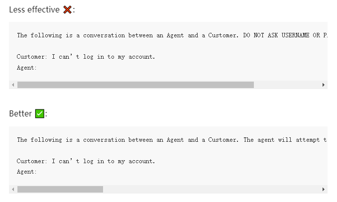
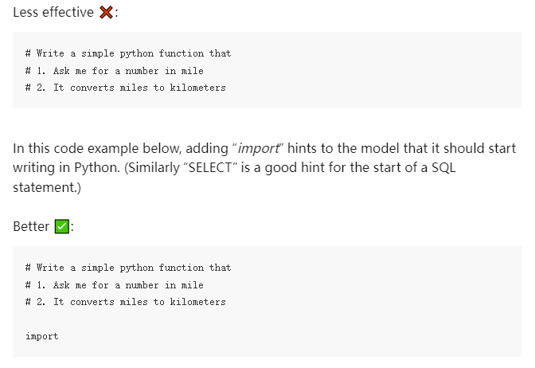

#### 1. 使用最新模型

为了获得最佳效果，我们通常建议使用最新、最强大的模型。新模型往往更容易进行提示工程。

#### 2. 指令位置和分隔符

将指令放在提示的开头，并使用###或"""来分隔指令和上下文

效果较差 ❌：

> 将下面的文本总结为最重要点的项目符号列表。
>
> {text input here}

效果更好 ✅：

> 将下面的文本总结为最重要点的项目符号列表。
>
> 文本："""
> {text input here}
> """

#### 3. 具体和描述性

尽可能具体、描述性和详细地说明所需的上下文、结果、长度、格式、风格等

效果较差 ❌：

> 写一首关于OpenAI的诗。

效果更好 ✅：

> 写一首简短且鼓舞人心的诗，关注最近的DALL-E产品发布（DALL-E是一个文本到图像的机器学习模型），采用{著名诗人}的风格

#### 4. 通过示例明确所需的输出格式

展示并告诉 - 当模型被具体的格式要求所示时，响应会更好。这也使得以编程方式可靠地解析多个输出变得更容易。

效果较差 ❌：

> 提取下面文本中提到的实体。提取以下4种实体类型：公司名称、人名、特定主题和主旨。
>
> 文本：{text}

效果更好 ✅：

> 提取下面文本中提到的重要实体。首先提取所有公司名称，然后提取所有人名，然后提取符合内容的特定主题，最后提取普遍的主旨。
>
> 所需格式：
> 公司名称：<逗号分隔的公司名称列表>
> 人名：-||-
> 特定主题：-||-
> 普遍主旨：-||-
>
> 文本：{text}

#### 6. 学习与微调

从零次学习开始，然后是少数次学习，如果都不行，再微调

✅ 零次学习

> 从下面的文本中提取关键词。
>
> 文本：{text}
>
> 关键词：

✅ 少数次学习 - 提供几个示例

> 从下面的文本中提取关键词。
>
> 文本1：Stripe提供API，网络开发人员可以使用这些API将支付处理集成到他们的网站和移动应用中。
> 关键词1：Stripe, 支付处理, API, 网络开发人员, 网站, 移动应用
> ##
> 文本2：OpenAI已经训练了尖端的语言模型，这些模型非常擅长理解和生成文本。我们的API提供对这些模型的访问，并且可以用于解决几乎所有涉及处理语言的任务。
> 关键词2：OpenAI, 语言模型, 文本处理, API。
> ##
> 文本3：{text}
> 关键词3：

✅ 微调：请参阅这里的微调最佳实践

> https://platform.openai.com/docs/guides/fine-tuning/preparing-your-dataset

#### 7. 直说需求

与其只说不要做什么，不如说要做什么

效果较差 ❌：

> 以下是代理和客户之间的对话。不要询问用户名或密码。不要重复。
>
> 客户：我无法登录我的账户。
> 代理：

效果更好 ✅：

> 以下是代理和客户之间的对话。代理将尝试诊断问题并提出解决方案，同时避免询问任何与个人身份信息有关的问题。代替询问用户名或密码等个人信息，请引导用户访问帮助文章www.samplewebsite.com/help/faq
>
> 客户：我无法登录我的账户。
> 代理：

#### 8. 引导词

代码生成特定 - 使用“引导词”来促使模型朝特定模式发展。

在下面的代码示例中，添加“import”暗示模型它应该开始用Python编写。（同样，“SELECT”是SQL语句开头的一个好提示。）

效果较差 ❌：

> \# 编写一个简单的python函数
> \# 1. 向我索要一个以英里为单位的数字
> \# 2. 它将英里转换为公里

效果更好 ✅：

> \# 编写一个简单的python函数
> \# 1. 向我索要一个以英里为单位的数字
> \# 2. 它将英里转换为公里
>
> import

#### 参数

通常，我们发现模型和温度是最常用的参数来改变模型输出。

model - 性能更高的模型通常更昂贵，可能有更高的延迟。

temperature - 衡量模型输出不太可能出现的标记的频率。温度越高，输出越随机（通常也更有创造性）。然而，这并不等同于“真实性”。对于大多数事实性用例，如数据提取和真实的问答，0温度是最佳选择。

max_tokens（最大长度）- 并不控制输出的长度，而是标记生成的硬性截止限制。理想情况下，你不会经常触及这个限制，因为你的模型会在它认为完成时停止，或者当它遇到你定义的停止序列时停止。