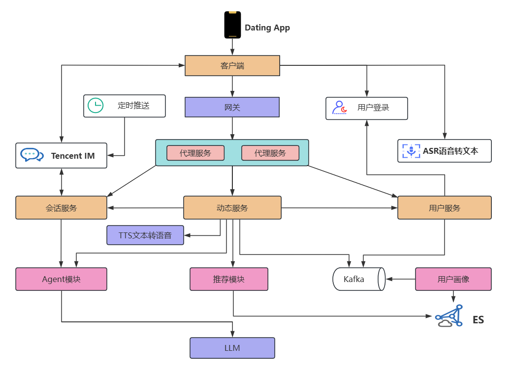
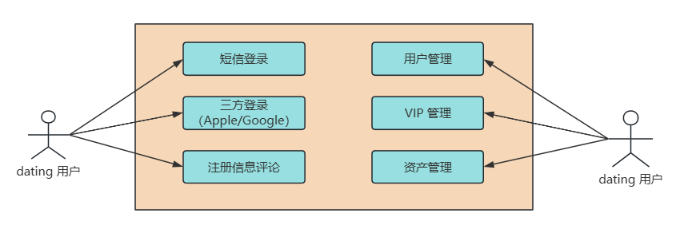
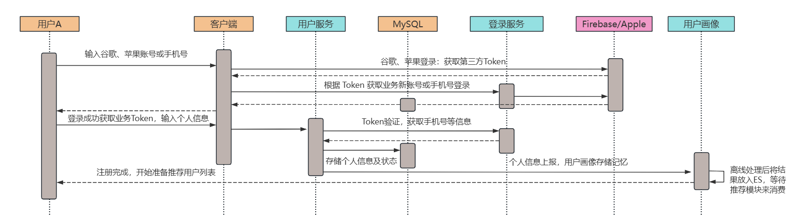
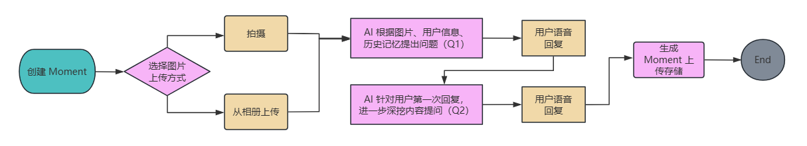

`Dating` 是一款社交类 App，在传统单一社交上新增了 `虚拟 AI`，采用 `Moment+ AI 对话`等动态方式，让交友对象可以更快速地熟悉彼此，从而快速实现精准 Match 的目的。

架构图：

涉及前后端关键组件如下：

> 客户端，网关、用户服务、会话服务、动态服务

涉及算法模块如下：

> Agent模块，用户画像，推荐模块

涉及基础组件包括：

> ASR（语音转文字），TTS（文本转语音），DB（结构化数据存储），COS文件存储及 Kafka 数据传输等

主要功能包括：用户登录、Moment 发布、获取推荐用户、IM 对话，下面基于这些核心功能，我们依次来介绍一下。

### 1. 用户登录

用户在使用 App 的过程中，创建账号可以方便用户对自己创建的资料和信息进行管理。

业务时序图如下：

Dating 支持用户采用谷歌、苹果账号或者手机号登录，登录模块是公共模块，主要和 Firebase/Apple 后台进行交互，做数据鉴权和验证。

用户的业务信息主要有用户服务管理，存储在 MySQL 里面，并且将用户的个人信息：包括昵称、年龄、性别、喜好、标签等数据上报到用户画像进行离线处理，每当有用户注册完成后，推荐模块会根据用户画像的数据用一定的公式计算两个用户之间的匹配度，进行推荐。

### 2. Moment 发布

在快节奏的现代社会中，人们越来越倾向于通过在线约会应用程序寻找伴侣。然而，虚拟世界中的信任建立和真实性验证是一个挑战。我们的约会应用程序通过引入"Moment"功能，旨在提供一个创新的平台，利用人工智能技术引导用户全面展示自己，并与潜在的伴侣建立真诚的联系。

以下是创建 Moment 的步骤：

用户选择图片进行上传到 dating，后台根据图片内容、用户信息生成 AI 提问，比如用户上传了一张猫咪的照片，AI 可能会用温柔的语音询问：“Hi 小❤，这只布偶猫咪真可爱，是之前你说的那只奶昔吧，看它在床上睡得真闲适啊！你今天还要继续在家撸猫吗，还是出门和大学同学去逛街啊？”

这时我会回答：“是的，奶昔很可爱呢，今天要背着它先打疫苗，然后和鄢哥去约饭”，然后 dating 再根据我的回答调整问题，经过两次问答之后，客户端会上传这部分的视频和图片，以及我和 AI 的问答信息，并将它们经过后台处理后记录成我的标签，最终放到我的个人画像里面。

下次我们再上传 Moment 时，AI 就可能会问：“Hi 上周你和鄢哥去约饭吃了些什么呀？味道如何...”，这个部分涉及的技术栈有 ASR、TTS 等，需要关注的是：为了让 AI 提问更快捷，我们采用流式请求的方式来进行语句拼接和返回。

### 3. 获取推荐用户

