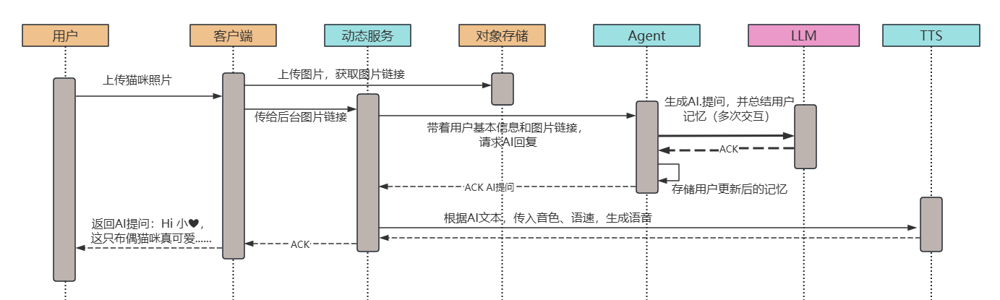

### 引言

大家好，我是小❤。

不知道大家有没有经历过，比家人逼着相亲的苦恼，被七大姑八大姨天天问有没有对象的无奈。当然，希望你永远不要经历 >-<

不过，在今天这个快节奏的世界里，相信有很多人都有找对象或者说约会的需求。这时候，谁不想要一个聪明的红娘呢？

“Dating” 应用正是为此而生，它将传统约会方式和 AI 技术完美结合，让你和潜在对象的距离瞬间拉近。本文将带你一探这款应用的神奇之处，看看它如何让约会变得既高效又有趣。

### 1. 整体架构

`Dating` 是一款社交类 App，在传统单一社交上新增了 `虚拟 AI`，采用 `Moment+ AI 对话`等动态方式，让交友对象可以更快速地熟悉彼此，从而快速实现精准 Match 的目的。

架构图：

涉及前后端关键组件如下：

> 客户端：页面展示，接口调用，渲染好看或者有趣的用户信息
>
> 网关：数据接收，根据用户不同的位置就近接入代理服务，比如：你在硅谷和在深圳，网关侧识别后分别将请求发到不同的代理服务上
>
> 代理服务：公共鉴权，业务请求转发，灰度部署等，在不同地区部署多个服务器（如硅谷、深圳）
>
> 用户服务：管理用户基本信息，用户权益等数据
>
> 动态服务：存储用户Moment动态信息，以及和推荐、Agent交互，是Dating业务的核心后台模块
>
> 会话服务：管理用户关系（好友、粉丝）和用户对话，和 IM 后台之间交互

涉及算法模块如下：

> Agent模块：接收后台传入的用户对话信息，根据一定的Prompt规则，请求大模型（LLM）进行AI回复
>
> 用户画像：处理用户所有基础数据和记忆，加工、过滤、筛选，并存入ES（大数据处理组件）
>
> 推荐模块：暴露接口给后台服务，当用户获取推荐时，在ES里取出对应的用户列表展示在客户端页面上

涉及基础组件包括：

> ASR（语音转文字），TTS（文本转语音），DB（结构化数据存储），COS文件存储及 Kafka 数据传输等

主要功能包括：用户登录、Moment 发布、获取推荐用户、IM 对话，下面基于这些核心功能，我们依次来介绍一下。

### 2. 用户登录

用户在使用 App 的过程中，创建账号可以方便用户对自己创建的资料和信息进行管理。

Dating 支持用户采用谷歌、苹果账号或者手机号登录，登录模块是公共模块，主要和 Firebase/Apple 后台进行交互，做数据鉴权和验证。

业务时序图如下：

用户的业务信息主要是用户服务进行管理，结构化数据存储在 MySQL 里面，图片、视频类数据存在 Cos 对象存储服务中。

同时，用户的个人信息：包括昵称、年龄、性别、喜好、标签等数据上报到用户画像进行离线处理，每当有用户注册完成后，推荐模块会根据用户画像的数据用一定的公式计算用户之间的匹配度，进行推荐。

### 3. Moment 发布

在快节奏的现代社会中，人们越来越倾向于通过在线约会应用程序寻找伴侣。然而，虚拟世界中的信任建立和真实性验证是一个挑战。

Dating 通过引入"Moment"功能，旨在提供一个创新的平台，利用人工智能技术引导用户全面展示自己，并与潜在的伴侣建立真诚的联系。

以下是创建 Moment 的步骤：

moment创建中AI共提问两轮：

第一轮，AI 根据用户相册上传/主摄像头拍摄的图片/live 动图+用户基础信息进行提问，问题实时展示在视频上。提问结束后调用前置摄像头，并出现语音交互提示，用户通过语音回答 AI 的问题。

第二轮，AI 根据用户上一轮回答深挖提问，问题实时展示在视频上。提问结束后调用前置摄像头，用户继续通过语音回答问题。

两轮回答结束后，进入 moment 制作环节（loading 状态），moment 制作完成后向用户展示。

用户点击“post”按钮进行发布，若不满意拍摄效果，可点击返回按钮选择是否删除当前 moment 重新创建。

以下是交互流程（时序图）：

用户选择图片进行上传到 dating，后台根据图片内容、用户信息生成 AI 提问，比如用户上传了一张猫咪的照片，AI 可能会用温柔的语音询问：“Hi 小❤，这只布偶猫咪真可爱，是之前你说的那只奶昔吧，看它在床上睡得真闲适啊！你今天还要继续在家撸猫吗，还是出门和大学同学去逛街啊？”

这时我会回答：“是的，奶昔很可爱呢，今天要背着它先打疫苗，然后和鄢哥去约饭”，然后 dating 再根据我的回答调整问题，经过两次问答之后，客户端会上传这部分的视频和图片，以及我和 AI 的问答信息，并将它们经过后台处理后记录成我的标签，最终放到我的个人画像里面。

下次我们再上传 Moment 时，AI 就可能会问：“Hi 上周你和鄢哥去约饭吃了些什么呀？味道如何...”，由于都是通过语音进行交流，所以这个部分涉及的组件主要有 DB 存储语言文件路径，Cos 存储语音文件，ASR 将用户语音转为文本输入，TTS 将大模型的回复文本转成语音播放给用户听。

### 4. 获取推荐用户

当用户创建 Moment 之后，就可以在首页刷到别的用户了。

推荐时我们会根据：用户距离、相似度（比如年龄、身高、兴趣爱好）、活跃度、Moment 丰富程度等来进行推荐，倾向于推荐那些有着优质 Moment 及内容完善度高，还有比较活跃的用户。

同时，会根据用户的受欢迎程度来影响被推荐的概率因子。

用户刷到别的用户时，可以在主页点赞或者对别人的 Moment 进行评论，这时：客户端会调用 ASR SDK 方法，将用户的语音评论转换成文本传入后台动态服务。

每次点赞或评论都默认喜欢对方。当对方用户回复了点赞或评论后，就会自动成为好友，此时会话服务会把好友关注写入到 IM 系统中（比如腾讯云的 IM 系统，参考 QQ），进行实时会话管理、好友关系维护等。

### 5. IM 对话

当两个用户成为好友以后，就可以在 CHAT 页进行对话。

此时，用户拉取好友列表、发消息都是直接调用 IM 管理服务，如果是真实用户对话，IM 管理服务会将会话发到长连接管理中心，进行消息推送。比如：你在 VX 上给好友发了一条消息，好友手机 APP 上就会出现通知图标。当好友拉取对话列表时，IM 管理服务会在接口返回两个用户的聊天记录。

同时，当 IM 管理服务监测到有消息发送时，会将所有对话通过回调的方式传入会话服务。会话服务会通过用户 ID 判断是与真人对话还是和虚拟人对话，如果是和虚拟人对话则调用 Agent，通过一系列 Prompt 处理后由 LLM（大模型，如 DeepSeek）生成智能回复。

### 6. 一些难点和要点

#### 1）好友关系存储复杂

在所有社交软件中，IM 关系都是我们需要考虑的重点。Dating 业务中，我们不仅要考虑单向关注、粉丝，好友，以及成为好友后单向取关、好友拉黑等情况。

关系模型转换图如下：

为了减少转换的状态，我们将拉黑和删除好友后，直接将关系置成单向关注，并在 IM 开始对话前校验好友关系，如果发现对方已经拉黑或者删除，就弹出一个提示（类似 VX 里面的红色感叹号），无法进行对话。

同时，为了快速返回好友的关系，我们在会话服务存储关系状态时，不仅需要持久化到 DB 里面，还需要给每个用户创建三个 Set（分别存储好友、粉丝和已关注），这样拉取好友列表时可以快速返回，减轻数据库负担。

关于 Redis 和 DB 如何保持一致性，可以看我之前写的这篇文章：

#### 2）用户对话耗时较高

在创建 Moment 时，由于每次需要通过用户上传的图片，其基本信息，用户记忆等数据请求大模型，再生成 Q1 提问，这个串行化的过程比较长且涉及 VQA 流程（即**给机器一张图片和一个开放式的的自然语言问题，要求机器输出自然语言答案**），同时，由于图片的链接放在对象存储服务中，每次从 LLM 拉取图片链接时由于网络不稳定，可能会导致用户上传图片后等待回复需要很久，大概 7~9s。

所以我们通过以下方式来优化：

1. 图片直接通过 Base64 从客户端传入 LLM，节省图片上传下载耗时；
2. Agent 通过记忆、图片信息提问时合并成一步，减少多次调用耗时，总结用户记忆可以异步进行；
3. 流式传输，每次 AI 流式返回时，动态服务通过标点符号判断一整句话就送入 TTS 生成语音返回给用户，把整段耗时减少为首句耗时；

通过以上优化，客户端等待时间从 7~9s 减少到 1~2s 就可以收到 AI 提问。

#### 3）用户Moment播放卡顿

获取推荐列表时，由于用户都是从对象存储拉取视频文件进行播放，所以对用户的网络要求比较高。而对于海外 25~30Mbps 网速的用户来说，拉取一个 15MB 的视频就得花 5s（15/3MB/s），这是项目上是难以接受的，用户体验也很差。

所以我们尝试加入视频压缩、预加载和自适应码流播放等功能。

具体流程为：客户端在 Moment 发布合成视频时，将原视频分片上传至视频处理中心（VHS），并通过开启 QUIC 的方式，让用户在弱网环境下也有着不错的性能。

然后 VHS 根据配置的规则开始转码，通过异步转码的方式处理视频，将用户的视频转成 480P、720P、1080P 等格式。

动态服务将视频的链接存储，每次客户端拉取时，返回视频链接，这时 VHS 可根据用户网速的变化自动选择最适合的码流，在保证视频播放尽可能流畅的前提下，选择最佳清晰度的视频播放，以此来优化用户体验。

### 7. 小结

由于篇幅有限，很多技术点和细节都是浅尝辄止，如果读者感兴趣，后面我们可以再出一篇细节的技术或者代码实现来讲解介绍。

感谢大家一路看到这里！还记得我们开头聊的那些相亲烦恼吗？在这个快节奏的世界里，Dating 应用正是为了解决这些问题而诞生的。

它不仅结合了传统约会方式和 AI 技术，还让整个过程变得更有趣和高效。无论是智能推荐、自然流畅的对话，还是轻松的互动体验，这款应用都让你在寻找对象的路上更加从容。

在大模型应用化的过程中，Dating 算是一款为现代约会带来了新思路的 App。希望它能为大家提供一些启发，让你在爱情的路上少些波折，多些乐趣；同时让我们在 AI+ 的过程中，探索更多可能性，体验技术如何在社交关系中发挥积极作用。

