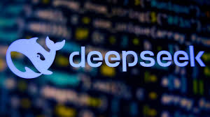
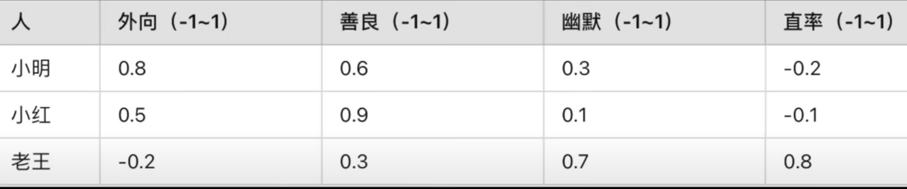
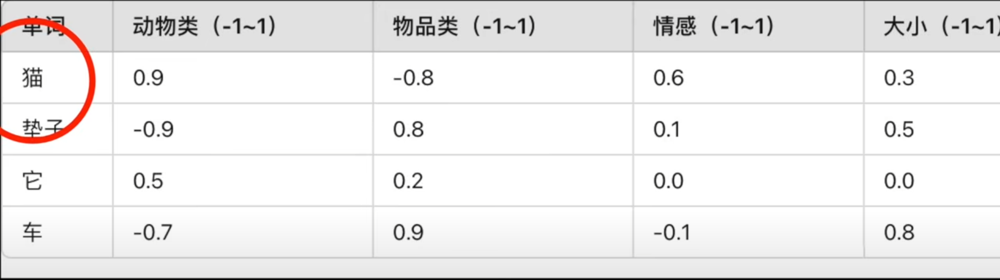
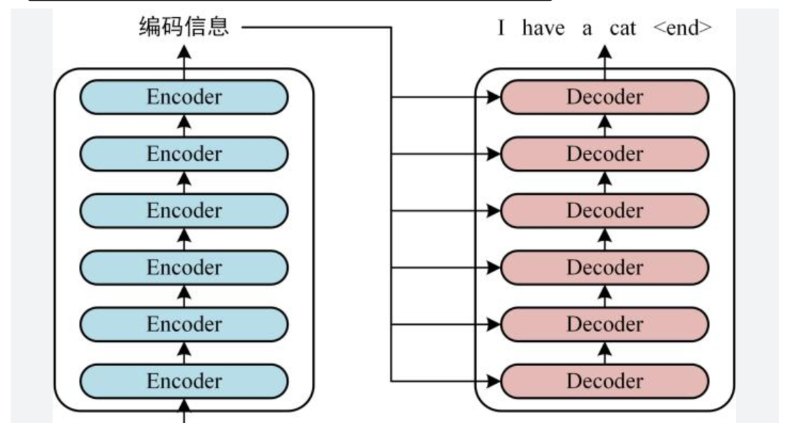
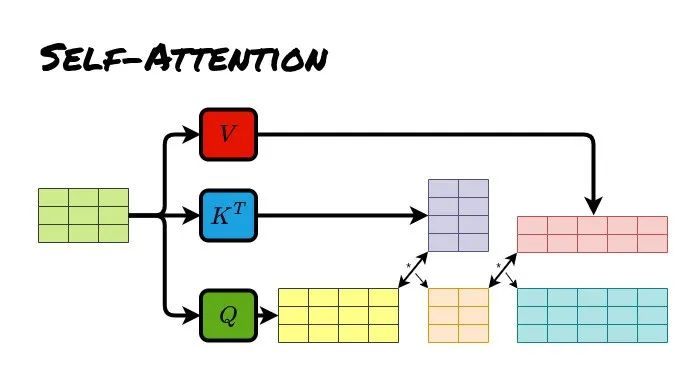
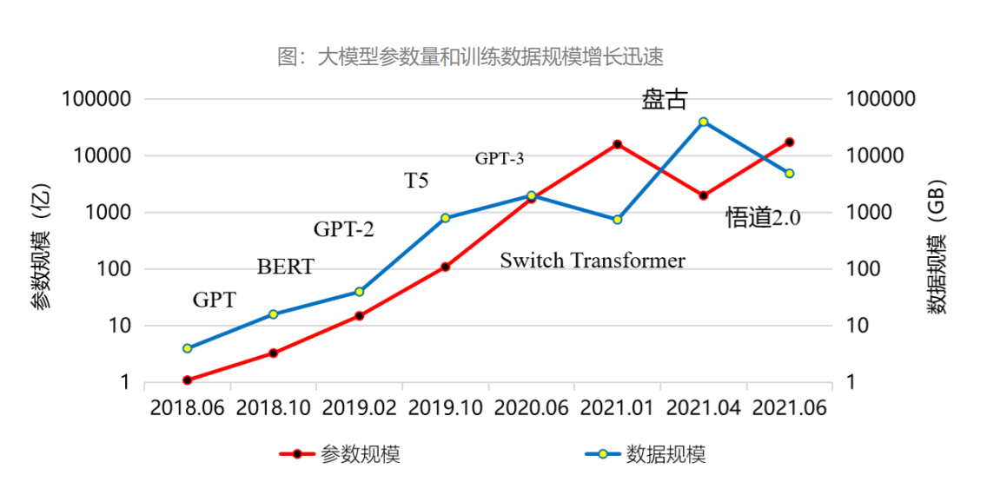
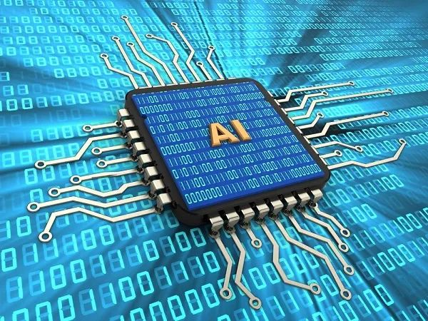
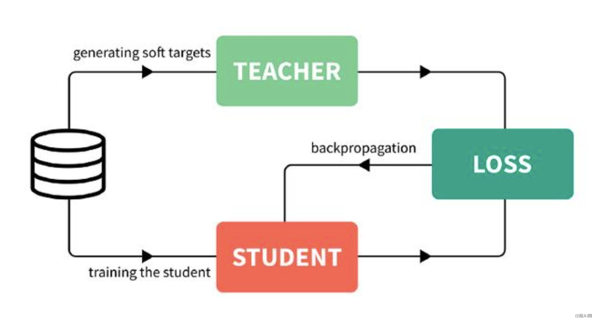

### 1. 前言

最近 AI 黑马 DeepSeek 火遍大街小巷，不知道大家都体验过没有，反正身边已经有很多同学朋友跑来问我：哎小❤，你们公司不也是做 AI（人工智能）的吗，有听说过 DeepSeek 吗？

那显然听过，从目前的形势来看，它不仅又一次带动国内的 AI 潮，也直接影响了大多数科技巨头公司的股票，以及整个互联网经济。别的不说，就我 2019 年买的互联网基金，终于重新回本盈利了~

那么，DeepSeek 有这么厉害吗？

有人说，它搞崩了美国的股市，彻底实现了弯道超车；也有人说，它不过是借着 OpenAI 的东风，吹得再高也只是昙花一现，根本不值一提。

网络上的声音非常两级分化，要么吹得天花乱坠，要么嗤之以鼻。

话说回来，聊 AI 这么“高大上”的东西，如果不清楚原理就瞎说，那和耍流氓有啥区别。但也不能太学术，毕竟咱也不是专门吃这碗饭的，也不需要了解那么学术化的知识，例如下面这种看到就想打瞌睡的：

所以，DeepSeek 到底是被夸大，还是真的这么牛B，我们今天就用最通俗的语言来科普一下。

### 2. LLM 大语言模型

首先要想弄明白 AI，咱们还得先搞清楚大语言模型（LLM）。

这么说吧，当今社会上几乎所有的大语言模型，像什么 OpenAI 的 ChatGPT，谷歌的 Gemini，Meta 的 LLaMA，以及国内比较出名的百度文心一言，华为的盘古，还有咱们今天要说的 DeepSeek，他们都来自同一个核心结构，就是 **Transformer**（变形金刚的英文）。

Transformer 这个概念源自 2017 年的来自谷歌团队的一篇神论文《Attention Is All You Need》，它的第一作者是一位印度裔科学家，名叫 Ashish Vaswani。

Transformer 最主要的原理名叫 **Self-Attention**（自注意力机制），即先挑出一句话里最关键的词，算一下他们之间的关联，最后再推断出来这句话说了啥。

#### 2.1 AI 理解人类语言

我知道大家可能已经听不下去了，我们下面开始说人话，假设有这么一句话：“猫坐在垫子上，它很舒服”，这里的 “它” 指的是谁？

对于咱们人类而言很容易知道，那不就是猫吗？

可对于 AI 来说，却曾经是一个千古难题，因为他根本就不理解。那到底要怎么让 AI 理解是猫很舒服还是垫子舒服呢？

其实在这段话里出现了不少概念，有猫、垫子、坐、上、它、舒服等等。

要想让 AI 区分他们，就得先给每个词都贴上性格标签。

#### 2.2 性格标签

什么是性格标签？

咱们先拿人来打个比方，大家想象一下，每个人都有不同性格特征对吧？可怎么表示能让计算机区分不同性格的人呢？毕竟计算机只能看懂数字，于是聪明的科学家想了个办法，给计算机做一个简单的二进制数字图表。

比如内向这个维度，-1 是最内向，零是中间，而 1 是最外向。以此类推，还有善良幽默直率等等性格。

小明很外向 0.8，比较善良 0.6，有一点幽默 0.3；而老王性格有点内向是 -0.2，但是他很幽默是 0.7，而且很直率 0.8。

这样我们就可以通过一组数字标签，即“数字向量”，让计算机区分小明和老王，毕竟计算机只认数字不认人。

同样，在 Transformer 处理语言的时候，他也要给每个英文单词或是汉字配上性格标签，也就是刚才说的数字向量。

那么咱们再来看刚才句子里出现的那些词汇：

> 猫是动物 0.9，它不是物品 -0.8，有点感情 0.6，体积不算大 0.3
>
> 垫子不是动物 -0.9，它是物品 0.8，几乎没有情感 0.1，它的动物属性是 0.5，物品属性 0.2，情感 0

有了这些所谓的数字，也就是数字向量，一下就可以知道猫大概率是动物类，跟垫子差的有点远；还能明白猫多少有点情感，垫子几乎没有情感，而舒服这种情感词汇更可能说的是猫而不是垫子。

于是，计算机听不懂人话的千古难题，就被一堆数字的比对算法给解决了，让 AI 慢慢地具备了理解我们的能力。

当然所谓的理解这种拟人化的说法也只是个比喻，实际上模型并没有自我意识，而是通过无数次的训练迭代更新参数，逐渐学会了在向量空间中表示猫、垫子的概念差异。

说人话就是 AI 仅仅理解一个单词就得需要大量的计算，如果要是一句话一段话一整篇文章的，那么就得需要指数级增长的海量计算吗？

#### 2.3 模型训练

那么就到了下一步模型训练，大致我把它总结为 4 个步骤。

第一步就是给所有的**单词自动编码**，前面咱们已经提到了计算机它只认识数字不理解文字，于是 AI 先把所有的单词转换成一组数值嵌入向量，这些向量并不是人类人工定好的，而是 AI 通过大规模的文本学习对比后算出来的。

在学习的过程中，AI 可能会看到很多关于猫的句子，比如猫喜欢吃鱼，猫和狗都是宠物，于是 AI 发现猫和狗经常出现在类似的句子里，它们可能具有相似的向量，猫和鱼也会经常的出现在一起，它们俩之间一定有某种特殊的联系。

第二步，通过填空游戏进行**自监督学习（Self-Supervised Learning）**。为什么叫自监督，因为 AI 没有老师告诉他每个单词的含义，而是自己通过填空游戏来学习。在训练的时候，AI 它会在海量文本上做完形填空题，比如训练数据：

AI 可能会预测沙发、床、垫子概率比较高，比如电风扇、灯泡概率比较低。

而每次 AI 猜错，它就会根据误差调整内部的向量，也就是那个词的标签数字，让下一次的预测更加的精准，就这么反反复复不断考试，不断改错，一点点学会了人类语言的基本规律。

再说到第三步**自注意力机制（Self-Attention）**，也就是刚才提到的那篇神论文《Attention Is All You Need》里的关键原理，能让 AI 自动找出句子中最相关的单词。

再看刚才举的那个例子，“它” 指代的是什么？句子里的重点是在讲什么？猫在垫子上睡觉很舒服，AI 计算出来的相关性可能会是：

> “它” 是电子的相关性 0.4，它是猫的相关性 0.9

就这样，AI 不仅学会了单词的意思，还理解了词、句子与句子之间的逻辑关系。

再到第四步，就是**反复训练加参数调整**，把上述的填空题和 `Self-Attention` 的步骤，在海量的数据上循环的进行上百万乃至上亿次的训练，每次迭代都会更新参数，慢慢形成更准确的理解和推理能力。

最终 AI 学会了生成文章，学会了回答人类的问题，甚至推断语境做推理，看起来像是能听懂了人话，可其实 AI 只是在做算术。

#### 2.4 GPT 的恐怖计算量

说到算数，大家一定想问：像训练一个 GPT4 这个级别的大语言模型到底需要多少次计算呢？

在 AI 训练里面通常用也就是浮点运算 FLOP 次数来衡量计算量，比如一次简单的计算：

就算一个 FLOP，OpenAI 上一代的产品 GPT3 的计算次数就是一个恐怖的天文数字，大约一共是 1750 亿的参数，用了 3.14×10 的 23次方的 FLOPs，那也就是 3140 万亿亿（注意是两个亿）次浮点运算，相当于一台当时的顶级 GPU A100，以每秒 312 万亿次浮点运算的速度连续运行了 355 年，或者是用 3640 台 A100 一起跑一个月的时间。

据说在 GPT3 的训练中一共看了大约 5,000 亿个单词，并且预测了 10 万亿个 Token，也就是做了 10 万亿次完形填空题来学习语言，至于 GPT4，它的规模比 GPT3 大了 10 倍以上，计算量和开销更是不用多说，据传训练一次 GPT4 就得花费几千万美元。

### 3. DeepSeek 如何弯道超车

说到这里，铺垫了那么长，相信大家已经有了大致的概念，那么下面咱们终于要说到国内的 DeepSeek 了。

#### 3.1 芯片限制

由于美国对中国的高端芯片制裁，顶尖的 GPU 比如 H100，肯定是不会卖给中国的。于是英伟达给中国市场提供了一个专用芯片，叫做 H800，即 H100 的中国市场阉割版，它的性能大概是 H100 的 60%~77%，也就是 1.3~1.6 倍的差距。

那么下面咱们就要聊到今天的重头戏，DeepSeek 是如何用 H800 的阉割版 GPU，采用 550 万左右的成本达到上亿美元 GPT4 的效果呢？答案就是模型蒸馏技术。

#### 3.2 模型蒸馏

前面我们一直反复强调，在一开始 GPT 并没有老师手把手的告诉他每个单词的含义，可在模型蒸馏里 DeepSeek 却找到了老师，而这位老师据传正是已经训练成熟的 ChatGPT，那到底是怎么教的呢？

咱们还用刚才的例子举例来说：猫坐在垫子上，它很舒服，“它”指的是什么？

那么基于 DeepSeek 的学习步骤如下：第一步**输入数据给 GPT**，也就是教师模型，这时 GPT 已经是一个经过海量数据训练的大师了，理解语言非常准确。

第二步，**GPT 生成输出**（软标签），GPT 分析完了之后可能会给出一个这样的概率分布，比如说：输出它指的是猫的概率是 85%，它指的是垫子的概率是 15%。

GPT 不仅告诉了 DeepSeek 正确的答案是猫，还能让 DeepSeek 知道 GPT 在判断时的细节和关联度。

不仅如此，DeepSeek 还会记录老师的思考过程。除了最终答案，DeepSeek 还可能获取在中间层的一些其他信息，比如刚才说的注意分数、隐藏状态等等，就像是获得老师的心得笔记。

接下来，即最后一步获得老师的心得笔记之后，DeepSeek 就不需要从 0 开始琢磨每一个词之间的关系，而是直接学习老师的经验，反复学习 GPT 这种软标签后，DeepSeek 大大缩短了训练时间，节省了大量的算力，并且最终可以输出与 GPT4 相近的结果。

上述的过程就叫**模型蒸馏**，用大模型当老师，把知识蒸馏到自己的小模型里，最终 DeepSeek 可以比老师更快给出靠谱的答案，且训练的成本也比老师大大的降低。

除此之外，由于 DeepSeek 是国内训练的大语言模型，所以在模型进化的过程中，吸收了很多“本土优势”，在回答一些国内民生、经济方面的问题时，比 ChatGPT 会更贴合实际一些。

### 4. 小结

说了这么多，小❤觉得，科技进步就像站在巨人的肩膀上打篮球，跳得高才能看得远。就像模型蒸馏，小模型有了大模型当老师，学习起来事半功倍，省时省力。开源的精神也在于此，它让知识在更广泛的范围内流动和共享，激发出更多的创新火花。

想象一下，有一天 AI 能极大程度帮我们解决工作难题，甚至实时监测我们的身体健康。同时，AI 将在医疗、教育、环境保护等领域发挥更为重要的作用，帮助我们解决当今世界面临的诸多挑战。

通过不断的学习和进化，AI 将不仅成为工具，更将成为我们探索未来的伙伴，引领我们走向一个更加智能和互联的世界。而 AI 将成为第四次工业革命的标准，已经慢慢地被人熟知和接受。

我是小❤，我们下期再见！