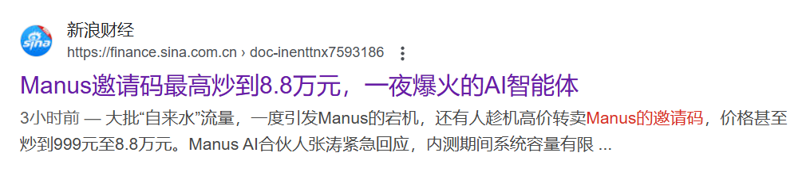
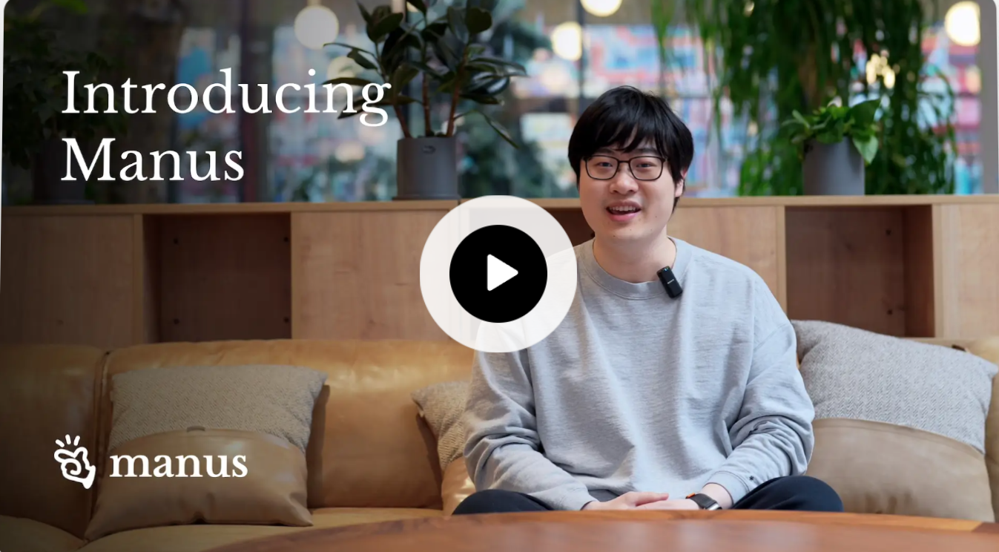
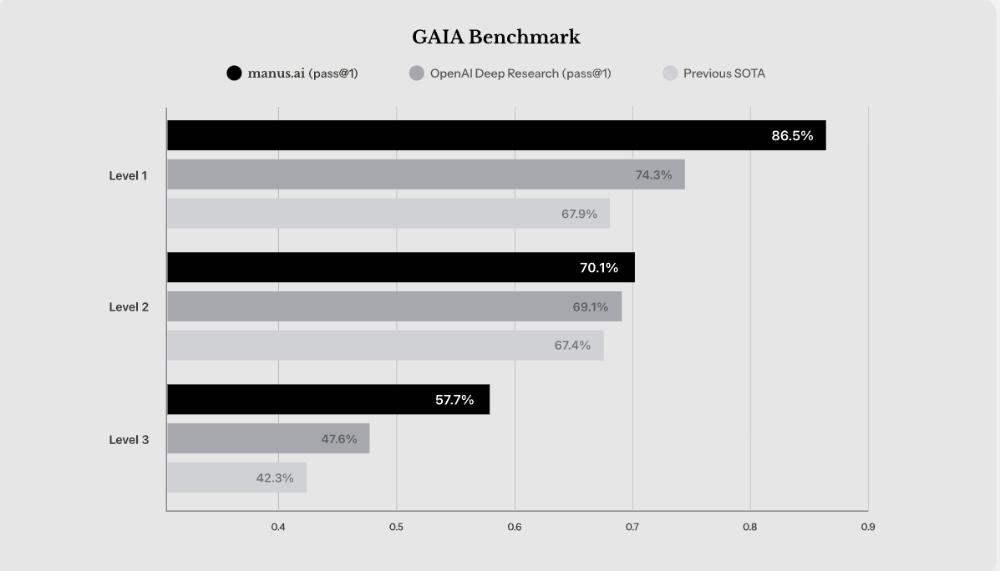
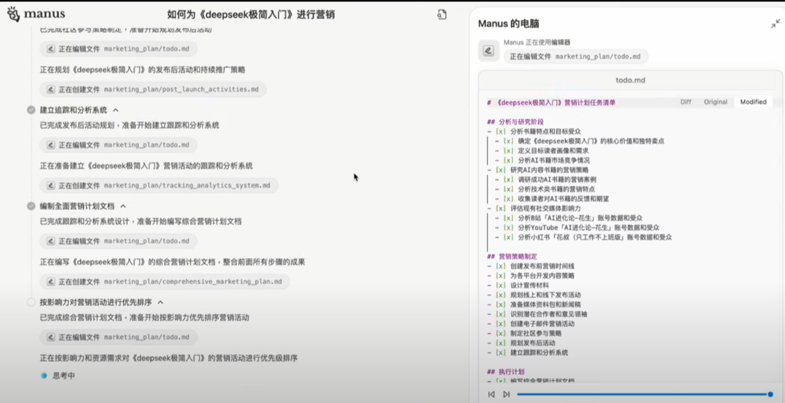
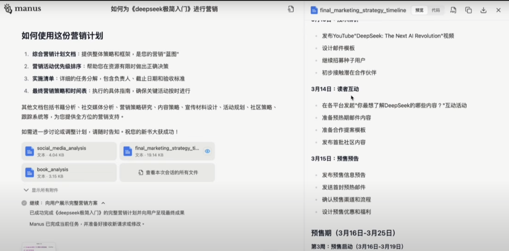
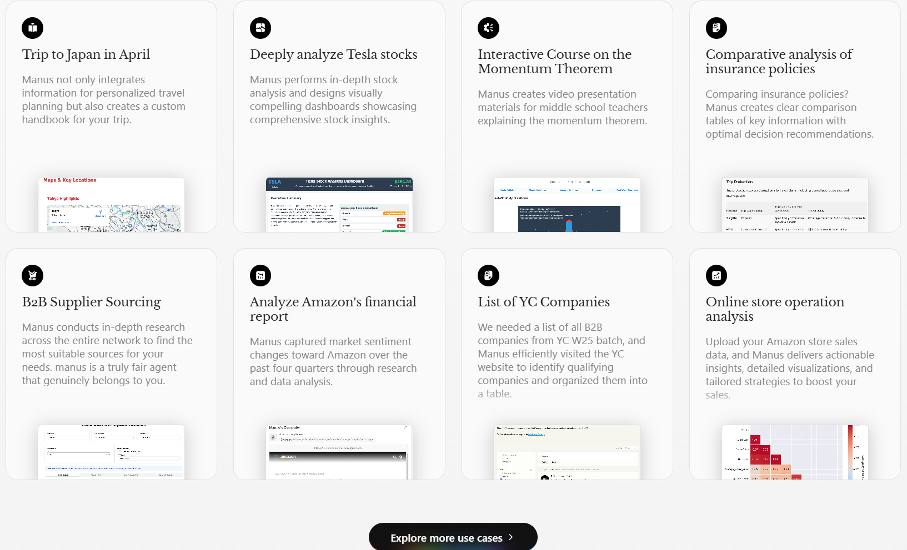

#### 引言：一个邀请码引发的“疯狂”

近日，朋友圈里流传着一个“天价邀请码”的故事：某位互联网大佬为了体验最新的AI神器Manus，竟然花了 8.8 万元买了一个邀请码！

消息一出，网友们炸开了锅：“这AI是镶金了吗？”“8.8万？我都能买辆车了！”更有甚者调侃：“这哪是邀请码，这是通往未来的船票吧！”

那么，Manus到底是什么？它凭什么这么贵？今天，我通过一个做自媒体的朋友搞了个邀请码，简单测试了一下，接下来和小❤（用户昵称）一起揭示这款“天价AI”的神秘面纱吧。

------

#### 一、Manus：不只是“会聊天”，它是“会干活”的AI

如果你以为Manus只是一个高级版的ChatGPT，那你就大错特错了。Manus的创始人季逸超（Peak）在发布会上说：“Manus不是聊天机器人，也不是工作流工具，它是一个真正自主的AI代理，能弥合‘想法’和‘执行’之间的鸿沟。”

简单来说，Manus不仅会“想”，还会“做”。它不仅能听懂你的需求，还能直接给你成品。比如，你让它筛选简历，它不仅能解压文件、阅读内容，还能生成排名表和评估报告；你让它帮你选房子，它不仅能分析社区安全、学校质量，还能编写 Python 代码计算预算，最后给你一份详尽的房产报告。

这种“直接交付结果”的能力，让Manus在AI领域独树一帜。它不再是“纸上谈兵”的AI，而是真正能帮你“干活”的AI。

------

#### 二、Manus的“杀手锏”：自主执行与多智能体系统

Manus的厉害之处，不仅在于它能“干活”，还在于它能“独立干活”。它可以在云端异步工作，这意味着你完全不用盯着它。你只需要下达任务，然后关掉电脑去喝杯咖啡，Manus会在完成任务后通知你。

更神奇的是，Manus还具备“多智能体系统”。它由多种模型支持，能够灵活调用工具、编写代码、浏览网页、操作应用。无论是数据分析、房产遴选，还是股票研究，Manus都能轻松应对。它甚至还能记住你的偏好，下次执行类似任务时，直接按你的要求交付结果。

这种“自主执行+多智能体”的能力，让Manus在GAIA基准测试中一举超越了OpenAI Deep Research，成为全球最强大的通用AI代理之一。

------

#### 三、Manus的“人性化”交互：像实习生一样与你对话

Manus的另一个突破性功能是它的交互方式。与传统的AI工具不同，Manus在生成内容的过程中，允许你随时输入文字与它对话。这种交互方式更像是在和一个实习生合作，而不是冷冰冰的机器。

举个例子，如果你让Manus帮你分析股票数据，它会在生成报告的过程中，实时显示内容大纲、搜索的过程，甚至像真正的人类那样打开浏览器、创建 ToDo 任务，一步步完成任务。

并且，你可以随时介入，给它新的指示或调整方向。比如，你可以在它制定营销计划时继续输入提示：“顺便帮我查一下最近的市场新闻。”Manus会立即响应，并将新闻内容整合到最终的报告中。

这种“实时对话+过程可视化”的设计，不仅让用户对AI的思考和执行过程一目了然，还大大提升了人机协作的效率和灵活性。

它让AI不再是“黑箱”，不用再严格一问一答式的中断式交流，而是一个**对话式AI**，一个透明的、可交互的伙伴。

------

#### 四、Manus的创作能力：写小说也是一把好手

除了处理复杂的任务，Manus在创作领域也展现出了惊人的能力。比如，如果你想在七猫平台投稿一篇小说，Manus可以根据你的提示内容轻松写出一篇 2 万字的文章，并且根据七猫平台的审核规则来进行创作，这在 ChatGPT 甚至 DeepSeek 都是比较难以达到的。

Manus不仅能够生成符合平台要求的内容，还能在创作过程中与你实时对话，调整情节、角色设定甚至语言风格，你可以随时提出修改意见，Manus会立即响应并调整内容。这种灵活的创作方式，让Manus成为了作家们的得力助手。

------

#### 五、Manus的用途：从工作到生活，无所不能

Manus的应用场景非常广泛，涵盖了研究、生活、数据分析、教育、生产力工具和创意娱乐等六大领域。以下是几个典型的用例：

1. **职场助手**：帮你筛选简历、整理会议纪要、生成报告，甚至编写代码。你可以随时与它对话，调整任务细节。
2. **生活管家**：帮你选房子、规划旅行、制定预算，甚至推荐餐厅。Manus会像真正的助手一样，一步步完成任务并实时汇报进展。
3. **投资顾问**：分析股票价格、生成金融报告、预测市场趋势。你可以随时介入，让它补充新的数据或调整分析方向。
4. **学习伙伴**：帮你整理学习资料、解答复杂问题、生成知识图谱。Manus会实时显示搜索过程，让你对知识的来源一目了然。
5. **创作助手**：帮你写小说、生成剧本、创作诗歌。Manus不仅能够生成高质量的内容，还能根据平台规则进行调整。

可以说，Manus几乎能胜任任何你能想到的任务。它不仅是你的“AI助手”，更是你的“AI伙伴”。

------

#### 六、值不值8.8万？——Manus的“天价”逻辑

回到最初的问题：Manus的邀请码值不值8.8万？从功能上看，Manus确实是一款革命性的产品。它不仅提升了AI的“智商”，还赋予了AI“动手能力”。对于那些追求效率、渴望突破的人来说，Manus无疑是一款“神器”。

但话说回来，8.8万的价格确实让人望而却步。不过，Manus团队表示，目前的高价是由于服务器容量有限，未来会逐步开放更多用户。或许，等到Manus正式上线时，我们每个人都能以更低的价格体验到这款“未来科技”。

------

#### 七、Manus的未来：人机协作的新范式

Manus的名字源自拉丁语“Mens et Manus”，意为“心智与手”。它不仅是AI技术的突破，更是人机协作的新范式。正如季逸超所说：“Manus的使命是将知识应用到现实中，对世界产生有意义的影响。”

Manus的实时对话功能和过程可视化设计，让AI不再是冷冰冰的工具，而是一个透明的、可交互的伙伴。它让我们看到了AI的另一种可能性：不再是单向的输出，而是双向的协作。

------

#### 结语：未来的“手”，正在改变世界

Manus的出现，标志着AI从“工具”向“伙伴”的转变。它不仅能“想”，还能“做”；不仅能“输出”，还能“对话”；不仅能“完成任务”，还能“展示过程”。这种全方位的突破，让Manus成为了AI领域的“新物种”。

所以，如果你问我Manus值不值8.8万，我会说：“它或许不是必需品，但它一定是未来的趋势。”毕竟，谁能拒绝一个既能“想”又能“做”、还能“聊”的AI伙伴呢？

------

**（温馨提示：如果你手头紧，不妨再等等。毕竟，未来的“手”再厉害，也得先握住自己的钱包！）**