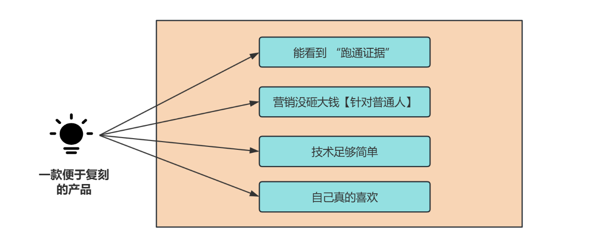

### 引言

作为既沉迷自媒体变现、又敲过多年代码的博主小❤（ID：xin 猿意码），最近刷到 Samuel 靠 3 款应用月入 3.5w 美金的案例时，直接忍不住拍桌 —— 这简直是为 “想靠编程搞钱，但怕创新、怕技术不够、怕踩坑” 的人量身定制的路径！

他没搞什么高深技术，也没做颠覆式创新，反而把 “抄作业 + AI 辅助 + 低成本验证” 玩到了极致，特别适合刚想尝试 “编程变现” 的新手。下面我就把他的整套方法论拆透，从选 Idea 到落地变现，每个步骤都给你讲清楚可落地的细节。

前阵子在 Indie Hacker（独立开发者社区）刷到 Samuel 的分享时，我第一反应是 “原来搞钱可以这么‘偷懒’”—— 他既没做什么没人见过的新功能，也没组团队熬夜赶项目，就靠 “找已验证的产品、用 AI 写代码、低成本引流”，运营 3 款应用做到了月入 3.5w 美金（约 25 万人民币）。

这对咱们想靠编程变现的人来说，太有参考价值了：很多人不敢动手，要么怕 “没好 Idea”，要么觉得 “技术不够牛”，要么担心 “投钱后没回报”。但 Samuel 的路径恰恰解决了这三个痛点 —— 不用创新，不用顶尖技术，甚至不用多高成本，就能从 0 到 1 跑通变现。

今天小❤就把他的整套方法论拆解成 “选 Idea→做产品→扩流量→控成本→避坑建议”，每个环节都附具体操作，不管你是刚毕业的程序员，还是想试试 “编程副业” 的新人，都能直接照着做。

### 一、选 Idea：别瞎想 “新东西”

别瞎搞创新：找 “已经跑通的” 抄作业，细数很多国内外的 App 或者网站，其实底层都是这个逻辑，例如早期的百度（对标 Google），淘宝/JD（对标亚马逊）等等，例子数不胜数。

Samuel 说他选 Idea 的第一原则是：**绝不去做还不存在的东西，只找 “有势头、能赚钱” 的现成产品**。因为 “验证市场需求” 是最费钱费时间的事，直接蹭 “已被验证的需求”，成功率能提升 80%。

#### 具体怎么找？2 个精准方向

- **盯 “垂直圈子的刚需产品”**：比如 Twitter、Solopreneur（个体创业者）、Indie Hacker、Build in Public（公开创业）这些圈子，里面常有人分享 “用某工具解决了什么问题”—— 比如有人晒 “用 XX 工具自动统计 Twitter 粉丝增长”，这类工具就是 “有明确需求” 的；

- **找 “自己会用、能解决痛点” 的**：比如你平时写自媒体要排版，觉得某款排版工具不好用，那 “优化版排版工具” 就是好方向 —— 自己是用户，才知道哪里要改，也有动力长期维护。

#### 4 个判断标准：确保 “能复刻、能赚钱”

光找到产品还不够，得用这 4 个标准筛一遍，避免踩坑：

- **标准 1：能看到 “跑通证据”**：最直接的是看创始人晒 MRR（每月 recurring 收入）截图 —— 比如有人在 Twitter 发 “这个月收入 1w 美金”，说明用户愿意付费，需求真实；

- **标准 2：营销没砸大钱**：如果某产品靠 “铺天盖地的广告” 才起来，你没预算跟投，就别碰；优先选 “没怎么投广告，靠用户自然传播或小流量起来” 的，比如靠 SEO（搜索引擎排名）获客的；

- **标准 3：技术足够简单**：后端逻辑复杂、需要频繁维护的（比如要做实时数据同步、复杂算法），新手别碰；优先选 “功能单一、维护轻松” 的，比如 “PDF 转 Word 工具”“Twitter 内容排版工具”；

- **标准 4：自己真的喜欢**：Samuel 说 “干一个不在乎的产品，会越做越累”—— 如果你自己都不用这类工具，没动力优化细节，大概率做不长久。

#### 核心逻辑：做 “1% 的优化”，不是 “100% 的创新”

不用推翻重来，找到现成的赚钱产品后，只要做 “1% 的改进” 就行：比如某款 “简历生成工具” 没适配手机端，你就加个 “移动端编辑功能”；某款 “SEO 文章工具” 生成速度慢，你就优化下加载效率 —— 微小的差异化，足够帮你抢下一部分用户。

### 二、实现产品：AI 能帮你做 90% 的代码，不用怕技术不够

很多人卡在这里：“我只会基础编程，做不出完整产品怎么办？”Samuel 的答案是：**靠 AI 编程工具，新手也能 2 周内做出 MVP（最小可用版）**。

#### 具体步骤：3 步落地，每步都有 AI 帮忙

1. **先找 “复刻模板”**：去 Google、Twitter 搜你想做的产品，比如 “Twitter 粉丝统计工具”，找到 1-2 个做得好的，把它们的功能列出来（比如 “统计粉丝增长曲线”“识别活跃粉丝”）；

2. **问 AI “要技术栈”**：打开 ChatGPT，把你列的功能丢进去，问 “想做一个能统计 Twitter 粉丝增长的工具，需要学哪些技术栈？有没有简单易上手的方案？”—— 如果产品比较新，GPT 不知道，就加细节，比如 “要支持用户登录、查看自己的粉丝数据，数据每天更新一次”；

3. **逐步实现，卡点就问 AI**：不用追求完美，先从核心功能开始：比如先做 “注册登录页”，再做 “粉丝数据抓取页”，最后做 “数据展示页”。每遇到卡壳（比如 “怎么调用 Twitter 的 API 获取粉丝数据”“登录页怎么加验证码”），就把问题抛给 GPT，它会给你代码示例和步骤，你照着改就行。

#### 关键心态：别纠结 “完美”，先跑通 “能用”

Samuel 说他第一次做产品时，花了 3 天纠结 “密码重置功能要不要加安全问题”，后来发现 “完全没必要”—— 先把 “能让用户付费的核心功能” 做出来，比如 “粉丝数据统计”，上线后再慢慢补 “密码重置”“设置页” 这类边缘功能。

### 三、扩大流量：4 个低成本引流法，从 “0 用户” 到 “稳定获客”

产品做出来没人用，等于白做。Samuel 的 4 个引流方法，兼顾 “快验证” 和 “长期复利”，特别适合新手。

#### 先投广告：最快验证市场（2-3 天出结果）

比如海外市场，就优先选 `Google Ads`（谷歌广告）或 `Meta Ads`（脸书 / Instagram 广告），原因是：

- 精准：能定向 “需要你产品的人”，比如做 “程序员简历工具”，就定向 “搜索‘程序员简历模板’的用户”；

- 快：投出去 1-2 天就能看到 “有没有人点、有没有人付费”—— 如果投了 500 块，连 1 个付费用户都没有，说明产品或定价有问题，赶紧调整；如果有付费，就继续加预算。

#### 做 SEO：长期免费流量，越做越赚

别只靠广告，Samuel 说 “没有自然流量的产品，就像没根的树”。SEO 虽然见效慢（通常要 3-6 个月），但一旦有排名，就能持续免费获客。具体步骤为：

- 用 `Ahrefs`（SEO 分析工具）查你复刻的产品：看他们靠哪些关键词排名（比如 “免费 PDF 转 Word 工具”），你就围绕这些关键词写文章、做页面；

- 用 AI 写 SEO 文章：比如用 `SEOptal`、`Outrank` 这类工具，输入关键词，自动生成 “如何用 XX 工具快速转 PDF” 的短文，发布到你的产品博客里 —— 既能帮你做 SEO，又能给用户提供价值。

#### 全自动短视频引流：靠 “UGC 风格视频” 滚雪球

不用自己出镜，每天花 10 分钟做 “产品使用视频”，发布到 `YouTube`、`TikTok`、`Ins`：

- 内容方向：比如你的产品是 “Twitter 内容排版工具”，就拍 “用这个工具 1 分钟排好一条 Twitter 文案” 的过程，配简单字幕；

- 全自动技巧：用 `StoryShorts` 这类工具，设置 “每天自动从产品里抓取使用案例，生成视频发布”—— 甚至可以开多个账号，覆盖不同语言（比如英语、西班牙语），长期下来，流量会像滚雪球一样涨。

#### 联盟推广：靠裂变放大获客

找 “垂直领域的博主” 帮你推广，给他们佣金（比如每带来 1 个付费用户，给 5-10 美金）：

- 去哪里找？比如做 “SEO 工具”，就找做 “网站优化” 的博主；做 “简历工具”，找 “职场求职” 博主；

- 优势：获客成本固定（付佣金就行），不用自己管流量，适合产品有一定口碑后放大。

### 四、技术栈 & 成本：新手能搞定的工具，每月成本可控

别觉得 “做产品要花很多钱”，Samuel 的 3 款应用，每月成本也就几百美金，技术栈都是 “易上手、免费 / 低价” 的。

#### 技术栈：3 类工具搞定全流程

- **开发工具**：前端用 `Next.js`（简单易上手，适合做网页端产品），后端用 `Node.js`（跟前端语言一致，不用学新语言）。当然，如果你会别的开发语言，最好选用自己熟悉的，例如 Python、Go 都可以；

- **辅助工具**：SEO 分析用 Ahrefs（有免费试用版，新手先试用再决定是否付费），AI 写作用 `SEOptal/Outrank`（自动写 SEO 文章，还能自动发布）；

- **部署 & 收款**：用 `Vercel` 部署产品（免费版足够新手用，上线快），用 `Stripe` 收款（支持全球支付，手续费不高），国内可以采用 `微信/支付宝`等。

#### 成本：3 类支出，优先控 “维护成本”

- **运营成本**：比如 Vercel 的服务器费用、域名费用，每月也就几十美金；

- **投放成本**：新手初期投广告，每月控制在 100-300 美金就行，先验证再加预算；

- **维护成本**：重点控制！优先选 “不用售后” 或 “售后轻松” 的产品（比如 “PDF 转工具”，用户用了就走，不用你答疑）；如果必须售后，就做 “自动答疑文档”，把常见问题列出来，减少手动回复。

### 五、回到创业前：Samuel 给新手的 6 条避坑建议（少走 1 年弯路）

如果能回到刚开始，Samuel 说这 6 件事他会 “立刻做”，也适合你参考：

1. **第一时间用 AI 编程工具**：别自己死磕代码，GPT、Copilot 这些工具能帮你省 80% 的开发时间；

2. **花 1 周学会广告投放**：Google Ads、Meta Ads 一定要学，这是 “最快验证市场” 的方式，比你埋头改产品有用；

3. **2 周内上线 MVP，别纠结细节**：密码重置、设置页这些 “非核心功能”，先放一放，先把 “能赚钱的核心功能” 上线，跑广告验证需求；

4. **有起势就做 SEO**：一旦广告带来付费用户，立刻开始做 SEO，长期靠免费流量赚钱，别一直依赖广告；

5. **尽量自动化所有流程**：用工具自动写文章、自动发视频、自动统计数据，别把时间耗在重复工作上；

6. **有用户后再打磨产品**：初期别追求 “功能完美”，等有用户反馈了，再根据需求加新功能，比如用户说 “想要导出数据功能”，你再做。

### 小结：搞钱不用 “高大上”，简单 + 落地才是王道

看 Samuel 的案例，我最大的感受是：**很多人把 “编程变现” 想复杂了，总觉得要做创新、要搞高深技术，其实越简单、越贴近刚需的小工具，越容易赚钱**。

他的路径总结下来就 3 句话：

1. 选 Idea：找 “已验证、能赚钱、技术简单” 的现成产品，做 1% 的优化；

2. 做产品：靠 AI 编程工具，2 周内做出 MVP，别纠结完美；

3. 获客：先投广告验证，再做 SEO 和短视频长期引流，控制成本。

你不用一开始就做 3 款产品，先从 1 款小工具开始，比如 “PDF 转 Word”“简历生成器”，按照这个方法跑通一次 —— 哪怕第一个产品没赚钱，你也会摸清 “选品、开发、引流” 的逻辑，下一个大概率能成。

**毕竟，比起 “想一万次”，不如 “动手做一次”。**

你今年有没有想尝试的编程变现方向？欢迎在评论区及小❤的技术交流群聊聊～