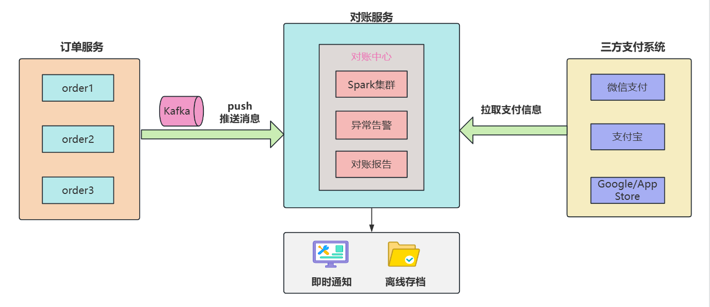

### 引言

大家好，我是技术圈懂 “花钱” 的小 ❤～

你有没有过这样的经历？双 11 凌晨蹲点付款，点击 “确认支付” 后屏幕转圈半天没反应，手心直冒冷汗怕错过优惠；或者春节发红包，刚点出去就提示 “支付失败”，群里亲友催着 “补一个” 的消息不断弹出 —— 那一刻，是不是特别想知道：**明明平时付款秒到，为啥关键时刻支付系统会 “掉链子”**？

如今我们出门不带现金，买奶茶、打车、缴水电费全靠手机在线支付，微信支付、支付宝每天要处理数十亿笔交易，**峰值时每秒甚至能扛住上百万次请求**。

这背后的在线支付系统，可不是简单的 “扣钱 + 打款”，而是一套能抗住**高并发、保障资金安全、实现跨平台互通**的复杂技术体系。

今天就带大家扒一扒在线支付系统的 “家底”：从整体架构到核心功能，从关键技术到踩过的坑，看完这篇，你不仅能懂支付系统的运作逻辑，下次再遇到支付问题，还能跟朋友唠唠 “这大概率是某个环节的容灾没做好”～

### 1. 整体架构

在线支付系统就像一个 “数字银行柜台”，既要对接用户（`客户端`）、商家（`商户系统`），还要联动`银行、第三方支付机构（如银联）`，同时得 `防黑客、堵漏洞`，确保每一笔钱都 “来去分明”。

它的核心是 “**分层解耦 + 分布式架构**”，哪怕某一个模块出问题，也不会影响整体支付流程。

架构图：

在线支付系统的架构可分为 “业务层” 和 “基础层”，各组件分工明确又相互协作，具体如下：

| 层级       | 核心组件                    | 核心作用                                                     |
| ---------- | --------------------------- | ------------------------------------------------------------ |
| **业务层** | 客户端                      | 用户操作入口，负责渲染支付界面、调用支付 SDK、接收支付结果通知 |
|            | API 网关                    | 系统 “交通枢纽”，处理请求路由、鉴权、限流、日志记录          |
|            | 支付核心服务                | 系统 “大脑”，包含`订单服务、通道服务、结果服务`，主导支付全流程 |
|            | 账户服务                    | 管理资金账户，负责余额查询、充值、提现、冻结，保障资金安全   |
|            | 对账服务                    | 系统 “财务审计员”，每日与支付通道对账，解决 “**多扣钱**”“**漏打款**” 问题 |
| **基础层** | 分布式数据库                | 存储订单、账户等核心数据，用分库分表 + TiDB 应对高并发读写   |
|            | 消息队列（Kafka/RocketMQ）  | 解耦服务依赖，异步处理非核心流程（如积分发放、物流通知），避免流程卡顿 |
|            | 分布式缓存（Redis 集群）    | 缓存热门配置、用户余额、防重复令牌，减少数据库压力           |
|            | 分布式锁（Redis/ZooKeeper） | 解决并发冲突（如避免余额超扣），确保数据一致性               |

### 2. 支付发起：从 “点击付款” 到 “等待支付”

你在奶茶店扫码付款时，看似简单的 “扫码→输密码→支付成功”，背后其实经历了 6 个关键步骤。这一步的核心是 “**确保订单不重复、金额不篡改、通道能兼容**”。

业务流程图如下：

具体流程拆解：

1. **用户触发支付**：你在商家 H5 页面点击 “微信支付”，客户端携带 “商品 ID、金额（15 元）、商户 ID” 请求 API 网关；

1. **网关鉴权与路由**：网关验证商户 API 密钥是否有效（防止伪造请求），判断请求频率是否超限（比如该商户每秒最多 10 笔），然后转发到支付核心的 “订单服务”；

1. **生成支付订单**：订单服务生成唯一订单号（比如 P20250902123456789），校验金额是否合法（比如不能为 0 或负数），关联商户的支付通道配置（该商户已开通微信支付，配置了微信商户号），将订单数据写入 MySQL 分表；

1. **请求支付通道**：订单服务调用 “通道服务”，通道服务根据 “微信支付” 类型，封装微信支付需要的参数（如 appid、mch_id、nonce_str、签名），调用微信支付的 “统一下单接口”；

1. **获取支付凭证**：微信支付接口返回 “prepay_id”（预支付 ID），通道服务将其封装成客户端能识别的格式（比如微信 APP 支付需要的 sign、timestamp），通过网关返回给客户端；

1. **客户端唤起支付**：客户端拿到凭证后，调用微信支付 SDK，唤起微信 APP 的支付界面，你输入密码或验证指纹后，微信开始处理支付。

这里有两个关键技术点：

- **防重复提交**：订单服务生成订单时，会向 Redis 写入 “用户 ID + 商品 ID” 的令牌，有效期 5 分钟，若同一用户 5 分钟内重复发起同一商品的支付，直接返回已存在的订单，避免生成多笔订单；

- **签名验证**：通道服务调用支付通道时，会用商户的 API 密钥对参数签名，支付通道（如微信）收到请求后会重新计算签名，若不一致则拒绝，防止参数被黑客篡改（比如把 15 元改成 1.5 元）。

### 3. 支付结果回调：从 “支付成功” 到 “订单完成”

你输完密码后，手机弹出 “支付成功” 提示，这时商家的收银系统也会同步收到通知 —— 这一步靠的是 “**支付通道异步回调**”，核心是 “确保结果不丢失、状态不混乱”。

业务时序图如下：

具体流程拆解：

1. **支付通道触发回调**：微信支付完成扣款后，会向我们系统配置的 “回调地址”（比如[https://pay.xx](https://pay.xxx.com/callback/wechat)[x.com](https://pay.xxx.com/callback/wechat)[/call](https://pay.xxx.com/callback/wechat)[back/](https://pay.xxx.com/callback/wechat)[wecha](https://pay.xxx.com/callback/wechat)[t](https://pay.xxx.com/callback/wechat)）发起 POST 请求，携带支付结果（订单号、支付金额、交易状态 SUCCESS）；

1. **回调接口验签**：通道服务的回调接口先验证微信的签名（防止伪造回调，比如黑客伪造 “支付成功” 消息骗商家发货），校验通过后解析回调参数；

1. **更新订单状态**：通道服务调用 “结果服务”，结果服务用分布式锁锁住该订单号（防止同一订单的两次回调同时处理），查询订单当前状态（此时为 “待支付”），将其更新为 “支付成功”，同时记录交易流水号（微信返回的 transaction_id）；

1. **异步通知关联系统**：结果服务向 Kafka 发送 “支付成功” 消息，消息包含订单号、用户 ID、金额，积分系统消费消息给用户加 15 积分，物流系统消费消息触发 “打包发货”（若为电商订单）；

1. **通知客户端结果**：结果服务通过 WebSocket 或推送（如极光推送）向用户客户端发送 “支付成功” 通知，同时调用商户的 “回调接口”，告知商户该订单已支付；

1. **日志与监控**：整个过程记录详细日志（包括回调参数、处理结果），同时上报监控指标（如 “支付成功数”“回调处理耗时”），若回调失败（比如商户接口超时），会触发重试机制（每隔 10 分钟重试一次，共重试 3 次）。

#### 避坑重点：回调重复处理

微信支付可能因网络波动发起两次回调，此时分布式锁会生效：第一个回调拿到锁后更新状态，第二个回调拿锁失败，**查询订单已成功则直接返回，避免重复扣减商户余额**。

### 4. 交易对账：每天凌晨的 “财务审计”

你可能没注意到，每天凌晨 2-4 点，支付系统会自动和微信、支付宝、银行对账 —— 这一步是 “资金安全的最后防线”，确保我们系统的交易数据和通道方一致，没有 “多扣用户钱” 或 “少收商家钱”。

对账交互图如下：

具体步骤：

1. **获取通道对账文件**：凌晨 2 点，对账服务自动从微信支付、支付宝的后台下载 “对账文件”（如 CSV 格式，包含当天每笔交易的订单号、金额、手续费、交易时间）；
1. **生成系统对账文件**：对账服务从 MySQL 分表、TiDB 中读取当天的所有支付订单，拉取 `订单号、交易流水号、金额数、交易状态` 等关键字段；
1. **字段匹配对账**：对账服务按 “订单号” 或 “交易流水号” 关联两个文件，对比关键字段：

- 金额一致、交易状态一致（系统显示成功，通道也显示成功）：标记为 “**对账成功**”；

- 系统有订单，通道没有：标记为 “单边账（系统多）”，可能是通道回调没收到，需要人工核实；

- 通道有交易，系统没有：标记为 “单边账（通道多）”，可能是系统回调处理失败，需要补录订单；

- 金额不一致：标记为 “金额差异”，比如系统显示 15 元，通道显示 14.9 元，可能是手续费计算错误，需要查日志；

4. **异常处理与归档**：对账服务将异常订单推送到 “对账异常平台”，通知运维和财务人员处理；处理完成后，将对账结果归档到 HDFS（海量存储），保留至少 3 年（符合金融监管要求）；

5. **生成对账报告**：对账服务生成当天的对账报告（总交易笔数、总金额、异常笔数、异常率），发送给运营和财务团队。

#### 技术难点：海量数据对账效率

若某天有 1 亿笔交易，对账文件达几十 GB，直接加载到内存会 OOM（内存溢出）。

解决方案是 “**分块对账 + Spark 分布式计算**”：按订单号哈希将文件分成 100 个块，用 Spark 集群并行处理，对账时间从 2 小时缩短至 30 分钟。

### 6. 一些难点和要点：支付系统的 “避坑指南”

做支付系统就像走钢丝，既要扛住高并发，又要保证资金安全，这些年小❤做商业化的过程中踩过不少坑，也总结了一些解决方案，分享给大家～

#### 1）高并发下的 “余额超扣” 问题

**场景**：某电商大促时，同一用户同时发起两笔支付（比如抢两件商品），用户余额只有 99 元，两笔订单各 50 元，理论上有一笔会被拦住（因为 100>99，用户的余额不足以支付两笔订单），但并发下可能扣成 “-1 元”（超扣）。

**原因**：传统的 “`查询余额→判断是否足够→扣减余额`” 是串行操作，并发时会出现 “脏读”—— 第一个请求查询余额 99 元，还没扣减，第二个请求也查到 99 元，两个请求都判断 “足够”，并发下两笔订单都判断 99≥50，最终扣成 99-50-50=-1 元”。

**解决方案**：

- 用 “`数据库行锁`”：扣减余额时执行UPDATE account SET balance = balance - 50 WHERE user_id = 123 AND balance >= 50，利用 MySQL 的行锁确保同一用户的扣减操作串行执行，且只有余额足够时才扣减；

- 加 “`分布式锁`”：扣减前用 Redis 的 SETNX 命令获取 “user_123_balance_lock” 锁，获取成功才执行扣减，执行完释放锁，防止并发操作。

通过这两个方案，我们把 “余额超扣” 的概率降到了 0.001% 以下，剩下的通过对账补正。

#### 2）支付通道 “降级与容灾”：避免某通道挂了影响支付

**场景**：微信支付某天凌晨升级，接口暂时不可用，若所有用户都只能用微信支付，会导致支付失败，影响商家生意。

**原因**：支付系统过度依赖单一通道，没有备用方案，通道故障直接导致服务不可用。

**解决方案**：

- **通道降级策略**：在通道服务中配置 “降级开关”，当微信支付接口失败率超过 5%（通过监控或者自动化配置发现），自动将该商户的微信支付通道降级为 “支付宝支付”，客户端只显示支付宝选项；

- **多通道容灾**：核心商户开通至少 2 个支付通道（如微信 + 支付宝），通道服务根据 “通道健康度”（成功率、响应时间）动态选择最优通道，比如微信响应慢时，自动路由到支付宝；

- **本地缓存通道配置**：将商户的通道配置缓存到 Redis，即使通道服务挂了，订单服务也能从缓存中获取通道信息，发起支付请求。

当然这只是考虑可能的意外情况，实际上微信支付和支付宝通道支付的可用性至少为 6 个 9（如 99.9999%），一年只有 31s 的不可服务时间。

但我们之前在做海外 `Google/App Store` 支付时，就遇到过网络访问失败的类似情况，某支付通道临时故障，我们的降级策略在 10 秒内生效，将 98% 的请求路由到备用通道，支付成功率仅下降 0.2%，几乎没影响用户体验。

#### 3）防刷单与防欺诈：守住资金安全大门

**场景**：黑客伪造商户生成虚假订单，用`盗刷银行卡支付后申请退款`，套取资金
**原因**：缺乏有效的风控机制，异常交易识别不及时
**解决方案**：

- 商户风控：入驻时严格审核营业执照、法人身份证、对公账户，开通通道前完成实名认证；
- 交易风控：`基于用户行为（如 IP 地址、设备号、支付频率）建立风控模型`，异常交易（如同一设备 10 分钟内支付 5 笔）触发人工审核；
- 资金风控：退款时**校验 “原支付账户” 与 “退款账户” 一致性**，防止资金转入陌生账户；大额退款（如超 1 万元）需人工二次审核。

其中原账户退款是金融产品比较常用的资金风控方案，如：同花顺、支付宝基金等都是如此，通过多层风控，我们可以将欺诈交易率控制在 0.0001% 以下。

### 总结：在线支付系统的 “技术核心”

在线支付系统不是简单的 “扣钱 + 打款”，而是一套融合 “高并发处理、数据一致性保障、资金安全防护” 的复杂体系。总结下来，它的核心要点可归纳为三点：

1. **架构设计：分层解耦 + 分布式**
   通过 `API 网关、支付核心、账户服务` 等组件分层设计，配合 `消息队列、分布式缓存` 等基础组件，实现 “高可用、可扩展” —— 即使某模块故障，整体流程也能正常运转，支撑每秒百万级请求。
2. **数据一致性：锁 + 对账双保障**
   用 `分布式锁、数据库行锁` 解决并发冲突（如余额超扣、重复退款）；用 `每日对账` 确保系统数据与支付通道一致，补上 “最后一道资金安全防线”，符合金融级数据可靠性要求。
3. **容灾与风控：应对极端场景**
   通过 `多通道容灾、降级策略` 应对通道故障；用多层风控模型识别欺诈交易，同时建立完善的退款机制，兼顾 “用户体验” 与 “资金安全”。

下次再遇到支付 “转圈圈”，你或许能猜到：可能是 API 网关限流了，也可能是支付通道临时波动 —— 而这背后，是无数技术人在为 “每一笔钱的安全流转” 保驾护航。

同时，随着移动支付场景的拓展（如跨境支付、刷脸支付），系统还需应对新的挑战：跨境支付要**兼容不同国家的货币转换、支付通道与监管规则**；刷脸支付则需平衡 “**识别效率**” 与 “**身份核验准确性**”，避免冒用他人面容支付。

这就要求技术团队既要深耕现有体系的稳定性，也要持续跟进新技术、新场景，**让支付系统在 “安全” 与 “体验” 之间找到最优解**。

