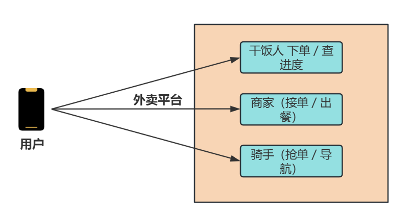
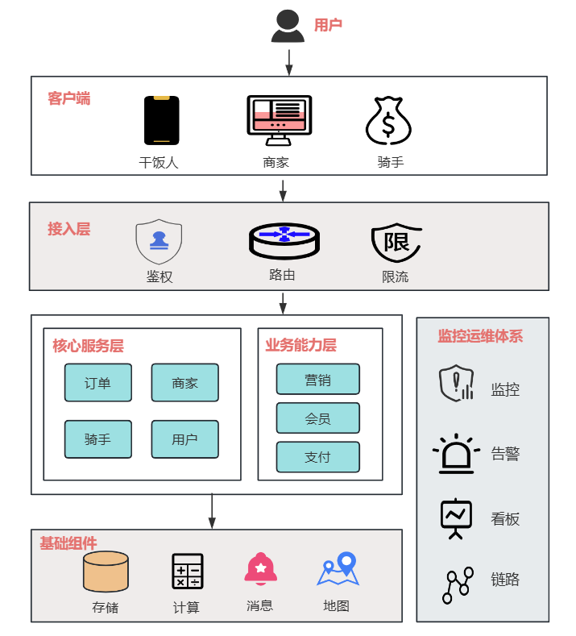
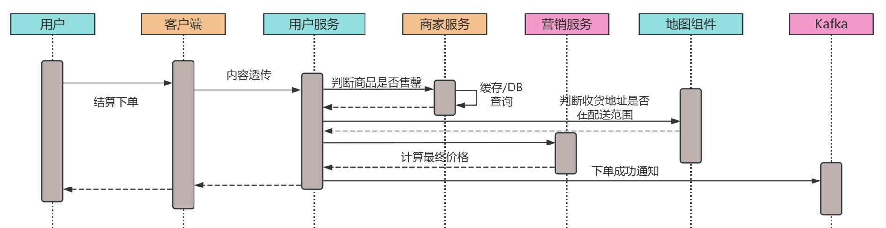
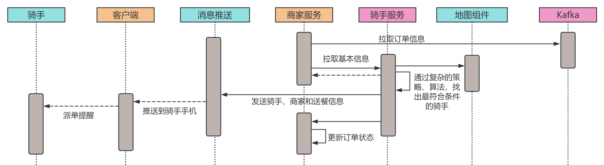
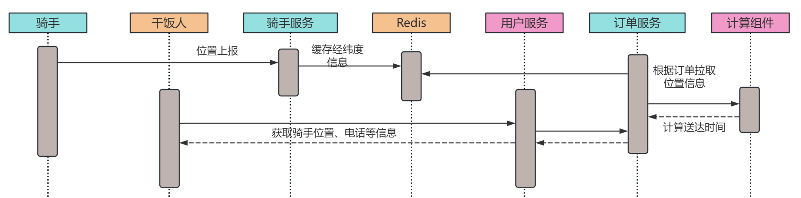

大家好，我是小❤。

## 引言

不知道各位后端开发者有没有过这样的经历：午休时打开美团外卖，手指划着商家列表纠结选黄焖鸡还是麻辣烫，下单后盯着 “骑手正在取餐” 的进度条满心期待。

可当产品经理拍着你的肩膀说 “咱们也搞个外卖系统” 时，瞬间从 “干饭人” 切换到 “开发者” 【请自动带入最近兴起订单京东、淘宝外卖的程序员视角】 —— 满脑子都是 “**高峰期百万订单怎么接**”“**骑手路径怎么算才不绕路**”“**商家出餐慢了用户投诉怎么搞**” 的灵魂拷问。

在当下的本地生活生态里，外卖早已不是 “简单送顿饭” 的生意。

美团、饿了么单日订单量峰值超千万，每秒有上万用户在下单、商家在接单、骑手在跑单，背后还连着支付、会员、营销等复杂链路。**要支撑这样 “人、货、场” 全链路协同的业务，系统架构绝不是 “订单 CRUD + 地图 API” 就能搞定的**。

本文就以美团、饿了么为参考原型，从后台技术视角拆解外卖系统的架构设计，涵盖整体架构分层、核心功能技术实现、关键难点突破，帮你把 “搞个外卖系统” 的模糊需求，变成可落地的技术方案。

## 一、整体架构：外卖系统的 “五脏六腑”

外卖系统是典型的 “高并发、强实时、多角色协同” 系统，需同时满足**用户（下单 / 查进度）、商家（接单 / 出餐）、骑手（抢单 / 导航）**三类核心角色的需求。

整体采用 “分层解耦 + 微服务化” 设计，从下到上分为**基础组件层、核心服务层、业务能力层、接入层**四层，再配套监控运维体系保障稳定性。

### 1.1 架构图

### 1.2 关键组件详解

#### （1）接入层：外卖系统的 “守门人”

- **API 网关**：采用 Kong/APISIX，负责三大核心工作：
- 路由转发：把用户 “下单请求” 转订单服务、商家 “接单请求” 转商家服务，避免服务混乱；
  - 限流防护：高峰期（如午晚高峰 11:30-13:00、18:00-20:00）用 “令牌桶算法” 限制单用户下单 QPS（如 1 分钟最多 3 次），防止恶意请求压垮后端；
- 鉴权校验：用户端用 JWT 令牌验证登录态，商家 / 骑手端用 OAuth2.0 做身份认证，避免非法接入。
  
- **负载均衡**：用 Nginx+LVS 组合，结合 DNS 地域路由，让北京用户接入北京机房、上海用户接入上海机房，降低网络延迟（比如用户下单后，请求不用跨地域传输，进度页加载更快）。

- **灰度发布**：新功能（如 “拼好饭” 新玩法）上线时，按 “`用户 ID 哈希`” 切分 10% 用户先体验，观察订单转化率、投诉率，没问题再全量，避免全量故障。

#### （2）核心服务层：外卖系统的 “心脏”

这一层是外卖业务的核心，每个服务拆成独立微服务，避免 “一荣俱荣、一损俱损”：

- **订单服务**：外卖系统的 “中枢”，负责订单从创建到完成的全生命周期管理，拆分为：
- 订单创建服务：校验商品库存（如商家是否售罄）、计算价格（满减 + 红包 + 配送费）、生成订单号；
  - 订单流转服务：处理 “待支付→待接单→待取餐→配送中→已完成” 的状态变更，每个状态变更都要发消息通知其他服务（如 “待接单” 状态要通知商家服务）；
- 订单查询服务：提供订单列表、订单详情查询，用 Redis 缓存近期订单（如 3 天内），减少 DB 压力。
  
- **商家服务**：管理商家核心能力，包括商家入驻审核、门店信息（地址 / 营业时间）、商品管理（上下架 / 改价）、接单管理（自动接单 / 手动接单开关），数据存储用 MySQL 分库分表（按商家 ID 哈希分片，支撑百万级商家）。

- **骑手服务**：连接骑手与订单的关键，包含：
- 派单服务：分 “智能派单”（系统按骑手位置、负载、历史配送效率分配）和 “抢单”（骑手自主抢单）两种模式；
  - 路径规划服务：对接高德 / 百度地图 API，计算骑手从商家到用户的最优路线（避开拥堵路段）；
- 骑手状态服务：实时更新骑手 “在线 / 离线”“配送中 / 空闲” 状态，用于派单决策。
  
- **用户服务**：管理用户信息（昵称 / 收货地址）、登录态（Session/Token）、地址库（常用地址智能排序），收货地址会提前做地理编码（转经纬度），方便后续计算配送距离。

#### （3）业务能力层：外卖系统的 “加分项”

- **营销服务**：负责满减、红包、优惠券、拼单等活动，比如 “满 30 减 5” 需要校验订单金额是否达标，优惠券要判断是否在有效期内，避免营销成本超支；
- **支付服务**：对接微信支付 / 支付宝，处理支付回调（支付成功后通知订单服务改状态），同时做支付异常处理（如用户付了钱但订单没改状态，要触发对账重试）；
- **消息服务**：给三类角色发通知：用户端（下单成功 / 骑手接单 / 送达提醒）、商家端（新订单 / 催单提醒）、骑手端（新派单 / 超时预警），用短信 + APP 推送双渠道，确保消息触达。

#### （4）基础组件层：外卖系统的 “地基”

- 存储组件

  - 结构化数据（订单 / 用户 / 商家信息）：用 MySQL 主从架构，主库写、从库读，同时分库分表（如订单表按 “创建时间 + 订单 ID” 分片，每月一个分表）；
  - 缓存数据（热门商家 / 近期订单 / 骑手位置）：用 Redis 集群，分片 + 哨兵保证高可用，比如骑手位置每 3 秒更新一次，比只存 DB 快 10 倍+；
  - 非结构化数据（商家头像 / 商品图片）：用对象存储（OSS/S3），配合 CDN 加速，用户刷商品列表时图片加载更快。

- **消息队列**：用 Kafka/RocketMQ，解耦服务间依赖。比如用户下单后，订单服务不用直接调用商家服务、消息服务，而是发一条 “订单创建成功” 消息，其他服务消费消息即可，避免某服务挂了导致整个链路卡壳。

- 地图组件

  ：对接第三方地图 API（高德 / 百度），核心能力包括：

  - 地理编码：把 “XX 小区 3 号楼 2 单元” 转经纬度（如 116.404, 39.915）；
  - 距离计算：算商家到用户的直线距离（用于判断配送费，比如 3 公里内 6 元，超 3 公里加 2 元）；
  - 路径规划：给骑手算实时路线，避开红灯多、拥堵的路。

- 实时计算组件

  ：用 Flink 处理实时数据，比如：

  - 骑手实时负载：计算骑手当前手上有多少单、预计送达时间，用于派单；
  - 订单超时预警：实时监控 “待接单” 订单是否超过 10 分钟，超时则触发催单；
  - 实时销量统计：商家商品销量每秒更新，用于 “销量 TOP10” 排序。
  
  

## 二、核心功能技术实现：从 “下单” 到 “送达” 的全链路

外卖最核心的链路是 “用户下单→商家接单→骑手取餐→送达用户”，我们拆解每个环节的技术细节，看看背后是怎么实现的。

### 2.1 用户下单：10 秒内完成的 “精准计算”

用户点完商品点击 “去结算”，背后要做 5 件事，全程需控制在 10 秒内（超过 10 秒用户会以为卡了）：

1. **商品校验**：调用商家服务，检查商品是否售罄、是否在营业时间（比如商家 22 点关门，用户 22:05 下单要提示 “商家已打烊”）；
2. **地址校验**：用户服务校验收货地址是否在商家配送范围内（用地图 API 算距离，超过 5 公里提示 “超出配送范围”）；
3. **价格计算**：营销服务计算最终价格，公式是 “`商品总价 - 满减优惠 - 优惠券 - 红包 + 配送费 - 会员红包`”，比如商品 30 元，满 30 减 5，用 5 元优惠券，配送费 6 元，会员红包减 3 元，最终付 30-5-5+6-3=23 元；
4. **订单生成**：订单服务生成唯一订单号（用 “时间戳 + 用户 ID 后 6 位 + 随机数”，避免重复），同时写订单主表（订单号 / 用户 ID / 商家 ID）和订单明细表（商品 ID / 数量 / 单价）；
5. **消息通知**：订单服务发消息到 Kafka，消息服务消费后给用户发 “下单成功” 推送，给商家发 “新订单” 提醒。

**关键技术**：

- 分布式事务：用 **“TCC” 模式保证价格计算、订单生成、支付状态同步的一致性**，比如用户付了钱，订单必须改成 “待接单”，不能出现 “钱扣了订单没创建” 的情况；
- 缓存预热：把商家的 “满减规则”“配送范围” 提前**缓存到 Redis**，用户下单时不用查 DB，计算速度快 3 倍。

### 2.2 智能派单：比骑手更懂 “怎么送快”

商家接单后，系统要给骑手派单，这是外卖效率的核心，不能乱派（比如把北京的单派给上海的骑手）。智能派单分 3 步：

1. **骑手筛选**：从 “在线且空闲” 的骑手中，筛选出 “距离商家 5 公里内、手上订单≤3 单、历史配送准时率≥90%” 的骑手，排除掉太远、太忙、配送差的；
2. **最优匹配**：用 “贪心算法” 算每个骑手接这单的 “综合成本”，成本 = 骑手到商家的时间 + 商家到用户的时间 + 这单会导致其他订单超时的风险，选成本最低的骑手；
3. **派单通知**：给选中的骑手发派单提醒，同时更新骑手状态为 “配送中”，订单状态为 “待取餐”。

**关键技术**：

- 实时数据：骑手位置每 3 秒通过 APP 上报一次，存 Redis，派单时读最新位置，避免用 1 分钟前的旧位置导致派单不准；
- 派单降级：如果智能派单系统故障，自动切换到 “**抢单模式**”，让骑手自主抢单，避免订单没人接。

### 2.3 订单跟踪：用户能实时看到 “骑手到哪了”

用户下单后，在 “订单详情页” 能看到骑手的实时位置和预计送达时间，背后是 “实时更新 + 前端渲染” 的配合：

1. **骑手位置更新**：骑手 APP 每 3 秒把经纬度上报给骑手服务，骑手服务更新 Redis 中的骑手位置；
2. **位置同步**：订单服务每 5 秒从 Redis 读骑手最新位置，同时计算 “预计送达时间”（用当前位置到用户地址的距离 / 骑手平均速度）；
3. **前端渲染**：用户 APP 每 5 秒调一次 “订单跟踪 API”，拉取最新的骑手位置和预计时间，然后在地图上重新画骑手图标，实现 “实时跟随”。

**关键技术**：

- 接口限流：用户可能频繁刷新订单页，用 Redis 做限流（每 10 秒最多查 2 次），避免 API 被刷爆；
- 降级处理：如果地图 API 故障，前端显示 “骑手正在赶来” 的文字提示，而不是空白页面，提升用户体验。

## 三、技术难点与解决方案：外卖系统的 “坑” 怎么填

外卖系统不是一帆风顺的，高峰期百万订单压过来、骑手位置更新太频繁、订单超时投诉多，这些都是常见的坑，我们看看怎么解决。

### 3.1 高峰期高并发：怎么接住 “午晚高峰” 的订单洪峰

#### 问题拆解

午晚高峰（11:30-13:00、18:00-20:00）是外卖订单的 “洪峰期”，单秒订单量是平时的 10 倍，比如平时每秒 100 单，高峰每秒 1000 单。如果系统没准备，DB 会扛不住写压力，API 会超时，用户下不了单。

#### 解决方案：“削峰 + 扩容 + 缓存” 三板斧

1. 流量削峰：

   - 前端限流：用户下单时如果遇到高峰，前端弹 “当前下单人数较多，请稍等 10 秒再试”，避免请求全压到后端；
- 消息队列缓冲：订单请求先写 Kafka，订单服务慢慢消费，比如每秒收 1000 单，消费 800 单，队列会暂存 200 单，但不会让后端直接被冲垮，同时设置队列最大长度，超过则提示 “系统繁忙”。
   
2. 服务扩容：

   - 提前扩容：用 K8s 做容器化部署，高峰前 1 小时（比如 11 点）把订单服务、商家服务的实例数从 10 台扩到 50 台，CPU / 内存资源翻倍；
- 弹性缩容：高峰过后（比如 13 点）自动缩到 10 台，避免资源浪费。
   
3. 多级缓存：

   - 前端缓存：用户商品列表、商家基本信息，前端缓存 1 分钟，不用每次刷新都查后端；
- Redis 缓存：热门商家的商品库存、满减规则，缓存 30 分钟，下单时直接读 Redis；
   - DB 读写分离：订单表主库写，从库读，查订单详情走从库，减轻主库压力。

### 3.2 骑手位置实时更新：怎么处理 “每秒百万次” 的位置上报

#### 问题拆解

全国有百万骑手，每 3 秒上报一次位置，单秒上报量达 30 万次。如果直接写 DB，DB 会被写死；如果缓存没做好，查骑手位置会很慢。

#### 解决方案：“Redis + 时序库” 组合

1. **实时写入 Redis**：骑手位置上报后，先写 Redis（Key 是骑手 ID，Value 是经纬度 + 更新时间），Redis 支持每秒 10 万 + 写，完全扛得住；
2. **异步同步到时序库**：用 Flink 消费 Redis 的位置更新，异步同步到时序库（InfluxDB/Prometheus），时序库适合存 “时间序列数据”，查骑手历史轨迹（比如过去 1 小时的路线）比 Redis 快；
3. **过期清理**：Redis 中骑手位置设置 5 分钟过期，骑手如果离线（超过 5 分钟没上报），自动清理缓存，避免内存浪费。

### 3.3 订单超时与异常：怎么减少 “用户催单” 和 “投诉”

#### 问题拆解

外卖最怕 “超时”：商家接单超时（超过 10 分钟没接单）、骑手取餐超时（超过 20 分钟没取餐）、送达超时（超过预计时间 30 分钟），每超时一次用户就可能催单或投诉，影响口碑。

#### 解决方案：“实时监控 + 分级预警 + 自动处理”

1. 实时监控：用 Flink 实时监控订单状态，给每个环节设超时阈值：

   - 待接单：超过 10 分钟→一级预警；
- 待取餐：超过 20 分钟→二级预警；
   - 配送中：超过预计时间 15 分钟→三级预警。
   
2. 分级处理：

   - 一级预警（商家接单超时）：消息服务自动给商家发催单短信，同时给用户发 “商家正在加急处理” 的提醒；
- 二级预警（骑手取餐超时）：派单服务重新评估骑手是否能按时取餐，不能则重新派单给其他骑手；
   - 三级预警（送达超时）：客服系统自动触发 “优先处理”，客服主动联系骑手和用户，解释原因并补偿（如送 5 元红包）。
   
3. **事后复盘**：每天统计超时订单的原因（商家慢 / 骑手绕路 / 交通拥堵），针对性优化（比如给慢的商家发提醒，给绕路的骑手优化路线）。

## 四、小结：从 “点外卖” 到 “搭系统”，原来没那么难

写这篇拆解时，我总会想起第一次接 “做外卖系统” 需求的场景：对着产品经理画的 “美团同款” 原型图，手里的笔悬了半小时，满脑子都是 “百万订单怎么接”“骑手位置怎么更实时”“超时了怎么办” 的焦虑。

但当把架构拆成 “接入层挡请求、核心服务做流转、业务能力加功能、基础组件托底” 四层后，突然发现复杂问题也能 “化整为零”—— **原来外卖系统不是 “一个大系统”，而是 “多个小服务拼起来的”**，每个服务解决一个小问题，组合起来就解决了大问题。

回头看全文，我们其实只做了三件事：**把模糊需求拆成具体模块**（比如 “下单” 拆成商品校验、价格计算、订单生成），**给每个模块选对工具**（高并发用 Redis+Kafka 扛、实时位置用 Redis 存），**给关键风险留好退路**（派单故障切抢单、高峰期限流缓冲、超时自动预警）。这些方案没有 “炫技” 的黑科技，却都是从 “落地能用、稳定靠谱” 出发 —— 毕竟对外卖系统来说，`用户能顺畅下单、骑手能高效送单、商家能正常接单`，比什么都重要。

如果你在做外卖相关系统时，踩过 “高并发订单压垮 DB” 的坑，或者对 “智能派单算法” 有更细节的疑问，欢迎在评论区留言。说不定下次我们就一起拆解 “外卖支付对账系统的实战笔记”，或者 “骑手路径规划的代码实现”。

毕竟技术这条路，从来不是一个人闷头想就能通的 —— 你遇到的问题，可能早就有人踩过坑；你琢磨出的解法，也可能帮到正在困惑的人。

下次再有人说 “咱们搞个外卖系统吧”，希望我们都能笑着接下需求，清晰地说出：“**订单用分库分表，派单用贪心算法，高并发靠 Redis+Kafka**，这事儿我熟。”

最后，也祝大家每次点外卖时，都能遇到 “`秒接单、不绕路、准时达`” 的神仙商家和骑手 —— 毕竟我们搭的系统，最终是为了让 “干饭” 这件事，更开心一点～