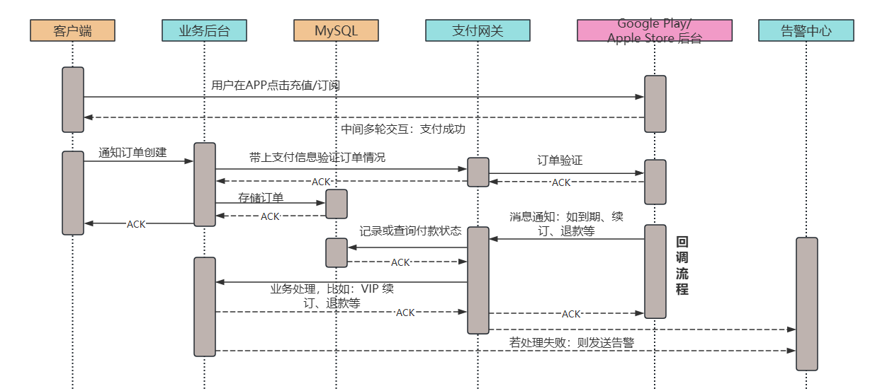
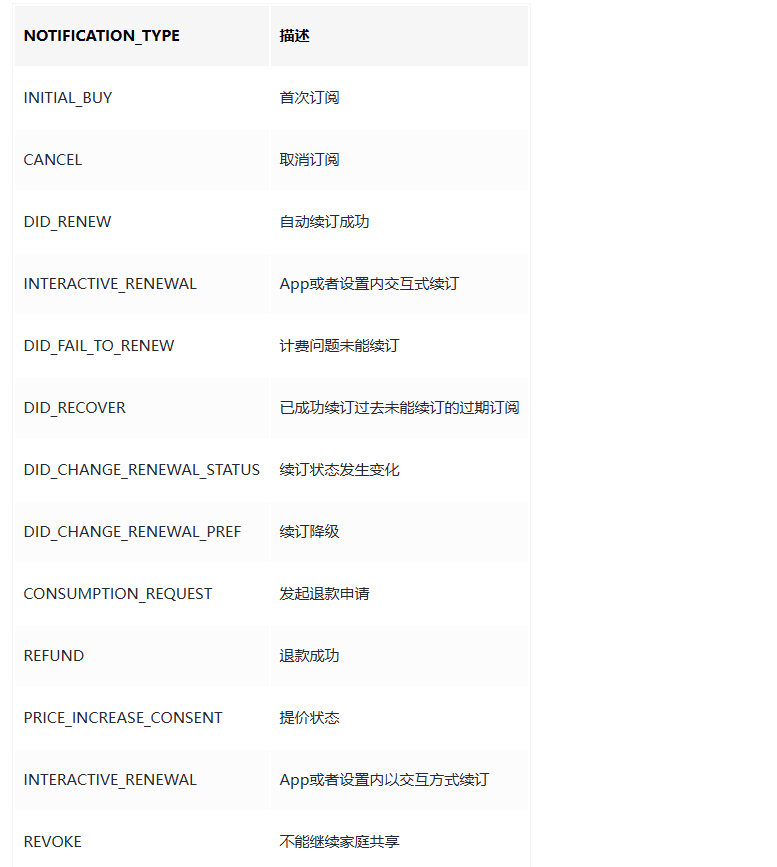
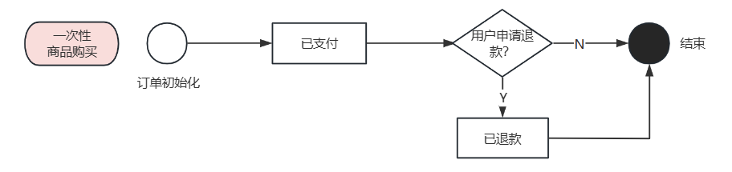
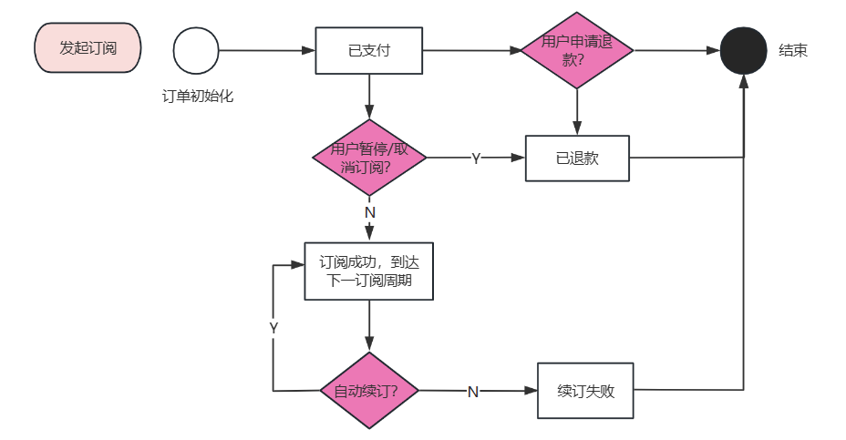

### 1. 引言

当 APP 出海时，海外支付总是绕不过的。海外支付平台最常用的有两个：Google Play 和 Apple Store（IAP 方式），在国内同等地位的可参考支付宝和微信支付。PayPal 也经常用，但我们在业务中很少用到，所以暂时不涉及。

由于是非本土环境，所以这篇文档就详解一下 Google Play 和 Apple Store 的接入流程，以及业务上可能遇到的一些小坑。


### 2. 常见业务交互流程

先看详细的交互流程：



由于业务需要不同的充值套餐和订阅周期，所有我们还需要先提前在 Apple Store 及 Google Play 中配置商品，并且给商品创建一个唯一 ID，存储在后台数据库中（这一步我们可以在运营后台里调用 Apple Store 或者谷歌 Play 的接口，同时写入到 DB，图中没有体现）。

当用户想要获取商品时，客户端首先到后台拉取商品列表，然后用户点击充值/订阅后，客户端就带着商品 ID 请求 Google Play/Apple Store 同时拉起支付页面，当用户支付完成后，客户端把产品ID、支付 Token、交易 ID 等信息传入后台并创建订单。

需注意的是，原始交易 ID 可以管理订阅订单中的续订状态，后台需要存储起来。

接着，业务后台请求支付网关接口，来验证订单的有效性，确认无误后开始下发用户权益（如：充值后获取 100 颗钻石进行主播打赏，或者成为尊贵的 VIP 用户）。


### 3. 海外支付的要点及难点

#### 一些背景

Google 和Apple 未提供完整的流程和状态的支持文档，中文资料也不完整，所以我们只能以官方文档为准，测试驱动开发。

在一些支付平台的接口调用上，服务端支持比较落后，我们尽量选用 SDK 进行交互。

由于 Google Play 和 Apple Store 的回调通知类型不完全一致，所以支付状态的设计也是个难点。


#### 支付状态流转

比如 Apple 订阅的通知类型【NOTIFICATION_TYPE】分为：



Google 的通知类型包括：

> ● **续订开始/续订恢复**
>
> ● **订阅取消/续订取消**
>
> ● **订阅下单**
>
> ● **订阅保留（相当于停机保号）**
>
> ● **订阅重新开始**
>
> ● **订阅到期**

结合实际业务，我们选用了都有的其中几种支付状态，如：完成订单、取消、续订失败、退订、续订成功等。

一次性商品的购买状态扭转比较简单：



订阅类商品更复杂一些：




#### 关键表结构

##### 商品表

商品表主要是记录业务中的商品列表，需要提前在三方支付平台上进行配置，下单时客户端需带着商品 ID 请求后台服务器。

以下是商品表的主要结构（采用 Go 语言的结构体形式展现）：

``` go
type Product struct {
	ID                   uint           `gorm:"primaryKey NOT NULL AUTO_INCREMENT"`
	ProductId            string         `json:"product_id" gorm:"index:product_id_app_id_deleted_at;type:varchar(64) DEFAULT ''"`
	ProductType          int            `json:"product_type" gorm:"comment:商品类型,0.未知类型/1.消耗型购买/2.非消耗型购买/3.自动订阅/4.非自动订阅;type:tinyint(4) DEFAULT 0"`
	Name                 string         `json:"name" gorm:"comment:商品名称;type:varchar(64) DEFAULT ''"`
	Description          string         `json:"description" gorm:"comment:商品描述;type:varchar(1024) DEFAULT ''"`
	Price                int            `json:"price" gorm:"comment:商品价格,精度2位小数,用100倍存储;type:bigint DEFAULT 0"`
	TokenType            int            `json:"token_type" gorm:"comment:虚拟币类型,0.钻石;1.金币;2.元宝;3.其它;type:tinyint(4) DEFAULT 0"`
	TokenQuantity        int            `json:"token_quantity" gorm:"comment:虚拟币数量;type:int(11) DEFAULT 0"`
	SubscribeDurationDay int            `json:"subscribe_duration_day" gorm:"comment:会员订阅时长(天);type:int(11) DEFAULT 0"`
	SubscribeMonthPeriod int            `json:"subscribe_month_period" gorm:"comment:会员订阅时长(月);type:int(11) DEFAULT 0"` // 为了避免多套餐中, 自然月和指定天数的精度问题
	Weight               int            `json:"weight" gorm:"comment:权重，排序时从大到小，客户端根据此字段进行商品排序;type:int(11) DEFAULT 0"`
	ImageURL             string         `json:"image_url" gorm:"comment:商品图片URL;type:varchar(1024) DEFAULT ''"`
	IsAutoSubscribe      int            `json:"is_auto_subscribe" gorm:"comment:是否是自动续费,0.未知/1.自动续费/2.非自动续费;type:tinyint(2) DEFAULT 0"`
	Platform             int            `json:"platform" gorm:"comment:支付平台, 0-海外,1-微信支付,2-国内支付渠道;type:tinyint(2) DEFAULT 0"`
	CreatedAt            time.Time      `json:"created_at" gorm:"type:timestamp DEFAULT CURRENT_TIMESTAMP"`
	UpdatedAt            time.Time      `json:"updated_at" gorm:"type:timestamp DEFAULT CURRENT_TIMESTAMP ON UPDATE CURRENT_TIMESTAMP"`
	DeletedAt            gorm.DeletedAt `gorm:"index:product_id_app_id_deleted_at"` // 只作为联合索引的一部分
}
```


##### 订单表

订单主要记录用户购买的商品状态，比如权益下发到哪一步了，续订套餐是否在续费状态，以及三方支付平台的一些交易凭据（如交易ID）等。

订单表结构可以这样定义（采用 Go 语言的结构体形式展现）：

``` go
type Order struct {
	ID                    uint           `gorm:"primaryKey NOT NULL AUTO_INCREMENT"`
	OrderId               string         `json:"order_id" gorm:"index:order_id_deleted_at;type:varchar(64) DEFAULT ''"`
	ProductId             string         `json:"product_id" gorm:"index:user_uuid_app_product_id_deleted_at;type:varchar(64) DEFAULT ''"`
	TransactionId         string         `json:"transaction_id" gorm:"comment:交易ID，订阅/续订时使用;type:varchar(64) DEFAULT ''"`
	OriginalTransactionId string         `json:"original_transaction_id" gorm:"comment:原始交易ID，订阅/续订时该ID一致;type:varchar(64) DEFAULT ''"`
	UserUuid              string         `json:"user_uuid" gorm:"index:user_uuid_app_product_id_deleted_at;comment:用户的UUID;type:varchar(64) DEFAULT ''"`
	PayChannel            int            `json:"pay_channel" gorm:"comment:支付渠道,0/1/2,GooglePay/ApplePay/PayPal;type:tinyint DEFAULT 0"`
	PaymentState          int            `json:"payment_state" gorm:"comment:支付状态,-1：处理中 0：初始化 1：已完成 2 取消 3 续订失败 4 退款 5 续订成功;type:tinyint DEFAULT 0"`
	RefundTime            string         `json:"refund_time" gorm:"comment:退款时间;type:varchar(32) DEFAULT ''"`
	CreatedAt             time.Time      `json:"created_at" gorm:"type:timestamp DEFAULT CURRENT_TIMESTAMP"`
	UpdatedAt             time.Time      `json:"updated_at" gorm:"type:timestamp DEFAULT CURRENT_TIMESTAMP ON UPDATE CURRENT_TIMESTAMP"`
	DeletedAt             gorm.DeletedAt `gorm:"index:order_id_deleted_at;index:user_uuid_app_product_id_deleted_at"` // 只作为联合索引的一部分
}
```


### 4. 常见问题

##### 1）如何防止掉单

在支付系统中，最重要的是用户权益。很多时候用户明明已经下单并且付钱了，但是 VIP 没有充上，钻石没有到账，是用户难以忍受的。

一个很常见的 Case 是：用户付钱后，断开网络连接，这时后台系统没有收到消息，该怎么处理？

这里我们做了两步来保证：

1. 客户端在划账请求的 ACK 之前先调用后台接口生成订单，如果用户在支付后突然断网，重新打开客户端后会检查当前是否存在未确认的划账请求，如果有就再调用一次后台订单再 ACK。同时后台通过幂等性来保证用户不会多次支付同一笔订单；
2. 业务平台接收到支付网关回调时，发现已有订单就更新订单状态；没有订单就发告警，进行人工处理；


##### 2）如何保证账单和订单正确性

在传统的公司交易中，都会需要会计来对账，将每月的账单和收支金额总额对比，防止出现账不对钱的坏账。

所以，一方面为了保证订单的有序性，我们在业务系统禁止随意扭转订单状态；另一方面我们在支付网关进行每天的定时对账：

1. 每次触发业务回调时，业务后台都会判断数据库状态和支付平台的后台状态一致性，若是不一致，则判断状态是否可以扭转，若是不能扭转则告警出来；若是可以扭转则更新 DB 里订单的状态；
2. 支付网关每天定时比较昨日数据库和支付平台后台的交易状态差异，有差错的部分进行告警。


### 5. 小结

