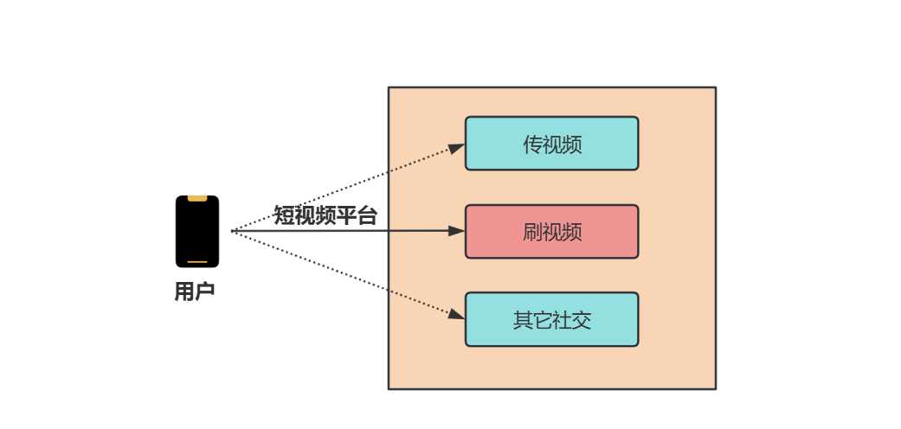
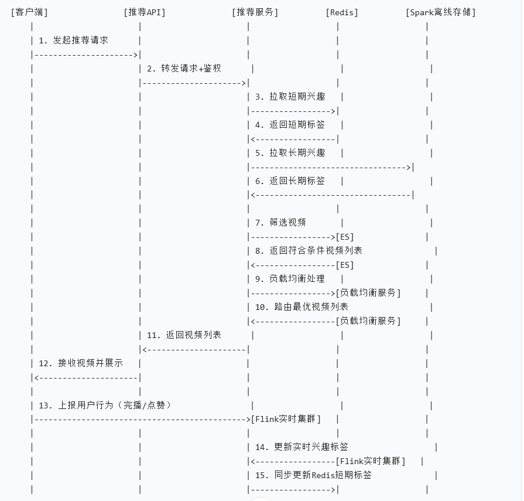
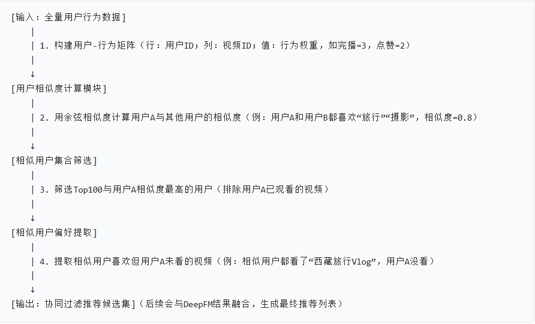
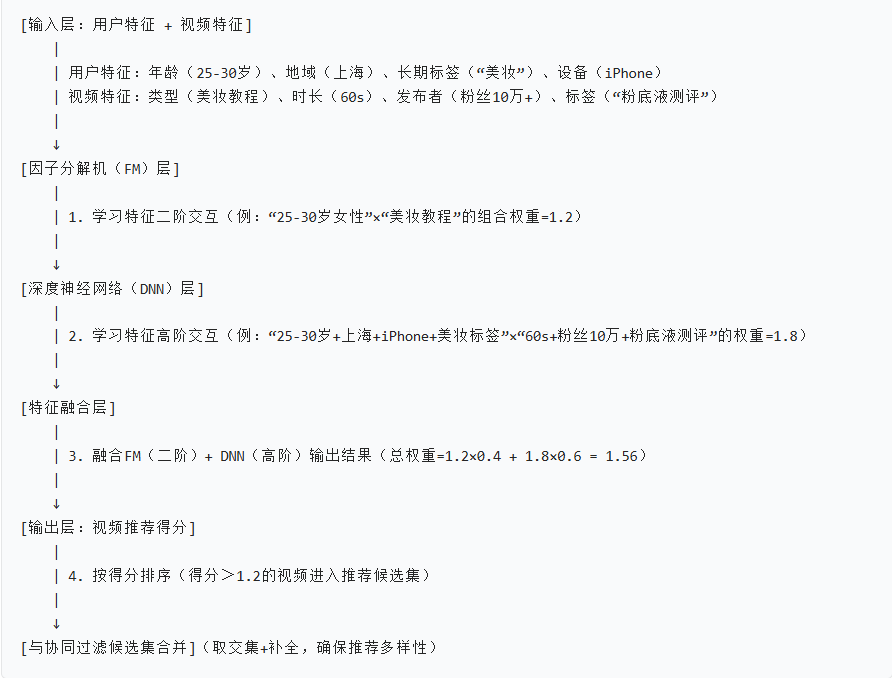
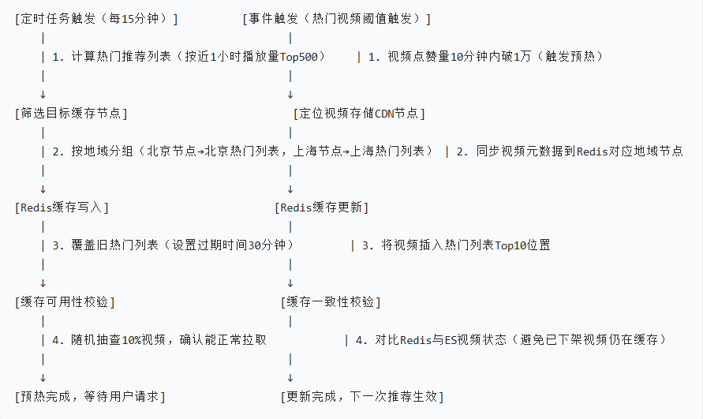
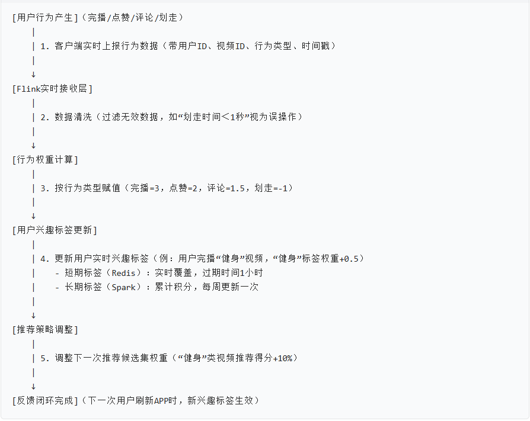
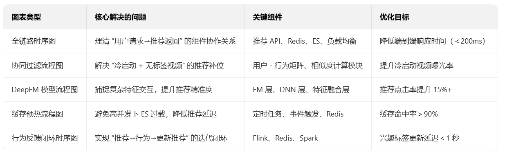

大家好，我是小❤。上篇我们说到了短视频的文件上传和解码。

传送门：短视频上传与转码全流程解析

但在短视频的世界里，视频上传与转码仅仅是内容创作的起点。

当视频成功入库后，**如何精准地将其推送到目标用户眼前**，便成了决定平台用户粘性与活跃度的关键 —— 这背后，靠的就是强大的视频推荐与分发系统。

今天，就让我们一起深入这个充满智能与策略的领域，看看海量视频是如何找到它们的 “**有缘人**” 的。

## 一、视频推荐与分发整体流程

为了让大家清晰地理解整个过程，先来看一张简化的流程图，它涵盖了从用户打开 APP 到视频被推荐展示的核心步骤，以及每一步涉及的关键技术与数据流向。

### 各模块作用与交互逻辑

1. **客户端**：作为用户与平台交互的窗口，负责在用户打开 APP 时，向推荐 API 发起请求，获取推荐视频列表。同时，它还承担着将用户观看视频过程中的各种行为（完播、点赞、评论等）实时上报给后端服务的任务，这些行为数据是后续更新用户兴趣标签、优化推荐算法的重要依据。
2. **推荐 API**：整个推荐流程的入口，接收来自客户端的请求，并将其转发给推荐服务进行处理。它起到了`统一接口、鉴权以及初步流量控制` 的作用，确保只有合法的请求能够进入推荐系统，同时避免因突发流量导致系统过载。
3. **Redis 缓存**：在推荐系统中扮演着 “快速查询助手” 的角色。它存储了用户的短期兴趣标签，这些标签是根据用户近期（如最近 1 小时）的行为快速生成的。由于 `Redis 基于内存存储，读写速度极快，推荐服务能够在毫秒级时间内从 Redis 中获取用户短期兴趣标签，大大缩短了推荐响应时间`。例如，用户在短时间内连续点赞了几个美食制作视频，Redis 中便会及时记录下 “美食制作” 这一短期兴趣标签，推荐服务在下次推荐时就能优先考虑相关视频。
4. **Spark 离线计算**：负责对海量的历史数据进行深度分析与挖掘，生成用户的长期兴趣标签。它通过对用户过去数周甚至数月的行为数据（观看历史、搜索记录、收藏内容等）进行复杂的机器学习算法运算，提炼出用户相对稳定的兴趣偏好。比如，经过长期分析发现某用户一直对科技资讯、电子产品评测类视频情有独钟，Spark 离线计算便会将 “科技”“电子产品” 等标签赋予该用户，作为其长期兴趣标签存储下来。`这些长期兴趣标签为推荐服务提供了更宏观、更稳定的用户兴趣画像，与短期兴趣标签相互补充，共同为精准推荐助力`。
5. **Elasticsearch（ES）**：作为视频数据的存储与检索引擎，`ES 存储了平台上的海量视频元数据（标题、描述、标签、时长、发布时间等）以及视频与用户兴趣标签的关联关系`。推荐服务在获取到用户的短期和长期兴趣标签以及其他相关信息（如地域、设备型号）后，会向 ES 发送复杂的查询语句，ES 能够快速筛选出符合条件的视频列表。例如，当推荐服务得知某用户的兴趣标签为 “旅游”“自然风光”，且该用户位于北京，使用的是 iPhone 设备时，ES 可以迅速从海量视频中检索出与旅游、自然风光相关，且适合在北京地区用户通过 iPhone 设备观看的视频，返回给推荐服务。
6. **Flink 实时计算集群**：专注于对用户实时行为数据的处理。当用户在 APP 上产生观看视频的行为（完播、点赞、评论等）时，这些数据会被实时发送到 Flink 集群。`Flink 利用其强大的流处理能力，迅速对这些实时数据进行分析，更新用户的实时兴趣标签`。

例如，用户刚刚观看完一个关于美女直播带货的视频并给予了点赞，Flink 集群能够在极短时间内捕捉到这一行为，将 “美女直播” 这一标签更新到该用户的实时兴趣标签中。

使得推荐系统在下一次推荐时，能够更快地响应用户的最新兴趣变化，为用户推荐更多相关的瑜伽视频。

### 关键节点说明

1. **请求发起层（1-2 步）**：客户端打开 APP 后自动触发推荐请求，推荐 API 先做「鉴权（验证用户 Token）+ 流量控制（防止单用户高频请求）」，再转发给推荐服务，避免非法请求冲击后端。
2. **兴趣标签获取层（3-6 步）**：推荐服务分两路拉取用户兴趣 ——Redis 存「短期标签」（最近 1 小时行为，如刚点赞的 “宠物” 类视频），Spark 离线存储存「长期标签」（近 30 天稳定兴趣，如 “科技测评”），两者结合避免 “兴趣漂移”（比如用户偶尔看一次美食，不会一直推美食）。
3. **视频筛选与分发层（7-12 步）**：推荐服务带着「用户兴趣标签 + 地域（如北京）+ 设备（如安卓）」向 ES 查询，ES 快速匹配符合条件的视频；再通过负载均衡服务选择 “就近节点存储的视频”（比如北京用户拉取北京 CDN 节点的视频），降低播放延迟。
4. **行为反馈层（13-15 步）**：用户行为实时上报 Flink，Flink 计算后更新「实时兴趣标签」，同步回写到 Redis—— 比如用户刚完播 “篮球赛事” 视频，下一次刷新推荐时，“篮球” 标签权重会临时提升，优先推同类内容。

## 二、关键技术细节剖析

### 协同过滤算法：基于用户行为相似性的推荐策略

协同过滤算法是推荐系统中的经典算法之一，它的核心思想是 “物以类聚，人以群分”。具体来说，该算法通过分析用户的行为数据（如观看历史、点赞、评论等），**找到与目标用户行为模式相似的其他用户群体（即相似用户集合）**。

然后，观察这些相似用户喜欢的视频，将目标用户尚未观看过但在相似用户中受欢迎的视频推荐给目标用户。

举例来说，假设用户 A 和用户 B 都喜欢观看电影类视频，且对动作片、科幻片表现出浓厚兴趣，他们在视频观看行为上具有较高的相似性。

当系统发现用户 A 观看了一部新上映的动作片并给予了好评，而用户 B 尚未观看这部影片时，协同过滤算法就会将这部影片作为推荐内容推送给用户 B。

#### 核心逻辑说明

- 核心是 “**找相似用户的共同偏好**”，无需依赖视频内容标签（比如不知道视频是 “旅行” 类，也能通过用户行为匹配），适合冷启动初期（新视频无标签时）的推荐补位。
- 权重设计：`完播行为权重＞点赞＞评论＞浏览` ，避免 “用户误点点赞但不看” 导致的推荐偏差。

考虑到用户行为的时效性，在计算相似度时会对近期行为赋予更高的权重，以更准确地反映用户当前的兴趣偏好。

### 深度学习模型（以 DeepFM 为例）：融合用户与视频特征的智能推荐

DeepFM 是一种将深度学习与因子分解机相结合的先进推荐模型，它能够**充分利用用户特征和视频特征进行精准推荐**。

在短视频推荐场景中，用户特征涵盖了`年龄、性别、地域、历史观看行为、兴趣标签`等多维度信息；视频特征则包括`视频标题、描述、标签、时长、视频类型、发布者`信息等。

#### 核心逻辑说明

- 解决 “协同过滤无法捕捉复杂特征关系” 的问题：比如协同过滤只能发现 “用户 A 和 B 相似”，但 DeepFM 能精准计算 “特定用户特征组合” 与 “特定视频特征组合” 的匹配度。
- 实时更新：模型参数每天用 Spark 离线更新一次，同时用 Flink 实时调整特征权重（比如 “双 11 期间，美妆类视频特征权重临时提升 20%”）。

DeepFM 模型的结构主要由两部分组成：**因子分解机（FM）部分和深度神经网络（DNN）**部分。

FM 部分能够有效地处理稀疏数据，自动发现特征之间的二阶交互关系。

例如，它可以捕捉到 “年轻男性用户” 与 “科技类视频” 之间的潜在关联，即使在数据中这种组合出现的频率较低，也能通过特征交叉学习到这种关系。

而 DNN 部分则通过多层神经网络对用户和视频的特征进行深度挖掘与非线性变换，学习到更复杂、更高阶的特征组合。比如，通过 DNN 可以发现 “居住在一线城市、喜欢户外运动且近期关注旅游话题的用户” 与 “具有特定拍摄风格的户外旅游视频” 之间的深层次联系。

通过将 FM 和 DNN 的输出结果进行融合，**DeepFM 模型能够综合考虑各种特征信息，为用户生成更个性化、更精准的视频推荐列表。**

### 缓存预热：提升推荐服务响应速度的秘密武器

在高并发的短视频推荐场景下，推荐服务的响应速度直接影响用户体验。

为了减少推荐延迟，缓存预热技术应运而生。缓存预热的核心思路是**在用户实际请求之前，提前将热门推荐列表（根据视频热度、用户活跃度等因素计算得出）加载到 Redis 缓存**中。

这样，当用户发起推荐请求时，推荐服务可以直接从 Redis 中获取已经预热好的推荐列表，快速返回给客户端，大大降低了推荐服务的响应时间。

#### 核心逻辑说明

- 定时预热：针对 “地域化热门内容”（比如北京用户爱刷 “北京环球影城” 视频），提前按地域缓存，避免用户请求时临时计算。
- 事件预热：针对 “突发热门视频”（比如某明星发布新视频，短时间内播放量暴涨），实时触发缓存，避免大量用户同时请求导致 ES 过载。

实现缓存预热通常有两种常见方式：**定时任务和事件驱动**。

**定时任务**方式是指按照预设的时间间隔（如每 15 分钟），系统自动触发一个任务，该任务会重新计算热门推荐列表，并将其更新到 Redis 缓存中。

例如，在凌晨用户活跃度较低的时段，系统可以更全面地对视频热度进行计算，将新的热门推荐列表缓存起来，以应对白天用户访问高峰。

**事件驱动**方式则是基于**特定的事件触发缓存更新**。

比如，当有新的热门视频发布，或者某个视频的点赞数、评论数在短时间内急剧增加，达到一定阈值时，系统会立即触发缓存更新任务，将包含该热门视频的最新推荐列表重新缓存到 Redis 中。

通过这两种方式的结合使用，能够确保 Redis 缓存中的推荐列表始终保持最新、最热，为用户提供快速、高效的推荐服务。

## 三、推荐与分发系统的优化方向

### 实时性优化：紧跟用户兴趣变化的步伐

在短视频领域，用户的兴趣变化往往十分迅速。前一刻还对美食制作视频兴致勃勃，下一刻可能就被一段搞笑短剧吸引。

因此，提升推荐系统的实时性，**及时捕捉并响应用户兴趣的动态变化**，成为优化的关键方向之一。

一方面，进一步优化 Flink 实时计算集群的性能，提高对用户行为数据的处理速度与效率。

通过采用更高效的**流处理算法、增加集群计算资源（如扩充 CPU、内存）**等方式，确保用户的实时行为数据能够在毫秒级时间内被处理，实时兴趣标签得到及时更新。

另一方面，**缩短推荐服务的迭代周期**。

传统的推荐模型训练可能以天或周为单位进行更新，而现在需要朝着实时更新模型参数的方向发展。例如，利用**在线学习技术**，当新的用户行为数据到达时，模型能够立即进行参数调整，使推荐结果更加贴合用户当前的兴趣状态。

#### 核心逻辑说明

- 实时反馈：用户行为产生后，最快 1 秒内更新 Redis 短期标签，确保 “即时兴趣” 能快速体现在推荐中（比如用户刚看了 “猫咪” 视频，下一个视频大概率还是 “猫咪”）。
- 长期迭代：Flink 每天将行为数据同步到 Spark，用于更新长期兴趣标签，避免 “短期兴趣干扰长期推荐”（比如用户偶尔看一次 “汽车” 视频，不会影响其 “美妆” 长期标签）。

### 精准度提升：让推荐更懂用户

虽然当前的推荐算法已经能够实现一定程度的个性化推荐，但在精准度上仍有提升空间。

为了让推荐系统更加 “懂” 用户，需要**不断丰富和细化用户画**像。除了现有的行为数据，还可以引入更多维度的信息，如用户的社交关系（关注列表、好友动态）、消费习惯（是否经常购买视频相关商品）、设备使用习惯（使用 APP 的时间、频率、时长分布）等。

通过对这些多源数据的综合分析，构建更加全面、立体的用户画像，从而为用户提供更精准的视频推荐。

同时，**持续优化深度学习模型的结构与参数，提高模型对复杂特征关系的学习能力**。可以尝试引入新的模型架构（如 Transformer 架构在推荐系统中的应用），或者对现有模型进行更精细的超参数调优，以提升模型的预测准确性，减少推荐结果与用户实际兴趣之间的偏差。

## 四、小结

通过以上 5 张可视化图表，能更清晰地看到推荐与分发系统的 “从请求到反馈” 全链路 —— 每一步都围绕 “快（低延迟）、准（高精准）、稳（高可用）” 设计。

视频推荐与分发，宛如短视频平台的 “智能导航”，精准指引海量视频找到目标用户，其重要性不言而喻。

从技术层面看，**协同过滤算法、深度学习模型（如 DeepFM）**等多管齐下，利用用户行为数据和视频特征，构建起个性化推荐的坚实大厦。

**缓存预热、实时计算**等技术，则不断为推荐系统的高效运转 “添砖加瓦”，确保用户能在第一时间看到心仪视频。

在实际应用中，推荐与分发系统直接影响着用户粘性与平台活跃度。

精准的推荐让用户迅速发现感兴趣的内容，沉浸其中，**提升使用时长**；而及时的分发，能让优质视频快速触达潜在受众，激发创作者的创作热情，**形成内容生产与消费的良性循环**。这不仅是技术的胜利，更是内容生态繁荣的关键支撑。

对于开发者而言，深入理解这套系统，能在短视频领域乃至更广泛的推荐系统开发中，拥有 “四两拨千斤” 的能力。

从算法调优到系统架构设计，每一次技术突破都可能带来用户体验的飞跃，为产品赢得竞争优势。

未来，随着技术的不断进步，视频推荐与分发系统还将持续进化，为我们带来更多惊喜。期待在这个充满无限可能的领域，与大家共同探索、共同进步！