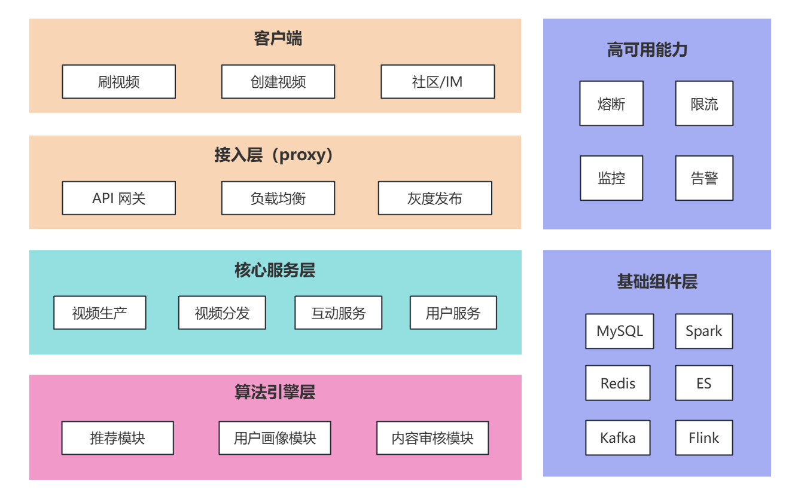
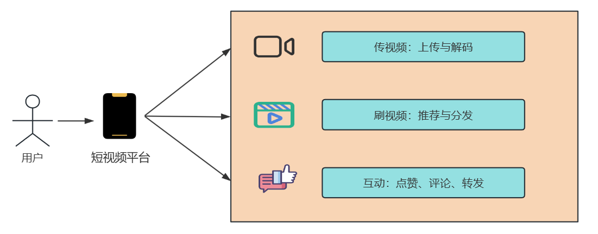
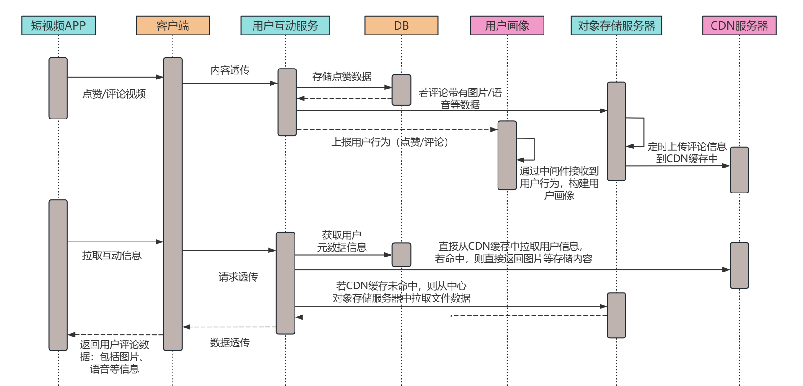
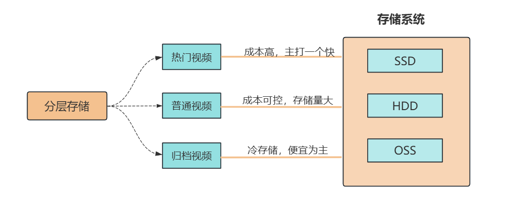
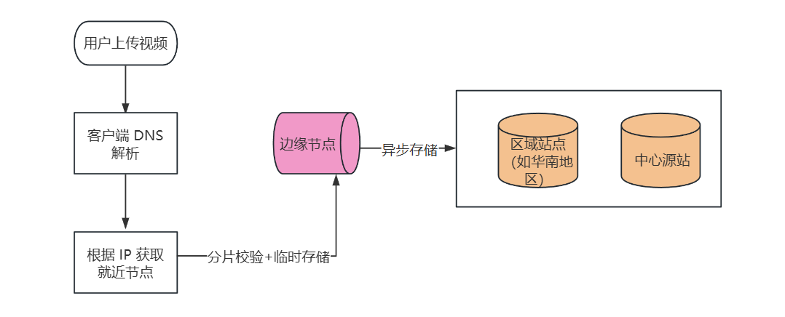
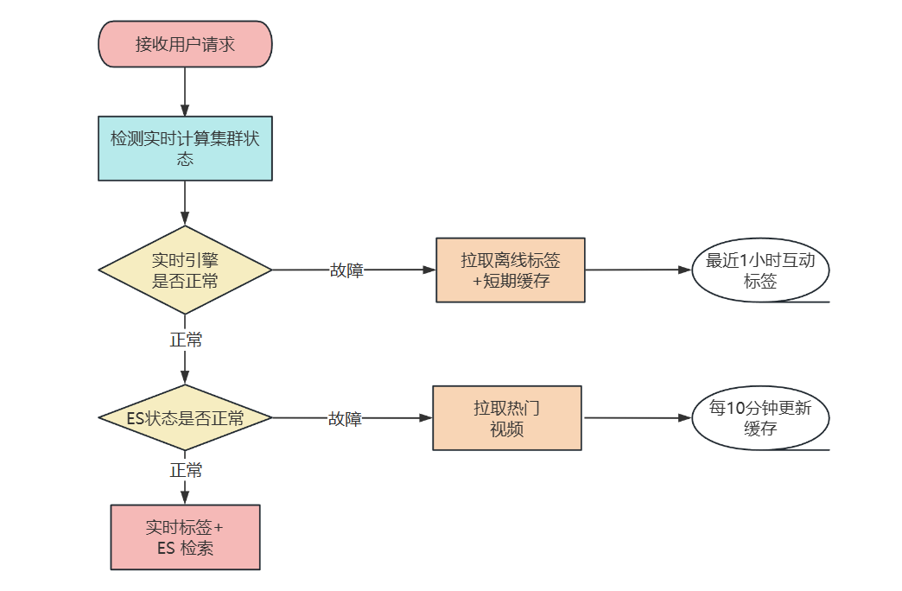

大家好，我是小 ❤。

## 引言

不知道各位后台开发者有没有过这样的经历：在地铁上刷着抖音停不下来，回家后又在快手上看各类生活分享。

可当产品经理拍着你的肩膀说 “咱们也搞个短视频系统” 时，瞬间从 “用户” 切换到 “开发者” 视角，满脑子都是 `海量视频存储怎么搞`、`高并发推流怎么扛`、`实时推荐怎么做到精准` 的灵魂拷问。

在当下的互联网生态中，短视频早已成为用户时长占比最高的应用形态之一。

抖音、快手等头部平台单日活跃用户数以亿计，每秒都有上万条视频被 `上传、转码、分发`，同时还有亿级用户在实时 `刷新、观看、互动`。

**要支撑这样庞大的业务规模，背后的系统架构设计绝非简单的 “CRUD + 文件存储” 就能搞定。**

本文将以抖音、快手为参考原型，从后台技术视角拆解短视频系统的架构设计，涵盖整体**架构分层、核心功能技术实现、关键技术难点**突破等内容，为各位开发者提供一套可落地的短视频系统架构思路，让你面对 “搞个短视频系统” 的需求时，能从容给出技术方案。

## 一、整体架构

短视频系统是典型的 “高并发、海量数据、低延迟” 综合系统，需兼顾 `视频生产（上传、转码）、内容分发（推荐、CDN）、用户互动（点赞、评论、分享）` 三大核心链路，整体采用 “分层解耦 + 微服务化” 架构设计，从下到上可分为**基础组件层、核心服务层、算法引擎层、接入层**四层，同时配套监控运维体系保障系统稳定性。

### 1.1 架构图

### 1.2 关键组件说明

#### （1）接入层

- **API 网关**：采用 Kong/APISIX，负责请求路由、鉴权（JWT/OAuth2.0）、限流（令牌桶算法）、灰度发布（基于 `用户 ID / 地域` 的流量切分），同时统一处理跨域、请求参数校验，屏蔽后端服务复杂性。

- **负载均衡**：使用 Nginx/LVS，结合 DNS 轮询实现 `地域级流量分发`，将用户请求引导至就近的机房节点，降低网络延迟（如北京用户接入北京机房，广州用户接入广州机房）。
- **灰度发布**：在关键功能上线时，特别是一些商业化能力，需要通过用户反馈、数据看板来查看当前功能的实践性，所以在发布时，我们会在网关层配置 `用户灰度` 比例（如采用 Hash 桶散列分布的方式），让一部分用户首先体验到新功能。

#### （2）核心服务层

- **视频生产服务**：负责视频 `上传、转码、审核` 流程，拆分为上传服务（接收客户端视频分片）、转码服务（调用转码集群处理多码率）、审核服务（对接内容审核接口）三个微服务。

- **视频分发服务**：核心是 “推流 - 拉流” 链路，包含 `推流` 服务（接收转码后的视频流，写入 CDN 源站）、`拉流` 服务（为客户端提供视频播放地址，支持断点续传）、`缓存` 服务（Redis 缓存热门视频元数据，减少 DB 访问）。

- **互动服务**：处理点赞、评论、分享、关注等互动行为，拆分为互动服务（处理点赞 / 评论的增删改查）、关系服务（管理用户关注 / 粉丝关系）、消息服务（推送评论通知 / 关注通知），本文主要关注核心模块的互动服务。

- **用户服务**：管理用户基础信息（账号、昵称、头像）、登录态（Session/Token 管理）、权益（会员特权、创作激励），数据存储采用 MySQL `分库分表`（按用户 ID 哈希分片）。

#### （3）算法引擎层

- **推荐模块**：核心是 “`实时推荐 + 离线推荐`” 双引擎，离线推荐基于 Spark/Flink 计算用户长期兴趣（T+1 更新），实时推荐基于 Flink 流处理计算用户短期兴趣（秒级更新），最终通过推荐 API 返回个性化视频列表。

- **用户画像模块**：基于用户基础信息、互动行为（点赞 / 评论 / 完播率）、观看时长等数据，通过 ES（Elasticsearch）存储用户标签（如 “喜欢美食”“关注汽车”），为推荐、内容审核提供数据支撑。

- **内容审核模块**：结合 AI 审核（识别违规画面 / 文字）和人工审核，对上传的视频进行实时过滤，违规视频直接拦截，疑似违规视频进入人工审核队列，保障内容合规性。

#### （4）基础组件层

- **存储组件**：视频文件存储采用 `对象存储（S3/OSS）`，支持海量文件存储和高并发访问；`结构化数据` （用户信息、互动记录）存储采用 MySQL（主从架构），`非结构化数据` （用户画像、日志）存储采用 ES/HDFS；`缓存` 采用 Redis（集群模式，分片 + 哨兵），缓存热门视频元数据和用户登录态。

- **计算组件**：`离线计算` 采用 Spark（处理用户画像、推荐模型训练），`实时计算` 采用 Flink（处理实时推荐、用户行为日志），为算法引擎提供算力支撑。

- **消息队列**：采用 Kafka（集群模式），`解耦` 服务间依赖，如视频上传完成后发送 “转码任务” 消息，转码完成后发送 “审核任务” 消息，避免服务直接调用导致的耦合。

- **CDN**：对接阿里云 / 腾讯云 CDN，将转码后的视频缓存到全国节点，用户拉取视频时从就近 CDN 节点获取，降低源站压力，提升播放速度。

## 二、核心功能技术实现

### 2.1 视频上传与转码

- **上传流程**：客户端采用 “分片上传”（将视频分成 1MB / 片），通过 HTTP/2 协议上传至上传服务，上传服务校验分片完整性后，调用对象存储合并分片，生成视频源文件；同时发送 “转码任务” 到 Kafka，转码服务消费消息后，调用 FFmpeg 转码集群，将源视频转成 480P/720P/1080P 多码率格式，转码完成后更新视频元数据状态。

- **关键技术**：分片上传（断点续传，避免网络中断重传整个视频）、异步转码（采用 Celery 任务队列，支持任务优先级，热门用户视频优先转码）、QUIC 协议（弱网环境下提升上传速度，降低丢包率）。

想要详细了解短视频传输的可以看我的这篇文章：短视频上传与转码全流程解析

### 2.2 视频推荐与分发

- **推荐流程**：用户打开 APP 后，客户端调用推荐 API，推荐服务先从 Redis 获取 “用户短期兴趣标签”（如最近 1 小时点赞的视频类型），再从 Spark 离线计算结果中获取 “用户长期兴趣标签”，结合用户地域、设备型号等信息，从 ES 中筛选符合条件的视频列表，通过负载均衡返回给客户端；同时，用户观看视频的行为（完播 / 点赞 / 评论）实时上报至 Flink 集群，更新用户实时兴趣标签，用于下一次推荐。
- **关键技术**：协同过滤算法（基于用户行为相似性推荐）、深度学习模型（如 DeepFM，融合用户特征和视频特征）、缓存预热（将热门推荐列表提前缓存到 Redis，降低推荐服务响应时间）。

想要详细了解短视频推荐与分发的可以看我的这篇文章：5张图带你深入短视频推荐分发背后的技术逻辑

### 2.3 用户互动（点赞 / 评论）

- **点赞流程**：客户端发送点赞请求到互动服务，互动服务先校验用户登录态，再判断用户是否已点赞（Redis 查询，避免重复点赞），未点赞则更新 MySQL（点赞表，按用户 ID 分表）和 Redis（用户点赞集合），同时发送 “点赞通知” 消息到 Kafka，消息服务消费后推送通知给视频作者。

- **关键技术**：Redis 分布式锁（避免并发点赞导致的数据不一致）、MySQL 分表（按用户 ID 哈希分表，支撑亿级用户互动数据存储）、读写分离（点赞查询走 Redis，写入走 MySQL 主库，读走从库）、CDN 预热提升互动拉取的速度。

## 三、技术难点与解决方案

### 3.1 海量视频存储成本控制

#### 问题拆解

短视频单文件 10-50MB，亿级存量视频需至少 100PB 存储空间（按 1 亿条、平均 10MB 计算），若全用标准存储，年成本超千万元。

且视频访问存在 “**冷热分化**”—— 近 30 天视频播放量占总播放量的 80%，老旧视频访问频次极低，全量高成本存储造成资源浪费。

#### 分层存储策略

首先，我们定义 “热 / 温 / 冷” 三级数据：

* **热门视频**（近 7 天播放量 Top10%、或单日播放量 > 1000 次）存对象存储 SSD 节点（如阿里云 OSS 高性能版），保障毫秒级拉流响应；
* **普通视频**（近 30 天有播放、非热门）存 HDD 标准节点（成本为 SSD 的 1/2）；
* **归档视频**（超过 3 个月无播放、或用户主动归档）迁移至冷存储（如 OSS 归档版，成本仅为标准存储的 1/5）。

##### 具体实现

通过**定时任务**（如 Crontab 离线作业，每日凌晨执行）统计视频播放量，触发**存储级别自动迁移**。

同时提供 “手动归档” API，允许创作者将历史视频转入冷存储，迁移过程中通过 “**软链接**” 保持播放地址不变，避免用户感知。

#### 视频压缩优化

转码阶段默认采用 H.265 编码（对比 H.264，相同清晰度下码率降低 30%，即 10MB 视频可压缩至 7MB），同时针对不同场景做适配：**短视频**（15-60 秒）码率控制在 500-1500kbps（480P→500kbps、720P→1000kbps、1080P→1500kbps），避免码率冗余；**长视频**（超过 1 分钟）采用 “动态码率”（VBR），画面复杂段提高码率、静态段降低码率，进一步节省 20% 存储。

##### 兼容性处理

针对不支持 H.265 的老旧设备（如部分 Android 7.0 以下机型），转码时额外生成 H.264 低码率版本，客户端通过设备检测接口选择对应格式，兼顾兼容性与成本。

### 3.2 高并发推流与低延迟播放

#### 问题拆解

峰值时段（如晚间 8-10 点）每秒新增 1000 + 条推流请求，若**直接推至源站，会导致源站带宽瓶颈**。

同时百万级用户同时拉流时，单节点带宽压力超 10Gbps，易出现丢包、延迟（>3 秒），播放卡顿率超 5% 会显著降低用户留存。

#### 推流侧：边缘节点

##### 架构设计

客户端通过 DNS 解析获取就近边缘节点（如用户在杭州，解析到阿里云杭州边缘节点），视频分片先上传至边缘节点，**边缘节点完成 “分片校验 + 临时存储” 后，再异步同步至中心源站**（采用增量同步，仅传输新分片），避免源站直接承接高并发推流。

##### 技术实现

边缘节点部署 “**推流代理服务**”（基于 Nginx-RTMP 模块二次开发），支持 HTTP/2 和 QUIC 协议；客户端分片上传时，边缘节点返回 “分片唯一标识”，若网络中断，客户端可通过标识续传未完成分片，重传成功率提升至 99%。

#### 拉流侧：CDN 多级缓存 + 播放优化

##### CDN 缓存策略

采用 “**边缘节点→区域节点→源站**” 三级缓存，`热门视频`（播放量 > 10 万次）直接缓存至边缘节点（覆盖全国 300 + 城市），用户拉流时延迟 < 100ms；`普通视频` 缓存至区域节点（如华东、华南区域中心），边缘节点无缓存时从区域节点拉取，避免直接访问源站。

##### 客户端优化

实现 “**预加载 + 自适应码率**” 双机制 —— 用户播放当前视频时，后台预加载下一个推荐视频（预加载 50% 内容），切换视频时实现 “无缝播放”；同时**客户端实时检测网速**（每 2 秒计算一次下载速率），若网速 < 1Mbps 自动切换至 480P，1-3Mbps 切换至 720P，>3Mbps 切换至 1080P，卡顿率可控制在 1% 以内。

### 3.3 实时推荐系统高可用

#### 问题拆解

实时推荐依赖三大环节 ——**Flink 实时计算（秒级更新用户短期兴趣）、ES 检索（毫秒级筛选视频）、推荐服务 API（聚合结果）**，任一环节故障（如 Flink 集群重启、ES 分片异常）都会导致推荐列表空白或返回错误内容，影响核心用户体验（推荐列表是短视频 APP 的主要流量入口，不可用会导致 DAU 下降 40%+）。

#### 多级降级预案

##### 一级降级（实时引擎故障）

当 Flink 实时计算集群延迟 > 5 秒（通过监控告警检测），**推荐服务自动切换至 “离线推荐 + 短期缓存” 模式** —— 使用 Spark T+1 离线计算的用户长期兴趣标签，结合 Redis 缓存的 “用户最近 1 小时互动视频类型”（如最近点赞过 “美食”），生成推荐列表，避免实时数据缺失导致的兴趣偏差。

##### 二级降级（ES 故障）

当 ES 集群健康度 <90%（如分片不可用），**推荐服务直接返回 Redis 中缓存的 “热门视频列表”**（每 10 分钟更新一次，存储 Top1000 条热门视频），同时标记 “降级状态”，前端显示 “热门推荐” 标识，降低用户感知。

##### 三级降级（推荐服务过载）

通过 Sentinel 配置推荐 API 的 QPS 阈值（如单节点 1000QPS），当并发超阈值时，**自动返回 “简化推荐列表”**（仅返回 20 条视频，而非默认 50 条），同时拒绝非核心推荐请求（如 “相似视频推荐”），优先保障首页主推荐流可用。

#### 数据一致性保障

##### 离线推荐结果预加载

每日凌晨 Spark 离线计算完成后，将**用户长期兴趣推荐列表提前写入 Redis**（按用户 ID 分片存储），推荐服务优先从 Redis 读取，减少 ES 访问依赖；同时通过 “版本号机制” 确保 Redis 与 ES 数据同步 —— 当 ES 数据更新时，同步更新 Redis 中的版本号，推荐服务发现版本不一致时触发**增量更新**。

##### 故障恢复自动切换

通过监控系统（如 Prometheus+Grafana）实时检测各环节状态，当故障环节恢复（如 Flink 延迟恢复正常、ES 分片重新分配完成），**推荐服务自动切换回正常模式，切换过程无感知**（通过双活服务部署，旧模式服务继续处理存量请求，新模式服务承接增量请求，待存量请求处理完后下线旧模式）。

## 四、小结：从 “满头问号” 到 “架构落地”，我们还能走得更远

写这篇架构拆解时，我总会想起第一次接 “做短视频系统” 需求的场景 —— 对着产品经理画的 “抖音同款” 原型图，手里的笔悬了半小时，满脑子都是 “这亿级视频存哪里”“百万并发怎么抗” 的焦虑。

但当把架构拆成 “**接入层挡请求、核心服务做流转、算法引擎给智能、基础组件托底**” 四层后，突然发现复杂问题也能 “化整为零”。

回头看全文，我们其实只做了三件事：**把模糊需求拆成技术模块**（比如把 “视频上线” 拆成上传、转码、审核三步），**给每个模块选对工具**（推流用边缘节点卸压、推荐用 Spark+Flink 双引擎），**给关键痛点留好退路**（存储分冷热控成本、推荐做三级降级保可用）。

这些方案没有什么 “黑科技”，但胜在落地性 —— 毕竟对开发者来说，能 `扛住流量、控住成本、不出故障`的架构，才是好架构。

如果你在做类似系统时踩过坑，或者对某块技术有疑问，欢迎在评论区留言 —— 说不定下次我们就一起拆解 “视频转码集群的实战踩坑笔记”，或者 “推荐系统从 0 到 1 的代码实现”。

**毕竟技术这条路，一个人走得快，一群人才能走得远。**

下次见时，希望我们都能对着 “做个短视频系统” 的需求，笑着说一句：“这事儿，我熟。”

