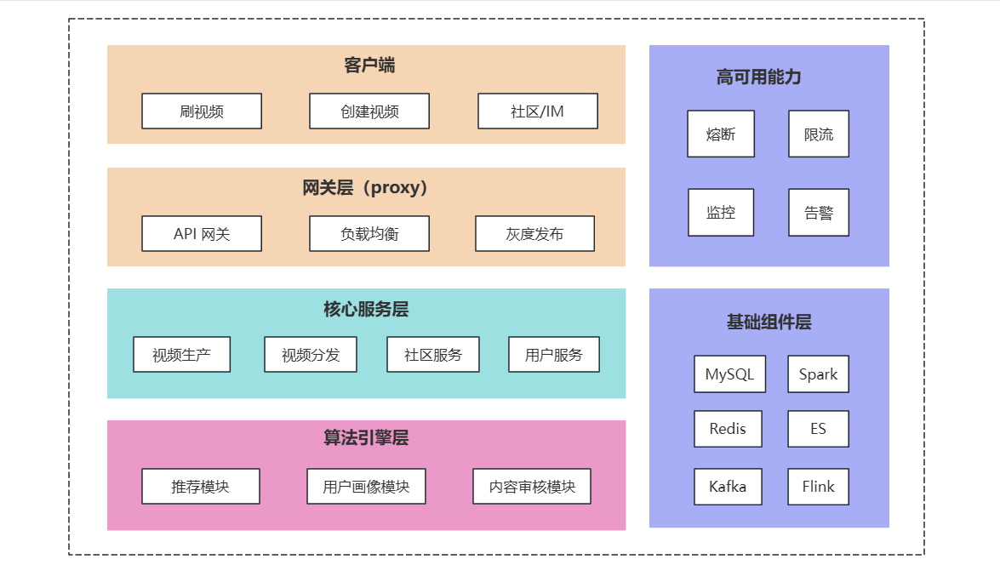
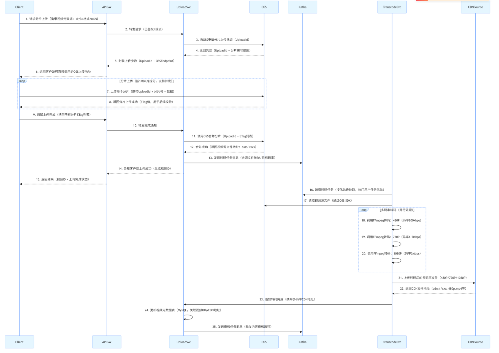

# 听说你会架构设计，来，弄一个短视频系统

## 引言

大家好，我是小 ❤。

不知道各位后台开发者有没有过这样的经历：在地铁上刷着抖音停不下来，回家后又在快手上看各类生活分享，可当产品经理拍着你的肩膀说 “咱们也搞个短视频系统” 时，瞬间从 “用户” 切换到 “开发者” 视角，满脑子都是 “海量视频存储怎么搞”“高并发推流怎么扛”“实时推荐怎么做到精准” 的灵魂拷问。

在当下的互联网生态中，短视频早已成为用户时长占比最高的应用形态之一，抖音、快手等头部平台单日活跃用户数以亿计，每秒都有上万条视频被上传、转码、分发，同时还有亿级用户在实时刷新、观看、互动。要支撑这样庞大的业务规模，背后的系统架构设计绝非简单的 “CRUD + 文件存储” 就能搞定。

本文将以抖音、快手为参考原型，从后台技术视角拆解短视频系统的架构设计，涵盖整体架构分层、核心功能技术实现、关键技术难点突破等内容，为各位开发者提供一套可落地的短视频系统架构思路，让你面对 “搞个短视频系统” 的需求时，能从容给出技术方案。

## 一、整体架构

短视频系统是典型的 “高并发、海量数据、低延迟” 综合系统，需兼顾视频生产（上传、转码）、内容分发（推荐、CDN）、用户互动（点赞、评论、分享）三大核心链路，整体采用 “分层解耦 + 微服务化” 架构设计，从下到上可分为基础组件层、核心服务层、算法引擎层、接入层四层，同时配套监控运维体系保障系统稳定性。

### 1.1 架构图

### 1.2 关键组件说明

#### （1）接入层

- **API 网关**：采用 Kong/APISIX，负责请求路由、鉴权（JWT/OAuth2.0）、限流（令牌桶算法）、灰度发布（基于用户 ID / 地域的流量切分），同时统一处理跨域、请求参数校验，屏蔽后端服务复杂性。

- **负载均衡**：使用 Nginx/LVS，结合 DNS 轮询实现地域级流量分发，将用户请求引导至就近的机房节点，降低网络延迟（如北京用户接入北京机房，广州用户接入广州机房）。
- **灰度发布**：在关键功能上线时，特别是一些商业化能力，需要通过用户反馈、数据看板来查看当前功能的实践性，所以在发布时，我们会在网关层配置用户灰度比例（如采用 Hash 桶散列分布的方式），让一部分用户首先体验到新功能。

#### （2）核心服务层

- **视频生产服务**：负责视频上传、转码、审核流程，拆分为上传服务（接收客户端视频分片）、转码服务（调用转码集群处理多码率）、审核服务（对接内容审核接口）三个微服务。

- **视频分发服务**：核心是 “推流 - 拉流” 链路，包含推流服务（接收转码后的视频流，写入 CDN 源站）、拉流服务（为客户端提供视频播放地址，支持断点续传）、缓存服务（Redis 缓存热门视频元数据，减少 DB 访问）。

- **社区服务**：处理点赞、评论、分享、关注等互动行为，拆分为互动服务（处理点赞 / 评论的增删改查）、关系服务（管理用户关注 / 粉丝关系）、消息服务（推送评论通知 / 关注通知）。

- **用户服务**：管理用户基础信息（账号、昵称、头像）、登录态（Session/Token 管理）、权益（会员特权、创作激励），数据存储采用 MySQL 分库分表（按用户 ID 哈希分片）。

#### （3）算法引擎层

- **推荐模块**：核心是 “实时推荐 + 离线推荐” 双引擎，离线推荐基于 Spark/Flink 计算用户长期兴趣（T+1 更新），实时推荐基于 Flink 流处理计算用户短期兴趣（秒级更新），最终通过推荐 API 返回个性化视频列表。

- **用户画像模块**：基于用户基础信息、互动行为（点赞 / 评论 / 完播率）、观看时长等数据，通过 ES（Elasticsearch）存储用户标签（如 “喜欢美食”“关注汽车”），为推荐、内容审核提供数据支撑。

- **内容审核模块**：结合 AI 审核（识别违规画面 / 文字）和人工审核，对上传的视频进行实时过滤，违规视频直接拦截，疑似违规视频进入人工审核队列，保障内容合规性。

#### （4）基础组件层

- **存储组件**：视频文件存储采用对象存储（S3/OSS），支持海量文件存储和高并发访问；结构化数据（用户信息、互动记录）存储采用 MySQL（主从架构），非结构化数据（用户画像、日志）存储采用 ES/HDFS；缓存采用 Redis（集群模式，分片 + 哨兵），缓存热门视频元数据和用户登录态。

- **计算组件**：离线计算采用 Spark（处理用户画像、推荐模型训练），实时计算采用 Flink（处理实时推荐、用户行为日志），为算法引擎提供算力支撑。

- **消息队列**：采用 Kafka（集群模式），解耦服务间依赖，如视频上传完成后发送 “转码任务” 消息，转码完成后发送 “审核任务” 消息，避免服务直接调用导致的耦合。

- **CDN**：对接阿里云 / 腾讯云 CDN，将转码后的视频缓存到全国节点，用户拉取视频时从就近 CDN 节点获取，降低源站压力，提升播放速度。

## 二、核心功能技术实现

### 2.1 视频上传与转码

- **上传流程**：客户端采用 “分片上传”（将视频分成 1MB / 片），通过 HTTP/2 协议上传至上传服务，上传服务校验分片完整性后，调用对象存储合并分片，生成视频源文件；同时发送 “转码任务” 到 Kafka，转码服务消费消息后，调用 FFmpeg 转码集群，将源视频转成 480P/720P/1080P 多码率格式，转码完成后更新视频元数据状态。

- **关键技术**：分片上传（断点续传，避免网络中断重传整个视频）、异步转码（采用 Celery 任务队列，支持任务优先级，热门用户视频优先转码）、QUIC 协议（弱网环境下提升上传速度，降低丢包率）。

### 2.2 视频推荐与分发

- **推荐流程**：用户打开 APP 后，客户端调用推荐 API，推荐服务先从 Redis 获取 “用户短期兴趣标签”（如最近 1 小时点赞的视频类型），再从 Spark 离线计算结果中获取 “用户长期兴趣标签”，结合用户地域、设备型号等信息，从 ES 中筛选符合条件的视频列表，通过负载均衡返回给客户端；同时，用户观看视频的行为（完播 / 点赞 / 评论）实时上报至 Flink 集群，更新用户实时兴趣标签，用于下一次推荐。

- **关键技术**：协同过滤算法（基于用户行为相似性推荐）、深度学习模型（如 DeepFM，融合用户特征和视频特征）、缓存预热（将热门推荐列表提前缓存到 Redis，降低推荐服务响应时间）。

### 2.3 用户互动（点赞 / 评论）

- **点赞流程**：客户端发送点赞请求到互动服务，互动服务先校验用户登录态，再判断用户是否已点赞（Redis 查询，避免重复点赞），未点赞则更新 MySQL（点赞表，按用户 ID 分表）和 Redis（用户点赞集合），同时发送 “点赞通知” 消息到 Kafka，消息服务消费后推送通知给视频作者。

- **关键技术**：Redis 分布式锁（避免并发点赞导致的数据不一致）、MySQL 分表（按用户 ID 哈希分表，支撑亿级用户互动数据存储）、读写分离（点赞查询走 Redis，写入走 MySQL 主库，读走从库）。

## 三、技术难点与解决方案

### 3.1 海量视频存储成本控制

- **问题**：短视频单个文件约 10-50MB，亿级视频存储量需 PB 级存储空间，直接存储原始视频成本过高。

- **方案**：采用 “分层存储”，热门视频（近 7 天播放量 Top10%）存储在 SSD（对象存储高性能节点），普通视频存储在 HDD（对象存储标准节点），归档视频（超过 3 个月无播放）存储在冷存储（成本仅为标准存储的 1/5）；同时通过视频压缩算法（如 H.265，比 H.264 节省 30% 存储空间）降低文件大小。

### 3.2 高并发推流与低延迟播放

- **问题**：峰值时段每秒有上万条视频推流，同时百万级用户实时拉流，易出现源站压力过大、播放卡顿问题。

- **方案**：推流侧采用 “边缘推流”，用户视频先上传至就近边缘节点，再由边缘节点同步到源站；拉流侧通过 CDN 多级缓存（边缘节点→区域节点→源站），热门视频直接从边缘节点拉取，同时支持 “预加载”（客户端提前加载下一个视频）和 “自适应码率”（根据用户网速切换 480P/720P/1080P）。

### 3.3 实时推荐系统高可用

- **问题**：推荐服务依赖离线计算结果和实时计算数据，任一环节故障会导致推荐列表异常，影响用户体验。

- **方案**：采用 “降级预案”，当实时推荐引擎故障时，自动切换到离线推荐列表；当 ES 集群故障时，缓存最近 1 小时热门视频列表作为兜底；同时通过熔断机制（如 Sentinel）限制推荐服务最大并发，避免雪崩效应。

## 四、小结（简短版）

短视频系统架构设计是 “业务需求 + 技术选型 + 性能优化” 的综合产物，核心在于通过分层解耦、微服务化拆分，将复杂问题拆解为可落地的模块，同时围绕 “高并发、海量数据、低延迟” 三大核心挑战，选择合适的基础组件和技术方案。

本文仅覆盖了短视频系统架构的核心模块和技术要点，实际落地中还需考虑数据一致性（如 MySQL 与 Redis 同步）、成本控制（存储 / 带宽优化）、全球化部署（多地域机房）等问题。如果各位开发者对某一模块（如视频转码集群设计、推荐算法实现）感兴趣，后续可以深入拆解技术细节和代码实现。

希望本文能为你提供一套短视频系统架构的 “骨架”，让你面对类似需求时，能快速理清技术思路，从 “无从下手” 到 “胸有成竹”。