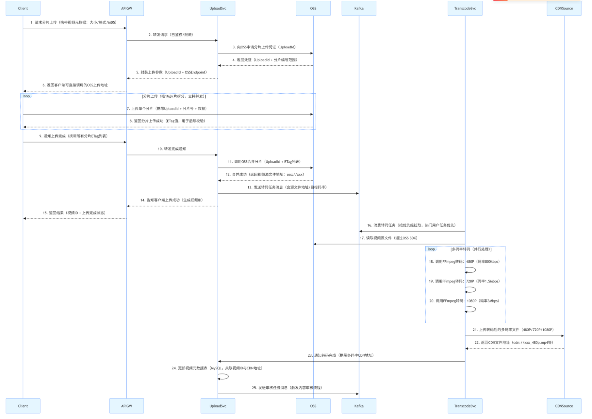

大家好，我是小❤。上周在等电梯时，发现在 4G 网络或者无网络的情况下，抖音、B 站的视频依旧可以正常观看，在视频发布时，甚至可以做到无网卡顿 ——> 连网续传的无缝连接操作。

于是，又想起了曾经在某视频平台的面试经历。

## 引言

各位后台开发的伙伴们，是不是也曾被用户吐槽 “视频传了 5 分钟还没动”、“一到弱网就马赛克漫天飞”？

面试官：

“在抖音、快手这类亿级日活平台，用户轻点 `发布` 的背后，藏着视频上传与转码的 `生死时速` —— 这俩看似简单的 `传文件`、`改格式` 操作，直接决定了用户是 `秒发秒看` 还是 `怒删 APP`。

听说你对视频传输和转码有一定研究，那简单说下短视频的上传转码流程吧！”

今天小❤就带着零星的面试记忆，带着大家扒一扒短视频上传转码的全流程：从`时序图理清组件协作，到拆解决策逻辑、优化技巧`，手把手带你体验一套**又稳又快**的视频生产链路。

## 一、视频上传与转码整体时序图

便于大家理解，我画了个时序图。要理解整个流程，首先得看清各组件之间的协作关系。

以下时序图覆盖了从 “客户端发起上传” 到 “转码完成入库” 的全链路，涉及**客户端、API 网关、上传服务**等 7 类核心组件，每一步都标注了关键技术选型和数据流向，让你一目了然。

可惜当时是线上面试，时序图显然来不及准备了，于是我口述了下面的内容。

### 第一步：客户端发起上传请求，获取分片上传凭证（对应时序图 1-6 步）

#### 涉及模块及作用

- **Client（客户端）**：用户操作的入口（如抖音 APP），核心作用是收集视频元数据（大小、格式、整体 MD5），并向网关发起 “申请分片上传” 的请求 —— 这一步是为了避免直接上传大文件时的风险，先拿到 “上传许可”。

- **APIGW（API 网关）**：系统的 “入口守卫”，作用是统一接收客户端请求，先做两件关键事：①鉴权（验证用户 Token 是否有效，防止非法上传）；②限流（比如限制单个用户每秒最多发起 2 次上传请求，避免恶意刷量），之后再将请求转发给上传服务。

- **UploadSvc（上传服务）**：上传流程的 “协调者”，不直接存储视频，而是负责与对象存储交互，申请 “分片上传凭证（UploadId）”——UploadId 是对象存储分配的唯一标识，用于后续分片上传、合并的身份验证，避免不同用户的分片混淆。

- **OSS（对象存储）**：视频分片的 “临时仓库”，作用是生成并返回 UploadId 和分片编号范围（比如 1-10 片，对应 10MB 视频按 1MB 拆分），同时提供后续分片上传的接口地址。

#### 交互逻辑与设计原因

这时，面试官针对细节发问了：“为什么客户端不直接调用 OSS，而是要通过 API 网关和上传服务？”

我心想，这不是小 case 嘛：“**如果客户端直接对接 OSS，会暴露 OSS 的访问密钥，存在数据泄露风险**。

通过网关和上传服务中转，既能统一鉴权、限流，又能隐藏后端存储细节，后续切换存储服务商（如从阿里云 OSS 换成腾讯云 COS）时，客户端无需修改代码。”

“那为什么要先申请 UploadId 呢？”

“分片上传是 **分多次传碎片**，UploadId 相当于**碎片的归属标识**—— 只有携带正确 UploadId 的分片，OSS 才会认为是同一视频的碎片，后续才能合并成完整文件，避免不同视频的分片混在一起。”

这时，面试官微微点了点头，“好，你接着往下说。”

### 第二步：客户端分片上传视频数据（对应时序图 7-8 步，循环执行）

#### 涉及模块及作用

- **Client（客户端）**：按 1MB / 片拆分视频，并发发起分片上传请求（每次传 1 个分片，携带 UploadId、分片号、分片数据）—— 并发上传是为了提速，比如同时传 3 个分片，比一个一个传快 2-3 倍。

- **OSS（对象存储）**：接收并存储单个分片，校验分片的完整性（比如通过分片 MD5），之后返回 “ETag 值”——ETag 是分片的唯一标识，相当于 “碎片的签收单”，客户端后续需要用 ETag 证明 “这个分片已传成功”。

这时，面试官又问了：“这个 ETag 有啥作用呢？”

我心想，就猜到你会这么问：当然是为了 **数据一致性校验**了，客户端后续通知 “上传完成” 时，会把所有分片的 ETag 列表传给上传服务，上传服务再拿给 OSS——OSS 会对比自己存储的分片 ETag 和客户端上报的 ETag，只有全部一致，才会执行合并，避免分片丢失或损坏。

### 第三步：客户端完成上传，触发分片合并（对应时序图 9-15 步）

当我说完上面的流程时，面试官心想，有点意思，不过面上也不能表现出来。于是继续发问：“**为什么要通过 Kafka 发转码任务，而不是上传服务直接调用转码服务**？”

这个是很常见的消息中间件的作用，就是避免 **服务耦合** 和 **单点故障**：如果上传服务直接调用转码服务，转码服务宕机时，上传服务会被阻塞，甚至拖垮。

用 Kafka 做中间件，上传服务发完消息就 “解脱”，转码服务恢复后可以继续消费任务，不会丢失；同时，后续增加多个转码节点时，只需让它们共同消费 Kafka 的任务，就能实现负载均衡。

### 第四步：转码服务消费任务，处理多码率转码（对应时序图 16-20 步）

#### 涉及模块及作用

- **TranscodeSvc（转码服务）**：从 Kafka 中消费转码任务（按优先级拉取，热门用户任务优先），先通过 OSS SDK 读取视频源文件，再调用 FFmpeg 工具进行多码率转码 —— 转码的核心是 “适配不同网络环境”，比如 480P 给弱网用户，1080P 给 5G 用户。

讲到这里，面试官才微微点头，看来是有实践过的。于是问了一个影响实际体验的问题：

#### 为什么要按优先级拉取任务？

这个问题很简单，无非就是系统中场景的热 key 问题。

关键在于保障 “**核心用户体验**”：热门用户（如粉丝 10 万 + 的创作者）的视频上线速度很重要，若和普通用户的任务一起排队，可能会延迟很久，影响创作者积极性。按优先级排序后，热门用户的任务先处理，普通用户的任务后续处理，平衡 “核心需求” 和 “普通需求”。

#### 那为什么要同时转 480P/720P/1080P 多码率呢？

主要是适配 “多样化网络与设备”：用户的网络环境差异大（2G/3G/4G/5G/WiFi），设备屏幕分辨率也不同（手机 / 平板 / 电脑）—— 弱网用户用 480P，播放不卡顿；高速网络用户用 1080P，体验高清；多码率并存，能让不同场景的用户都有好体验。

### 第五步：转码完成，写入 CDN 源站，更新元数据（对应时序图 21-25 步）

#### 涉及模块及作用

- **CDNSource（CDN 源站）**：存储转码后的视频文件，后续会同步到全国的 CDN 节点（如北京、上海、广州的节点）—— 用户播放视频时，会从就近的 CDN 节点拉取，减少延迟（比如广州用户从广州节点拉取，比从北京源站拉取快 1-2 秒）。

- **Kafka（消息队列）**：接收上传服务发送的 “审核任务消息”—— 视频上线前必须审核（防止违规内容），通过 Kafka 转发审核任务，让审核服务异步处理，不阻塞上传服务的后续操作。

#### 为什么要把视频放到 CDN，而不是直接从 OSS 播放？

降低 “源站压力” 和 “用户延迟”：如果所有用户都从 OSS 拉取视频，OSS 的带宽压力会极大，且跨地域访问延迟高（如新疆用户访问北京 OSS，延迟可能 100ms+）；CDN 有全国节点，用户就近访问，延迟低（通常 20-50ms），且 CDN 能缓存热门视频，减少对 OSS 的请求，降低整体成本。

讲到这里，我感觉面试官还没想好接下来的问题，于是又补充了一下，做个小小的总结。

### 整个流程背后的核心设计思想

上述整个时序图的交互逻辑，围绕三个核心目标展开：

1. **可靠性**：通过分片上传、ETag 校验、任务重试，确保视频数据不丢失、不损坏；

1. **效率性**：通过并发上传、GPU 转码、CDN 分发，让视频上传快、转码快、播放快；

1. **可扩展性**：通过 API 网关、消息队列、微服务拆分（上传 / 转码 / 审核独立），后续增加节点、切换组件（如换 OSS、换 CDN）时，系统能灵活应对，支撑业务增长（从百万级用户到亿级用户）。

理解这些模块作用和交互逻辑，就能掌握短视频上传与转码的核心设计思路，后续遇到类似场景（如大文件上传、音视频处理），也能复用这些技术方案。

## 二、关键技术细节拆解

这时，面试官调整了下坐姿，说：“嗯，那你再说说分片上传的设计吧”。

看到这里，想必大家和面试官一样，都已经了解了视频上传的大概。于是我们再深入每个环节的技术核心，解决实际开发中可能遇到的 “坑”。

### 1. 分片上传的核心设计：解决 “大文件上传失败” 问题

短视频文件通常在 10-50MB 之间，若采用 “一次性上传”，一旦遇到网络波动，就可能导致全量重传，用户体验极差。

分片上传通过三大设计，从根本上解决这一问题：

#### 1.1 分片大小选择

我们采用 1MB / 片的规格，这是兼顾并发效率与对象存储接口限制的最优解。

以阿里云 OSS 为例，单分片最大支持 5GB，但小分片更易重试 —— 哪怕某一个 1MB 的分片上传失败，重新上传也只需几秒，而非整个几十 MB 的视频。

#### 1.2 断点续传

客户端会记录每一个已成功上传分片的 ETag（对象存储返回的唯一标识），下次上传同一视频时，只需对比本地分片 MD5 与 OSS 中的 ETag，仅重新上传未成功的分片。

比如用户上传到一半退出 APP，再次打开时，系统能自动续传剩余分片，无需从头开始。

#### 1.3 数据一致性校验

两层校验保障文件完整：

一是客户端上传前计算视频整体 MD5，与服务端预存的 MD5 比对，避免文件损坏后无效上传。

二是分片合并时，OSS 会自动校验所有分片的 ETag 是否与客户端上报的一致，只要有一个分片不匹配，就拒绝合并，防止最终视频文件损坏。

这时，面试官又点了点头，问到了系统中的高可用问题：“假设我们需要开发**高并发、海量用户**的短视频系统，你会从哪些方面考虑呢？”

### 2. 转码服务的架构设计：兼顾效率与资源成本

转码是典型的 **CPU 密集型操作**，在高峰期，每秒可能有上万条转码任务涌入，若架构设计不合理，要么转码慢到用户等不及，要么资源消耗过高导致成本飙升。

我们通过 “**集群化 + 异步化**” 的设计，平衡效率与成本。

#### 2.1 任务调度策略

采用 “**优先级队列**” 机制，根据用户等级和视频热度分配资源。热门用户（粉丝数 > 10 万）的视频转码任务设为 “高优先级”，确保其内容快速上线。

普通用户任务设为 “中优先级”；归档视频（超过 3 个月无播放）设为 “低优先级”，错峰处理。

同时，转码服务通过 Kafka 分区实现任务分片，**每个转码节点只消费指定分区的任务**，避免重复处理和资源争抢。

#### 2.2 转码参数优化

**编码格式和码率**是影响视频质量与存储成本的关键。

我们选择 H.265（HEVC）编码，相比常用的 H.264，能节省 30% 的存储空间，且支持移动端硬解码，播放更流畅。码率则分为三档：480P（800kbps）适配 2G/3G 弱网环境，720P（1.5Mbps）应对主流 WiFi，1080P（3Mbps）满足 5G / 高速 WiFi 下的高清需求，客户端会根据用户当前网速自动切换。

#### 2.3 资源隔离

为避免不同业务争抢资源，我们将**转码集群按业务线拆分，直播转码和短视频转码使用独立集群** —— 比如直播高峰期（晚上 8-10 点），不会占用短视频转码的 CPU 资源。

同时，通过 Linux cgroups 限制单个转码任务的最大 CPU 使用率（不超过 20%），防止单个大视频转码拖垮整个节点。

### 3. 异常处理机制：保障流程稳定性

在高并发场景下，异常是常态，一套完善的异常处理机制，能让系统在故障时 “不崩、不丢数据”：

- **上传失败重试**：分片上传超时（如 5 秒无响应）时，客户端会自动重试 3 次，且每次重试间隔指数递增（1 秒→2 秒→4 秒），减少网络波动的影响。若 3 次重试仍失败，上传服务会将该视频标记为 “上传异常”，并触发定时任务（每 10 分钟）重新发起分片合并，避免用户手动重试的麻烦。
- **转码失败降级**：若某一码率转码失败（比如 1080P 转码报错），转码服务不会中断整个任务，而是跳过该码率，优先保证 480P 和 720P 可用，同时记录失败日志并触发人工排查。对于转码超时的任务（如 30 分钟未完成，通常是超大文件），会自动终止并降级为 “低优先级”，待资源空闲时重新处理，不占用实时任务的资源。
- **数据一致性保障**：上传服务与转码服务通过 “视频 ID” 唯一关联，转码完成后，必须更新 MySQL 中该视频的 “转码状态”。若超过 5 分钟未更新，定时任务会重新发送转码任务，防止数据丢失。此外，若 OSS 分片合并失败，上传服务会自动删除已上传的分片，避免存储垃圾数据，同时通知客户端重新上传。

讲到这里，面试官已经正襟危坐，透过电脑屏幕我看到他又开始打量起了我的简历，但这时我仿佛面试之神附身，意犹未尽，于是接着发挥。

## 三、性能优化实践

光稳定还不够，还要 “快”—— 用户上传快、视频转码快、播放加载快，这需要针对性的性能优化。

### 3.1 客户端上传速度优化

- **并发分片上传**：客户端同时发起 3-5 个分片上传请求（根据网络环境动态调整，弱网时降为 1-2 个），相比串行上传，速度能提升 2-3 倍。比如一个 10MB 的视频，拆分为 10 个 1MB 分片，并发上传只需 2-3 秒，而串行上传可能需要 5-6 秒。
- **QUIC 协议替代 HTTP/2**：在弱网环境（如地铁、偏远地区），HTTP/2 的 TCP 连接容易丢包重传，我们改用 QUIC 协议（基于 UDP），支持 0-RTT 连接建立，上传成功率能提升 15% 以上（实测数据）。比如在地铁中，HTTP/2 上传成功率约 70%，QUIC 能提升到 85% 以上。
- **预上传校验**：客户端上传前先校验视频格式（仅支持 MP4/AVI/MOV），不符合格式的直接提示用户，避免无效上传。同时提前计算分片 MD5，若发现分片损坏，直接丢弃并重新分片，减少上传后校验失败的概率。

### 3.2 转码效率优化

- **GPU 加速转码**：对热门视频（日播放量 > 10 万），我们采用 NVIDIA Tesla T4 GPU 进行转码，相比传统 CPU（Intel Xeon 8375C），速度快 4-5 倍。比如一个 5 分钟的视频，CPU 转码需要 10 秒，GPU 转码只需 2 秒，大幅缩短视频上线时间。
- **转码任务批量处理**：当同一创作者发布多个视频时，我们会将这些视频的转码任务合并，复用一次 OSS 连接和 FFmpeg 初始化资源，减少 IO 开销。比如某创作者一次发布 3 个视频，批量处理比单独处理能节省 30% 的时间。
- **热点视频预转码**：通过用户行为预测提前触发转码。比如某创作者历史视频播放量均破万，当其刚发布新视频时，系统会预判该视频会成为热点，提前启动转码，避免用户等待 —— 原本需要等转码完成才能观看，现在发布后 1-2 秒就能加载播放。

讲到这里，面试官赶紧示意我停止，说：“嗯 小伙子还不错，短视频这块的上传转码看来有专门了解过，好了，今天的面试先到这里吧，你有什么想问的吗？”

于是我问了几个不痛不痒的专业问题后，结束了这次面试。

## 小结

视频上传与转码作为短视频系统的 “内容入口”，是技术落地的关键一环。**从分片上传解决大文件传输问题，到转码服务平衡效率与成本，再到异常处理和性能优化保障体验**，每一步都需要结合业务场景做精细化设计。

对于后台开发者而言，理解这套流程不仅能应对 “搭建短视频系统” 的需求，更能将其中的技术思路（如`分片传输、异步调度、资源隔离`）迁移到其他大文件处理场景（如直播、云存储）。

当然，这只是短视频系统的冰山一角，后续我们还会拆解**视频推荐、用户互动**等核心模块。

如果你在实际开发中遇到了具体问题，或者对某一技术点有更深入的探讨需求，欢迎在评论区留言，我们一起交流进步！

