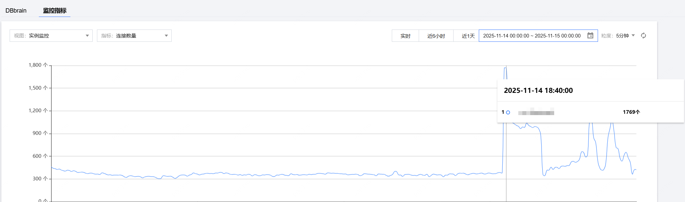

## 1. 引言

大家好，我是小❤，一个在软件开发领域摸爬滚打 7 年的后台开发攻城狮，从早期的单体应用到现在的微服务架构，踩过的坑能绕公司大楼三圈。

上周刚处理完一个线上紧急故障，现在回想起来还心有余悸 —— **线上服务突然大量报 “redis: connection pool timeout” 错误，监控显示 Redis 服务本身一切正常，可用户的请求却在不断失败**。

那段时间，告警短信像雪花一样飘来，运维同事在旁边急得直踱步，我盯着屏幕上的报错日志，感觉头皮都要炸开了。

后来花了 2 个小时，从代码配置到连接池原理逐一排查，才终于解决了问题。

今天就把整个排查过程 + 版本升级适配经验分享出来，希望能帮到遇到类似问题的朋友，避免再踩同样的坑。


## 2. 报错现场：Redis 正常，为啥连接会超时？

先跟大家还原一下当时的场景：

我们的服务是基于 Go 语言开发的，原本用的是`github.com/go-redis/redis/v8`客户端，后来为了兼容更多新特性，升级到了`github.com/redis/go-redis/v9 v9.16.0`。

服务主要用 Redis 缓存用户登录信息、接口热点数据，**服务的热点接口每天请求数 2.5 亿+，QPS 6000+，高峰期（比如周末晚上）的 QPS 超 8000+**。

那天晚上，线上流量突然迎来一波小高峰（某活动带来的并发，峰值请求量达到 10000+），没过多久，日志系统就开始疯狂输出 “GetRedisKeyFailed” 错误，报错信息正是 “redis: connection pool timeout”。

一开始我以为是 Redis 服务出了问题，赶紧让运维同事查 Redis 监控：CPU 使用率 30%、内存占用 40%。

大部分指标都在正常范围内，这就奇怪了 ——Redis 好好的，怎么会连不上呢？

直到看了当前实例的连接数峰值，居然从小几百快速增长到了极高的 1700+ ！



很明显有问题，但是当前的峰值连接数，也在 Redis 的承受范围内，毕竟一般的单机 Redis 也可支撑 10w+/s 的读写性能。

于是我把目光转回代码，先看了 Redis 的初始化和使用代码。

升级 v9 版本时，只是简单迁移了配置，没仔细核对参数差异，这才发现了关键问题：**v9 版本虽然兼容大部分 v8 配置，但部分参数名称和默认值有变化，而且我们还沿用了旧版的 “极简配置”，根本没适配高并发场景。**

原来的初始化代码（升级 v9 后未优化版）长这样：

```go
func Init() (*redis.Client, error) {
	pollTimeout := 3 * time.Second
	if global.Config.Redis.PoolTimeout > 0 {
		pollTimeout = global.Config.Redis.PoolTimeout * time.Second
	}
	client := redis.NewClient(&redis.Options{
		Addr:        global.Config.Redis.Host,
		Password:    global.Config.Redis.Password,
		DB:          0,
		PoolTimeout: pollTimeout,
	})

	_, err := client.Ping(context.Background()).Result()
	if err != nil {
		return nil, fmt.Errorf("redis connect err, %v", err)
	}
	log.Println("[Init] redis connect success")
	return client, nil
}
```

使用代码倒是没大问题，就是没加独立超时 Context：

```go
data := &pb.VerifyTokenData{}
header := utils.FetchXverseHeaderFromCtx(ctx)
lg := utils.GetLoggerWithContext(ctx)

key := constants.GetKey(fmt.Sprintf("%s_%d", USERINFO, token.UserId))
userInfoStr, err := global.Redis.Get(ctx, key).Result()
if err != nil && err != redis.Nil {
	lg.Errorw("GetRedisKeyFailed", utils.ErrKey, err.Error(), utils.ParamKey, map[string]interface{}{
		"UserId": token.UserId,
	})
	return data, err_code.NewCustomError(err_code.RedisHandleError)
}
```

盯着代码看了 5 分钟，终于发现了核心问题：**v9 版本的默认连接池配置，依然是`PoolSize=10`（最大连接数仅 10 个），这在 1000 + 并发场景下，简直是 “杯水车薪”。**


## 3. 排查第一步：v9.16.0 版本配置差异 + 默认值坑点

升级`github.com/redis/go-redis/v9 v9.16.0`后，首先要明确两个关键：**参数兼容性**和**默认值陷阱**。


### 3.1 v9 版本核心参数变化（对比 v8）

| 功能               | v8 版本参数                 | v9.16.0 版本参数           | 说明                       |
| ------------------ | --------------------------- | -------------------------- | -------------------------- |
| 最大连接数         | PoolSize                    | PoolSize                   | 名称不变，默认值仍为 10    |
| 最小空闲连接数     | MinIdleConns                | MinIdleConns               | 名称不变，默认值为 0       |
| 空闲连接超时回收   | IdleTimeout/ConnMaxIdleTime | ConnMaxIdleTime            | 统一为 ConnMaxIdleTime     |
| 连接最大存活时间   | MaxConnAge/ConnMaxLifetime  | ConnMaxLifetime            | 统一为 ConnMaxLifetime     |
| 最大活跃连接请求数 | -                           | MaxActiveConns             | v9 新增，建议等于 PoolSize |
| 重试配置           | -                           | MaxRetries/MinRetryBackoff | v9 新增，增强容错          |


### 3.2 默认值陷阱（高并发场景致命）

v9.16.0 的默认配置中，以下几个参数是 “高并发杀手”：

- `PoolSize=10`：最大连接数仅 10 个，1000 + 并发请求会疯狂排队
- `MinIdleConns=0`：无保底空闲连接，高并发时需频繁创建连接，开销大
- `PoolTimeout=1s`：默认等待连接超时仅 1 秒，容易触发超时报错
- `MaxRetries=0`：默认不重试，一次拿不到连接就直接报错

找到问题根源后，我开始针对性优化配置 —— 不仅要调整核心参数，还要兼顾 “配置可覆盖”（支持通过配置文件动态调整）和 “容错性”（增加重试、超时控制）。


## 4. 排查第二步：v9.16.0 专属优化配置（可直接复用）

结合高并发场景需求和 v9.16.0 版本特性，最终优化后的初始化代码如下，关键优化点都加了注释：

```go
func Init() (*redis.Client, error) {
	// 1. 基础超时默认配置（高并发友好，支持配置文件覆盖）
	pollTimeout := 2 * time.Second // 等待连接超时，比默认1秒更合理
	if global.Config.Redis.PoolTimeout > 0 {
		pollTimeout = global.Config.Redis.PoolTimeout * time.Second
	}

	// 2. 连接池核心配置（适配1000+峰值，支持配置文件覆盖）
	poolSize := 2000                // 最大连接数，略高于峰值，预留缓冲
	minIdleConns := 500             // 最小空闲连接数，减少连接创建开销
	idleTimeout := 30 * time.Second // 空闲30秒回收，防连接泄漏
	maxConnAge := 60 * time.Second  // 连接存活60秒强制重建，避免网络异常

	// 配置文件优先级高于默认值
	if global.Config.Redis.PoolSize > 0 {
		poolSize = global.Config.Redis.PoolSize
	}
	if global.Config.Redis.MinIdleConn > 0 {
		minIdleConns = global.Config.Redis.MinIdleConn
	}
	if global.Config.Redis.IdleTimeout > 0 {
		idleTimeout = global.Config.Redis.IdleTimeout * time.Second
	}
	if global.Config.Redis.MaxConnAge > 0 {
		maxConnAge = global.Config.Redis.MaxConnAge * time.Second
	}

	// 3. v9.16.0客户端配置（新增重试、MaxActiveConns等特性）
	client := redis.NewClient(&redis.Options{
		Addr:            global.Config.Redis.Host,         // Redis地址
		Password:        global.Config.Redis.Password,     // 密码（无则留空）
		DB:              0,                                // 目标数据库
		// 核心连接池参数
		PoolSize:        poolSize,                         // 最大连接数（核心！必改）
		MinIdleConns:    minIdleConns,                     // 最小空闲连接数（必改）
		PoolTimeout:     pollTimeout,                      // 等待连接超时（必调）
		ConnMaxIdleTime: idleTimeout,                      // 空闲连接回收（必改）
		ConnMaxLifetime: maxConnAge,                       // 连接最大存活时间（必改）
		// 基础超时控制（避免阻塞）
		DialTimeout:     3 * time.Second,                  // 建立连接超时（防卡壳）
		ReadTimeout:     2 * time.Second,                  // 读取响应超时（防慢查询）
		WriteTimeout:    2 * time.Second,                  // 写入请求超时（防写阻塞）
		// v9新增容错配置
		MaxRetries:      2,                                // 获取连接失败重试2次
		MinRetryBackoff: 200 * time.Millisecond,           // 重试间隔200ms，避免频繁重试
		MaxActiveConns:  poolSize,                         // 最大活跃请求数=最大连接数
	})

	// 4. 验证连接有效性
	_, err := client.Ping(context.Background()).Result()
	if err != nil {
		return nil, fmt.Errorf("redis connect err, %v", err)
	}

	log.Println("[Init] redis connect success (v9.16.0)")

	// 5. 可选：启动连接池监控（支持配置开关和轮询时间）
	if global.Config.Redis.OpenMonitor {
		defaultPollTime := 10 * time.Second
		if global.Config.Redis.MonitorPollTime > 0 {
			defaultPollTime = global.Config.Redis.MonitorPollTime * time.Second
		}
		go monitorRedisPool(client, poolSize, defaultPollTime)
	}

	return client, nil
}
```


### 关键优化点说明（v9.16.0 专属）

1. **配置可覆盖**：所有核心参数都支持通过`global.Config`动态调整，无需改代码即可适配不同环境（开发 / 测试 / 生产）
2. **新增容错机制**：`MaxRetries=2`+`MinRetryBackoff=200ms`，避免因短暂网络波动导致的连接失败
3. **MaxActiveConns**：v9 新增参数，限制最大同时活跃的连接请求数，建议与`PoolSize`保持一致，防止超负载
4. **监控可控**：通过`OpenMonitor`开关控制是否启用监控，`MonitorPollTime`调整轮询频率，灵活适配不同场景


### 配套使用代码优化（加独立超时 Context）

除了初始化配置，使用代码也要优化 —— 给 Redis 操作添加独立超时 Context，避免外层 Context 无超时导致连接长期占用：

```go
data := &pb.VerifyTokenData{}
header := utils.FetchXverseHeaderFromCtx(ctx)
lg := utils.GetLoggerWithContext(ctx)

key := constants.GetKey(fmt.Sprintf("%s_%d", USERINFO, token.UserId))

// 关键优化：给Redis操作添加2秒独立超时（v9推荐用法）
ctxRedis, cancel := context.WithTimeout(ctx, 2*time.Second)
defer cancel()

// 使用带超时的ctxRedis执行操作
userInfoStr, err := global.Redis.Get(ctxRedis, key).Result()
if err != nil {
	if err == redis.Nil {
		lg.Debugw("RedisKeyNotFound", "UserId", token.UserId, "key", key)
		// 缓存不存在，后续查数据库逻辑（略）
	} else {
		lg.Errorw("GetRedisKeyFailed", utils.ErrKey, err.Error(), utils.ParamKey, map[string]interface{}{
			"UserId": token.UserId,
			"key":    key,
		})
		return data, err_code.NewCustomError(err_code.RedisHandleError)
	}
}
```


## 5. 排查第三步：v9.16.0 专属监控函数（精准监控连接池状态）

v9.16.0 的`PoolStats()`返回的结构体与 v8 一致，我优化了监控函数，支持配置轮询时间、关联日志上下文，方便问题排查：

```go
// monitorRedisPool v9.16.0连接池监控函数（支持动态轮询时间）
func monitorRedisPool(client *redis.Client, poolSize int, pollTime time.Duration) {
	// 初始化监控日志，添加traceId便于追踪
	lg := utils.GetLoggerWithContext(context.Background())
	lg = lg.With("traceId", "redis_pool_monitor", "version", "v9.16.0")

	ticker := time.NewTicker(pollTime)
	defer ticker.Stop()

	for range ticker.C {
		stats := client.PoolStats()
		// 结构化日志输出，便于日志分析工具解析
		lg.Infow("redis_pool_status",
			"连接池总连接数", stats.TotalConns,    // 当前已创建的所有连接数（≤PoolSize）
			"空闲连接数", stats.IdleConns,      // 可直接复用的连接数（反映连接复用率）
			"缓存命中次数", stats.Hits,          // 获取连接时命中空闲连接的次数（越高越好）
			"缓存未命中次数", stats.Misses,      // 无空闲连接，需创建新连接/等待的次数
			"等待连接超时次数", stats.Timeouts,  // 核心告警指标！等于线上报错次数
			"过期连接回收数", stats.StaleConns,  // 反映ConnMaxIdleTime/ConnMaxLifetime是否生效
			"连接池最大容量", poolSize,          // 配置的最大连接数
			"轮询时间", pollTime.String(),      // 监控轮询时间
		)
	}
}
```


### 监控指标解读（重点关注）

| 指标名称         | 解读要点                                                     |
| ---------------- | ------------------------------------------------------------ |
| 等待连接超时次数 | 只要增长，说明有请求超时失败（即线上 “connection pool timeout” 报错），需紧急处理 |
| 连接池总连接数   | 长期等于 PoolSize → 连接池饱和，需调大 PoolSize 或优化业务   |
| 空闲连接数       | 长期为 0 → 连接被持续占用（可能是高并发或连接泄漏）          |
| 过期连接回收数   | 定期增长 → 正常（配置生效）；突然暴增 → 检查 Redis 服务稳定性 |


## 6. 上线验证 + 长期优化建议

### 6.1 上线验证流程

1. **测试环境压测**：模拟 150 + 并发请求，观察监控日志 ——`Timeouts`始终为 0，`TotalConns`稳定在 1200 左右，`IdleConns`保持在 400-500，符合预期
2. **灰度发布**：先部署到 10% 服务器，观察 10 分钟，无超时报错后全量发布
3. **线上监控**：全量发布后，`Timeouts`持续为 0，用户请求成功率从 80% 恢复到 100%，故障彻底解决


### 6.2 长期优化建议

1. **动态调优**：根据监控数据调整`PoolSize`—— 如果`TotalConns`频繁接近`PoolSize`且`Misses`增长，可适当调大（如 2000→2500）
2. **连接泄漏排查**：v9 版本虽有自动回收，但仍需避免手动调用`client.Conn()`后未关闭，建议禁止非必要的手动连接操作
3. 缓存策略优化
   - 热点数据添加本地缓存（如`ristretto`），减少 Redis 请求次数
   - 批量查询用`MGet`、批量写入用`MSet`，减少连接占用
   - 给不存在的 key 设置短期空缓存（如 10 秒），避免缓存穿透
4. **告警配置**：给`等待连接超时次数`配置告警（如 1 分钟内增长超过 5 次），提前发现问题


## 7. 总结：go-redis v9版本避坑指南

这次故障的核心原因，是 “忽视了客户端默认配置” 和 “版本升级后的参数适配”。结合`github.com/redis/go-redis/v9 v9.16.0`的特性，总结几个高并发场景避坑要点：

1. **必改核心参数**：`PoolSize`（1.5-2 倍峰值并发）、`MinIdleConns`（峰值的 50%）、`ConnMaxIdleTime`（30-60 秒）、`PoolTimeout`（2-5 秒）
2. **用好 v9 新特性**：`MaxRetries`（2-3 次）、`MinRetryBackoff`（200-500ms）、`MaxActiveConns`（等于 PoolSize），增强容错性
3. **配置可覆盖**：所有关键参数支持通过配置文件调整，避免硬编码
4. **监控不能少**：启用连接池监控，重点关注`Timeouts`指标，提前预警
5. **避免连接泄漏**：禁止滥用`client.Conn()`，必须用`defer conn.Close()`关闭


其实后台开发中，很多故障都不是 Redis 本身的问题，而是客户端配置/命令使用不当导致的。

只要摸清客户端的参数逻辑，结合业务场景合理配置，再加上完善的监控，就能让 Redis 在高并发场景下稳定运行。

我是小❤，下次再跟大家分享更多 Go 语言 + Redis 的实战技巧。如果这篇文章对你有帮助，别忘了点赞 + 关注，咱们下期再见！