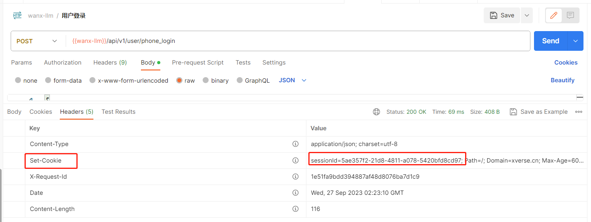
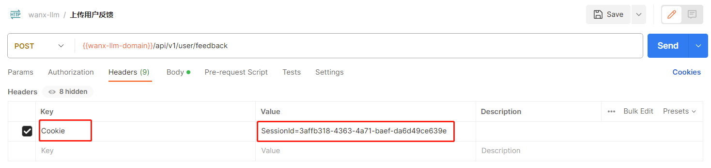
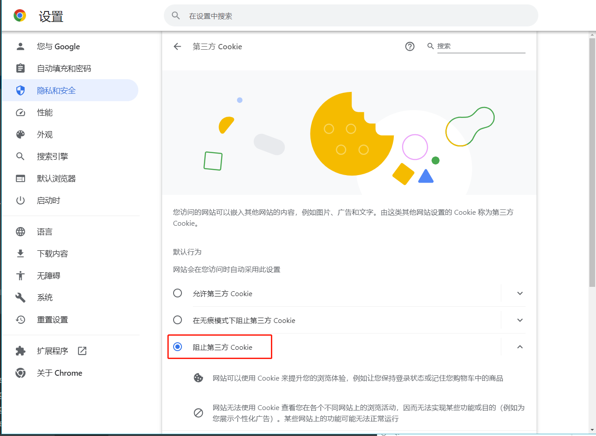

## 1. 引言

### 假期抢票的尴尬事件

大家好，我是小❤，一个漂泊江湖多年的 985 非科班程序员，曾混迹于国企、互联网大厂和创业公司的后台开发攻城狮。

最近小❤在抢出行的高铁票时，发生了一件尴尬的事情。

这不是临近中秋和国庆假期了嘛，按以往经验，抢票应该比较难。于是我通过渠道找了一牛子哥，帮忙抢票，抢票时间在第二天早上 9 点。

好巧不巧，第二天 8点多的时候正好打开了手机，就想着上 12306 去看看票。

**输手机号，拿验证码，登录，一气呵成！**

结果，到 9 点多的时候牛子哥给我说抢票失败了！原因竟然是中途账号被顶了，而 12306 一个账号同一时间只能让一部手机登录。

啊这？！

我还以为牛子哥用了什么高端渠道，或者是神奇 App，原来...小丑竟是我自己。

于是，我就趁此机会复习一下 12306 的登录机制，便有了这篇文章！

### 设备限制的底层逻辑

如今，网站或者手机应用限制登录设备个数已经屡见不鲜了。

不管是限制登录个数，还是保持登录状态，**都和网络交互的 HTTP 协议，以及客户端和服务端的 Cookie、Session 技术息息相关**。

虽然咱每天都在与它们打交道，但你是否真的理解它们的原理和使用方式呢？接下来，让我们一起来揭开它们的神秘面纱吧！

## 2. 产生背景

我们都知道，HTTP 是一个无状态协议。

**无状态是指服务端不会跟踪和记录请求，即对请求处理没有记忆能力**，这意味着每个请求都是独立的。

它的优缺点分别是：

- 优点：服务器处理请求时不需要上下文信息，因此应答很快，每一次请求都是“点到为止”，提升了请求处理的效率。
- 缺点：缺少访问状态意味着如果后续请求和之前有关联，比如 APP 登录功能，就会导致切换 APP 页面时，就必须重传请求。

想象一下，每次在手机上切换应用，或者把应用收到后台就需要我们重新登录一次，那也太恶心了。

一般应用或者网站都会有这种登录状态：

所以，我们对登录功能的诉求是：

- 登陆 APP 时，需要**记住登录用户名密码信息**，避免每次都进行用户名密码输入操作。
- 登陆 APP 时，需要**记住用户登陆的状态**，避免每次都进行重复登录的操作。

除此之外，在一些其它 Web 交互场景下也需要记住状态，比如：

- 购物车添加商品时，需要标识和跟踪某个用户，才能知道购物车里面有几本书。

于是，两种用于保持 HTTP 连接状态的技术应运而生，分别是 Cookie 和 Session。

## 3. Session：身份的标识符

Session，就像你的身份证一样，是一种在服务器和客户端之间传递身份信息的方式。

用户登录生成 Session 的时序图如下：

当你登录一个网站时，服务器会生成一个唯一的 SessionID，并将它存储在服务器端，然后将这个 ID 发送到你的浏览器，通常以 Cookie 的形式。

**这个 SessionID 就像是你的通行证，每当你访问需要登录的页面时，浏览器都会将它发送给服务器。**

服务器通过这个 ID 来识别你，就像保安看到你的身份证一样。Postman 请求登录接口，响应如下：

## 4. Cookie：保持记忆

Cookie 是一个小小的文本文件，它被存储在你的浏览器中。

正如 Cookie 本身的含义，它就像一个小甜点，作用是让服务器能够在不同的 HTTP 请求之间"记住"你。

当你登录一个网站时，服务器已经将一些信息存储在 Cookie 中，比如你的用户名或一些用户首选项。

然后，**每当你再次访问这个网站时，浏览器都会将这些信息发送给服务器，这样服务器就能够"认识"你，而不需要你重新登录。**

用户通过 Cookie 与应用交互的时序图如下：

通过将 SessionId 放在缓存里，每次用户交互时只要带上 Cookie，应用层就可以解析出对应的 SessionId，验证用户的身份，获取用户信息。

Postman 交互如下：

有时，为了信息隐私，我们可以在浏览器设置不记录 Cookie。

这样，我们每次在页面交互时都需要重新登录，体验就会比较差。

## 5. Session与 Cookie 的关系

PS：**这个是 Web 和后台开发面试的常考题，赶快拿小本本记下来** :smile:

### 1）联系

如上所示，Session 和 Cookie 之间有着密切的关系。

通常，服务器会将 SessionId 存储在一个 Cookie 中，并将它发送给你的浏览器或其它设备。

然后，浏览器在每次请求中都会自动包含这个 Cookie，这样服务器就能够识别你的 SessionId，从而知道你是谁。

所以，你可以将 **Session 看作是服务器的身份验证标识，而 Cookie 则是浏览器/用户设备的记忆工具**，用于保存一些有关你的信息。

### 2）区别

那么，Session和 Cookie 有什么不同呢？

#### 访问机制

Cookie 通过检查客户端的用户“通行证”来确定用户身份，Session 检查服务器的“客户档案表”来确认用户状态。

#### 安全程度

不法分子可能会分析存放在本地的 Cookie 进行 Cookie 欺骗，而 Session 是有人登陆或者启动某个会话时才会产生，且 Session 是加密和定时失效的，所以 Session 安全系数更高。

#### 会话机制

简单来说，Session 的隐私度更高，因为它的数据存储在服务器端，用户无法直接修改。

而 Cookie 存储在用户的浏览器中，用户可以看到和修改它们的内容，所以不适合存储敏感信息。

使用场景方面，**Session 通常用于存储用户的登录状态和其他敏感信息，而 Cookie 可以用于存储一些用户首选项或跟踪用户的行为**，比如购物车中的商品。

## 6. 小结

### 登录设备限制

明白了 Cookie 和 Session 的底层逻辑，限制设备的登录个数是不是就很简单了。

我们只需要在登录时，根据账号密码，记录一下当前设备已有的 **Session 数量**，就可以控制登录设备的个数了。

如果要根据客户端类型去限制，比如可以允许电脑和手机同时在线，我们就可以在登录时**记录用户的设备类型**，以此控制每一种设备类型只能有一个 Session。

更进一步，如果基于安全考虑，我们可以在登录时**记录用户的设备 Id**。

> 比如手机在通话框输入 `*#06#`，就可以拿到手机的唯一标识码 `IMEA`

每次用户用新设备登录时，需要先通过手机号或人脸验证，再记录设备的 IMEA 码，以此来保证登录设备的可靠性。

### 结语

**Session 与 Cookie 是构建现代网站的重要组成部分。它们为用户提供了方便的登录和个性化体验，同时也保障了用户的隐私和安全。**

通过深入理解这两者的原理和用法，我们可以更好地构建安全、高效的网络应用程序。

希望这篇文章让你对 Session与 Cookie 有了更清晰的认识，如果大家有任何问题或想要了解更多，请随时留言。

感谢阅读，如果有帮助的话，请点赞、关注、分享、加入在看哦！

### 后话

错过了牛子哥的抢票，只能继续捡漏了！还好，当天下午又放了一波高铁票，如愿以偿可以在中秋之前回家了~~

**预祝屏幕前的各位中秋节 & 国庆节快乐**呀，不知道大家都抢到中秋国庆出行的票没