### 引言

自从工作以来，就在用代码协同工具，最多的就是 Git。

但是最近小❤发现很多人（包括我自己）只熟悉日常代码的拉取和提交，连 `git reset/rebase` 都不知道怎么用，太尴尬了 T.T

于是特意查了下资料，结合我们的日常最常见的使用写了这篇文章，相信开发者们看完都能有所收获。


### 什么是 Git？


不管在大公司还是小公司工作的 coder，还是个人开发者。不管是多人协同开发，还是实现一次上传，多次下载，都需要用到**代码版本控制系统**。

而 Git，就是代码版本管理的扛把子。什么，你 SVN 不服？那我把 Git 的优点列一下，阁下又该如何应对？

1. Git 是分布式版本管理，而 SVN 不是；
2. Git 内容按元数据方式存储，而 SVN 用的是文件；
3. Git 内容存储用的是 SHA-1 哈希算法，对内容完整性来说，Git 吊打 SVN；
4. 市场占有率来说，用 Git 的开发者远超于 SVN。

讲了这么多，不是想要炫耀啥，只是让你认清 Git 的地位。现在不管是应届生还是社招开发者，要 Git 操作都不熟练，在公司走路都得低着头，别问我怎么知道的（bushi


### 安装与配置

Windows：

> 安装包下载地址：https://gitforwindows.org/
>
> 官网慢，可以用国内的镜像：https://npm.taobao.org/mirrors/git-for-windows/。

Mac：

> http://sourceforge.net/projects/git-osx-installer/

以 Windows 举例，安装完成后，可以在开始菜单里输入 "Git" -> "Git Bash"，进入 Git 窗口进行命令操作：

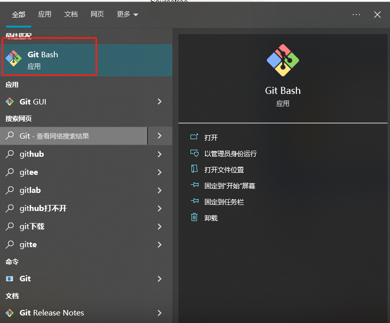


### Git 常用操作

#### 拉取仓库代码

首先，选择一个目录作为我们的代码仓库，也就是存放代码项目的地方。一般选在 D 盘里：

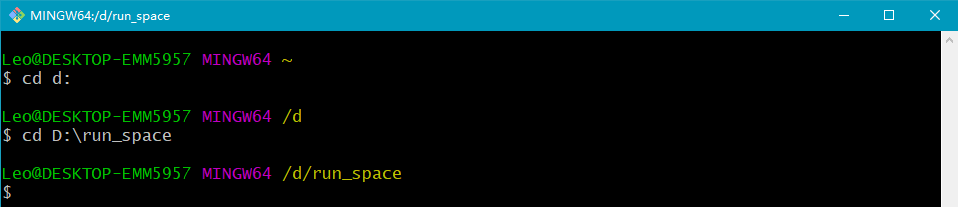


然后去 Git 获取仓库地址，如：直接复制 GitHub 仓库 <https://github.com/yangfx15/coder> 的 HTTPS 链接：

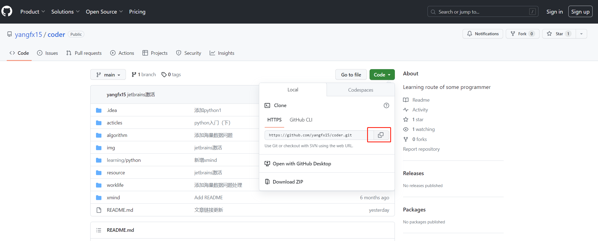

然后在 Git 中执行 `git clone https://github.com/yangfx15/coder.git` 拉取代码，并进入 coder 目录：

> git clone https://github.com/yangfx15/coder.git
>
> cd coder

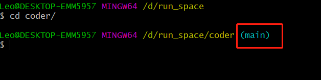

看到 `(main)` 标识，就代表远程代码已经下载到本地仓库了！


#### 代码分支管理

涉及到代码协作，自然会涉及到代码分支。

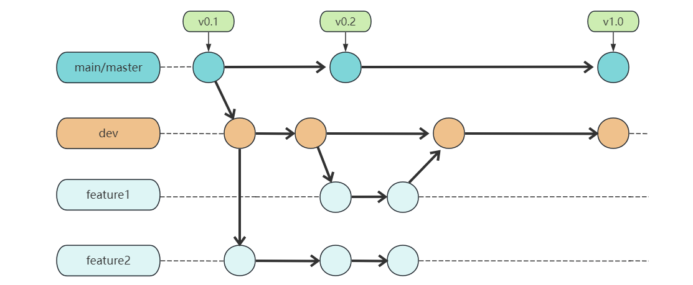

关于分支，大概有展示分支，切换分支，创建分支，删除分支这四种操作。

| **git branch**                                 | **列出所有本地分支**                           |
| ---------------------------------------------- | ---------------------------------------------- |
| **git branch -r**                              | **列出所有远程分支**                           |
| **git branch -a**                              | **列出所有本地分支和远程分支**                 |
| **git branch <branch-name>**                   | **新建一个分支，但依然停留在当前分支**         |
| **git checkout -b <branch-name>**              | **新建一个分支，并切换到该分支**               |
| **git branch --track <branch><remote-branch>** | **新建一个分支，与指定的远程分支建立追踪关系** |
| **git checkout <branch-name>**                 | **切换到指定分支，并更新工作区**               |
| **git branch -d <branch-name>**                | **删除分支**                                   |
| **git push origin --delete <branch-name>**     | **删除远程分支**                               |

关于分支的操作虽然比较多，但都比较简单好记。


#### branch 常见操作

张三和李四协同开发，他们各在 `main` 主分支下拉取了个人分支：feat_zhangsan、feat_lisi。

> git checkout -b feat_zhangsan
>
> git checkout -b feat_lisi

张三开发功能 A，李四开发功能 B。张三开发完成后将本地所有代码推送到远程分支

> git add .
>
> git commit -m "功能A"
>
> git push origin feat_zhangsan
>
> git branch --set-upstream-to=origin/feat_zhangsan

不清楚这几个步骤的继续往下看。


#### 代码推送管理

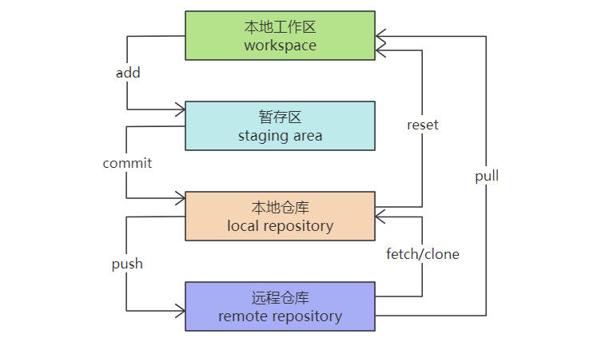

##### add

add 相关命令很简单，主要实现将本地工作区修改的内容提交到暂存区，交由 git 管理。

| **git add .**       | **添加当前目录的所有文件到暂存区**   |
| ------------------- | ------------------------------------ |
| **git add <dir>**   | **添加指定目录到暂存区，包括子目录** |
| **git add <file1>** | **添加指定文件到暂存区**             |

和 add 相反的命令是 `reset`，即撤销暂存区的更改。

| **git reset .**       | **撤销当前目录的所有暂存区文件修改**       |
| --------------------- | ------------------------------------------ |
| **git reset <dir>**   | **从暂存区撤销指定目录，包括子目录的修改** |
| **git reset <file1>** | **从暂存区撤销指定文件的修改**             |


##### commit

commit相关命令也很简单，主要实现将暂存区的内容提交到本地仓库，并使得当前分支的HEAD向后移动一个提交点。

| **git commit -m <message>**         | **提交暂存区到本地仓库,message代表说明信息** |
| ----------------------------------- | -------------------------------------------- |
| **git commit <file1> -m <message>** | **提交暂存区的指定文件到本地仓库**           |
| **git commit --amend -m <message>** | **使用一次新的commit，替代上一次提交**       |


##### reset

和 commit 相反的命令是 `reset --soft`，即撤销 commit，但是写的代码仍然还保留。

| **git reset --soft HEAD^** | **撤销最近一次commit，HEAD^意思是上一个版本，也可以用HEAD~1。如果你想撤回前两次commit，可以使用 HEAD~2** |
| -------------------------- | ------------------------------------------------------------ |
| **git reset --hard HEAD^** | **和 `git reset --soft` 类似，唯一不同的点在于 `hard` 会同时撤销 git add 的操作** |

其中 HEAD 是 Git 中的提交版本概念，它始终指向当前所处分支的最新的提交点。你所处的分支变化了，或者产生了新的提交点，HEAD就会跟着改变。


如果我们想回退到某一次 commit 点，又该如何操作呢？

此时，我们可以先用 `git log --pretty=oneline` 获取历史提交记录：

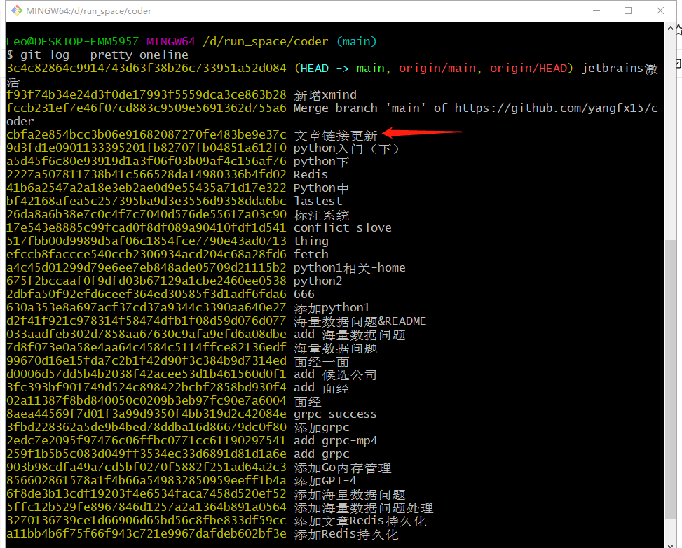

假设我们要回退到 “文章链接更新” commit 点，就需要复制前面的 commit_id：`cbfa2e854bcc3b06e91682087270fe483be9e37c`，然后输入 q 退出。

然后再用 `git reset --hard cbfa2e854bcc3b06e91682087270fe483be9e37c` 回滚到此次提交。


##### status查看代码状态

在 Git 上可以通过 `git status` 查看当前代码的修改状态。

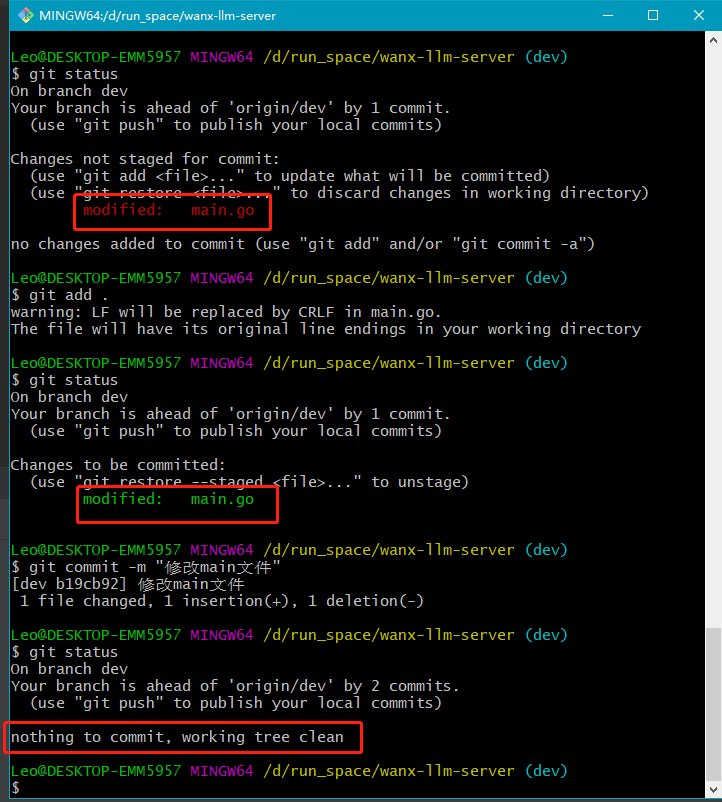

如图所示，当代码处于工作区时，修改的文件呈现红色；代码处于暂存区后，修改的文件呈现绿色；当代码提交到本地仓库以后，显示`nothing to commit, working tree clean` 工作树是干净状态。


##### 常用操作

张三在个人分支上完成开发后，开始推送代码到远程分支，并合并个人分支的代码到 `main` 主分支上。

> feat_zhangsan分支：git add .
>
> feat_zhangsan分支：git commit -m "功能A2"
>
> feat_zhangsan分支：git push
>
> feat_zhangsan分支：git checkout main
>
> main分支：git fetch
>
> main分支：git pull
>
> main分支：git merge origin/feat_zhangsan
>
> main分支：git push


#### 代码合并管理

##### merge

merge 命令把不同分支的代码进行合并。

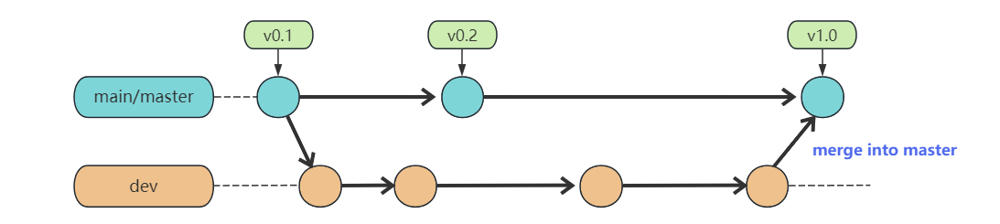

如上图，在实际开放中，我们可能从 master 分支中切出一个 dev 开发分支，然后进行开发完成需求，中间经过多次 commit 记录，最后开发完成需要合入 master 中，就便用到了 merge。

| **git fetch <remote>** | **merge之前先拉一下远程仓库最新代码，fetch后可添加指定远程分支，未指定时默认为当前分支的远程分支** |
| ---------------------- | ------------------------------------------------------------ |
| **git pull**           | **merge之前保住当前分支的代码是最新的**                      |
| **git merge <branch>** | **合并指定分支的代码到当前分支**                             |

一般在merge之后，会出现 conflict，需要针对冲突情况，手动解除冲突。这是由于多个用户修改了同一文件的同一块区域导致。

比如上图中，v0.2 和 dev 分支都修改了 master 分支中的某一个文件，dev 分支 merge into master 时，就需要解决合并冲突。


##### rebase

rebase又称为衍合 & 变基，是合并的另外一种选择。

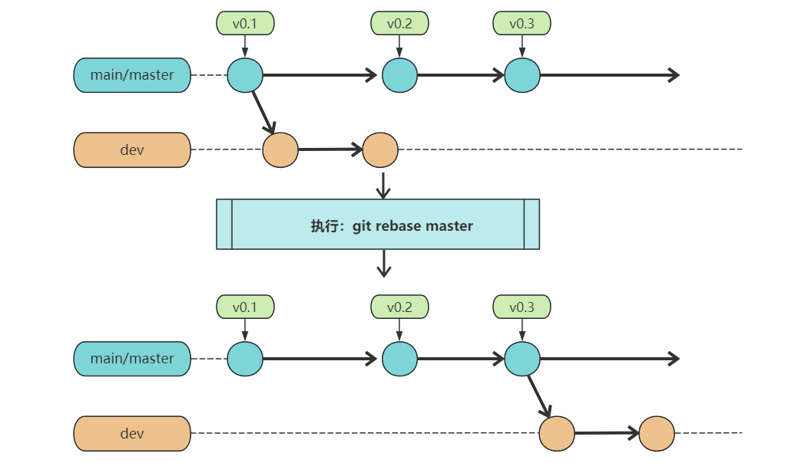

在开始阶段，我们处于 dev 分支上，执行 git rebase master，那么 dev 分支上新的 commit 都在 master 分支上重演一遍，最后 checkout 切换回到 dev 分支。这一点与 merge 是一样的，合并前后所处的分支并没有改变。

git rebase master，通俗的解释就是 dev 分支想站在 master 的肩膀上继续下去。

和 merge 类似，rebase 也需要手动解决冲突。


#### rebase 与 merge 的区别

现在我们有这样的两个分支，dev 和 master，提交如下：

```plain
      D---E dev
     /
A---B---C---F master
```


在 master 执行 git merge dev，然后会得到如下结果：

```plain
      D--------E
     /          \
A---B---C---F----G   master
```

可以看到，merge 操作会生成一个新的节点，之前的提交分开显示、

相当于一棵树长出了新的枝条，然后新枝条合并到主干上！

如果有很多分支都这样合并，看上去就会很乱，对于有强迫症的同学来说，这种合并方式带来的提交历史就显得非常难看。这时有人会问：为什么 Git 的提交历史不能是一条干净的直线？答案就是 rebase。


在 master 执行 git rebase dev，然后得到如下结果：

```plain
A---B---D---E---C'---F' master
```

而 rebase 操作不会生成新的节点，是将两个分支融合成一个线性的提交。

如果你想要一个干净的，没有 merge commit 的线性历史树，那么你应该选择 git rebase；如果你想保留完整的历史记录，并且想要避免重写 commit history 的风险，你应该选择使用 git merge。


##### revert

git revert 撤销某次提交操作，用的是一个新提交来消除一个历史提交所做的修改。

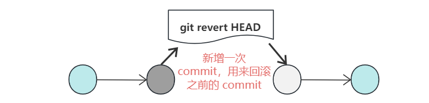

当进行撤销时，revert 会提交一个新的版本，将需要 revert 的版本内容反向修改。此时 HEAD 版本会递增，不影响之前提交的内容。

| **git revert HEAD**        | **撤销前一次 commit**                            |
| -------------------------- | ------------------------------------------------ |
| **git revert HEAD^**       | **撤销前两次 commit**                            |
| **git revert {commit_id}** | **销指定的版本，撤销本身也作为一次提交进行保存** |


#### revert与reset的区别

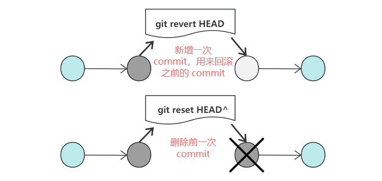

git revert 是用一次新的 commit 来回滚之前的 commit，git reset 是直接删除指定的 commit。

在回滚这一操作上看，效果差不多，但是在日后继续 merge 以前的老版本时有区别。这是由于 revert 操作新增了一次逆向的 commit，相当于酸碱中和了，因此以后在与旧分支进行 merge 时，这部分改变不会再次出现（已经中和完成了）！但是 reset 相当于把酸性给封印了，以后在合并时，reset 恢复部分的代码依然会出现在历史分支里，可能会产生冲突。

两者的区别相当于一个是化学反应，一个是心理反应。为什么如此呢？

这是由于 Git 作为代码版本的管理，每次删除 commit 其实都不是完全删除，相当于对当次 commit 进行了封印。就像人失恋时获取的痛苦记忆一样，如果脑子经历了震荡，不可能完全删除那些历史记忆，只可能会封印住它们。而 revert 相当于对痛苦的记忆做了疏导，这样一来，即便以后再想起时，就没有那么痛苦了:)

git reset 是把版本 HEAD 向后移动了一下，而 git revert 中的版本 HEAD 继续前进。


#### 其他命令

| **git diff**                 | **显示暂存区和工作区的差异**                 |
| ---------------------------- | -------------------------------------------- |
| **git diff HEAD**            | **显示工作区与当前分支最新commit之间的差异** |
| **git cherry-pick <commit>** | **选择一个commit，合并进当前分支**           |

以上就是关于 Git 的一些常用命令及详细阐述，相信能对 Git 有一个初步的认识。