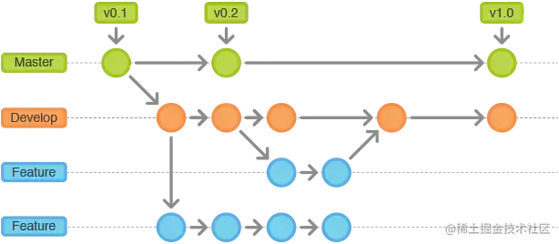
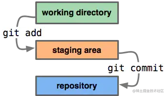
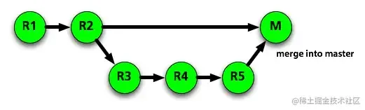
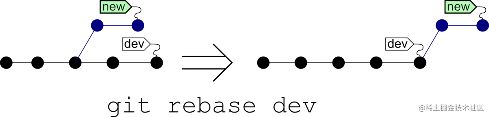
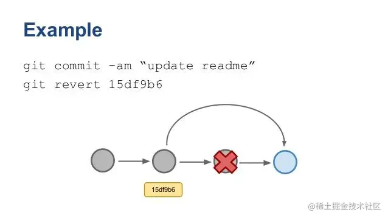
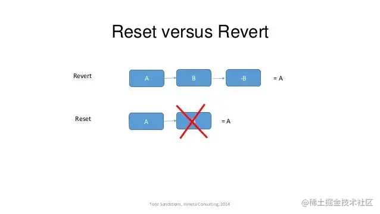

不会吧不会吧，都 2023 年了，不会还有开发者不懂怎么用 Git 吧！

什么？你用过 Git，但是连 `git rebase` 都不知道怎么用？那看完这篇文章应该可以帮到你。


什么是 Git？


不管在大公司还是小公司，商业代码肯定是需要管理起来的。不仅如此，就连个人开发者，为了实现一次上传，多次下载，也需要用到**代码版本控制系统**。

而 Git，就是代码版本管理的扛把子。什么，你 SVN 不服？那我 Git 的优点列一下，看看你有什么话说：

1. Git 是分布式版本管理，而 SVN 不是；
2. Git 内容按元数据方式存储，而你 SVN 用的是文件；
3. Git 内容存储用的是 SHA-1 哈希算法，对内容完整性来说，Git 吊打 SVN；
4. 市场占有率来说，用 Git 的开发者远超于 SVN。


安装与配置

Windows：

> 安装包下载地址：https://gitforwindows.org/
>
> 官网慢，可以用国内的镜像：https://npm.taobao.org/mirrors/git-for-windows/。

Mac：

> http://sourceforge.net/projects/git-osx-installer/

以 Windows 举例，安装完成后，可以在开始菜单里输入 "Git" -> "Git Bash"，进入 Git 窗口进行命令操作：


拉取仓库代码

首先，选择一个目录作为我们的代码仓库，也就是存放代码项目的地方。一般选 D 盘：


然后去 Git 获取仓库地址，如：直接复制 GitHub 仓库 <https://github.com/yangfx15/coder> 的 HTTPS 链接：


然后在 Git 中执行 `git clone https://github.com/yangfx15/coder.git` 拉取代码，并进入 coder 目录：

> git clone https://github.com/yangfx15/coder.git
>
> cd coder


看到 `(main)` 标识，就代表远程代码已经下载到本地仓库了！


代码分支管理

涉及到代码协作，自然会涉及到代码分支。



关于分支，大概有展示分支，切换分支，创建分支，删除分支这四种操作。

| **git branch**                                 | **列出所有本地分支**                           |
| ---------------------------------------------- | ---------------------------------------------- |
| **git branch -r**                              | **列出所有远程分支**                           |
| **git branch -a**                              | **列出所有本地分支和远程分支**                 |
| **git branch <branch-name>**                   | **新建一个分支，但依然停留在当前分支**         |
| **git checkout -b <branch-name>**              | **新建一个分支，并切换到该分支**               |
| **git branch --track <branch><remote-branch>** | **新建一个分支，与指定的远程分支建立追踪关系** |
| **git checkout <branch-name>**                 | **切换到指定分支，并更新工作区**               |
| **git branch -d <branch-name>**                | **删除分支**                                   |
| **git push origin --delete <branch-name>**     | **删除远程分支**                               |

关于分支的操作虽然比较多，但都比较简单好记。


branch 常见操作

张三和李四协同开发，他们各在 `main` 主分支下拉取了个人分支：feat_zhangsan、feat_lisi。

> git checkout -b feat_zhangsan
>
> git checkout -b feat_lisi

张三开发功能 A，李四开发功能 B。张三开发完成后将本地所有代码推送到远程分支

> git add .
>
> git commit -m "功能A"
>
> git push origin feat_zhangsan
>
> git branch --set-upstream-to=origin/feat_zhangsan

不清楚这几个步骤的继续往下看。


代码推送管理




add

add 相关命令很简单，主要实现将工作区修改的内容提交到暂存区，交由 git 管理。

| **git add .**       | **添加当前目录的所有文件到暂存区**   |
| ------------------- | ------------------------------------ |
| **git add <dir>**   | **添加指定目录到暂存区，包括子目录** |
| **git add <file1>** | **添加指定文件到暂存区**             |

和 add 相反的命令是 `reset`，即撤销暂存区的更改。

| **git reset .**       | **撤销当前目录的所有暂存区文件修改**       |
| --------------------- | ------------------------------------------ |
| **git reset <dir>**   | **从暂存区撤销指定目录，包括子目录的修改** |
| **git reset <file1>** | **从暂存区撤销指定文件的修改**             |


commit

commit相关命令也很简单，主要实现将暂存区的内容提交到本地仓库，并使得当前分支的HEAD向后移动一个提交点。

| **git commit -m <message>**         | **提交暂存区到本地仓库,message代表说明信息** |
| ----------------------------------- | -------------------------------------------- |
| **git commit <file1> -m <message>** | **提交暂存区的指定文件到本地仓库**           |
| **git commit --amend -m <message>** | **使用一次新的commit，替代上一次提交**       |


和 commit 相反的命令是 `reset --soft`，即撤销 commit，但是写的代码仍然还保留。

| **git reset --soft HEAD^** | **撤销最近一次commit，HEAD^意思是上一个版本，也可以用HEAD~1。如果你想撤回前两次commit，可以使用 HEAD~2** |
| -------------------------- | ------------------------------------------------------------ |
| **git reset --hard HEAD^** | **和 `git reset --soft` 类似，唯一不同的点在于 `hard` 会同时撤销 git add 的操作** |

那如果想回退到某一次 commit 点，我们又该如何操作呢？

此时，我们先用 `git log --pretty=oneline` 获取历史提交记录：


这时，假设我们要回退到 “文章链接更新” commit 点，就需要复制前面的 commit_id：`cbfa2e854bcc3b06e91682087270fe483be9e37c`，然后输入 q 退出。

然后再用 `git reset --hard cbfa2e854bcc3b06e91682087270fe483be9e37c` 回滚到此次提交。


常用操作

张三在个人分支上完成开发后，开始推送代码到远程分支，并合并个人分支的代码到 `main` 主分支上。

> feat_zhangsan分支：git add .
>
> feat_zhangsan分支：git commit -m "功能A2"
>
> feat_zhangsan分支：git push
>
> feat_zhangsan分支：git checkout main
>
> main分支：git fetch
>
> main分支：git pull
>
> main分支：git merge origin/feat_zhangsan
>
> main分支：git push


代码合并管理

merge

merge 命令把不同的分支合并起来。如上图，在实际开放中，我们可能从 master 分支中切出一个分支，然后进行开发完成需求，中间经过R3,R4,R5的 commit 记录，最后开发完成需要合入 master 中，这便用到了 merge。



| **git fetch <remote>** | **merge之前先拉一下远程仓库最新代码，fetch后可添加指定远程分支，未指定时默认为当前分支的远程分支** |
| ---------------------- | ------------------------------------------------------------ |
| **git pull**           | **merge之前保住当前分支的代码是最新的**                      |
| **git merge <branch>** | **合并指定分支的代码到当前分支**                             |

一般在merge之后，会出现conflict，需要针对冲突情况，手动解除冲突。主要是因为两个用户修改了同一文件的同一块区域。如下图所示，需要手动解除。


rebase

rebase又称为衍合，是合并的另外一种选择。



在开始阶段，我们处于 new 分支上，执行 git rebase dev，那么 new 分支上新的 commit 都在 master 分支上重演一遍，最后 checkout 切换回到 new 分支。这一点与 merge 是一样的，合并前后所处的分支并没有改变。

git rebase dev，通俗的解释就是new分支想站在dev的肩膀上继续下去。

rebase也需要手动解决冲突。


### 6.1. rebase 与 merge 的区别

现在我们有这样的两个分支，test和master，提交如下：

```plain
      D---E test
     /
A---B---C---F master
```


在master执行git merge test，然后会得到如下结果：

```plain
    	D--------E
     /          \
A---B---C---F----G   test, master
```


在master执行git rebase test，然后得到如下结果：

```plain
A---B---D---E---C'---F'   test, master
```


可以看到，merge操作会生成一个新的节点，之前的提交分开显示。而rebase操作不会生成新的节点，是将两个分支融合成一个线性的提交。

如果你想要一个干净的，没有 merge commit 的线性历史树，那么你应该选择 git rebase；如果你想保留完整的历史记录，并且想要避免重写 commit history 的风险，你应该选择使用 git merge。


## 8. revert



git revert 用一个新提交来消除一个历史提交所做的任何修改。

### 8.1. revert与reset的区别



- git revert是用一次新的commit来回滚之前的commit，git reset是直接删除指定的commit。
- 在回滚这一操作上看，效果差不多。但是在日后继续merge以前的老版本时有区别。因为git revert是用一次逆向的commit“中和”之前的提交，因此日后合并老的branch时，导致这部分改变不会再次出现，减少冲突。但是git reset是之间把某些commit在某个branch上删除，因而和老的branch再次merge时，这些被回滚的commit应该还会被引入，产生很多冲突。关于这一点，不太理解的可以看[这篇文章](https://link.juejin.cn?target=https%3A%2F%2Flinks.jianshu.com%2Fgo%3Fto%3Dhttp%3A%2F%2Fyijiebuyi.com%2Fblog%2F8f985d539566d0bf3b804df6be4e0c90.html)。
- git reset 是把HEAD向后移动了一下，而git revert是HEAD继续前进，只是新的commit的内容和要revert的内容正好相反，能够抵消要被revert的内容。


## 10. 其他命令

| git status                   | 显示有变更的文件                             |
| ---------------------------- | -------------------------------------------- |
| **git log**                  | **显示当前分支的版本历史**                   |
| **git diff**                 | **显示暂存区和工作区的差异**                 |
| **git diff HEAD**            | **显示工作区与当前分支最新commit之间的差异** |
| **git cherry-pick <commit>** | **选择一个commit，合并进当前分支**           |

以上就是关于 

Git 的一些常用命令及详细阐述，相信能对 Git 有一个初步的认识。