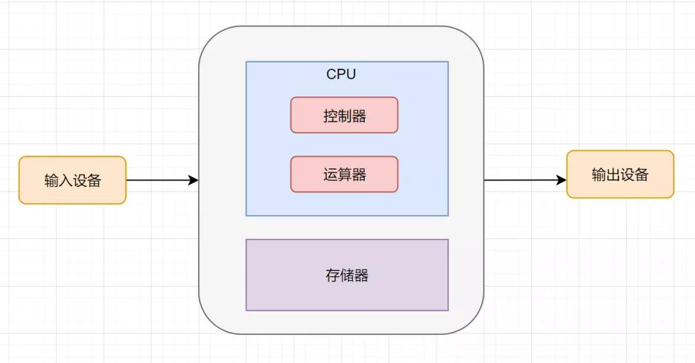
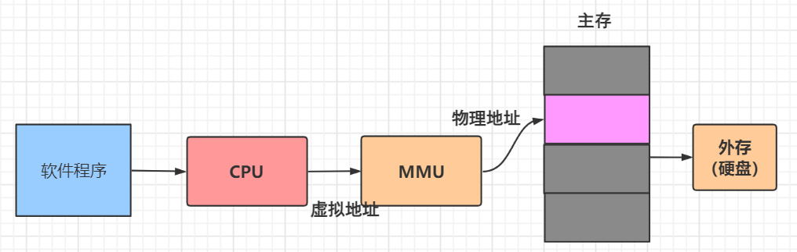
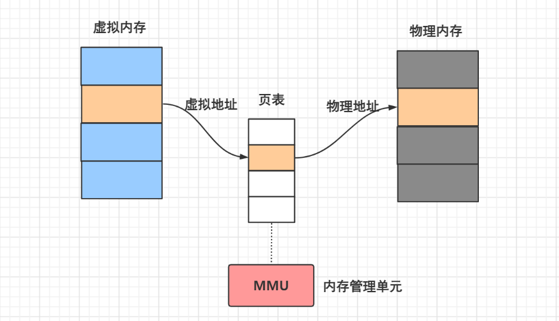
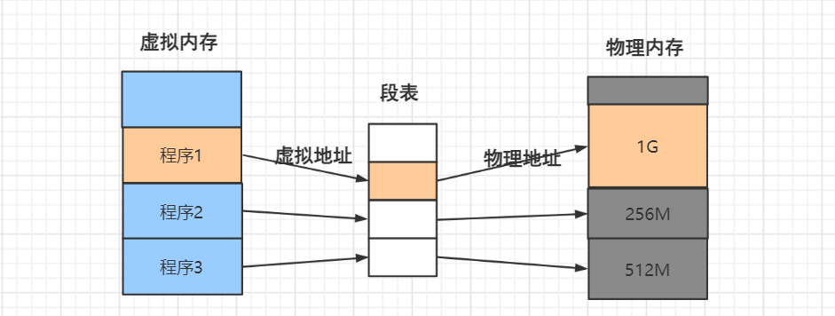
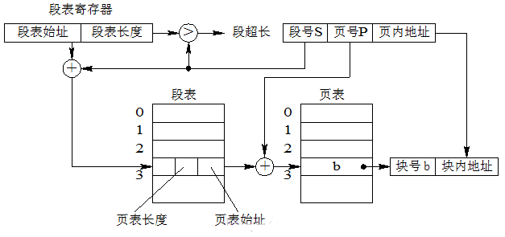
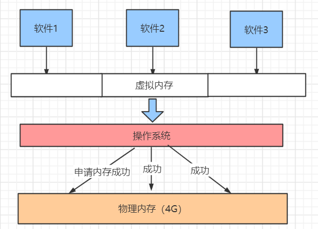
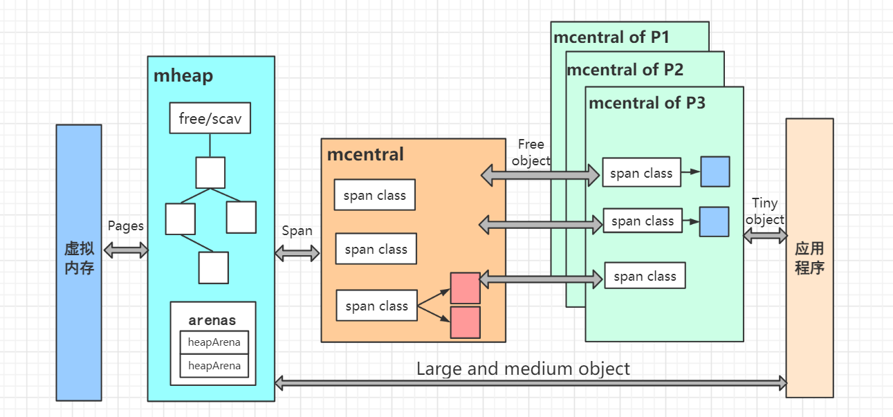
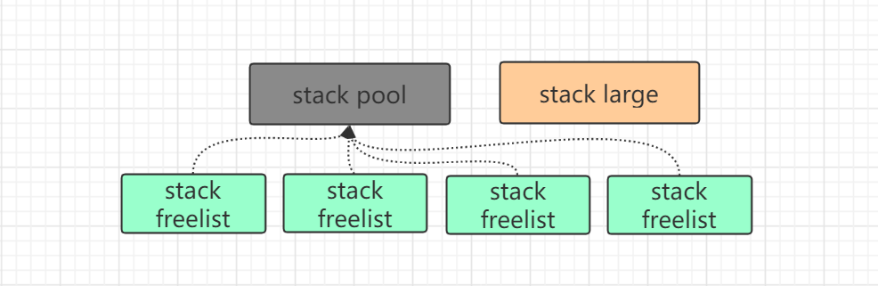

目录

> 1. 引言
> 2. 虚拟内存
> 3. 内存管理
> 4. 逃逸分析
> 5. 小结


## 1. 引言

内存管理，是开发者在程序编写和调优的过程中不可绕开的话题，也是走向资深程序员必须要了解的计算机知识。

有经验的面试官会从内存管理的掌握程度去考察一个候选人的技术水平。这里面涉及到的知识可能包括操作系统、计算机组成原理以及编程语言的底层实现等。

说到内存，其实就是存储器，我们可以从冯.诺依曼的计算机结构来了解存储器的概念：



可以看到，存储器是计算机中不可或缺的一部分。内存管理，其实就是对存储器的存储空间管理。

接下来，我们会从内存分类、以及 Go 语言的内存空间分配上，结合常见的逃逸分析场景，来学习内存管理相关的知识。


## 2. 虚拟内存

### 2.1 虚拟内存和物理内存的区别

我们都知道，以前的计算机存储器空间很小，我们在运行计算机程序的时候物理寻址的范围非常有限。

比如，在 32 位的机器上，寻址范围只有 2 的 32 次方，也就是 4G。并且，对于程序来说，这是固定的，我们可以想象一下，如果每开一个计算机进程就给它们分配 4G 的物理内存，那资源消耗就太大了。


资源的利用率也是一个巨大的问题，没有分配到资源的进程就只能等待，当一个进程结束以后再把等待的进程装入内存，而这种频繁地装入内存操作效率也很低。

并且，由于指令都是可以访问物理内存的，那么任何进程都可以修改内存中其它进程的数据，甚至修改内核地址空间的数据，这是非常不安全的。

由于物理内存使用时，资源消耗大、利用率低及不安全的问题。因此，引入了**虚拟内存**。

虚拟内存是计算机系统内存管理的一种技术，**通过分配虚拟的逻辑内存地址，让每个应用程序都认为自己拥有连续可用的内存空间。**而实际上，这些内存空间通常是被分隔开的多个物理内存碎片，还有部分暂时存储在外部磁盘存储器上，在需要时进行数据交换。


### 2.2 虚拟内存转换

既然计算机用到的都是虚拟内存，那我们如何拿到真实的物理内存地址呢？答案就是内存映射，即如何把虚拟地址（又被称作逻辑地址）转换成物理地址。



在 Linux 操作系统下，内存最先有两种管理方式，分别是页式存储管理和段式存储管理，其中：

* 页式存储能有效地解决内存碎片，提高内存利用率；
* 分段式存储管理能反映程序的逻辑结构，并有利于段的共享；

通俗来讲就是内存有两种单位，一种是分页，一种是分段。**分页就是把整个虚拟和物理内存空间切割成很多块固定尺寸的大小**，虚拟地址和物理地址间通过**页表**来进行映射：



分页内存都是预先划分好的，所以不会产生间隙非常小的内存碎片，分配时利用率比较高。

而分段就不一样了，它是基于程序的逻辑来分段的，由于程序属性可能大不相同，所以分段的大小也会大小不一。分段管理时，虚拟地址和物理地址间通过**段表**来进行映射：



不难发现，分段内存管理的切分不是均匀的，而是根据不同的程序所占用的内存来分配。这样带来的问题是，假设程序1的内存（1G）用完了释放后，另一个程序4（假设内存需要1000M）装到物理内存中可能还剩余 24M 内存，如果系统中有大量的这种内存碎片，那整体的内存利用率就会很低。

于是，段页式内存管理方式出现了，它将以上两种存储管理方法结合起来：即**先把用户程序分成若干个段，为每一个段分配一个段名，再把每个段分成若干个页**。

在段页式系统中，为了实现从逻辑地址到物理地址的转换，系统中需要同时配置段表和页表，利用段表和页表进行从用户地址到物理内存空间的映射。系统为每个进程创建一张段表，每个分段上有一个页表。段表包括段号、页表长度和页表始址，页表包含页号和块号。



在地址转换时，首先通过段表查到页表地址，再通过页表获取页帧号，最终形成物理地址。

虚拟内存到物理内存的映射，是操作系统层面去管理的。而我们在开发时，涉及到的内存管理，往往只是软件程序去调用虚拟内存时要做的工作：



接下来，我们从虚拟内存的构成来分析下软件开发中的内存管理。


## 3. 内存管理

程序在虚拟内存上被分为栈区、堆区、数据区、全局数据区、代码段五个部分。

而内存的管理，就是对内存空间进行合理化使用，主要是堆区（Heap）和栈区（Stack）这两个重要区域的分配使用。


### 3.1 堆与栈

虚拟内存里有两块比较重要的地址空间，分别为堆和栈空间。对于 C++ 等底层的编程语言，栈上的内存空间由编译器统一管理，而堆上的内存空间需要程序员来手动管理进行分配和回收。

在 **Go 语言中，栈上的内存空间也是由编译器来统一管理，而堆上的内存空间由编译器和垃圾收集器共同管理进行分配和回收**，这给我们程序员带来了极大的便利性。

在栈上分配和回收内存的开销很低，只需要 2 个指令：PUSH 和 POP。PUSH 将数据压入栈中，POP 释放空间，消耗的仅是将数据拷贝到内存的时间。

而在堆上分配内存时，不仅分配的时候慢，而且垃圾回收的时候也比较费劲，比如说 Go 在 1.8 以后就用到了三色标记法+混合写屏障的技术来做垃圾回收。总体来看，堆内存分配比栈内存分配导致的开销要大很多。

> 想进一步了解Go垃圾回收，可以看这篇文章：Go语言GC原理


### 3.2 堆栈内存分配

#### 1）内存分配的挑战

* 像 C/C++ 这类由用户程序申请内存空间，可能会频繁地进行内存申请和回收，但每次内存分配时都需要进行系统调用（即只有进入内核态才可以申请内存），就会导致系统的性能很低。

* 除此之外，还可能会有多线程（Go语言里面也有协程）去访问同一个地址空间的情况，这时就必定需要对内存进行加锁，带来的开销也会比较大。

* 初始化时堆内存是一整块连续的内存，但随着系统运行过程中不断申请回收内存，可能会产生许多的内存碎片，导致内存的使用效率降低。

程序进行内存分配时，为了应对以上最常见的三种问题，Go 语言结合谷歌的 TCMalloc（ThreadCacheMalloc） 内存回收方法，做了一些改进。同时，TCMalloc 和 Go 进行内存分配时都会引入**线程缓存（mcentral of P）、中心缓存（mcentral）和页堆（mheap）**三个组件进行分级管理内存。如图所示：



线程缓存属于每一个独立的线程或协程，里面存储了每个线程所用的内存块 span，由于内存块的大小不一，所以有上百个内存块类别 span class，这些内存块里面分别管理不同大小的内存空间（比如 8KB、16KB、32KB...）。由于不涉及多线程，所以不需要使用互斥锁来保护内存，以减少锁竞争带来的性能损耗。

当线程缓存的空间不够时，会使用中心缓存作为小对象内存的分配，中心缓存和线程缓存的每个 span class 一一对应，并且中心缓存的每个 span class 中有两个内存块，分别存储了分配过内存的空间和满内存空间，以提升内存分配的效率。如果中心缓存还不满足，就像页堆进行空间申请。

为了提升空间的利用率，当遇到中大对象（>=32KB）分配时，内存分配器会选择页堆直接进行分配。

Go 语言内存分配的核心是使用**多级缓存**将对象根据大小分类，并按照类别来实施不同的分配策略。如上图所示，应用程序在申请内存时会根据对象的大小（Tiny 小对象或者 Large and medium 中大对象），向不同的组件去申请内存空间。


#### 2）栈内存分配

栈区的内存一般由编译器自动分配和释放，一般来说，栈区存储着函数入参以及局部变量，这些数据会随着函数的创建而创建，函数的返回而消亡，一般不会在程序中长期存在。

这种线性的内存分配策略有着极高地效率，但是工程师也往往不能控制栈内存的分配，这部分工作基本都是由编译器完成的。

栈空间在运行时中包含两个重要的全局变量，分别是 [`runtime.stackpool`](https://draveness.me/golang/tree/runtime.stackpool) 和 [`runtime.stackLarge`](https://draveness.me/golang/tree/runtime.stackLarge)，这两个变量分别表示全局的栈缓存和大栈缓存，前者可以分配小于 32KB 的内存，后者用来分配大于 32KB 的栈空间：



栈分配时，根据线程缓存和申请栈的大小，Go 语言会通过三种不同的方法分配栈空间：

1. 如果栈空间较小，使用全局栈缓存或者线程缓存上固定大小的空闲链表分配内存；
2. 如果栈空间较大，从全局的大栈缓存 [`runtime.stackLarge`](https://draveness.me/golang/tree/runtime.stackLarge) 中获取内存空间；
3. 如果栈空间较大并且 [`runtime.stackLarge`](https://draveness.me/golang/tree/runtime.stackLarge) 空间不足，在堆上申请一片大小足够内存空间。

在 Go1.4 以后，最小的栈内存大小为 2KB，即一个 goroutine 协程的大小。所以，当程序里的协程数量超过栈内存可分配的最大值后，就会分配在堆空间里面。也就是说，虽然 Go 语言里面可以用 go 关键字分配不限数量的 goroutine 协程，但是在性能上，我们分配的 goroutine 个数最好不要超过栈空间的最大值。

假设，栈内存的最大值为 8MB，那分配的 goroutine 数量最好不要超过 4000 个（8MB/2KB）。


## 4. 逃逸分析

### 4.1 Go如何做逃逸分析

在 C 语言和 C++ 这类需要手动管理内存的编程语言中，将对象或者结构体分配到栈上或者堆上是由工程师来决定的，这也为工程师的工作带来的挑战：如何精准地为每一个变量分配合理的空间，提升整个程序的运行效率和内存使用效率。但是 C 和 C++ 的这种手动分配内存会导致如下的两个问题：

1. 不需要分配到堆上的对象分配到了堆上 — 浪费内存空间；
2. 需要分配到堆上的对象分配到了栈上 — 产生野指针、影响内存安全；

与野指针相比，浪费内存空间反而是小问题。在 C 语言中，栈上的变量被函数作为返回值返回给调用方是一个常见的错误，在如下所示的代码中，栈上的变量 `i` 被错误返回：

``` c
int *dangling_pointer() {
    int i = 2;
    return &i;
}
```

当 `dangling_pointer` 函数返回后，它的本地变量会被编译器回收（栈上空间的机制），调用方获取的是危险的野指针。如果程序里面出现大量不合法的指针值，在大型项目中是比较难以发现和定位的。

> 当所指向的对象被释放或者收回，但是对该指针没有作任何的修改，以至于该指针仍旧指向已经回收的内存地址，此情况下该指针便称野指针，或称悬空指针、迷途指针。——wiki百科


那么，在 Go 语言里面，编译器该如何知道某个变量需要分配在堆，还是栈上而避免出现这种问题呢？

**编译器决定内存分配位置的方式，就称之为逃逸分析**。逃逸分析由编译器完成，作用于编译阶段。在编译器优化中，逃逸分析是用来决定指针动态作用域的方法。Go 语言的编译器使用逃逸分析决定哪些变量应该在栈上分配，哪些变量应该在堆上分配。

其中包括使用 `new`、`make` 和字面量等方法隐式分配的内存，Go 语言的逃逸分析遵循以下两个不变性：

1. 指向栈对象的指针不能存在于堆中；
2. 指向栈对象的指针不能在栈对象回收后存活。

什么意思呢？我们来翻译一下：

* 首先，如果堆的指针指向了栈对象，那么栈对象的内存就需要分配到堆上；
* 如果栈对象回收后，指针还存活，那么这个对象就只能分配到堆上。

我们在进行内存分配时，编译器会遵循上述两个原则，对我们申请的变量或对象进行内存分配到栈上或者是堆上。

换言之，当我们分配内存时，违反了上述两个原则之一，本来想分配到栈上的变量可能就会“逃逸”到堆上，被称作内存逃逸。如果程序中出现大量的内存逃逸，势必会带来意外的负面影响：比如垃圾回收缓慢，内存溢出等问题。


### 4.2 四种逃逸场景

Go 语言中，由于以下四种情况，栈上的内存可能会发生逃逸。

**1. 指针逃逸**

指针逃逸很容易理解，我们在函数中创建一个对象时，对象的生命周期随着函数结束而结束，这时候对象的内存就分配在栈上。

而如果返回了一个对象的指针，这种情况下，函数虽然退出了，但指针还在，对象的内存不能随着函数结束而回收，因此只能分配在堆上。

```go
package main

type User struct {
	ID     int64
	Name   string
	Avatar string
}
// 要想不发生逃逸，返回 User 对象即可。
func GetUserInfo() *User {
	return &User{
		ID: 666666,
		Name: "sim lou",
		Avatar: "https://www.baidu.com/avatar/666666",
	}
}

func main()  {
	u := GetUserInfo()
	println(u.Name)
}
```

上面例子中，如果返回的是 `User` 对象，而非对象指针 `*User`，那么它就是一个局部变量，会分配在栈上；反之，指针作为引用，在 main 函数中还会继续使用，因此内存只能分配到堆上。


我们可以用编译器命令 `go build -gcflags -m main.go` 来查看变量逃逸的情况：


`&User{...} escapes to heap` 即表示对象逃逸到堆上了。


**2. interface{} 动态类型逃逸**

在 Go 语言中，空接口即 `interface{}` 可以表示任意的类型，如果函数参数为 interface{}，编译期间很难确定其参数的具体类型，也会发生逃逸。比如 Println 函数，入参是一个 interface{} 空类型：

```go
func Println(a ...interface{}) (n int, err error)
```


这时，返回的是一个 User 对象，也会发生对象逃逸，但逃逸节点是 fmt.Println 函数使用时：

```go
func GetUserInfo() User {
	return User{
		ID: 666666,
		Name: "sim lou",
		Avatar: "https://www.baidu.com/avatar/666666",
	}
}

func main()  {
	u := GetUserInfo()
	fmt.Println(u.Name) // 对象发生逃逸
}
```


**3. 栈空间不足**

操作系统对内核线程使用的栈空间是有大小限制的，64 位 Linux 系统上通常是 8 MB。可以使用 ulimit -a 命令查看机器上栈允许占用的内存的大小。

```go
root@cvm_172_16_10_34:~ # ulimit -a
-s: stack size (kbytes)             8192
-u: processes                       655360
-n: file descriptors                655360
```

因为栈空间通常比较小，因此递归函数实现不当时，容易导致栈溢出。


对于 Go 语言来说，运行时(runtime) 尝试在 goroutine 需要的时候动态地分配栈空间，goroutine 的初始栈大小为 2 KB。当 goroutine 被调度时，会绑定内核线程执行，栈空间大小也不会超过操作系统的限制。

对 Go 编译器而言，超过一定大小的局部变量将逃逸到堆上，不同的 Go 版本的大小限制可能不一样。我们来做一个实验（注意，分配 int[] 时，int 占 8 字节，所以 8192 个 int 就是 64 KB）：

```go
package main

import "math/rand"

func generate8191() {
	nums := make([]int, 8192) // <= 64KB
	for i := 0; i < 8192; i++ {
		nums[i] = rand.Int()
	}
}

func generate8192() {
	nums := make([]int, 8193) // > 64KB
	for i := 0; i < 8193; i++ {
		nums[i] = rand.Int()
	}
}

func generate(n int) {
	nums := make([]int, n) // 不确定大小
	for i := 0; i < n; i++ {
		nums[i] = rand.Int()
	}
}

func main() {
	generate8191()
	generate8192()
	generate(1)
}
```


编译结果如下：


可以发现，`make([]int, 8192)` 没有发生逃逸，`make([]int, 8193)` 和 `make([]int, n)` 逃逸到堆上。也就是说，当切片占用内存超过一定大小，或无法确定当前切片长度时，对象占用内存将在堆上分配。


**4. 闭包**

> 一个函数和对其周围状态（lexical environment，词法环境）的引用捆绑在一起（或者说函数被引用包围），这样的组合就是闭包（closure）。也就是说，闭包让你可以在一个内层函数中访问到其外层函数的作用域。
>
> — [闭包](https://developer.mozilla.org/zh-CN/docs/Web/JavaScript/Closures)


Go 语言中，当使用闭包函数时，也会发生内存逃逸。看一则示例代码：

```go
package main

func Increase() func() int {
    n := 0
    return func() int {
        n++
        return n
    }
}
func main() {
    in := Increase()
    fmt.Println(in()) // 1
    fmt.Println(in()) // 2
}
```

`Increase()` 函数的返回值是一个闭包函数，该闭包函数访问了外部变量 n，那变量 n 将会一直存在，直到 in 被销毁。很显然，变量 n 占用的内存不能随着函数 Increase() 的退出而回收，因此将会逃逸到堆上。


### 4.3 利用逃逸分析提升性能

**传值VS传指针**

传值会拷贝整个对象，而传指针只会拷贝指针地址，指向的对象是同一个。传指针可以减少值的拷贝，但是会导致内存分配逃逸到堆中，增加垃圾回收(GC)的负担。在对象频繁创建和删除的场景下，传递指针导致的 GC 开销可能会严重影响性能。

一般情况下，对于需要修改原对象值，或占用内存比较大的结构体，选择传指针。对于只读的占用内存较小的结构体，直接传值能够获得更好的性能。


## 5. 小结

内存分配是程序运行时内存管理的核心逻辑，Go 程序运行时的内存分配器使用类似 `TCMalloc` 的分配策略将对象根据大小分类，并设计多层缓存的组件提高内存分配器的性能。理解 Go 语言内存分配器的设计与实现原理，可以帮助我们理解不同编程语言在设计内存分配器时做出的不同选择。

栈内存是应用程序中重要的内存空间，它能够支持本地的局部变量和函数调用，栈空间中的变量会与栈一同创建和销毁，这部分内存空间不需要工程师过多的干预和管理，现代的编程语言通过逃逸分析减少了我们的工作量，理解栈空间的分配对于理解 Go 语言的运行时有很大的帮助。

内存管理里面最重要的就是内存分配和回收，本文讲述了堆栈的内存分配，关于垃圾回收可以看我的另一篇文章：Go 语言 GC 原理。


**参考资料：**

1. Go：How Does the Goroutine Stack Size Evolve？[https://medium.com/a-journey-with-go/go-how-does-the-goroutine-stack-size-evolve-447fc02085e5]
2. Go设计与实现
3. 极客大学云原生训练营
4. Go Stack：https://github.com/golang/go/blob/41d8e61a6b9d8f9db912626eb2bbc535e929fefc/src/runtime/stack.go#L141