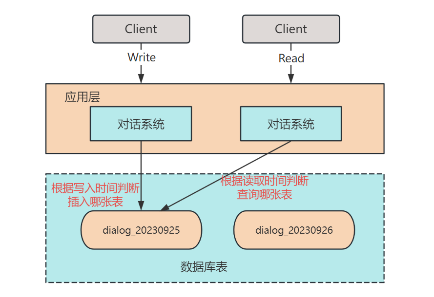
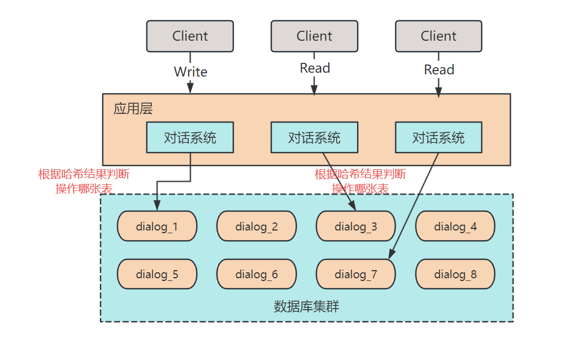

## 1. 引言

### 为什么企业招不到人，求职者也说找不到工作？

前段时间公司的师兄在面试候选人之后，发出了这样感慨：2023 年，企业太难招到人了！

而同时，脉脉（技术圈社交软件）上也是一片哀鸿，说今年互联网行情非常差。

图片来源：脉脉，侵删

也正如脉脉这位网友所言，现在做普通业务的后台开发基本都是 **CRUD（数据库 “增删改查” 的意思，形容没有技术含量的活）**，正常情况下很少涉及高并发、海量数据的实践场景。

毕竟，技术服务于业务，如果你的业务每天就几百人使用，咱搞个能抗几千万并发的系统又有什么意义呢？

**性价比不高！**

但是，这些企业 HR 能不知道吗？企业面试官也不是傻子，天天在简历和面试上挑挑拣拣的，也耽误时间。有这功夫，不如在工位多摸一会鱼，不香吗？

所以啊，**你用没用过，和你知不知道是两个概念**。面评里一般会有几个等级的打分，分别是：

* 差：和简历完全不符，怀疑简历造假。
* 中：可以略答一二，但核心要点说不清楚。
* 良：可以说清楚，但实践不足。
* 优：逻辑清晰，表达精准，实践丰富。

但是，有面评的前提是：**你得通过简历**。

如果你的简历全是 CRUD，那面试官根本不会想和你聊！

所以，为了摆脱 CRUD-candidate 的身份，今天小❤和大家聊一聊数据量增长和高并发带来的数据库问题以及如何解决。

### 1.2 用户激增，怎么破？

当用户量和数据量激增时，对于 MySQL 这样的关系型数据库管理系统，如何有效地应对**高并发、高性能**成了工程师们一项重要的任务。

在这篇文章中，我们将探讨两种常见的数据库架构设计策略：MySQL 的拆表（Sharding）和分片（Table Partitioning）。

这两种策略都旨在应对数据规模的增大以及高并发访问的问题，但它们各有特点，适用于不同的场景和需求。

**本文将通过深入拆表和分片的原理、应用场景以及优缺点，为大家揭示如何在面对不断增长的数据和流量时，保持数据库的高性能和可用性。**

无论您是一名数据库工程师、开发人员，还是对数据库架构设计感兴趣的读者，本文都将为您提供有价值的见解，帮助您更好地应对数据库扩展的挑战。

而且，数据库扩展是架构设计绕不开的一项重要话题，更是简历和面试中合理 Zhuangbility 的要点内容。

**低投入，高回报，性价比极高！**

接下来让我们一起深入探讨 MySQL 拆表和分片，为构建可靠的系统架构铺平道路吧~~

## 2. 拆表

**拆表**是一种常见的数据库分割技术，通常用于解决单表数据量过大、查询性能下降以及维护困难等问题，下面是拆表的一些场景及其优缺点。

### 什么时候拆表？

1. **大数据量表**：拆表适用于那些包含大量数据的表，例如日志表、历史数据表、交易记录表等。当单个表的数据量已经超过数据库服务器的处理能力时，拆分成多个子表可以提高查询性能。
2. **数据分区**：某些应用需要按照时间、地理位置等维度对数据进行分区存储，以便更有效地管理和查询数据。拆表可以将不同分区的数据存储在不同的子表中，提高数据管理的效率。
3. **权限控制**：在某些情况下，不同用户或应用程序需要访问相同表的不同数据集。通过拆分表，可以更容易地实现数据的权限控制。

### 怎么拆表？

假设有一个 ChatGPT 人机对话系统，其中有一个对话表，每个对话包含多条对话句子。

在对话表 `dialog` 有一问一答两条数据：

| dialog_id | user_id | sentence_id | content              | role   | state      | created_at |
| --------- | ------- | ----------- | -------------------- | ------ | ---------- | ---------- |
| 1         | 1       | 1           | 你好啊，你叫什么名字 | prompt | unfinished | 2023-09-25 |
| 1         | 1       | 2           | 我叫 xin猿意码       | answer | unfinished | 2023-09-26 |

可以发现，数据库的 dialog_id、user_id、state 等信息重复冗余了。当数据量增多时，类似的数据不仅会大量浪费磁盘空间，还会在查询时影响整体性能，所以我们可以将其拆为两个表：

`dialog` 对话表

| dialog_id | user_id | state      |
| --------- | ------- | ---------- |
| 1         | 1       | unfinished |

`sentence` 对话句子表

| dialog_id | sentence_id | content              | role   | created_at |
| --------- | ----------- | -------------------- | ------ | ---------- |
| 1         | 1           | 你好啊，你叫什么名字 | prompt | 2023-09-25 |
| 1         | 2           | 我叫 xin猿意码       | answer | 2023-09-26 |

这只是个相对简单的拆表例子，还有一些拆表可能根据用户，或者时间来拆表。

比如，对于时间敏感的查询业务，可以将主表按年、月、日来拆为多个表，以提升查询性能。

### 拆表的好处

1. **提高查询性能**：拆表可以将大表拆分成多个较小的子表，从而加快查询速度。查询只需要针对特定子表进行，减少了扫描的数据量。
2. **灵活性**：拆表可以根据不同的业务需求进行定制，例如按时间、地理位置、用户等维度进行拆分，提高数据管理的灵活性。
3. **维护和备份**：拆表可以使备份和维护更加容易，可以单独备份和维护每个子表，而不影响其他子表的正常运行。

### 拆表的坏处

1. **复杂性**：拆表需要额外的管理和维护工作，包括数据迁移、查询路由、子表之间的关联等。增加了系统复杂性。
2. **查询路由**：在查询时需要确定查询应该路由到哪个子表，这可能需要额外的路由逻辑和代码。
3. **跨子表查询**：如果查询需要涉及多个子表的数据，可能需要更复杂的 SQL 查询语句和逻辑。
4. **数据一致性**：在拆表的环境下，确保数据一致性可能会更加复杂，需要额外的措施。

综合考虑，拆表是一种有效的数据库性能优化方法，但需要根据具体的业务需求和数据特点来决定是否采用，以及如何进行拆表设计。

## 3. 分片

**分片** 是将大型数据库分成多个小片段的方法，每个片段独立运行。

使用分片场景包括：

- **高并发写入**：当一个表需要频繁进行插入、更新或删除操作，可能会导致锁竞争和性能下降。通过拆分表，可以将写入操作分散到多个分片，减轻锁竞争，提高并发性能。
- **多租户系统**：在多租户系统中，不同租户的数据可以存储在不同的分片中，确保数据隔离。

分片也需要考虑数据一致性和查询路由的问题。通常，分片数据库需要一个中心控制节点来管理数据分布和查询路由。

比如，在上述 `dialog` 表例子上，我们用 `user_id` 作为哈希键分片。

具体做法为：把数据的 `user_id` 对数据分片数量取余，假设我们一共有 8 个分片，`user_id` 为 10 时，就将该数据插入 `dialog_2` 的分片中（10%8 = 2）。

查询时也是先哈希，再去对应的分片上查找数据，以此减少每个分片的数据量，提升数据库的响应速度，分片的优缺点如下。

### 分片的好处

1. **水平扩展**：分片允许数据库系统水平扩展，通过添加更多的分片来增加存储容量和吞吐量。
2. **高并发**：每个分片可以并行处理写入操作，减少锁竞争，提高并发性能。
3. **数据隔离**：不同分片之间的数据相互隔离，有助于保持数据的完整性和隐私性。

### 分片的坏处

1. **复杂性**：分片增加了系统的复杂性，包括数据路由、分片键选择、数据迁移等方面的管理工作。
2. **跨分片查询**：在跨越多个分片的查询中，需要合并和聚合数据，可能导致性能下降。
3. **数据一致性**：确保跨分片数据的一致性是一个挑战，可能需要实施额外的措施。

看到这里，大家可能有点疑惑。对于数据量的增加，拆表和分片都可以起到一定的作用，也都会出现数据一致性问题，那他们的区别是啥呢？

别急，接着往下看。

## 4. 拆表 VS 分片

MySQL的拆表和分片都是用于处理大规模数据的技术，但它们的应用场景和方式有所不同，以下是它们的联系和区别。

### 相同点

1. **处理大规模数据**：拆表和分片都是为了应对数据量巨大的情况而设计的。它们可以提高数据库系统的性能和扩展性，以应对高并发和大量数据存储需求。
2. **水平扩展**：拆表和分片都支持水平扩展，允许将数据分布在多个物理存储位置上，以分摊负载并提高性能。

### 不同点

#### 应用场景不同

- **拆表**：通常在单一表中存储的数据量已经非常庞大，难以继续扩展或查询性能下降时，考虑拆分表。拆表是将单一表按照某种规则或逻辑分割成多个较小的表，通常是为了**提高查询性能或简化数据管理**。每个拆分的表通常保留原表的一部分数据。
- **分片**：适用于整个数据库的数据量已经无法容纳在一台服务器上，或者需要跨多台服务器水平扩展的情况。分片是将数据库中的数据按照某种规则或策略分布到多个物理服务器上，每个服务器称为一个分片。**分片通常是为了提高整体系统的性能、可用性和扩展性**。

#### 数据分布方式不同

- **拆表**：拆表是在逻辑上将数据拆分为多个表，但这些表通常仍然存储在同一个数据库实例中。各个表之间可能存在关联关系，但它们在同一数据库中。
- **分片**：分片是将数据分布到多个物理服务器上，每个服务器上都有自己的数据库实例。各个分片之间通常是独立的，可以在不同的服务器上运行。

#### 管理复杂度不同

- **拆表**：相对于分片，拆表的管理复杂度较低，因为所有数据仍然在同一个数据库中。但需要注意表之间的关联和查询性能。
- **分片**：分片可能涉及到跨多个服务器的数据同步、故障恢复、路由管理等复杂问题，管理上相对复杂一些。

#### 查询方式不同

- **拆表**：查询通常需要在多个表之间进行联合或使用应用程序逻辑来合并结果，查询性能可能会因此受到一定影响。
- **分片**：分片系统通常具有路由层，负责将查询路由到正确的分片上，因此查询通常更为直接和高效。

综上所述，拆表和分片都是用于处理大规模数据的技术，但在**应用场景、管理复杂度、数据分布方式和查询方式**等方面存在差异。

选择哪种技术取决于具体的需求和系统架构，一般情况下，应对高并发和海量数据，分片拆表（又叫分库分表）都会用到。

### 数据一致性问题

拆表和分片都可能引入数据一致性问题，但问题的性质和解决方法有所不同。

#### 拆表的数据一致性问题

还以上述的对话表举例，原始的 `dialog` 表是一个单一的表，每个对话项都以对话 ID 关联。

现在，为了优化查询性能，决定将对话表拆分为两个表：`dialog` 和 `sentence` 表。

在这种情况下，数据一致性问题可能出现在以下情况下：

- 当向 `dialog` 表插入新对话时，如果在插入 `sentence` 之前发生了错误，可能导致对话主表和对话句子表之间的数据不一致。
- 当从 `dialog` 表删除对话时，如果在删除相关的对话句子之前发生了错误，也可能导致数据不一致。

解决这些问题的方法通常包括使用**事务或一致性哈希**等技术来确保数据操作的原子性。如果数据一致性对业务非常重要，建议使用数据库事务来处理这些操作。

> 不了解事务的朋友可以看我之前的这篇文章，解锁MySQL的黑科技：事务与隔离

#### 分片的数据一致性问题

假设有一个社交媒体应用程序，用户数据表存储了全球 10 亿用户的数据，现在决定将用户数据分片到不同的数据库服务器上，以提高性能。

分片的方式可能是**按用户 ID 的范围进行划分，每个分片负责一定范围内的用户数据**。

在这种情况下，数据一致性问题可能出现在以下情况下：

- 当用户在不同分片之间进行互动（例如，用户 A 在分片 1 上，用户 B 在分片 2 上）时，需要确保跨分片的操作具有一致性。
- 如果一个分片的服务器发生故障，需要确保用户数据可以迁移到其他分片而不丢失或破坏。

解决这些问题的方法通常包括使用**分布式事务或一致性哈希**等分片技术。例如，可以使用分布式事务来确保跨分片的操作是原子性的，或者使用数据复制和备份来确保故障恢复。

总之，拆表和分片都可能引入数据一致性问题，但可以通过适当的技术和设计来解决这些问题，以确保数据的完整性和一致性。

## 5. 小结

MySQL 拆表和分片的设计策略，为应对不断增长的数据和高并发访问提供了可行的解决方案，同时也伴随着各自的优势和挑战。

拆表，像一位精巧的工匠，把复杂的数据库切割成可管理的小块，为数据的水平扩展提供了坚实的基础。

而分片，似一位智慧的园丁，将数据按照规则有序地分类，使得数据库的维护和查询更加高效。

**但是，无论是选择拆表还是分片，都需要根据实际需求和场景来进行权衡和决策。**

本文我们剖析了这两种策略的内部工作原理，还深入探讨了它们的使用场景、优点和限制。通过这些知识，相信屏幕前的你已经对如何更好地构建和维护 MySQL 数据库有了更清晰的认识。

无论您是一名数据库专业人士，还是对技术探索充满激情的读者，都希望这篇文章能为您带来价值和启发。

如果您觉得本文对您有所帮助，请不吝点赞、关注，也欢迎分享给更多的人。技术的进步离不开分享和交流，我是小❤，我们下期再见！