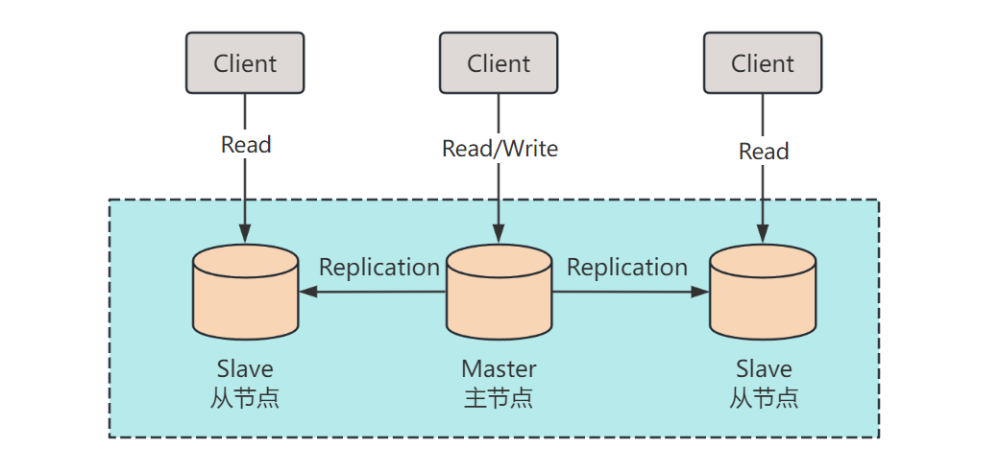
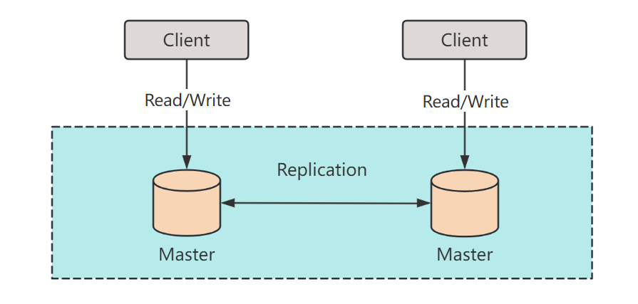

数据库是许多应用的核心，而 MySQL 作为一款流行的关系型数据库，高可用性是确保数据安全与稳定的关键。

在这篇文章中，我们将深入讨论MySQL高可用性的几种关键技术，包括主从复制、主主复制、非规范化以及 SQL 调优。

## 主从复制

**主从复制** 是MySQL中常用的高可用性技术之一。它的基本原理是将主数据库的变更同步到多个从数据库上。

这种架构的使用场景包括：

- **读写分离**：主数据库用于写操作，从数据库用于读操作，分担读请求，提高性能。
- **备份**：从数据库可以用于数据备份，而不干扰主数据库的正常运行。

然而，主从复制也存在一些缺点，如复制延迟和单点故障。

在**复制延迟**方面，由于同步需要时间，从数据库的数据可能比主数据库稍有滞后。

在**单点故障**方面，如果主数据库宕机，需要手动切换到从数据库，可能会导致一段时间内的数据不一致。

## 主主复制

**主主复制** 是一种双向数据同步的方法，两个数据库既可以作为主数据库又可以作为从数据库。

这种架构的使用场景包括：

- **高可用性**：由于有两个主数据库，即使一个宕机，另一个仍然可用。
- **负载均衡**：可以将读写请求分布到两个主数据库上，提高性能。

然而，主主复制也存在一些复杂性，如数据冲突解决和配置管理。

在主主复制中，需要仔细处理**数据冲突**，以免数据不一致。此外，维护两个主数据库的配置也需要一定的管理工作。

## 非规范化

**非规范化** 是将数据存储在冗余或冗长的结构中的方法，以提高查询性能。这种架构的使用场景包括：

- **读写性能优化**：在需要频繁查询的情况下，可以将冗余数据存储在表中，减少连接操作，提高查询性能。
- **报表生成**：为了加快报表生成速度，可以将报表所需的数据预先计算和存储在表中。

其优缺点如下：

- **优点**：
  1. **查询性能**：非规范化可以显著提高查询性能，减少连接操作。
  2. **报表生成**：对于需要频繁生成报表的系统，非规范化可以加速报表生成过程。
- **缺点**：
  1. **数据一致性**：非规范化可能导致数据不一致，需要额外的维护工作来保持数据一致性。
  2. **存储空间**：冗余数据可能占用更多的存储空间。
  3. **维护复杂性**：非规范化后，维护数据的复杂性增加，需要确保冗余数据的正确性。

然而，非规范化也会增加数据的冗余，并增加数据维护的复杂性。在使用非规范化时，需要权衡性能和数据维护成本。

## SQL调优

最后，**SQL调优** 是确保数据库高可用性的关键一步。通过优化查询语句和索引设计，可以显著提高数据库性能。使用场景包括：

- **高性能**：合理的SQL查询和索引设计可以加快查询速度。
- **慢查询**：当数据库中存在慢查询时，需要对SQL语句进行优化，以提高查询性能。
- **资源节约**：优化查询可以减少服务器资源的消耗。

在进行SQL调优时，需要深入了解数据库的查询执行计划，并根据实际情况进行调整。

优缺点如下：

- **优点**：
  1. **性能提升**：SQL调优可以显著提高查询性能，降低查询时间。
  2. **资源利用**：通过优化查询计划，可以更有效地利用数据库资源。
- **缺点**：
  1. **复杂性**：SQL调优可能需要深入理解数据库系统的内部机制，对于复杂查询和大型数据集来说，可能较为复杂。
  2. **时间消耗**：SQL调优可能需要大量的时间和精力，特别是在处理复杂查询时。

总结来说，MySQL高可用性技术包括主从复制、主主复制、联合、分片、非规范化和SQL调优。

每种技术都有其使用场景和优缺点，选择合适的技术取决于具体的需求和约束。希望这篇文章能够帮助你更好地理解MySQL高可用性，为你的数据库架构设计提供一些启发。

如果你对这些技术有更多疑问或需要进一步的解释，请随时联系我，我将竭诚为你解答。