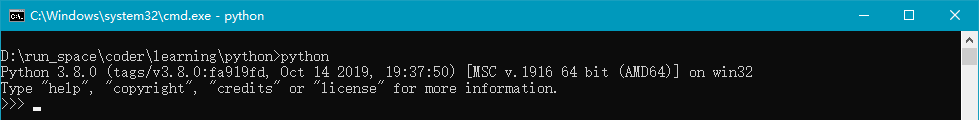

目录

> 1. 背景
> 2. 下载与安装
> 3. 第一个Python程序
> 4. Python数据类型


## 1. 背景

### 1.1 最近动向

最近，由于工作需要，把多年之前看过一点点的 Python 拾起来重新系统学习一遍。并且还一直在做项目，所以更新就比较慢了。

其实相比 Java 和 Golang，Python 在数据分析和数据标注等场景下更为常用。并且，如今大模型如火如荼，当 OpenAI 发布 GPT3.5 之后，国内大厂和中小厂都纷纷入局，公众号里推广 GPT 星球的人也越来越多了。

都在探索！

做商业化的恨不得立马变现，做大模型的恨不得立马反超 GPT4，做公司的恨不得立马融资上市超过 BATTMD。

其实没那么简单！

如今 AIGC 和 GPT 确实是人工智能领域的大方向，一如之前的元宇宙。不过，比元宇宙好得多，OpenAI 已经把 GPT 的大方向探索好了，现在就缺一些契机，如果谁能先找到商业化方向并抢占市场，谁就有可能是下一个“BAT”。

说了这么多，还得沉下心来学习，不能被这些概念和技术迷失了眼，毕竟：先保住饭碗，再寻求发展。并且，2023 年的风口非人工智能（AI）莫属，而 AI 领域中最不可或缺的编程语言就是 Python，所以 Python 还得学。


### 1.2 Python简介

Python，是 `Guido van Rossum` 在 1989 年圣诞节为了打发无聊的时光，而编写的一门高级编程语言。同样滴，大家无聊的时候都干什么呢？笑 :)

Python 如今在市场占有率上，是稳坐前 10，据市场研究报告，2022 年 10 月份，Python 在编程界的占有率为 15%+。而且，在 2023 年 4 月的 TIOBE 编程语言排行榜中，Python 是最受欢迎的编程语言！紧随其后是 C、Java 等。

**Python 可以做什么？**

做自动化任务，比如自动备份你的游戏数据；可以做网站，很多著名的网站包括 YouTube（油管）就是 Python 语言写的；可以做 AI 相关的很多事情，比如 NLP 任务等等。

而且，Python 不仅可以编程做软件，还可以用在数据分析、数据统计、数据标注等领域。

**Python 的优势**

Python 为我们提供了非常完善的代码库，所以我们写程序时可以随取随用，代码十分精简。完成一个任务时，C 语言要写 1000 行代码，Java 只需要 100 行，而 Python 可能只用 20 行就能实现。

所以 Python 是一种相当高级的语言。理论上来说，越高级的语言，我们入门的成本越低，上手也比较快。

**Python 的劣势**

这时，聪明的同学可能就开始问了：那既然 Python 这么好，为什么还需要其它语言呢？

是的，Python 也有它不会的地方，也有它的局限性。比如写操作系统，这个只能用 C 语言写；写手机应用，只能用 Swift/Objective-C（iPhone）和 Java（Android）；写 3D 游戏，最好用 C 或 C++；写高并发的应用软件，最好用 Golang。

而且 Python 的运行时间比 C/C++/Java 都要慢，在性能敏感的程序上，Python 显然不是一个最好的选择。

那么，这门如今最受环境的语言，究竟有哪些魔力，让大家宁愿舍弃一部分性能，也要选择它呢？


## 2. 下载与安装

Python 是一门跨语言的平台，可以运行在主流的任意操作系统上，比如：Windows、Mac 和 Linux/Unix 等。跨平台是指，你在 Windows 上写的 Python 程序，可以直接放到 Linux 环境上运行，完全 OK。

要入手 Python，你得先在电脑上安装一个 Python 解释器（负责翻译 Python 代码），以及命令行交互环境（现在，Windows 上都自带了 cmd 命令行工具，Mac 上更为方便）。

### 2.1 Python版本

目前，Python 有 2.x 和 3.x 两种版本，其中 3.x 版本更为普及，所以我们采用 Python3.8 版本为基础，开始以下步骤。

#### 1）Windows安装

首先，根据你的 Windows 版本（64位还是32位）从 Python 的官方网站下载 Python 3.8 对应的[64位安装程序](https://www.python.org/ftp/python/3.8.0/python-3.8.0-amd64.exe)或[32位安装程序](https://www.python.org/ftp/python/3.8.0/python-3.8.0.exe)，然后，运行下载的 exe 安装包：


注意，需要勾选上 `Python3.8 to PATH` 的选项，以保证安装完成后可以自动配置环境变量（图中显示是 Python3.5，不用理会）。

#### 2）Mac安装

如果你正在使用 Mac，系统是 OS X>=10.9，那么系统自带的 Python 版本是2.7。要安装最新的 Python 3.8，有两个方法：

方法一：从 Python 官网下载 Python 3.8 的[安装程序](https://www.python.org/downloads/)，下载后双击运行并安装；

方法二：如果安装了 [Homebrew](https://brew.sh/)，直接通过命令`brew install python3`安装即可。


## 3. 第一个Python程序

> 环境：Windows10、Python3.8

### 3.1 Python 交互模式

首先，我们通过 `win+R` 快捷键打开运行窗口，在窗口里输入 `cmd` 命令进入命令行模式。然后在命令行模式中输入 `python`，进入 Python 的交互模式下：



在交互模式的提示符 `>>>` 下，直接输入代码，按回车键，就可以得到代码的执行结果了。现在，我们试试输入第一个程序：

``` python
>>> print('hello, world')
```

执行结果：


### 3.2 命令行模式

Python 代码文件的后缀是 `.py`，我们可以新建一个名为 `hello.py` 的文件：


文件内容是 `print(100+200)`，即计算 100+200 的结果，打印出来。

这时，如果我们想要执行这个 `.py` 文件，就需要用 `exit()` 先退出交互模式，再执行文件代码。注意：检查一下当前目录是否为文件所在的目录：


### 3.3 直接运行.py文件

在 Mac 和 Linux 上可以直接运行 `.py` 文件，但需要先在 `.py` 文件第一行加注释：

``` python
#!/usr/bin/env python3

print('hello, world')
```

然后，通过命令给`hello.py`以执行权限：

``` shell
$ chmod a+x hello.py
```

就可以直接运行`hello.py`了，比如在Mac下运行：


Python 在代码编写时，没有大括号约定代码块的边界，而是用缩进来组织，默认为 4 个空格，比如以下 Go 语言的代码：

``` go
if a>0 {
    print("a>0")
}
```

而在 Python 里面，是没有大括号的，但需要**前面缩进 4 个空格**：

``` python
if a>0:
    print('a>0')
```


## 4. Python数据类型

### 4.1 整数、浮点数