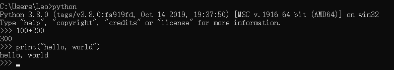
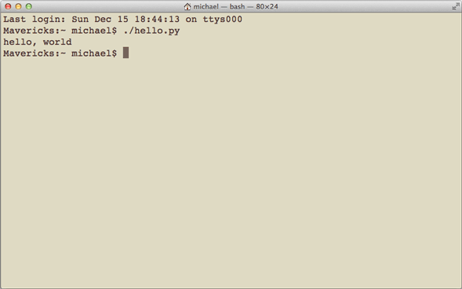

目录

> 1. 背景
> 2. 下载与安装
> 3. 第一个Python程序
> 4. Python数据类型
> 5. 基本操作
> 6. 小结


## 1. 背景

### 1.1 最近动向

最近，由于工作需要，把多年之前看过一点点的 Python 拾起来重新系统学习一遍。并且还一直在做项目，所以更新就比较慢了。

其实相比 Java 和 Golang，Python 在数据分析和数据标注等场景下更为常用。并且，如今大模型如火如荼，当 OpenAI 发布 GPT3.5 之后，国内大厂和中小厂都纷纷入局，公众号里推广 GPT 星球的人也越来越多了。

**都在探索！**

做商业化的恨不得立马变现，做大模型的恨不得立马反超 GPT4，做公司的恨不得立马融资上市超过 BATMD。

其实没那么简单！

如今 AIGC（AI generated content，生成式 AI）和 GPT 确实是人工智能领域的大方向，一如之前的元宇宙。不过，比元宇宙好得多，OpenAI 已经把 GPT 的大方向探索好了，现在就缺一些契机，如果谁能先找到商业化方向并抢占市场，谁就有可能是下一个“BAT”。

说了这么多，还得沉下心来学习，不能被这些概念和技术迷失了眼，毕竟：先保住饭碗，再寻求发展。但是，2023 年的风口非人工智能（AI）莫属，而 AI 领域中最不可或缺的编程语言就是 Python，所以 Python 还得学。


### 1.2 Python简介

Python，是 `Guido van Rossum` 在 1989 年圣诞节为了打发无聊的时光，而编写的一门高级编程语言。同样滴，大家无聊的时候都干什么呢？笑 :)

Python 如今在市场占有率上，稳坐前 3 并隐隐有占据第一的势头。据市场研究报告，2022 年 10 月份，Python 在编程界的占有率为 15%+，已经超越了 C 语言和 Java。并且，在 2023 年 4 月的 TIOBE 编程语言排行榜中，Python 是最受欢迎的编程语言！紧随其后是 C、Java 等。

**Python 可以做什么？**

可以做数据分析，比如 Python 实现股票的自动化买入和卖出；可以做网站，很多著名的网站包括 YouTube（油管）就是 Python 语言写的；可以做 AI 相关的很多事情，比如 NLP 任务等等。

而且，Python 不仅可以编程做软件，还可以用在数据分析、数据统计、数据标注等领域。

**Python 的优势**

Python 为我们提供了非常完善的系统库，我们写程序时可以随取随用，让代码十分精简。比如，完成一个简单的定时任务，C 语言要写 1000 行代码，Java 只需要 100 行，而 Python 可能只用 20 行就能实现。

所以 Python 是一种相当高级的语言。理论上来说，越高级的语言，我们入门的成本越低，上手也比较快。


## 2. 下载与安装

Python 是一门**跨平台的语言**，可以运行在主流的任意操作系统上，比如：Windows、Mac 和 Linux/Unix 等。跨平台是指，你在 Windows 上写的 Python 程序，可以直接放到 Linux 环境上运行，完全 OK。

要入手 Python，你得先在电脑上安装一个 Python 解释器（负责翻译 Python 代码），以及命令行交互环境（现在，Windows 上都自带了 cmd 命令行工具，Mac 上更加方便，所以 mac 是学 Python 的最佳利器。如果你没有 mac，那也别慌，工具只是一个非必要条件，Windows 系统上学 Python 是一样的。

### 2.1 Python版本

目前，有 Python2 和 Python3 两种版本，自 2020 年 1 月 1 日以来，Python 官方已经停止了 Python2 的更新，所以我们采用 Python3 版本进行学习，下载地址：

> Python下载地址：https://www.python.org/downloads/
> Python文档下载地址：https://www.python.org/doc/


#### 1）Windows安装

首先，根据你的 Windows 版本（64位还是32位）从 Python 的官方网站下载 Python 3.8 对应的[64位安装程序](https://www.python.org/ftp/python/3.8.0/python-3.8.0-amd64.exe)或[32位安装程序](https://www.python.org/ftp/python/3.8.0/python-3.8.0.exe)，然后，运行下载的 exe 安装包：


注意，需要勾选上 `Python3.8 to PATH` 的选项，以保证安装完成后可以自动配置环境变量（图中显示是 Python3.5，不用理会）。

#### 2）Mac安装

如果你正在使用 Mac，系统是 OS X>=10.9，那么系统自带的 Python 版本是2.7。要安装最新的 Python 3.8，有两个方法：

方法一：从 Python 官网下载 Python 3.8 的[安装程序](https://www.python.org/downloads/)，下载后双击运行并安装；

方法二：如果安装了 [Homebrew](https://brew.sh/)，直接通过命令`brew install python3`安装即可。


### 2.2 IDE 工具

Python 编码常用的工具有 PyCharm 和 VsCode：

> PyCharm下载地址：https://www.jetbrains.com/pycharm/download/
>
> VsCode下载地址：https://code.visualstudio.com/download

由于之前写 Go 时用过 VsCode，所以我们之后的文章都用 VsCode 来编写 Python 代码。首先，安装 VsCode：


安装完成后下载常用的插件：

#### 1）chinese 中文简体语言包：


安装完成后重启即可。


#### 2）编辑器主题

> **建议浅色系对眼睛友好**
>
> 管理 -> 颜色主题 -> 选择自己喜欢的主题即可


#### 3. icon 显示代码文件图标：


设置主题：


安装完成后，文件图标就出来了：


其它插件可根据需要安装：如 `open in brower`，通过编辑器直接打开默认浏览器；`Live Server`，开启本地服务器；`carbon-now-sh`，将代码生成一张图片；`prettier`，化代码格式等等。


## 3. 第一个Python程序

> 环境：Windows10、Python3.8、VsCode

### 3.1 Python 交互模式

首先，我们通过 `win+R` 快捷键打开运行窗口，在窗口里输入 `cmd` 命令进入命令行模式。然后在命令行模式中输入 `python`，进入 Python 的交互模式下：


在交互模式的提示符 `>>>` 下，直接输入代码，按回车键，就可以得到代码的执行结果了。现在，我们试试输入第一个程序：

``` python
>>> print('hello, world')
```

执行结果：




### 3.2 IDE 模式

打开 VsCode，新建一个名为 `hello.py` 的文件，输入：


文件内容是 `print(100+200)`，即计算 100+200 的结果，打印出来。点击运行 Python 文件，即在控制台打印出结果为 300.


### 3.3 直接运行.py文件

在 Mac 或 Linux 上可以直接运行 `.py` 文件，但需要先在 `.py` 文件第一行加注释：

``` python
#!/usr/bin/env python3

print('hello, world')
```

然后，通过命令给`hello.py`以执行权限：

``` shell
$ chmod a+x hello.py
```

就可以直接运行`hello.py`了，比如在Mac下运行：



Python 在代码编写时，没有大括号约定代码块的边界，而是用缩进来组织，默认为 4 个空格，比如以下 Go 语言的代码：

``` go
if a>0 {
    print("a>0")
}
```

而在 Python 里面，是没有大括号的，但需要**前面缩进 4 个空格**表示代码块：

``` python
if a>0:
    print('a>0')
```


## 4. Python数据类型

### 4.1 整数、浮点数

Python 的整数和浮点数与其它语言比较类似，都是通过正常数字表达。但 Python 允许我们在数字中加下划线 `_` 分隔很大的数，比如：十进制 10_000_000_000，十六进制也可以 0xa5b3_c3d。

并且，Python 的整数和浮点数都没有大小限制，但是超过一定范围后（比如：计算机的位数不足以表示这个数）就直接表示为 `inf`（无限大）。


### 4.2 字符串

Python 中的字符串用单引号 `''` 表示，比如 `'Hello World'`。

当字符串内部既包含 `'` 又包含 `"` 时，可以用转义字符 `\` 来标识引号，比如：

``` python
'I\'m\"OK\"!', 即：I'm "OK"!
```

Python 还用了 `r''` 表示 `''` 内部的字符串默认**不转义**：

``` python
>>> print('\\t\\') #转义时
\    \
>>> print(r'\\\t\\') #不转义时
\\\t\\
```

如果字符串内部有很多换行，用 `\n` 写在一行不好阅读，可以用 `'''...'''` 的格式**表示多行内容**：

``` python
>>> print('''line1
...line2
...line3''')
line1
line2
line3
```

多行字符串 `'''...'''` 还可以在前面加上 `r` 使用，转义符会失效，但 `'''...'''` 生效了：

``` python
>>> print(r'''hello,\n
...world''')
hello,\n
world
```


### 4.3 布尔值与空值

Python 用  `True/False` 来表示布尔：

``` python
>>> True
True
>>> False
False
>>> 3 > 1
True
>>> 3 > 4
False
```

布尔值可以用与、或和非（`and`、`or`和`not`表示）运算：

``` python
>>> True and True
True
>>> True and False
False

>>> True or True
True
>>> True or False
True

>>> not False
True
>>> not 1 > 2
True
```


==空值==

和 Java 中的 `null`、Go 语言中的 `nil` 一样，Python 用 `None` 来表示空值。

``` python
print(False==None)
```


### 4.4 变量与常量

变量不仅可以是数字，还可以是任意数据类型。变量在程序中用变量名表示，**变量名**必须是大小写英文、数字和 `_` 的组合，且不能用数字开头，比如：

``` python
a = 1
t_007 = 'T007'
Ans = True
```

注意：和其它固定类型不同，**Python 中的变量名可以反复赋值，而且可以是不同数据类型的变量**：

``` python
a = 123
print(a)
a = 'ABC'
```

像 Python 这种变量本身类型不固定的语言称之为*动态语言*，与之对应的是*静态语言*。静态语言在定义变量时必须指定变量类型，如果赋值的时候类型不匹配，就会报错。例如 Go 就是静态语言，赋值语句如下（// 表示注释）：

``` go
a := 100 // a被定义为整数类型变量
a = "abc" // 报错：不能把字符串赋给整型变量
```

与 Go、Java 等静态语言相比，Python 作为动态语言更灵活，就是这个原因。


### 4.5 list 和 tuple

#### list

和大多数语言一样，list 作为一个列表，表示多个元素组合：

``` python
books = ['Chinese', 'Math', 'English']
```

Python 作为动态语言，一个 list 中的元素可以是不同类型，比如：

``` python
l2 = ['Chinese', True, 123]
```

Python 提供了很多数组相关的函数，可以直接使用，如：

* len()，获取列表的元素个数；
* append，插入元素到列表的尾端；
* insert，插入元素到数组指定位置；
* pop，删除指定下标的元素，默认删除尾端元素。


#### tuple

tuple 元组是 Python 中独有的数据结构，表示一组不可变的元素：

``` python
classmate = ('zhangs', 'lis', 'wangw')
```

tuple 没有 append、insert、pop 这样的方法，也没有赋值操作。

**不可变的元组 tuple 的意义是：代码更安全。**

> Python官方说明：如果可能，能用 tuple 代替 list 就尽量用 tuple。


### 4.6 dict 和 set

#### dict

字典（dict）也叫 map，是存储键值对（key-value，简称 k-v）的数据结构，采用 hash 算法存储数据，具有极快的查找速度。

定义一个 dict，赋值：

``` python
d = {} # 存储名字和年龄的映射
d["zhangsan"] = 18
d["lisi"] = 19
```

或者：

``` python
d = {"zhangsan": 18, "lisi": 19}
```

当获取 dict 中的 value 值时，可以用 get() 方法：

``` python
d.get("zhangsan")
18
```

或者直接用：

``` python
d['zhangsan']
18
```

删除 key 时，用 pop(key) 方法。

Python 中使用 dict 需要注意的两点：

* 如果 key 不存在，d[key] 会报错；
* dict 中的 key 必须是不可变对象，如字符串、整型数等等，list 是可变的，所以不能作为 dict 的 key；


#### set

set 和 dict 类似，也是无序的数据结构，且重复元素会被自动过滤。

``` python
s = set([1, 2, 3, 1, 2])
print(s) # {1,2,3}
```

**set 可以理解为 dict 中的 value 为空的数据结构**，在其它语言里，比如 Go 语言里是不存在 set 类型的，要定义一组不重复的元素，只能用 dict 来做。

set 提供了很多操作元素的方法：

* add(key)，添加元素；
* remove(key)，删除元素；

和 dict 一样，set 内部不允许放入可变对象，如 list。


## 5. 基本操作

### 5.1 条件判断

和大多数编程语言一样，在Python 中，采用 if-else 来作为条件控制：

``` python
age = 3
if age >= 18:
    print('adult')
elif age >= 6:
    print('teenager')
else:
    print('kid')
```

和其它语言相比，Python 需要注意三点：

* 判断语句的冒号不能省略；
* Python 的条件判断代码块不用大括号 `{}` 装起来，而是以缩进代码块来判断（VsCode 中可以采用 tab 键和 shift+tab 键调节缩进）；
* 新增 `elif` 代替 else if 语句。


### 5.2 循环

Python 有两种循环 `for` 和 `while`。

#### for 循环

循环打印列表里的元素：

``` python
names = ['b', 'a', 'c']
for name in names:
    print(name)
```

打印出 1+2+...+100 的和：

``` python
sum = 0
for x in range(101):
    sum = sum+x
print(sum) #5050
```

>  Python 中自带的 range(n) 方法，可以生成列表 [1, 2, ..., n-1]


#### while 循环

只有条件满足，就不断循环，只到不满足条件时退出。比如计算 100 以内的所有奇数之和：

``` python
sum = 0
num = 99
while num>0:
    sum = sum+num
    num = num-2
print(sum)
```


#### break 和 continue

和其它语言的循环类似，Python 也提供了 `break` 和 `continue` 关键字用来控制循环：

``` python
d = ["zhangsan", "lisi", "wangwu"]
for name in d:
    if name == "lisi"":
    	print(name)
        break # 找到对应的元素就退出循环
```

打印结果：

> lisi

和 break 不同，continue 只是跳过当前循环：

``` python
d = ["zhangsan", "lisi", "wangwu"]
for name in d:
    if name == "lisi"":
    	continue
    print(name)
```

打印结果：

> zhangsan
>
> wangwu


#### 利用循环开发一个猜数字游戏

游戏说明：随机生成一个 0-100 的数，参与者最多可以猜 5 次，看能否猜出随机数是多少。

参考代码：

``` python
# _*_ coding: utf-8 _*_

import random
num = random.randint(0,100)
x = 0
n1 = 0 #记录猜的最近数
n2 = 100 #记录猜的最近数的距离

while x<5:
    x = x+1
    n = int(input('随机输入一个数：'))
    if n == num:
        print('你真聪明，只用了%d次就猜对了，答案是%d'%(x, num))
        break
    elif n>num:
        print('太大了！')
        if n-num<n2:
            n2 = n-num
            n1 = n
    else:
        print('太小了！')
        if num-n<n2:
            n2 = num-n
            n1 = n        
print('都猜错了！答案是%d，你猜的数%d很接近了，下次努力！'%(num,n1))
```


## 6. 小结

Python 是一门应用非常广泛的编程语言，在数据分析、web 开发上都非常方便。这时，聪明的同学可能就开始问了：那既然 Python 这么好，为什么还需要其它语言呢？

是的，Python 也有它不会的地方，也有它的局限性。比如写操作系统，这个只能用低级语言写；写手机应用，只能用 Swift/Objective-C（iPhone）或 Java（Android）；写 3D 游戏，最好用 C 或 C++；写高并发的云计算软件，最好用 Golang。

而且 Python 的运行时间比 C/C++ 都要慢，在性能敏感的程序上，Python 显然不是一个最好的选择。

那么，这门如今最受欢迎的语言之一，究竟有哪些魔力，让大家宁愿舍弃一部分性能，也要选择它呢？

当你和我一样学完 Python 入门篇，你就明白了，敬请期待《Python 入门篇（中）》！