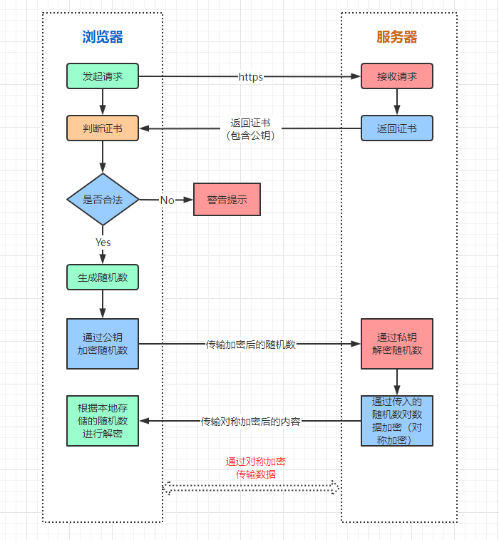

目录

> 1. 引言
> 3. web服务端开发
> 4. Django网站框架
> 6. 总结


## 1. 引言

### 1.1 函数定义与调用

和别的语言一样，函数是一个完整的代码块，用于实现特定的任务，Python 定义函数用 `def` 关键字。

学完了 Python 入门的上中篇内容【时光机：Python入门篇（上）、Python入门篇（中）】，接下来是使用场景最为广泛的 Web 开发知识。


2.web服务端开发

了解 web 开发之前，我们先来熟悉一下什么是 CS（Client-Server）客户端编程。

最开始，互联网还没有那么广泛时，基本都是 Client-Server 架构，即每个互联网应用都是一个软件包。比如：QQ客户端、微信客户端等。

后来，由于应用程序的更新升级非常迅速，3 天一小版本，5 天一大版本，频繁升级，让用户很不开心。因此，软件开发者就开始想办法，不然这么玩下去应用得凉，于是如今很流行的 BS（Browser/Server）架构上场了。

BS 架构最核心的点在于，应用程序还是部署在服务器上，但是访问它们只需要浏览器的 Web 页面来请求就可以了。这让用户们纷纷鼓掌欢迎，毕竟，电脑/手机装不了太多应用软件，但装个浏览器还是 So easy 的，何况在访问网页时还不需要频繁的升级软件。

现在，你应该已经了解 Web 开发的重要性了，Python 作为一门解释型脚本语言，开发效率很高，所以非常适合用来做 Web 开发。


Web通信

知道了我们现在流行的网络通信模式是 Web 通信（即 BS 架构），现在我们来了解一下 Web 通信的原理。

学过计算机网络的都知道（没学过也不要紧），浏览器和服务器的交互是通过 HTTP 网络协议来进行通信的。当我们在网页上输入一个网址，或者点击一个链接时，一个 HTTP 请求就从你的浏览器发送到了目标服务器。



这个是浏览器通过 HTTPs（= HTTP+数据加密+身份认证+完整性保护）协议访问服务器的过程，如图我们不难看出，所谓上网其实就是对网络资源的请求。

这个请求包括一个标识所需资源的唯一 URL，可以理解为网址，但在服务器中它是一个定义资源的路径。

比如 www.baidu.com 对应的百度公司的服务器中，可能映射了一个唯一的网络进程，当你在百度搜索框里输出要查询的内容时，请求就通过网络传输到了一台服务器上，服务器上的 Web 应用处理完请求后，就回复给浏览器一个 HTTP 响应信息。这个响应信息里面就包括了请求的状态（是否成功），请求的内容等。

随后，浏览器通过响应的内容，渲染出我们看到的搜索完成的页面，一次 HTTP（或 HTTPs）请求就结束了。


Python进行Web开发

说了这么多，那我们作为开发者，如何在服务器上部署自己的应用为用户提供网络服务呢？

别着急，Python 为我们提供了规范的接口，只需要实现一个标准的 HTTP 处理函数即可。首先，我们在电脑中随便选取一个目录，编写 `hello.py` 文件：

``` python
def application(env, start_resp):
    start_resp('200 OK', [('Content-Type', 'text/html')])
    return [b'<h1>Hello, Python Web</h1>']
```

然后在同一个目录下，再编写一个 `server.py` 文件，来启动服务器：

``` python
# 从wsgiref模块导入make_server包
from wsgiref.simple_server import make_server
# 导入我们自己编写的application函数
from hello import application

# 创建一个服务器，IP地址为空，端口是8000，处理函数是application
httpd = make_server('', 8000, application)
print('Serving HTTP on port 8000...')
# 监听HTTP请求
httpd.serve_forever()
```

这时候，我们通过 `cmd` 进入命令行，在刚才的文件目录下执行 `python server.py`，就启动好我们自己的服务器了：


当命令行打印 `Serving HTTP on port 8000...` 就代表服务启动成功了，如果启动失败，我们需要检查一下 `8000` 端口是否被其他程序占用，或者在 `server.py` 里面换一个端口再启动。


随后，我们打开任意浏览器，在地址栏输入 `127.0.0.1:8000`，就可以看到如下页面：


此时，属于我们自己的 BS 架构就完成搭建成功了，是不是很简单！


Web框架

上面我们已经实现了一个最简单的服务器，但是离真正上线可用还有一段距离，因为我们的 Web 应用最终的目标是给用户提供服务，而提供服务就必须要接收用户的实时请求，根据请求的内容回复不同的资源。

那么我们如何高效处理用户入参，并快速响应资源呢？

答案是 Web 框架，它可以用来帮助我们提升效率，节省时间，避免处理一些底层的细节。目前业界做 Web 开发，99.9% 的程序员会选用合适 Web 框架助力。

简单来说，如果我们用 Python 开发 Web 应用，所有的代码都得自己手动敲，1000 行的代码用了 Web 框架，可能只需要 100 行代码。

在 Python 领域，开发 Web 应用最主流的框架是 FastAPI、Django 和 Flask，它们都非常优秀。尤其是 FastAPI，是用于构建 Web API 的现代、开源、快速、高性能的 Web 框架，它基于Python 3.6+ 标准类型提示，支持异步，正如它的名字，FastAPI 就是为构建快速的 API 而生。Django 生态很丰富，但是模块较重，用起来相对比较笨重；而 Flask 简单易用，但是对开发人员的要求比较高，否则 Web 应用的代码容易引起安全漏洞。

基于三者的特定对比，我们接下来选择最年轻且性能较高的 FastAPI 来入门。


什么是 FastAPI？

FastAPI 是 Python 开发的一个开源 Web 框架，几乎包括了 Web 应用的所有内容，可用于快速搭建高性能、优雅的网站应用。最主要的是，FastAPI 提供了 Web 开发经常使用到的模块，包括自动生成接口文档等，使开发者能够专注业务部分。


使用 FastAPI 搭建我们的 Web 应用

首先，我们安装 fastapi 的三方包：

``` python
pip install fastapi uvicorn
```


## 5. 小结

对于一个之前写过 Java 和 Go 的人来说，Python 上手其实还蛮快的，学了不到一个周就开始写项目了。但很多时候也会犯一些基本错误：比如 Python 作为一门动态语言，做声明时需要特别注意，拿一个实际场景对比。

在 Go 语言下：

``` go
a := "123"
a = 1 # 不允许赋值
```

而 Python 里面这样的赋值是允许的，所以在命名上尤其需要注意是否重名。

但 Python 在数据和文件处理等方面非常强大，在 Go 里面需要反复转换的格式，在 Python 里可能仅需要一两行代码就可以搞定了，妥妥懒人福音：)

敬请期待《Python 入门篇（下）》！