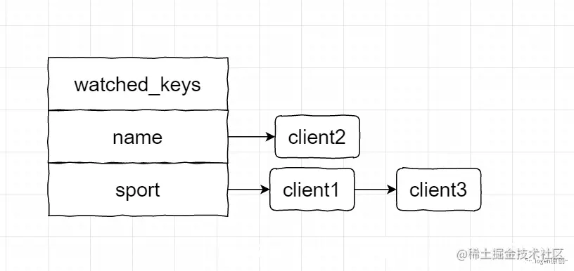
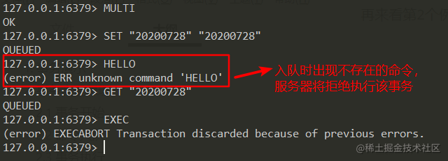
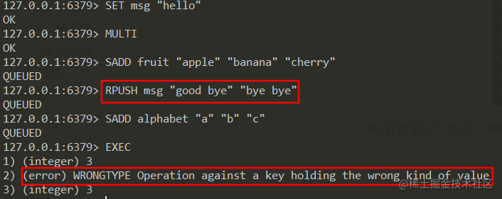

### 引言

在古老的程序员村庄里，有一个广为流传的传说，讲述一位叫做Redis的大法师，他能在眨眼间记住村子里每一个人的秘密。他有一本神奇的大红书，里面记录着所有人的消息。

然而，这本书并非凡物，它需要采用严格的法术才能更新信息，以保证每一条讯息都是可靠的。

太阳和月亮如循环的轮，老法师就这样一次次地维护着他的大红书。

今天，让我们一起揭开这位大法师的秘密，学习他如何通过一系列精妙的命令来管理自己的宝贵信息吧。

### 1）事务控制的几个命令

Redis，这位在数据存储领域的关键角色，不仅仅能够快速地处理命令并存储信息，他还掌握了事务机制这个强大的法术。

所谓事务，即是一系列的行为必须被视为一个单一的整体；它们要么全部完成，要么一个也不做。就像村子里举行的一场婚礼，所有的准备工作要么全部完成，宴会才能顺利举行；要么，若有任何一环出错，宴会也只能取消。

Redis 作为一个数据库使用时，本身也提供了事务机制。事务执行期间，Redis 服务器会先将事务所有命令执行完毕以后，再处理客户端的其它命令请求。

让我们来看看老法师掌握的几个基本事务法术（Redis 事务主要通过几个命令实现）：

| 命令    | 描述                                       |
| ------- | ------------------------------------------ |
| MULTI   | 开启事务                                   |
| EXEC    | 执行事务                                   |
| WATCH   | 监视事务执行过程中的 key，以字典的形式保存 |
| DISCARD | 取消事务，放弃执行事务块中的所有命令       |
| UNWATCH | 取消 WATCH 对事务中的 key 的监视           |

### 2）事务执行过程

如上所述，Redis大法师在施放事务咒语时，会谨慎地将所有命令存放于一个魔法队列中。这个队列就是 Redis 事务实现的一个核心结构——事务队列，当服务器执行 MULTI 开启事务状态后，会根据收到的命令执行不同操作：

- 如果是 MULTI、EXEC、WATCH 和 DISCARD 中的任意一个，服务器会立即执行；
- 如果非上述四个命令，服务器就将其放入到事务队列中，然后向客户端返回 QUEUED 回复，表示命令已经入队，等待执行；
- 当执行 EXEC 时，服务器会遍历事务队列，执行队列中的所有命令，将结果返回给客户端。

### 3）WATCH 控制

WATCH 命令会在事务过程中监视任意数量的 key，将它们保存到 watched_keys 字典中，字典的 key 就是被监视的 key 值，value 是监视该键的所有客户端。

其中，所有的客户端都会维护一个 REDIS_DIRTY_CAS 标识，只要监视的 key 发生了改变，客户端的 REDIS_DIRTY_CAS 标识就会被打开。

REDIS_DIRTY_CAS 用乐观锁实现，只有当事务 EXEC 执行时，Redis 会检查 watched_keys 中监视 key 所有客户端的 REDIS_DIRTY_CAS 标识是否打开：如果客户端的该标识有一个被打开过了，说明 key 已被修改，服务器会拒绝执行事务，并向客户端返回事务执行失败的空回复；都没修改，则成功执行事务。

### 4）Redis 事务的 ACID

**原子性**

事务中的命令要么全部执行，要么都不执行，主要由 MULTI/EXEC/WATCH 命令来实现。 Redis 总是保证原子性的，先从 Redis 的两种事务执行（EXEC）异常来看：

1. **命令入队时报错**

执行 EXEC 前，事务中的某个命令本身存在错误（比如语法错误，使用了不存在的命令），在命令入队时就会 Redis 检测出来了，比如：

这种情况下，虽然我们还能再事务中提交命令。但是，当执行 EXEC 时，Redis 会拒绝执行所有的命令，返回事务失败的结果，此时的事务可以保证原子性。

1. **命令在执行期间报错**

当事务中出现了命令和操作的数据类型不匹配时，由于没有语法错误，所以事务入队时不会报错，但是在 EXEC 后 Redis 执行这条错误的命令时，会报错。但其它正确的命令可以继续执行，不受错误的命令影响：

Redis 不支持回滚，即便事务中包含出错命令，也不影响其它正确命令的执行。这种情况下，虽然一些命令成功一些命令失败，但事务中的命令都是都执行或者都不执行的结果，所以 Redis 事务满足原子性。

其余三种性质：

- 一致性：Redis 事务在各种出错的情况下都可以保证一致性（一致性即数据库状态和数据都不发生异常），不管是执行成功还是失败，数据库的前后一致性都满足；
- 隔离性：EXEC 命令执行后，由于 Redis 事务总是串行执行，所以不存在隔离问题；在事务中，通过 WATCH 机制保证不出现并发问题；
- 持久性：如果 Redis 采用 RDB 持久化模式，那在一个事务执行后，下一次的 RDB 快照还未执行前，Redis 服务器意外宕机，事务修改后的数据可能会丢失；AOF 只有 always 可以保证数据不丢失，no、everysec 都会存在数据丢失的情况。因此，事务的持久性只有 AOF 机制下的 always 策略可以满足。

Redis 的事务机制可以保证原子性、一致性和隔离性，只有在持久化机制为 always 时才能满足。但是 Redis 是基于内存操作，everysec 最多丢失一秒的数据也可以承受。