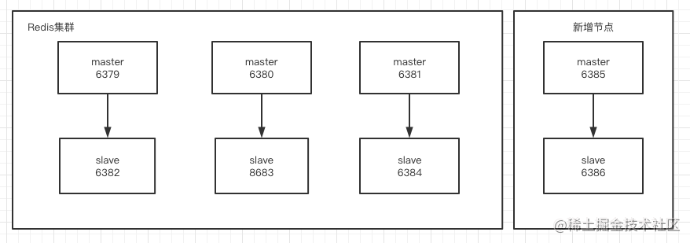
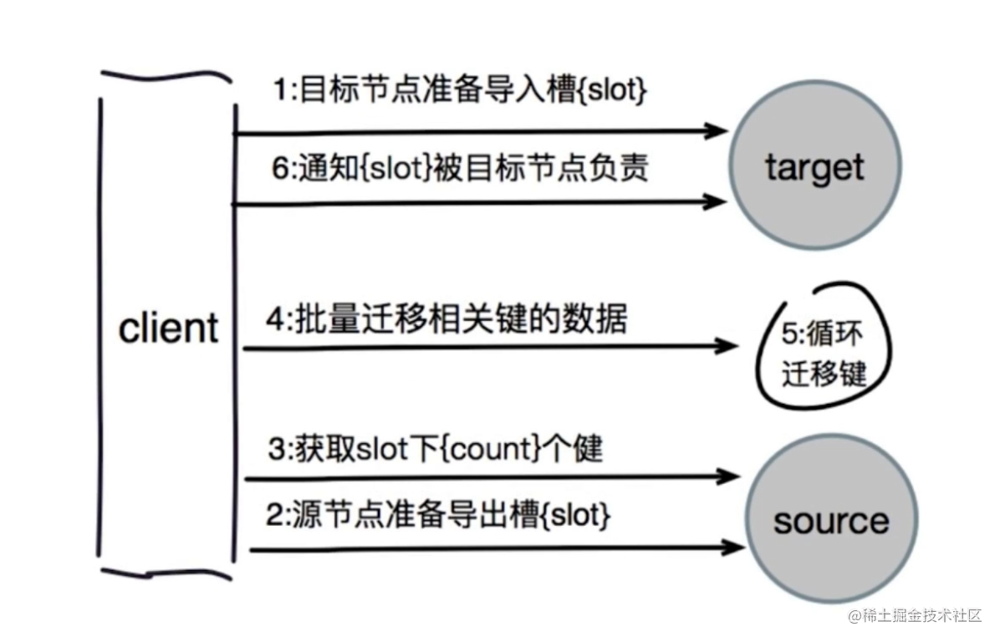

当谈到高性能、高可用的分布式缓存系统时，Redis（Remote Dictionary Server）通常是首选之一。Redis集群是Redis的一种分布式部署方式，通过将数据分片存储在多个节点上，实现了数据的横向扩展，提高了系统的吞吐量和容量。在这篇文章中，我将为你详细介绍Redis集群的原理，以及为什么要使用Redis集群，同时讨论Redis集群的扩缩容机制、注意事项，以及一些常见的面试题。

## 背景

在互联网应用中，快速响应用户请求并确保数据的高可用性是至关重要的。传统的单机Redis在处理大规模的数据和请求时存在容量瓶颈，因此，我们需要一种方法来扩展Redis以满足高并发、大规模的数据需求。

## Redis集群的原理

Redis集群是一种分布式架构，通常由多个Redis节点组成，每个节点负责存储部分数据。这种分布式结构允许Redis集群横向扩展，将数据和负载均匀分布在不同节点上。每个节点都可以独立运行，并可以处理读取和写入请求。

为了实现数据的分片和高可用性，Redis集群采用了以下核心原理：

- **数据分片：** Redis将数据划分为多个槽（slot），通常有16384个槽。每个槽都有一个唯一的编号。不同的数据被映射到不同的槽上，从而实现数据的分布式存储。每个Redis节点可以负责多个槽。
- **节点间通信：** Redis节点之间使用二进制协议进行通信，通过集群总线（cluster bus）来交换信息。节点之间互相感知，并在需要时进行数据迁移。
- **主从复制：** Redis集群中的每个主节点都可以拥有多个从节点，用于数据的备份和高可用性。当主节点宕机时，从节点可以升级为新的主节点。

## 为什么要使用Redis集群？

使用Redis集群有多个优势：

- **高性能：** Redis集群可以平行处理多个请求，从而提高系统的吞吐量。数据分片使每个节点只负责部分数据，减轻了单个节点的负担。
- **高可用性：** Redis集群支持主从复制，当主节点故障时，从节点可以晋升为新的主节点，确保系统的可用性。此外，多个节点之间的数据冗余也增加了数据的安全性。
- **横向扩展：** 随着业务的增长，你可以轻松地向Redis集群中添加新的节点，从而增加存储容量和处理能力，而不需要中断现有的服务。

## Redis集群的扩缩容机制

Redis集群的扩缩容机制允许你在需要时添加或删除节点，以满足不断变化的负载需求。这种机制是自动的，Redis集群会根据节点的状态来调整数据分片。

例如，当需要扩容时，可以添加一个新的Redis节点，然后Redis集群会自动将一部分槽从已有节点迁移到新节点上。同样，当需要缩容时，可以将一个节点标记为下线，Redis集群会将该节点的槽重新分配给其他节点。

## 注意事项

在使用Redis集群时，有一些注意事项：

- **数据迁移：** 当进行扩缩容操作时，数据迁移可能会导致一定的性能损失。因此，在高负载时，建议提前规划好扩容策略。
- **配置管理：** 维护Redis集群的配置需要一定的管理工作。你需要定期监控集群的健康状况，并确保配置的一致性。
- **客户端支持：** 使用Redis集群需要客户端库的支持。不同的编程语言可能需要不同的客户端库，确保你的应用程序能够正确连接到Redis集群。

## 面试题

在面试中，关于Redis集群的问题可能会被问到。以下是一些可能的问题和答案：

1. **什么是Redis集群？为什么要使用Redis集群？**

   答：Redis集群是Redis的一种分布式部署方式，用于提高性能、可用性和扩展性。它通过数据分片、主从复制和节点通信来实现这些目标。

2. **如何确保Redis集群的高可用性？**

   答：Redis集群通过主从复制和自动故障转移来确保高可用性。当主节点故障时，一个从节点会升级为新的主节点，继续提供服务。

3. **Redis集群如何进行数据分片？**

   答：Redis集群将数据分为多个槽，每个节点负责部分槽。这种方式实现了数据的分布式存储。

4. **如何扩展Redis集群的容量和性能？**

   答：可以向Redis集群添加新的节点来扩展容量和性能，Redis集群会自动调整数据分片。

5. **在使用Redis集群时，有哪些需要注意的问题？**

   答：需要注意数据迁移的性能损耗、配置管理、客户端支持等问题。建议提前规划好扩容策略，确保集群的健康运行。

总之，Redis集群是一个强大的工具，用于构建高性能、高可用性的分布式缓存系统。通过理解其原理和运维要点，你可以更好地利用Redis集群来支持你的应用程序。希望这篇文章对你理解Redis集群有所帮助。

## Redis Cluster 原理及扩容

**1）背景**

大数据高并发场景下，写请求全部落在 master 节点上，导致存储、CPU、内存和 IO 都存在瓶颈。如果我们采用纵向扩展（扩容内存），会导致 RDB 文件过大，从而在 fork 子进程进行持久化时阻塞时间较长。此时，Redis Cluster 集群方案应运而生。

**2）简介**

Redis Cluster（简称 RC，下同）是 Redis 原生的数据分片实现，可以自动在多个节点上分布数据，不需要依赖任何外部的工具。

**3）原理**

RC 采用的是虚拟槽分区，一个集群共有 16384（2^14）个 hash 槽。集群中所有的 key 会被分派到这些 hash 槽上，这些 slot 又会被指派到多个 Redis 节点上，每个节点的槽个数为 16384/N 个。

**4）扩容机制**

假设我们有三个主节点（A：6379，B：6380，C：6381），三个从节点 A'，B'，C'（6382,6383,6384）从节点。随着业务发展过快，需进行扩容。此时新增一个主节点 D：6385，D'：6386.

【注意：添加新节点时，尽量采用 Redis-trib 工具的命令，而不要用 Cluster meet，因为 trib 工具会去检查新节点的状态，保证新节点没有数据，也还未加入其它集群】

步骤一：为了保证各节点的 hash 槽数量尽可能相同，扩容时我们采用分批迁移。分别从 A ，B，C 节点上，迁移 4096 个槽（2^14/4 = 4096）之后的槽位到新增的 D 节点上。

步骤二：确定了迁移槽之后，开始迁移，主要有以下几个步骤：

1. 对目标节点（这里是新节点 D：6385）发送 cluster setslot {slot} importing {sourceNodeld} 命令，让目标节点准备导入槽数据；
2. 对源节点（A，B，C节点）发送 cluster setslot {slot} migrating {targetNodeld} 命令，让源节点准备迁出槽数据；
3. 源节点上循环执行 cluster getkeysinslot {slot} {count} 命令，获取 count 个数据槽 {slot} 的 key；
4. 在源节点上执行 migrate {targetIp} {targetPort} key 0 {timeout} 命令将指定的 key 进行迁移。

重复 3,4 步骤直到槽下所有的键值数据迁移到目标节点。

步骤三：向集群内所有主节点发送 cluster setslot {slot} node {targetNodeID} 命令，通知槽已经分配给目标节点。

**5）缩容机制**

缩容的三种情况：下线迁移槽、忘记节点、关闭节点。其中槽迁移和扩容是一样的。

**6）key迁移的原子性**

由于 migrate 命令是同步阻塞的（同步发送和同步接收），在迁移过程中会阻塞该引擎上对该 key 的所有读写，只有在迁移响应成功以后，才会将本地的 key 删除。因此在 redis-cluster 中迁移是原子的，一个 key 不会存在正在迁移时被读写的情况。

**7）ASK 和 MOVED**

Redis 客户端在发起 key 命令请求时有如下操作：

- 计算 key 的 slot 值；
- 获取 slot 的节点位置（先到本地 slot -> node **映射缓存**获取）；
- 对指定节点发起请求。

但是，如果该 key 对应的 slot 已经被迁移：

- 如果迁移过程已经结束，但客户端本地的映射缓存还未更新，就会出现 **MOVED** 重定向；
- 如果 slot 正在迁移，客户端本地缓存未更新，就会出现 **ASK** 重定向。

当请求的 slot 发生迁移时，redis-cluster 作如下处理：

1. 客户端根据本地 slots 缓存发送命令到源节点，如果存在 key 对象则直接返回结果给客户端；
2. 如果 key 对象不存在，但 key 所在的 slot 属于本节点，则可能存在于目标节点。这时源节点回复 ASK 重定向异常，例如 (error) ASK：
3. 客户端收到 ASK 异常后提取出目标节点的信息，发送 asking 命令到目标节点打开客户端连接标识，再执行 key 命令：如果存在则执行返回数据，不存在则返回不存在信息；

如果第 2 步中 key 所在的 slot 不属于本节点，也就是迁移已经完成了，则返回 MOVED 重定向，例如 (error) MOVED。然后客户端再根据 MOVED 异常返回的目标节点信息，直接去目标节点请求 key 数据，并且之后同一个 key 的数据都去目标节点上请求。

MOVED 和 ASK 重定向和网络请求里的 301、302 类似，是永久重定向和临时重定向的区别。

