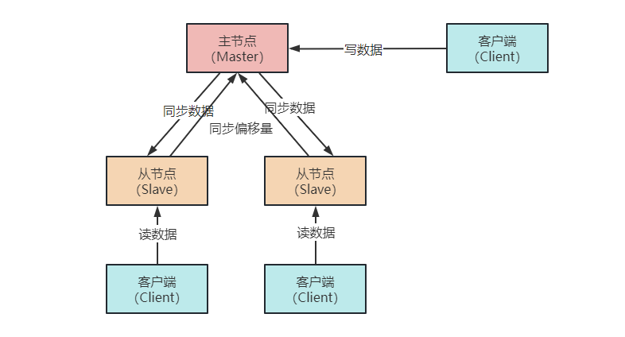

## Redis Cluster 原理及扩容

### 1. 引言

==Q：什么是 Redis？==

A：Redis，全称是远程数据服务（Remote Dictionary Server），它作为一款由 C 语言编写的内存高速缓存数据库，在互联网产品中应用甚广。

无论是国内还是国外，从五百强公司到小型初创公司都在使用 Redis，很多云服务提供商还以 Redis 为基础构建了相应的缓存服务、消息队列服务以及内存存储服务，当你使用这些服务时，实际上就是在使用 Redis。

**作为一名开发者，即便没在工作中用到它，也一定会在面试中被问到！**

> 不熟悉 Redis 应用场景及持久化的，可以看这篇文章【Redis持久化都说不明白？回去等消息吧】。

由于很多开发者在使用 Redis 时由于业务的规模，成本等方面考虑，都用的还是 Redis 主从架构，从最开始的一主多从，到读写分离，再到 Sentinel 哨兵机制。单实例的 Redis 缓存已经可以应对大部分使用场景，也能实现主从故障迁移。

这样的架构确实很简单，而且部署也方便，性价比高。

但若是在遇到业务场景比较复杂，并发量大，且对稳定性要求比较高时，就会出现如下问题：

* 并发写：在大数据高并发场景下，如果用户的写请求全部落在 master 节点上，会导致存储、CPU、内存和 IO 都存在一定的瓶颈；
* 海量存储：单实例 Redis 本质上只有一台 Master 作为存储，面临海量数据时，如果我们采用纵向扩展（即扩容 Redis 的内存），则会导致 RDB 文件过大，从而在 fork 子进程进行持久化时阻塞时间较长，这对线上环境的用户来说是难以忍受的。

综上，Redis Cluster 集群方案应运而生。

## 2. Redis Cluster

### 2.1 简介

Redis3.0 以后加入了 Redis 的集群模式，即 Redis Cluster，它是 Redis 原生的数据分片实现，可以自动在多个节点上分布数据，节点间的数据能共享，也能动态地调整数据分布。

Redis 集群采用去中心化的思想，没有中心节点的说法。对于客户端来说，整个集群可以看成是一个整体，可以连接任意的节点进行数据操作，就像操作单实例 Redis 一样，也不需要任何的代理中间件。

最重要的是，Redis 集群具有高可用性，支持多个 master 节点，每个 master 节点都可以挂载多个 slave 节点，当 master 节点挂掉以后，集群会选出一个新的 master 节点。

除了自动进行故障转移，Redis 集群还可以根据业务的数据量进行弹性伸缩，所以 Redis 集群的运维成本非常低。

### 2.2 原理

Redis 集群采用了分布式存储的方式，解决了单点故障、海量数据存储的问题，对于分布式来说，最优先考虑的就是数据如何拆分到不同的 Redis 节点上。

Redis 集群采用的是 hash 槽分区的方式来拆分数据，即一个集群里共有 16384（2^14）个 hash 槽（又称为 slot）。集群中所有的 key 会被分派到这些 hash 槽上，这些 hash 槽又会被分配到多个 redis 节点上，每个节点的槽个数为 16384/N 个（基本保证均匀分布）。

当对数据进行操作时，集群会使用 CRC16 算法对 key 进行计算并对 16384 取模（slot = CRC16（key）%16384），得到的结果就是这个 Redis 键值对存放的 hash 槽。再通过 hash 槽去找到对应的 Redis 节点，最后在对应的节点上进行数据存取操作。

## 3. 集群扩容

Redis 集群可以对节点的上下线灵活控制。假设我们有三个主节点，端口号分别为（A：6379，B：6380，C：6381），三个从节点 A'，B'，C'（6382，6383，6384）。

随着业务发展过快，现有的节点数已经不满足需求，于是对集群进行扩容。假设我们新增一主一从节点：主节点 D：6385，D'：6386.

【注意：添加新节点时，尽量采用 Redis-trib 工具的命令，而不要用 Cluster meet，因为 trib 工具会去检查新节点的状态，保证新节点没有数据，也还未加入其它集群】

步骤一：为了保证各节点的 hash 槽数量尽可能相同，扩容时我们采用分批迁移。分别从 A ，B，C 节点上，迁移 4096 个槽（2^14/4 = 4096）之后的槽位到新增的 D 节点上。

步骤二：确定了迁移槽之后，开始迁移，主要有以下几个步骤：

1. 对目标节点（这里是新节点 D：6385）发送 cluster setslot {slot} importing {sourceNodeld} 命令，让目标节点准备导入槽数据；
2. 对源节点（A，B，C节点）发送 cluster setslot {slot} migrating {targetNodeld} 命令，让源节点准备迁出槽数据；
3. 源节点上循环执行 cluster getkeysinslot {slot} {count} 命令，获取 count 个数据槽 {slot} 的 key；
4. 在源节点上执行 migrate {targetIp} {targetPort} key 0 {timeout} 命令将指定的 key 进行迁移。

重复 3,4 步骤直到槽下所有的键值数据迁移到目标节点。

步骤三：向集群内所有主节点发送 cluster setslot {slot} node {targetNodeID} 命令，通知槽已经分配给目标节点。

**5）缩容机制**

缩容的三种情况：下线迁移槽、忘记节点、关闭节点。其中槽迁移和扩容是一样的。

**6）key迁移的原子性**

由于 migrate 命令是同步阻塞的（同步发送和同步接收），在迁移过程中会阻塞该引擎上对该 key 的所有读写，只有在迁移响应成功以后，才会将本地的 key 删除。因此在 redis-cluster 中迁移是原子的，一个 key 不会存在正在迁移时被读写的情况。

**7）ASK 和 MOVED**

Redis 客户端在发起 key 命令请求时有如下操作：

- 计算 key 的 slot 值；
- 获取 slot 的节点位置（先到本地 slot -> node **映射缓存**获取）；
- 对指定节点发起请求。

但是，如果该 key 对应的 slot 已经被迁移：

- 如果迁移过程已经结束，但客户端本地的映射缓存还未更新，就会出现 **MOVED** 重定向；
- 如果 slot 正在迁移，客户端本地缓存未更新，就会出现 **ASK** 重定向。

当请求的 slot 发生迁移时，redis-cluster 作如下处理：

1. 客户端根据本地 slots 缓存发送命令到源节点，如果存在 key 对象则直接返回结果给客户端；
2. 如果 key 对象不存在，但 key 所在的 slot 属于本节点，则可能存在于目标节点。这时源节点回复 ASK 重定向异常，例如 (error) ASK：
3. 客户端收到 ASK 异常后提取出目标节点的信息，发送 asking 命令到目标节点打开客户端连接标识，再执行 key 命令：如果存在则执行返回数据，不存在则返回不存在信息；

如果第 2 步中 key 所在的 slot 不属于本节点，也就是迁移已经完成了，则返回 MOVED 重定向，例如 (error) MOVED。然后客户端再根据 MOVED 异常返回的目标节点信息，直接去目标节点请求 key 数据，并且之后同一个 key 的数据都去目标节点上请求。

MOVED 和 ASK 重定向和网络请求里的 301、302 类似，是永久重定向和临时重定向的区别。