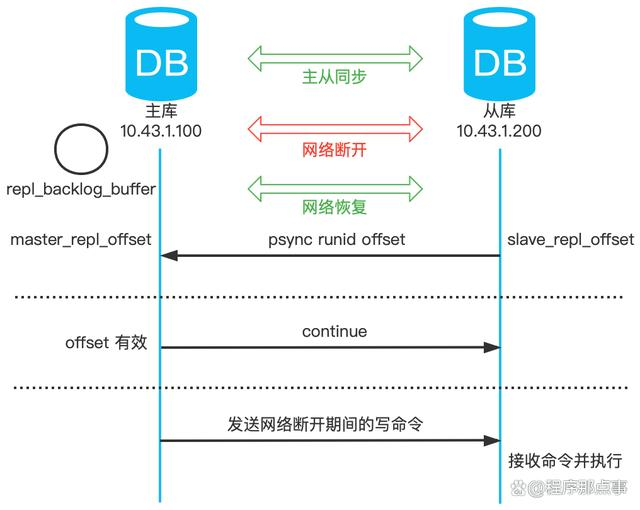

大家好，我是小❤，一个漂泊江湖多年的 985 非科班程序员，曾混迹于国企、互联网大厂和创业公司的后台开发攻城狮。

## 1. 引言

之前我们聊过 Redis 的数据结构底层原理和持久化机制，这期我们来聊 Redis 的高可用主题。

> 时光穿梭机：
>
> Redis持久化都说不明白？回去等消息吧
>
> Redis底层数据结构的实现

众所周知，一个数据库系统想要实现高可用，主要从以下几个方面来考虑：

1. 保证数据安全不丢失
2. 系统可以正常提供服务

而 Redis 作为一个提供高效缓存服务的数据库，也不例外。

上期我们提到的 Redis 持久化策略，其实就是为了减少服务宕机后数据丢失，以及快速恢复数据，也算是支持可用性的一种实现，但还算不上高可用。

而 Redis 提供了其它几种方式来保证系统高可用，业务中最常用的莫过于主从同步（也称作主从复制）、Sentinel 哨兵机制以及 Cluster 集群。

同时，这也是面试中出现频率最高的几个问题。考虑篇幅和侧重点，这期我们先来讲讲 Redis 的主从复制。

## 2. 主从复制简介

Redis 支持主从复制，其中一个 Redis 实例作为主节点 master，负责写操作。其它实例（可能有 1 或多个）作为从节点，负责复制主节点的数据。

### 2.1 架构组件

#### 主节点Master

**数据更新：**Master 负责处理所有的写操作，包括写入、更新和删除等。

**数据同步：**写操作在 Master 上执行，然后 Master 将写操作的结果同步到所有从节点 Slave 上。

#### 从节点Slave

**数据读取：**Slave 负责处理读操作，例如获取数据、查询等。

**数据同步：**Slave 从 Master 复制数据，并在本地保存一份与主节点相同的数据副本。

### 2.2 为什么要读写分离

#### 1）防止并发

从上图我们可以看出，数据是由主节点向从节点单向复制的，**如果主、从节点都可以写入数据的话，那么数据的一致性如何保证呢？**

有聪明的小伙伴可能已经想到了，那就是加锁！

但是主、从节点分布在不同的服务器上，分布式一致性的问题大概率会出现，而在高频并发的场景下，解决加锁问题往往又会带来其它的分布式问题（写入效率低、吞吐量大幅下降）。

而对于 Redis 这样一个高效缓存数据库来说，性能降低是难以忍受的，所以加锁不是很好的方案。

那如果不加锁，使用最终一致性方案呢？

这样 Redis 在主、从库读到的数据又可能会不一致，带来业务上的挑战，用户也是难以接受的。

所以，为了权衡数据的并发问题，我们只允许在主节点上写入数据，从节点上读取数据。

#### 2）易于扩展

我们都知道，大部分使用 Redis 的业务都是读多写少的。所以，我们可以根据业务量的规模来确定挂几个从节点，当缓存数据增大时，我们可以很方便的扩展从节点的数量，实现弹性扩展。

同时，读写分离还可以实现数据的备份和负载均衡，从而提高可靠性和性能。

#### 3）高可用保障

不仅如此，Redis 还可以手动切换主从节点，来做**故障隔离和恢复**。这样，无论主节点或者从节点宕机，其他节点依然可以保证服务的正常运行。

## 3. 主从复制实现

### 3.1 开启主从复制

要开启主从复制，我们只需要关注如下命令即可：

`replicaof  <masterIP> <masterPort>`：确定好主节点的 IP 地址和端口号，在从库执行这个命令，就可以开启主从复制。注意，在 Redis5.0 之前，该命令为 slaveof。

开启主从复制后，应用层采用读写分离，所有的写操作在主节点进行，所有读操作在从节点进行。

主从节点会保持数据的最终一致性：主库更新数据后，会同步给从库。

### 3.2 主从复制过程

那主从库同步什么时候开始和结束呢？

是一次性传输还是分批次写入？Redis 重连后没传输完成的怎么办？

带着这些疑问我们继续来分析下，Redis 传输时需要考虑以下 3 点：

1. 首次开启主从复制时，一次性**全量复制**

2. 全量复制完成后，继续将新增的数据**命令传播**

3. 主、从节点断开重连后，**Append 增量数据 + 准实时同步**

#### 1）一次性全量复制

##### 1.1 建立连接

从服务器从 `replicaof` 配置项中获取主节点的 `IP` 和 `Port`，然后进行连接。

连接成功后，从服务器会向主服务器发送 `PSYNC` 命令，表示要进行同步。同时，命令中包含 `runID` 和 `offset` 两个关键字段。

1. runID：每个 Redis 实例的唯一标识，当主从复制进行时，该值为 Redis 主节点实例的ID
2. offset：从库数据同步的偏移量，当第一次复制时，该值为 -1，表示全量复制

主服务器收到 `PSYNC` 命令后，会创建一个专门用于复制的后台线程（`replication thread`），然后记录从节点的 `offset` 参数并等待从服务器的连接。

##### 1.2 全量复制（第一次同步）

当从服务器连接到主服务器后，主服务器会将自己的数据发送给从服务器，这个过程叫做**全量复制**。主服务器会执行 `BGSAVE` 命令，然后 `fork` 出一个子进程来遍历自己的数据集并生成一个 `RDB` 文件，将这个文件发送给从服务器。

在这期间，**为了保证 Redis 的高性能，主节点的主进程不会被阻塞，依旧对外提供服务并接收数据写入内存中。**

##### 1.3 从库加载数据

从服务器接收到 `RDB` 文件后，会加载这个文件，将自己的数据集替换成主服务器的数据集。

第一次同步时，由于从节点还没有数据，所以将主库的数据全量拿过来，存入从库。

#### 2）同步期间的增加复制

在第一次同步过程中，由于是全量同步，所以用时可能比较长，这期间主库依旧会写入新数据。

但是，在数据同步一开始就生成的 `RDB` 文件中显然是没有这部分新增数据的，所以第一次数据同步后需要再发送一次这部分新增数据。

这样一来，主服务器就能够在发送完 RDB 文件后，将期间的写操作重新发送给从服务器，以保证从服务器的数据集与主服务器保持一致。

#### 3）命令传播

在完成全量复制后，主从服务器之间会保持一个 TCP 连接，主服务器会将自己的写操作发送给从服务器，从服务器执行这些写操作，从而保持数据一致性，这个过程也称为**基于长连接的命令传播**（`command propagation`）。

增量复制的数据同步是**异步**的，但通过记录写操作，主从服务器之间的数据最终会达到一致状态。

#### 4）增量数据同步

命令传播的过程中，如果出现 **网络故障** 导致连接断开，此时新的写命令将无法同步到从库。

即便是抖动后断开又恢复网络连接，但此时 TCP 连接已经断开，数据肯定是需要重新同步了。

**从 Redis 2.8 开始，从库已支持增量同步，只会把断开的时候没有发生的写命令，同步给从库。**

详细过程如下：

1. 网络恢复后，从库发生 psync 命令给主库，并携带之前主库返回的 runid，还有复制的偏移量 offset；
2. 主库收到命令后，核查 runid 和 offset，确认没问题将响应 `CONTINUE` 命令；
3. 主库发送网络断开期间的写命令，从库接收命令并执行。

实际上，主库在进行命令传播的过程中，做了两个事情：

1. 发送写命令给从库；
2. 写命令写入 `repl_backlog_buffer` **复制积压缓冲区**，保存最近传播的写命令。

复制积压缓冲区，是一个环形缓冲区。主库除了拥有 repl_backlog_buffer，还存在复制点位 master_repl_offset；

同理，从库，也有复制点位 slave_repl_offset；

如果从库的 psync 命令指定的 offset，数据还存在 repl_backlog_buffer 缓冲区里，也就是：

master_repl_offset - size < slave_repl_offset，即主库最小的偏移量，小于从库的偏移量，说明数据还在环形缓冲区里。

**所以，只要主库的缓冲区足够大，足以容纳最近的写命令（Redis 协议），就可以在网络中断后使用增量同步了。**

默认 repl_backlog_buffer = 1M，如果写入数据量较大，比如 1M/s，显然，网络故障 1秒后，复制积压缓冲区数据无效，所以应该增大它的值。

具体大小，需要根据实际情况确定。建议设置 10M 以上，大概就是 10s 以内的中断，因为 Redis 服务器启动也需要一定时间。

## 4. 小结

- 主从复制的作用一个是为分担读写压力，均衡负载，另一个是为了保证部分实例宕机之后服务的持续可用性，所以 Redis 演变出主从架构和读写分离。
- 主从复制的步骤包括：建立连接的阶段、数据同步的阶段、基于长连接的命令传播阶段。
- 数据同步可以分为全量复制和部分复制，全量复制一般为第一次全量或者长时间主从连接断开。
- 命令传播阶段主从节点之间有 PING（主到从的的探测） 和 REPLCONF ACK（从到主的ack应答） 命令，这种互相确认心跳的模式保证数据同步的稳定性。
- 主从模式是比较低级的可用性优化，要做到故障自动转移，异常预警，高保活，还需要更为复杂的哨兵或者集群模式，这个后面我们会有专门的文章进行介绍。

参考：

Redis主从同步原理：https://baijiahao.baidu.com/s?id=1772624108846137125&wfr=spider&for=pc

Redis高可用之主从架构：https://www.cnblogs.com/wzh2010/p/15886795.html

解读Redis主从同步机制：https://zhuanlan.zhihu.com/p/650722037