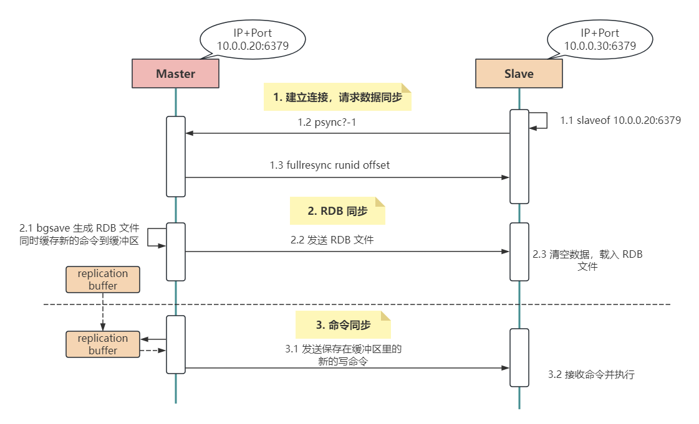
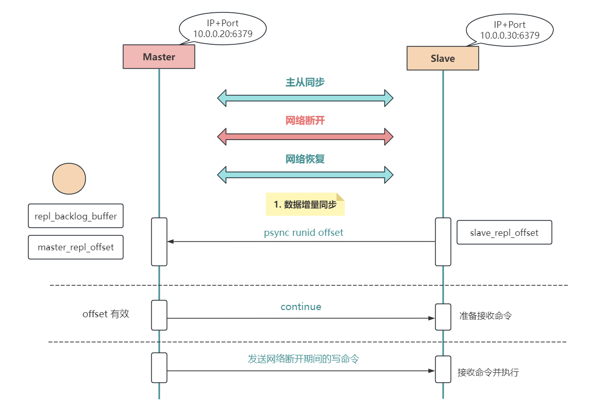
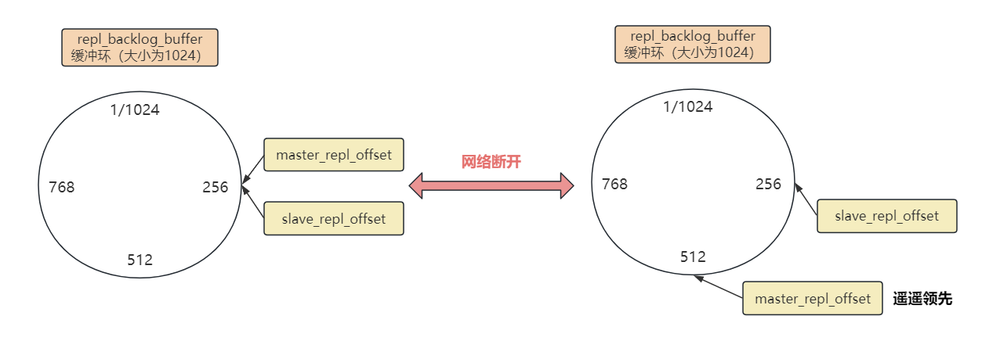

大家好，我是小❤，一个漂泊江湖多年的 985 非科班程序员，曾混迹于国企、互联网大厂和创业公司的后台开发攻城狮。

## 1. 引言

之前我们聊过 Redis 的数据结构底层原理和持久化机制，这期我们来聊 Redis 的高可用主题。

> 时光穿梭机：
>
> * *Redis*持久化都说不明白？那今天先到这吧~
>* *Redis*数据结构的底层原理

众所周知，一个数据库系统想要实现高可用，主要从以下两个方面来考虑：

1. 保证数据安全不丢失
2. 系统可以正常提供服务

而 Redis 作为一个提供高效缓存服务的数据库，也不例外。

上期我们提到的 **Redis 持久化策略**，其实就是为了减少服务宕机后数据丢失，以及快速恢复数据，也算是支持高可用的一种实现。

除此之外，Redis 还提供了其它几种方式来保证系统高可用，业务中最常用的莫过于**主从同步（也称作主从复制）、Sentinel 哨兵机制以及 Cluster 集群**。

同时，这也是面试中出现频率最高的几个问题，这期我们先来讲讲 Redis 的主从复制。

## 2. 主从复制简介

Redis 同时支持**主从复制和读写分离**：一个 Redis 实例作为主节点 `Master`，负责写操作。其它实例（可能有 1 或多个）作为从节点 `Slave`，负责复制主节点的数据。

### 2.1 架构组件

#### 主节点Master

**数据更新：**Master 负责处理所有的`写操作`，包括写入、更新和删除等。

**数据同步：**写操作在 Master 上执行，然后 Master 将写操作的结果`同步到所有从节点 Slave` 上。

#### 从节点Slave

**数据读取：**Slave 负责处理`读操作`，例如获取数据、查询等。

**数据同步：**Slave 从 Master 复制数据，并在本地保存一份与主节点相同的`数据副本`。

### 2.2 为什么要读写分离

#### 1）防止并发

从上图我们可以看出，数据是由主节点向从节点单向复制的，**如果主、从节点都可以写入数据的话，那么数据的一致性如何保证呢？**

有聪明的小伙伴可能已经想到了，那就是加锁！

但是主、从节点分布在不同的服务器上，数据跨节点同步时又会出现**分布式一致性**的问题。而在高频并发的场景下，解决加锁后往往又会带来其它的分布式问题，例如**写入效率低、吞吐量大幅下降**等。

而对于 Redis 这样一个高效缓存数据库来说，性能降低是难以忍受的，所以加锁不是一个优秀的方案。

那如果不加锁，使用最终一致性方式呢？

这样 Redis 在主、从库读到的数据又可能会不一致，带来业务上的挑战，用户也是难以接受的。

而**业务为用户服务，技术为业务服务**。

所以，为了权衡数据的并发问题和用户体验，我们只允许在主节点上写入数据，从节点上读取数据。

> 不理解分布式一致性的同学可以看我之前的这篇文章：深入浅出：分布式、CAP和BASE理论

#### 2）易于扩展

我们都知道，大部分使用 Redis 的业务都是**读多写少**的。所以，我们可以根据业务量的规模来确定挂载几个从节点 `Slave`，当缓存数据增大时，我们可以很方便的扩展从节点的数量，实现弹性扩展。

同时，读写分离还可以实现**数据备份**和**负载均衡**，从而提高可靠性和性能。

#### 3）高可用保障

不仅如此，Redis 还可以手动切换主从节点，来做**故障隔离和恢复**。这样，无论主节点或者从节点宕机，其他节点依然可以保证服务的正常运行。

## 3. 主从复制实现

### 3.1 开启主从复制

要开启主从复制，我们只需要关注 `replicaof` 命令即可。

`replicaof <masterIP> <masterPort>`，确定好主节点的 IP 地址和端口号，在从库执行这个命令，就可以开启主从复制。

> 注意，在 Redis5.0 之前，该命令为 `slaveof`

**开启主从复制后，应用层采用读写分离，所有的写操作在主节点进行，所有读操作在从节点进行。**

主从节点会保持数据的最终一致性：主库更新数据后，会同步给从库。

### 3.2 主从复制过程

那主从库同步什么时候开始和结束呢？

是一次性传输还是分批次写入？Redis 主从节点在同步过程中网络中断了，没传输完成的怎么办？

带着这些疑问我们来分析下，首先，Redis 第一次数据同步时分 3 个阶段。

#### 1）建立连接，请求数据同步

主从节点建立连接，从库请求数据同步。

从服务器从 `replicaof` 配置项中获取主节点的 `IP` 和 `Port`，然后进行连接。

连接成功后，从服务器会向主服务器发送 `PSYNC` 命令，表示要进行同步。同时，命令中包含 `runID` 和 `offset` 两个关键字段。

1. runID：每个 Redis 实例的唯一标识，当主从复制进行时，该值为 Redis 主节点实例的ID。由于**首次同步时还不知道主库的实例ID，所以该值第一次为 `?`**
2. offset：从库数据同步的偏移量，当第一次复制时，**该值为 `-1`，表示全量复制**

主服务器收到 `PSYNC` 命令后，会创建一个专门用于复制的后台线程（`replication thread`），然后记录从节点的 `offset` 参数并开始进行 RDB 同步。

#### 2）RDB 同步

主库生成 RDB 文件，同步给从库。

当从服务器连接到主服务器后，主服务器会将自己的数据发送给从服务器，这个过程叫做**全量复制**。主服务器会执行 `bgsave` 命令，然后 `fork` 出一个子进程来遍历自己的数据集并生成一个 `RDB` 文件，将这个文件发送给从服务器。

在这期间，**为了保证 Redis 的高性能，主节点的主进程不会被阻塞，依旧对外提供服务并接收数据写入缓冲区中。**

从服务器接收到 `RDB` 文件后，会清空自身数据，然后加载这个文件，将自己的数据集替换成主服务器的数据集。

#### 3）命令同步

在第一次同步过程中，由于是全量同步，所以用时可能比较长，这期间**主库依旧会写入新数据**。

但是，在数据同步一开始就生成的 `RDB` 文件中显然是没有这部分新增数据的，所以第一次数据同步后需要再发送一次这部分新增数据。

这样一来，主服务器就能够在发送完 RDB 文件后，将期间的写操作重新发送给从服务器，以保证从服务器的数据集与主服务器保持一致。

### 3.3 增量同步

#### 1）命令传播

在完成全量复制后，主从服务器之间会保持一个 TCP 连接，主服务器会将自己的写操作发送给从服务器，从服务器执行这些写操作，从而保持数据一致性，这个过程也称为**基于长连接的命令传播**（`command propagation`）。

增量复制的数据是**异步**复制的，但通过记录写操作，主从服务器之间的数据最终会达到一致状态。

#### 2）网络断开后数据同步

命令传播的过程中，由于网络抖动或故障导致**连接断开**，此时主节点上新的写命令将无法同步到从库。

即便是抖动瞬间又恢复网络连接，但 TCP 连接已经断开，数据肯定是需要重新同步的。

**从 Redis 2.8 开始，从库已支持增量同步，只会把断开的时候没有发生的写命令，同步给从库。**

详细过程如下：

1. 网络恢复后，从库携带之前主库返回的 runid，还有复制的偏移量 offset 发送 `psync runid offset` 命令给主库，请求数据同步；
2. 主库收到命令后，核查 `runid` 和 `offset`，确认没问题将响应 `continue` 命令；
3. 主库发送网络断开期间的写命令，从库接收命令并执行。

这时，有细心的小伙伴可能要问了，**网络断开后，主库怎么知道哪些数据是新写入的呢？**

这个问题很好，接下来我们详细说明一下。

#### 3）增量复制的关键

Master 在执行写操作时，会将这些命令记录在 `repl_backlog_buffer` （**复制积压缓冲区**）里面，并使用 `master_repl_offset` 记录写入的位置偏移量。

而从库在执行同步的写命令后，也会用 `slave_repl_offset` 记录写入的位置偏移量。正常情况下，从库会和主库的偏移量保持一致。

但是，当网络断开后，主库继续写入，而从库没有收到新的同步命令，所以偏移量就停止了。所以，`master_repl_offset` 会大于 `slave_repl_offset`。

> 注意：主从库实现增量复制时，都是在 `repl_backlog_buffer` 缓冲区上进行。

网络断开前后，主从库的同步图如下：

> `repl_backlog_buffer` 复制积压缓冲区是一个环形缓冲区，如果缓冲区慢了（比如超过 1024），则会从头覆盖掉前面的内容。

所以，当网络恢复以后，主节点只需将 `master_repl_offset` 和 `slave_repl_offset` 之间的内容同步给从库即可（图中 `256~512` 这部分数据）。

需要注意的是，主库的积压缓冲区默认为 1M，如果从库网络断开太久，缓冲区之前的内容已经被覆盖，这时主从的数据复制就只能采取全量同步了。

所以我们需要根据业务量和实际情况来设置 `repl_backlog_buffer` 的值。

## 4. 小结

在真实的互联网应用上，Redis 为了保证高可用和分担读写压力，几乎都会采取主从复制的部署架构。一方面让架构`易于扩展`，另一方面防止`单体故障`：当主库挂了，可以立即拉起从库，不至于让业务停滞太久。

而首次主从复制包括**建立连接，RDB 同步和命令同步**三个阶段。

为了保证同步的效率，除了第一次需要`全量同步`以外，例如当主从节点断连后，则只需要`增量同步`，这是由主从库的复制偏移量以及主库的 `repl_backlog_buffer` 复制积压缓冲区来控制的。

好了，以上就是本文的所有内容了，希望今天的文章能让大家更深入地了解 Redis 主从同步，并在实际工作或面试中用起来，探索更多的细节。

如果觉得文章有所启发或收获，不妨点赞、分享，加入在看，这对我是最大的鼓励！

ღ( ´･ᴗ･` )比心

如果你有任何问题或想了解更多，也随时在评论区提问，谢谢你的阅读！

我是小❤，我们下期再见。

#### 参考资料

Redis主从同步原理：https://baijiahao.baidu.com/s?id=1772624108846137125&wfr=spider&for=pc

Redis高可用之主从架构：https://www.cnblogs.com/wzh2010/p/15886795.html

解读Redis主从同步机制：https://zhuanlan.zhihu.com/p/650722037