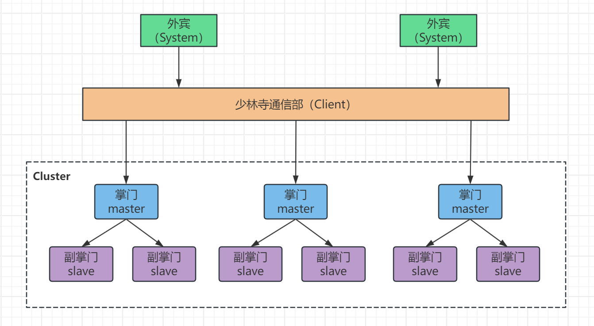
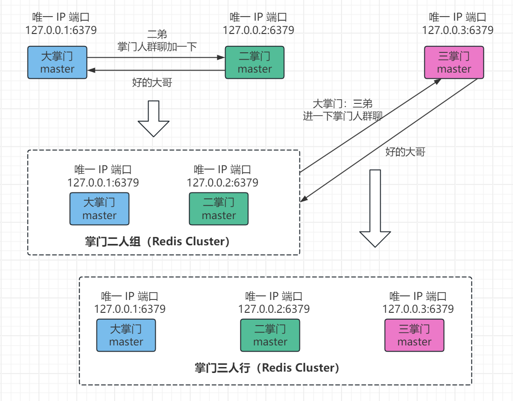
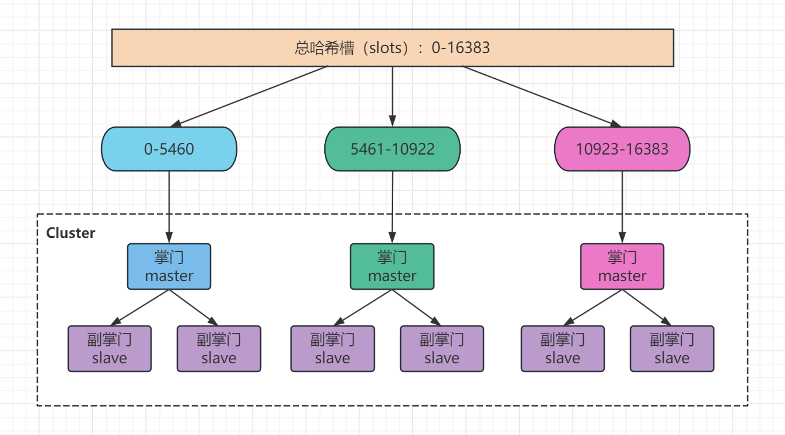
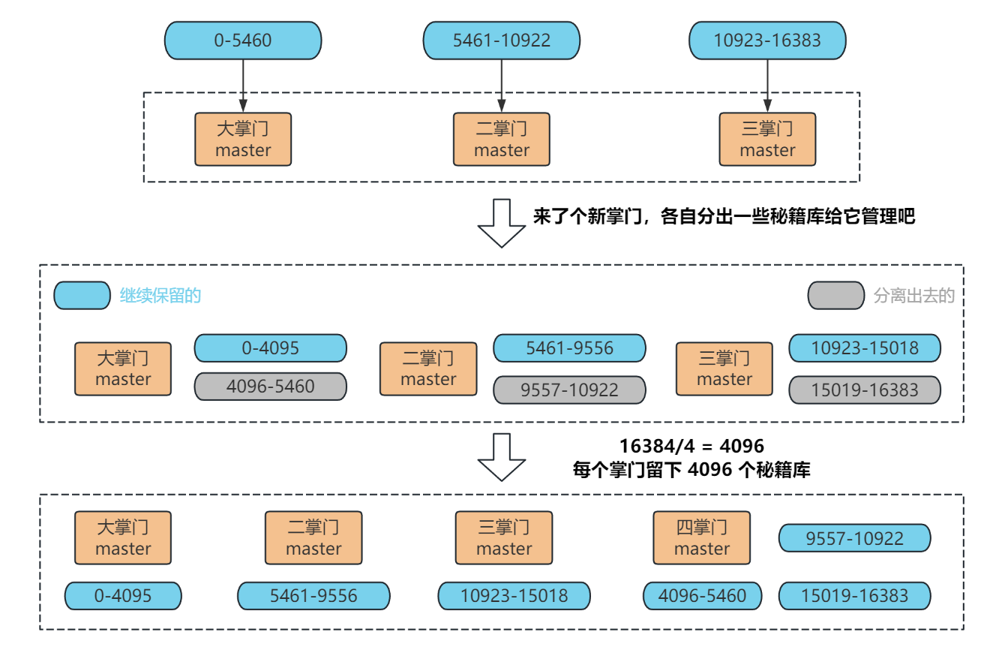
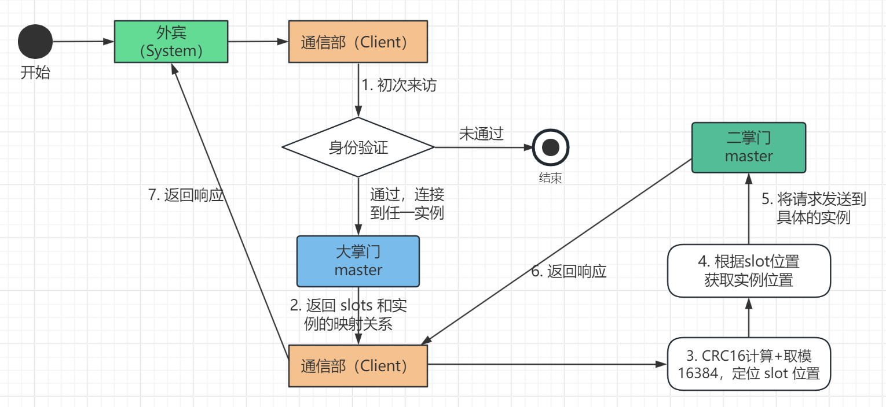
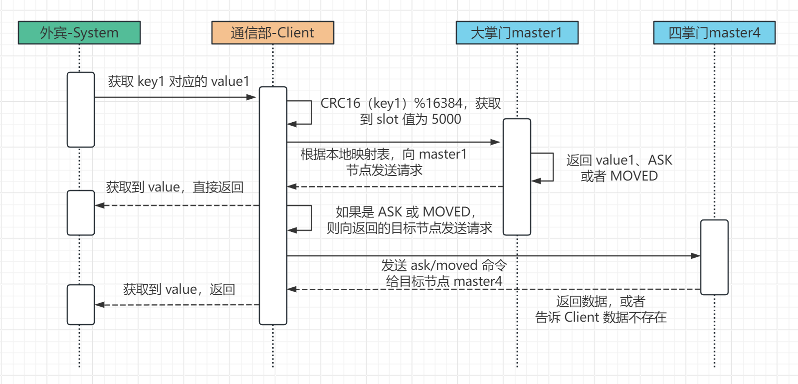

大家好，我是小❤，一个漂泊江湖多年的 985 非科班程序员，曾混迹于国企、互联网大厂和创业公司的后台开发攻城狮。

## 1. 引言

前面我们已经聊过 Redis 的主从同步（复制）和哨兵机制，这期我们来聊 Redis 的集群模式。

上期我们说过，在实际互联网架构上，Redis 为了保证进阶高可用，会在主从复制的部署架构上进一步引入哨兵机制。

> 时光穿梭机：
>
> * [救命！只有我还不明白Redis主从复制的原理吗？](https://mp.weixin.qq.com/s?__biz=MzI5Nzk2MDgwNg==&mid=2247485225&idx=1&sn=761feb02c973cc7b2ecdcc9b9124b070&chksm=ecac5320dbdbda36d147b027db413b324b5e0d31760e71b5b52fbec9af51bb3261475a27b973#rd)

但是在超大规模的互联网应用中，业务规模不断扩展，用户量持续增多时，原有的主从+哨兵机制已经不满足我们的需求了。如：**性能问题，数据量过多、并发量过高导致 Redis 服务器响应太慢**。

### 1.1 自古功夫出少林

如果把 Redis 比作江湖里的门派，少林寺作为武林中最有威望的名门正派，提供了武功秘籍（缓存数据）的存储服务。

由于少林存储的可用性做的很好，武功秘籍几乎不会丢失。而且，每次去获取武林同道的秘籍时，响应也很快，所以少林威望不断提升，后得千古美誉：“自古功夫出少林”。

少林的武功秘籍存储方案为什么这么稳定呢？

这得从头说起。

### 1.2 累坏的掌门人

在武林大会 3.0 之前，已经有很多武林同道在少林寺存取武功秘籍了，而少林掌门作为权力的中心，不仅披星戴月和外宾打交道（Client 请求），还得在管理物资之余（数据存储和输出）给副掌门做业务培训（数据备份）。

虽然在武林大会 2.8 时，少林和武当一样，已经新增了哨兵部门，从此不用担心掌门嗝屁的问题。

> 详见上一篇文章：[深入浅出Redis高可用：哨兵机制](https://mp.weixin.qq.com/s?__biz=MzI5Nzk2MDgwNg==&mid=2247485363&idx=1&sn=c3568d661ab3136bf38accb0b3720192&chksm=ecac53badbdbdaac73ae2e87ae827b94564e9cc06b17a3ba82148a32913bc9690da99b81ed2b&token=1824878640&lang=zh_CN#rd)

但掌门人日理万机，应接不暇，还是把头发都愁掉了！

为了掩饰尴尬，从此少林弟子不准留头发 :dog:

这时可能有小伙伴产生疑问了，性能不好，那就加 CPU、加内存或者网络带宽呗？！

只能说太天真！当数据量增大、并发增高时，一味地增加 Redis 服务器的CPU、内存和网络带宽，往往不能起到很好的优化效果。

毕竟，服务器也和人的体能极限一样，不是吃得越多，就可以干活越快的。

而纵向扩展不管用，我们就只能考虑横向扩展了：团结就是力量，一个人解决不了，那就再来十个。

于是乎，今天的主角——**Redis 集群模式**应时而生。

## 2. 集群模式：分权

Redis3.0 之后，加入了 Redis 集群模式，即 `Redis Cluster`：可以自动在多个节点上分布数据，节点间的数据能共享，也能动态地调整数据分布。

### 2.1 集群架构

Redis 集群采用去中心化的思想，没有中心节点的说法。

对于客户端来说，整个集群可以看成是一个整体，可以连接任意的节点进行数据操作，就像操作单实例 Redis 一样，也不需要任何的代理中间件。

> 少林掌门：帮手来了，不用一个人掉头发了！

最重要的是，Redis 集群具有高可用性，支持多个 master 节点，每个 master 节点都可以挂载多个 slave 节点，当 master 节点挂掉以后，集群会选出一个新的 master 节点。

自武林大会 3.0 以来，少林为了解决事务变多，掌门人疲于应对的问题，引入了多掌门模式：**每个掌门平级，共同处理门派事务**，也可以发展自己的副掌门，以作平替。

当有新的外宾访问时，会首先通过少林寺通信部（Client）来将请求转发给各掌门，再分别处理。

相当于一个人的活可以数以千计个人一起干，不得不说，这很强！

那这个过程是如何建立起来的呢？

### 2.2 集群组建

首先，少林会选出多个掌门人（根据武林秘籍的数量决定），然后找一个掌门人负责集群组建的主持工作。

> 武林规定，一个门派不超过 1000 个掌门人：master 节点个数尽量在 1000 个以下

假设我们用三个 master 节点作为集群成员，它们的建连过程如下图所示：

为了提升工作效率，掌门人之间需要加群方便沟通，在 Redis 中，master1 可以向 master2 节点发送以下命令建连：

> CLUSTER MEET 127.0.0.2 6379

当 master2 节点回复响应时，一个 `Redis Cluster` 便组建成功了。

群聊组建成功后，掌门人们便开始各自管理事务。但少林存放的武林秘籍这么多，每个掌门该如何分配管理呢？

### 2.3 集群数据分片

在少林里，有专门的算法机制以及秘籍库来管理武林秘籍。

首先：将每本武功秘籍都赋予一个唯一标识，并将唯一标识分类后放到不同的秘籍库，然后交由不同的掌门人进行管理。

> 其中：算法机制用的是 CRC16，秘籍库有 16384 个

结合集群中各 master 节点的交互包大小、节点数量的最大值来考量：Redis 官方将**集群中所有的数据划分到 16384（2 的 14 次方）个哈希槽（slots）里面，每个 master 节点管理一部分 slot**。

当 master 节点数为 N 时，每个节点的哈希槽（slot）个数为 `16384/N` 个，基本保证均匀分布。

当然，这是可以人为控制的，如果某个节点的性能较好，就可以多分配一些 slot。命令如下：

> redis-cli -h 127.0.0.1 -p 6379 cluster addslots 0, 5460

能者多劳，这在掌门人之间也达成了共识。

### 2.4 数据存取流程

我们知道，江湖中每天都会新增不可计数的武林秘籍，而少林要求这些武林秘籍都有一个唯一标识 key，真实的秘籍信息存放在 value 里面。

少林会根据 key 的不同，将它们归为不同的秘籍库，然后再根据秘籍库的编号，让不同的掌门人分属管理。

当对秘籍进行存取时，少林通信部会使用 **CRC16 算法对秘籍 key 进行计算并对 16384 取模**，得到的结果就是这个武功秘籍存放的秘籍库 slot：

> slot = CRC16（key）% 16384

然后，通信部会根据**掌门人群组返回的 {slot，Redis实例IP} 映射表**，通过秘籍库 ID 去找到对应的掌门人住址，最后向此掌门人存储或索要 key 对应的武功秘籍 value。

## 3. 集群的扩容与访问

这时，有聪明的武林同道发现了问题：既然秘籍库的数量是固定的 16384，当少林寺新增掌门人时，岂不是没有秘籍库可以管理了？

这个问题很好，**当哈希 slot 已经被分配完毕，并已经存储数据时，如果后续在线上需要新增 master 节点，那新增的哈希 slot 从哪里来呢？**

既然蛋糕不会变大，那只能把现有的蛋糕分出来了。

怎么分？那当然是一人分一点出来！大家都不愿意吃亏，所以分出来的地盘尽可能相同。

### 3.1 数据迁移：一人分一点

当少林寺宣布要新增一个四掌门时，大家纷纷开始工作。

首先，三个掌门首先会划出一部分秘籍库出来，准备移交到四掌门管辖。

确定好迁移的秘籍库后，通信部会做以下几件事：

1. 对目标节点（即四掌门：127.0.0.4: 6385）发送 `cluster setslot {slot} importing 127.0.0.4` 命令，让目标节点准备导入槽数据；
2. 对源节点（大掌门、二掌门、三掌门 3 个节点）发送 `cluster setslot {slot} migrating 127.0.0.4` 命令，让源节点准备迁出槽数据；
3. 源节点上循环执行 `cluster getkeysinslot {slot} {count}` 命令，获取 count 个数据槽 {slot} 的 key；
4. 在源节点上执行 `migrate 127.0.0.1 6379 key 0 {timeout}` 命令将指定的 key 进行迁移。

重复 3,4 步骤直到槽下所有的键值数据迁移到目标节点。

当迁移结束后，向集群中所有的主节点发送通知，slot 集合已经分配给了目标节点。

### 3.2 数据访问：秘籍怎么取

上面我们已经说过了，在少林寺存储的武林秘籍由各掌门共同处理。那么，当外宾想要获取存储的秘籍时，该如何获取呢？

如上图所示，当 Client 首次访问 Redis 时，会经过三个步骤：

* 客户端（Client）连接某个实例，获取到 slots 和实例节点的映射关系，并将这个**映射关系存储在本地缓存**；
* 将需要存取的 key 经过 CRC16 计算后，再用 16384 对其取模，获取 slot 的值；
* 根据映射表得到 slot 对应的实例，将 key 存取的请求发送到这个实例上进行操作。

正常访问是这个流程，但如果新增节点后，key 对应的 slot 被迁移了怎么办呢？

### 3.3 slot已迁移，秘籍找谁要

当通信部第一次访问秘籍 `key1` 时，计算得出 `slot(key1) = 5000`，然后被掌门人群组告知：这个 `slot 5000` 对应的武功秘籍存放在大掌门那里，于是通信部将 {slot=5000, 大掌门} 这个映射信息存了下来。

但是，当客户端第二次访问 key1 时，slot 5000 已经被大掌门分给了四掌门，由于秘籍迁移的过程需要一定的时间，所以分两种情况讨论：

* 如果 slot 迁移已经结束，就会出现 **MOVED** 重定向，代表数据已经转移了；

* 如果 slot 正在迁移，就会出现 **ASK** 重定向，代表不确定该 `key` 是否迁移完成，需要通信部去四掌门那里问一下。

当请求的 slot 发生迁移时，`redis-cluster` 交互时序图如下：

首先，通信部成员根据 `slot 5000` 和武功秘籍的唯一标识 `key1` 屁颠屁颠去找大掌门索要武功秘籍，但是大掌门说：这个 `key1` 对应的武功秘籍找不到，我这会在做秘籍迁移呢，我先看下 `slot 5000` 秘籍库的钥匙有没有在我这里吧：

* 钥匙还在，说明迁移正在进行，则 `key1` 可能在四掌门那里，你去他那里问下。然后大掌门甩给了通信部成员一个 ASK 重定向异常。
* 钥匙已经不在了，秘籍库在老四那里，你直接找他吧，并甩给通信部成员一个 MOVED 重定向异常。

客户端收到 Cluster 返回的异常后判断：

* 如果是 ASK 异常，则发送 ASK 命令到 `master4` 节点建连，再执行 key 命令：如果存在则执行返回数据，不存在则返回不存在信息；
* 如果是 MOVED 异常，客户端会直接去 `master4` 请求 key 数据，并更新本地缓存，后续访问同一个 key 的数据都去请求 `master4` 节点 。

这时，有小伙伴要问了：都是重定向，MOVED 和 ASK 有什么实质性区别吗？

其实啊，和 HTTP 请求里的重定向 301、302 类似，MOVED 和 ASK 就是永久重定向和临时重定向的区别，分别代表 key 已迁移和不确定 key 已迁移的异常状态。

## 4. 小结

当业务规模不断扩展，用户量和并发量都很大时，用主从复制+哨兵机制来支撑 Redis 的高可用还是不能解决单机主实例的性能问题：比如数据响应太慢。

同时，在面对千万级甚至亿万级的数据流量时，利用分治法来进行实例扩展尤为重要。

而 Redis 集群，不仅原生支持了**主从复制**，每个主节点都用备用节点，而且还支持**哨兵机制**，当某个主节点宕机时，Cluster 会自动将对应的 Slave 节点选为 Master，以实现**故障转移**。

最重要的是，集群支持**弹性伸缩**能力，当数据量过大或过小时，我们可以视情况而定，增加服务器提升性能，或减少服务器降低成本，Redis Cluster 都提供了良好的解决方案。

OK，以上就是本文的所有内容了，希望今天的文章能让大家更深入地了解 Redis 集群模式，并在实际工作或面试中用起来，探索更多的细节。

如果觉得文章有所启发或收获，不妨点赞、分享，加入在看，这对我是最大的鼓励！

ღ( ´･ᴗ･` )比心

如果你有任何问题或想了解更多，也随时在评论区提问，谢谢你的阅读！

我是小❤，我们下期再见。
