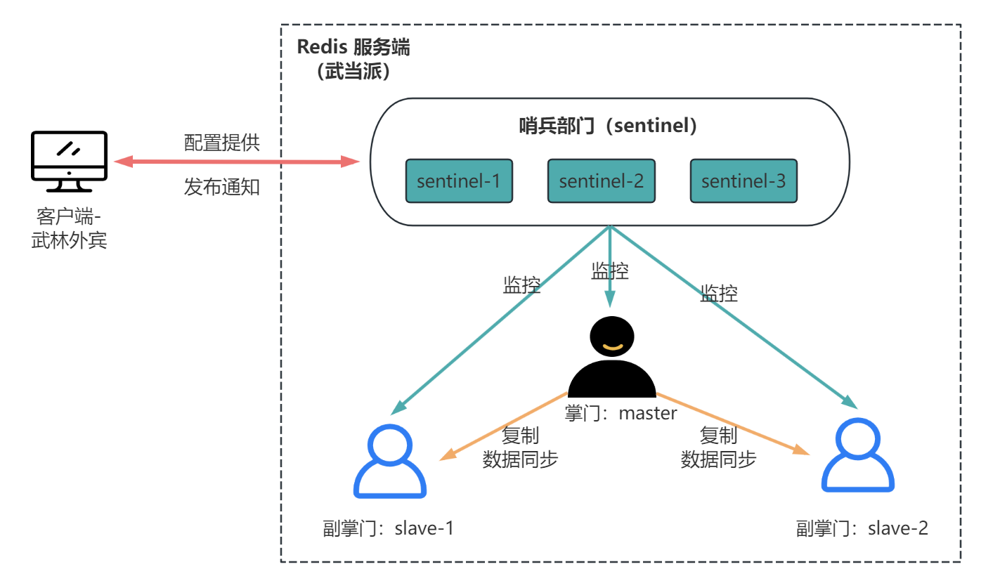
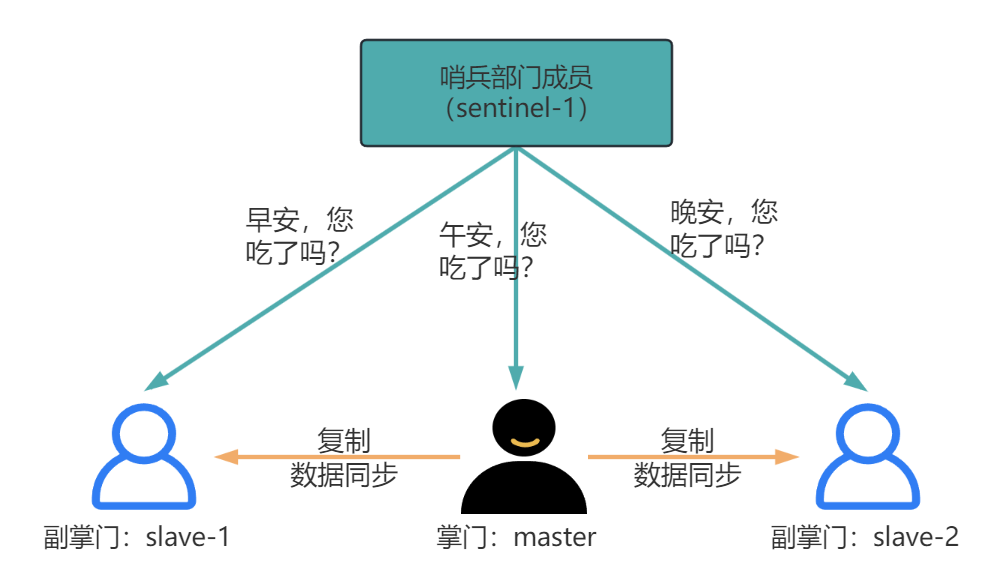
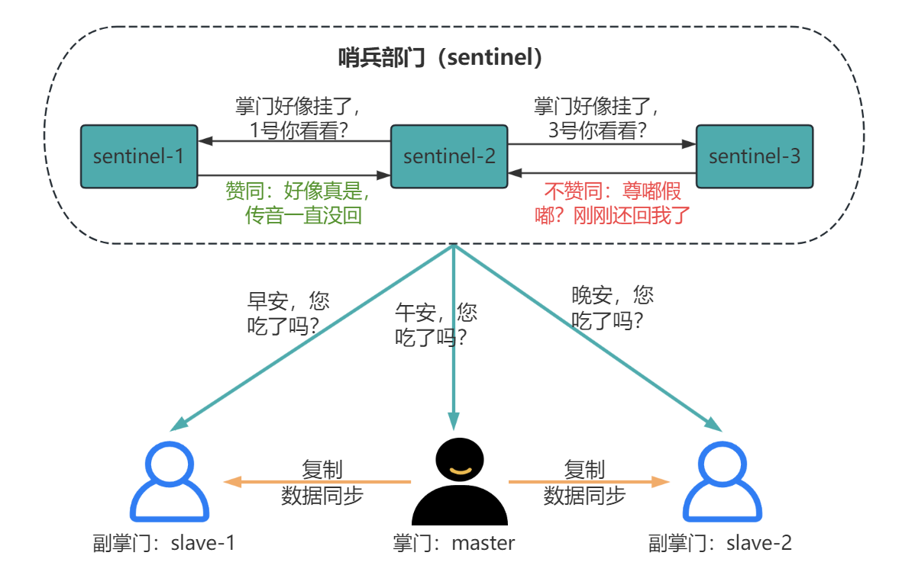
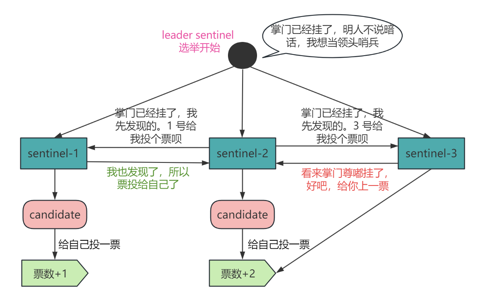
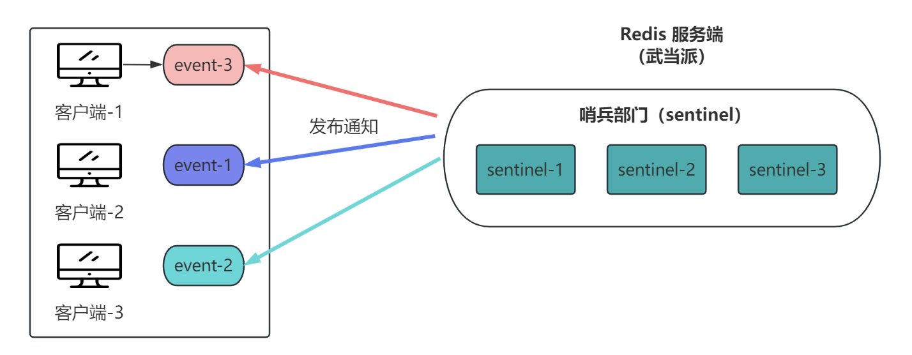

大家好，我是小❤，一个漂泊江湖多年的 985 非科班程序员，曾混迹于国企、互联网大厂和创业公司的后台开发攻城狮。

## 1. 引言

之前我们聊过 Redis 的主从同步（复制）主题，这期我们来聊 Redis 的哨兵机制。

> 时光穿梭机：
>
> * [救命！只有我还不明白Redis主从复制的原理吗？](https://mp.weixin.qq.com/s?__biz=MzI5Nzk2MDgwNg==&mid=2247485225&idx=1&sn=761feb02c973cc7b2ecdcc9b9124b070&chksm=ecac5320dbdbda36d147b027db413b324b5e0d31760e71b5b52fbec9af51bb3261475a27b973#rd)

上期我们说过，在实际互联网架构上，Redis 为了保证高可用和分担读写压力，几乎都会采取主从复制的部署架构。

一方面让架构`易于扩展`，另一方面防止`单体故障`：当主库挂了，可以立即拉起从库，不至于让业务停滞太久。

### 江湖门派林立

如果把所有互联网应用看做是一个江湖，Redis 是武林中的门派，为了让门派更加稳定，每个门派都有掌门和副掌门。

在一些小门派里面，掌门仙逝以后，都会开追悼大会，然后从副掌门中再选一个掌门出来主持大局，这个过程可能会持续好几天。

但是，在一些大门派里面，比如武林之中一些有名望的派别：武当、少林（如淘宝、微信）之流，却不可一日无掌门。

放到现代双 11，电商应用挂了几秒钟可能都是千万甚至亿万级别的损失，所以对系统的高可用性要求很严。

> 一般大型应用的可用性都需要达到 4 个 9：即 99.99%，一年宕机时间不超过 53 分钟。

那以武当（淘宝 Redis）为例，需要如何保证门派的稳定性呢？

首先我们得依赖副掌门机制（主从复制机制）做备份，上篇我们已经说过了。

这期我们来说一下在掌门挂了后如何高效交接事务（故障转移）

武林门派大会 2.8 后，每个门派有一个单独的部门来负责掌门交接事宜——哨兵部门。

> Redis2.8 版本以后提供的**哨兵机制（Sentinel）**。

## 2. 哨兵部门的职责

在武当派，张真人之下有武当七侠，从声望和资历来看，派内将前两位弟子作为副掌门人选，他们平时也会辅助掌门处理门派事务。

而哨兵部门的职责，主要有四点：

* 监控：检查掌门和副掌门状态，每日多次为它们把脉，查看他们的生命体征和情绪状态是否正常；
* 自动故障转移：当掌门人生病或者嗝屁了后，立马从副掌门选一个代掌门处理门派事务；
* 配置提供者：外宾（客户端）来访时，通过哨兵部门来获取掌门人的联系方式；
* 通知：掌门更换以后，哨兵部门将新掌门的结果发布到武林中。

其中监控和故障转移功能主要是为了维系系统的稳定，可以第一时间感知几位掌门的状态，当掌门人生病或者嗝屁以后，能快速地选出一个新的掌门接替门派事务。

而配置提供和通知功能主要是和客户端交互，可以理解为哨兵部门是外宾和门派建立联系的桥梁。

并且，当掌门人易主以后，哨兵机制会向客户端发布新的主节点地址，仿佛在向武林宣布，新掌门联系方式变了，望周知！

## 3. 哨兵部门如何工作

哨兵部门这么强横，那它究竟是怎么做到的呢？接下来我们从分别从**监控、节点切换、通知机制及旧主恢复**来详细介绍一下。

### 3.1 监控-如何感知掌门的生命体征

虽然说是监控，但哨兵只是对他们的存活状态是否正常做一个判断，门派事务哨兵是一概不参与的（毕竟人家是掌门&副掌门，哨兵还管不着这么宽）！

在武当派，不管是哨兵部门的成员，还是副掌门之上，都会一招 “千里传音”，以便更好地传递事务消息。

那怎么监控生命体征呢？

如图所示，哨兵成员会定期给掌门人们千里传音，各掌门如果定时回复，那掌门人就处于正常状态。

#### 主观下线

在 Redis 中，哨兵也是会每隔 1 秒给主从节点发送 PING 命令，如果在一定时间内收到响应，就说明节点正常运行。

如果任意一个主/从节点没有在规定时间内（`down-after-milliseconds` 可配置，单位是毫秒）响应，哨兵就认为这个节点挂了，将其标记为**主观下线**。

为什么是主观下线呢？

因为 Redis 中为了保证监控的稳定性，当一个哨兵没收到回复时，就说明这个节点有概率挂了，但是不一定完全是节点的问题，也有可能是网络故障，或者阻塞了导致消息没有正常传播。

在武当，哨兵部门就出过洋相！那天，某个哨兵监控到掌门人长时间不回复消息，于是主观判断掌门人嗝屁了。于是开始换掌门，发通知，一顿操作下来，掌门人又传来回复说晚饭吃得有点饱，千里传音可能声音比较小，哨兵没听到，这让武林同道看尽了笑话，至今传为茶余饭后的谈资。

#### 客观下线

于是，为了防止这种情况的发生，哨兵部门决定加派人手，每个部门至少 3 个人，每次判断掌门嗝屁时如果有多个人得出相同的判断，才能说明这个判断有效。

在 Redis 里，每次部署哨兵集群时至少三台机器来部署，当某个哨兵判断节点**主观下线**后，就会向其它哨兵发起命令，其它哨兵根据自己的监控情况，投出赞同或者反对节点已下线的票。

当多数节点（比如 3 个哨兵有 2 个都认可，`quorum` 可配置这个值）赞同后，该节点会被标记为**客观下线**。

当判断**主节点客户下线**后，哨兵机制会进行故障转移操作，即选出一个从节点升级为主节点。不难理解，如果掌门人挂了，则哨兵部门会重新选一个新的掌门，来接替门派事务。

### 3.2 节点切换：如何选出新掌门

#### 领头哨兵：主持掌门更换仪式

首先，哨兵部门会先选一个领头哨兵（`leader sentinel`），来主持换掌门的仪式。

换掌门仪式毕竟和下任掌门息息相关，所以每个哨兵都想当这个 `leader`。

领头哨兵的选举需要从领头候选人（`leader candidate`）里面选，而只有发现掌门客观下线的哨兵成员才可以成为候选人。

通过所有哨兵节点给候选人投票，至少得票数过半的候选人才能成为领头哨兵。

> 在 Redis 里面，参选领头哨兵的候选人不止需要拿到半数以上的票，还需要超过配置文件中的 `quorum` 值才可以成为 `leader sentinel`。

所以，哨兵个数和 Redis 的节点数一样，一般为单数个。

#### 主从故障转移：选出新掌门

每个候选哨兵在得知掌门可能挂了之后，就会给自己投一票，。d

也很简单，即只要发现掌门客观下线的哨兵成员，

哨兵集群中选出一个 `leader哨兵` 之后，就开始进行主从故障转移。

就好比是选掌门，那谁来当这个新掌门呢？

哨兵部门制定了一个策略，会从副掌门的向上管理能力、业务熟悉程度以及资历来考虑。对应 Redis 里选出主节点的三大策略：优先级、复制进度、ID 号。

##### 1. 优先级

哨兵会根据从节点的优先级进行排序，优先级越小排名越靠前。

在门派中，这可能是看哪个副掌门的向上管理做得更好，和领导走得更近，毕竟，掌门在选接班人时也会有优先级的侧重。

##### 2. 复制程度

如果节点的优先级不分上下，则查看数据复制的 `slave_repl_offset` 参数（不明白这个参数的，可以看我上一篇文章：深入浅出Redis主从复制），并选择接收数据更多的那个从节点。

这就好比掌门不偏不倚，对待副掌门都一视同仁。这就得考量副掌门的业务熟悉能力了，谁在掌门那里学的本事越多，谁就来当这个新掌门。

##### 3. 节点ID号

当优先级和复制程度都相同时，就选择从节点 ID 较小的那个（说明排行越高）。

当副掌门的受重视程度和能力不相上下时，就得论资排辈了，看谁资历更高，排行更靠前，就来当这个新掌门。

### 3.3 通知机制：更换掌门后告知武林同道

在哨兵机制的协助下，从节点晋升为主节点，这时机器节点的 IP 等信息都更换了，所以需要知会客户端和新的主节点进行通信，这是通过发布/订阅者机制实现的。

每个门派可能有诸多事宜，但是客户端（外宾）不会关心所有的事件，它们只关心一些像掌门更换这种大事情。

在 Redis 里面，哨兵机制提供的订阅事件主要有如下三种：

1. 主节点下线事件：如节点主观下线（`+sdown`）、客观下线（`+odown`）等；
2. 从库更新配置事件：如重新同步（`+slave-reconf-sent`）、主从同步完成（`+slave-reconf-done`）等；
3. 主节点更换：主库地址发生变化（`+switch-master`）。

如果客户端订阅了主节点更换的事件，就会收到哨兵的通知事件，进而调整自身连接的节点信息。

### 3.4 旧主恢复：老掌门出关，成为副掌门

所谓一山不容二虎，哨兵部门在更换掌门后要做的职责是，继续监控老掌门的体征信息。一当老掌门有消息回复时，哨兵部门就会告诉它，现在已经有新掌门人了，而它可以担任副掌门。

Redis 中，哨兵集群会向重新上线的旧主节点发送 `SLAVEOF` 命令，让它成为新主节点的从节点。

## 4. 小结

在真实的互联网应用上，Redis 为了保证高可用和分担读写压力，几乎都会采取主从复制的部署架构。一方面让架构`易于扩展`，另一方面防止`单体故障`：当主库挂了，可以立即拉起从库，不至于让业务停滞太久。

而首次主从复制包括**建立连接，RDB 同步和命令同步**三个阶段。

为了保证同步的效率，除了第一次需要`全量同步`以外，例如当主从节点断连后，则只需要`增量同步`，这是由主从库的复制偏移量以及主库的 `repl_backlog_buffer` 复制积压缓冲区来控制的。

好了，以上就是本文的所有内容了，希望今天的文章能让大家更深入地了解 Redis 主从同步，并在实际工作或面试中用起来，探索更多的细节。

如果觉得文章有所启发或收获，不妨点赞、分享，加入在看，这对我是最大的鼓励！

ღ( ´･ᴗ･` )比心

如果你有任何问题或想了解更多，也随时在评论区提问，谢谢你的阅读！

我是小❤，我们下期再见。

#### 参考资料

Redis主从同步原理：https://baijiahao.baidu.com/s?id=1772624108846137125&wfr=spider&for=pc

Redis高可用之主从架构：https://www.cnblogs.com/wzh2010/p/15886795.html

解读Redis主从同步机制：https://zhuanlan.zhihu.com/p/650722037