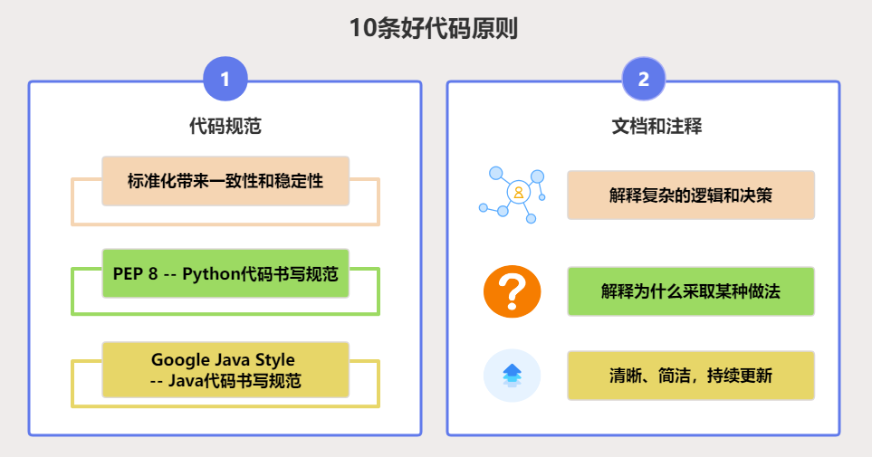
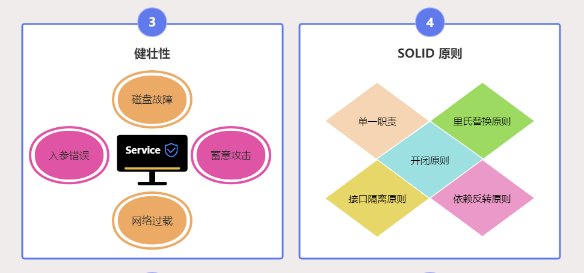
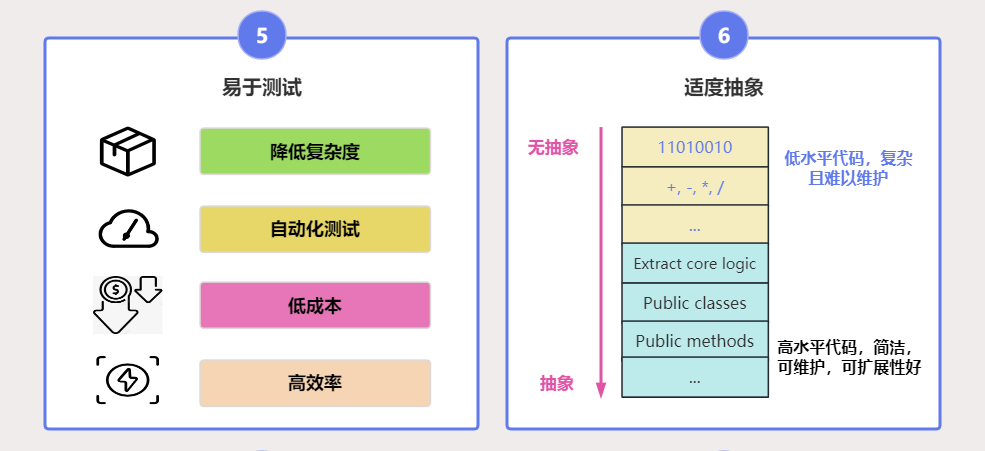
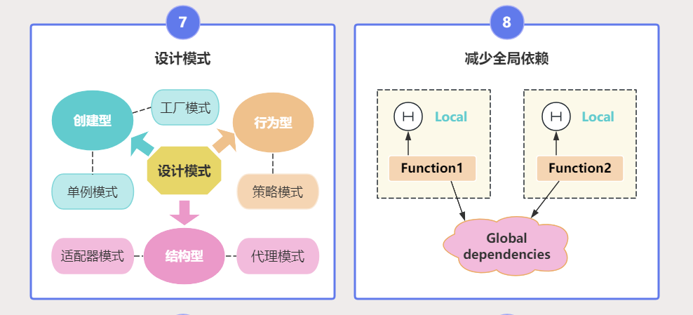
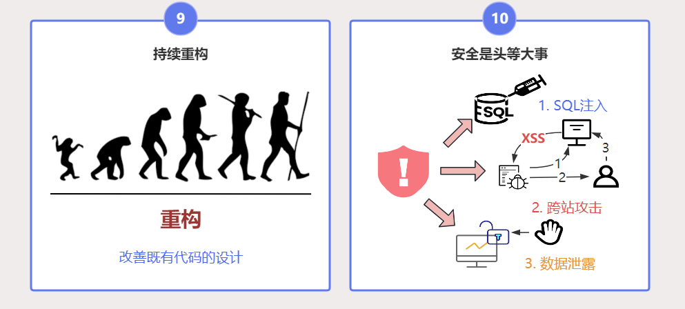

大家好，我是小❤，一个漂泊江湖多年的 985 非科班程序员，曾混迹于国企、互联网大厂和创业公司的后台开发攻城狮。

# 引言

编程界都知道，代码是一种艺术 —— 它是对技术职责和美学眼光的完美融合。

正如一名工匠在雕琢他的作品，软件开发者在编码时也需要遵守一定的原则与标准，确保软件的**质量、可维护性和可扩展性**。

仅仅编写功能代码是不够的！

我们需要掌握并实践好代码原则，使我们的代码像优雅的艺术品一样经得起时间的考验，**让你的代码可以在键盘上跳“华尔兹”**。

接下来，让我们一起探索能在键盘上跳舞的好代码应该遵循的十大原则。

# 01 遵循代码规范

参与一个项目的开发就像是加入一个乐队，每个人都需要在同一个节拍上演奏。同理，代码规范就是确保每个程序员在同一节拍上编码的指挥棒。它定义了变量命名、缩进、注释格式等编码标准，就像交通信号灯一样提供了统一的行动指导。

无论是 `PEP 8`、`Google Java Style` 还是其它，坚持一套约定俗成的代码规范，可以保证代码质量的一致性与可读性。

遵循这些规范不仅使得代码整洁，也让其他开发者更容易理解你的意图，就像是在代码间搭建了一座沟通的桥梁。

# 02 文档和注释

假想一下，你在参加一个宝藏寻宝游戏，但是没有地图，没有线索，这将会是多么困难。同样地，在没有文档和注释的代码中导航就像在黑暗中摸索。

良好的文档和注释就是那张宝图，它们详细说明了代码的功能、用途及其工作方式，为未来的开发者或维护者对代码库进行迭代和扩展铺平道路。

请记住，写注释就像写留言一样，不仅要简明扼要，更要让接收者能迅速理解信息的核心。

好的代码应该编写清晰的文档和注释来解释复杂的逻辑和决策，注释应该解释为什么采取某种做法（`Why`），而不是解释具体做什么（`What`，这是代码内容应该做的）。文档和注释应该清晰、简洁，并持续更新。

# 03 健壮性

软件就像是一架飞机，在飞行中会遭遇各种气候和异常情况。一个健壮的软件能够灵活应对这些情况，保持平稳飞行。

在编程中，这意味着我们要对各种输入情况做好准备，避免软件因异常而崩溃。比如，设计良好的错误处理逻辑能够在遭遇问题时给出明确的指示，而不是让用户对一个神秘的错误代码感到茫然。

并且，好的代码都应该能处理各种预期外的攻击，而不会发生崩溃或产生不可预测的结果，最常见的做法就是使用 `try、recover` 等机制捕获并处理异常。

# 04 遵循SOLID原则

单一职责（`Single Responsibility`）、开闭原则（`Open/Closed`）、里氏替换（`Liskov Substitution`）、接口隔离（`Interface Segregation`）和依赖反转（`Dependency Inversion`）——这五大原则（简称 SOLID）是编写扩展性强且容易维护代码的基石。

其中，单一职责原则让每个模块像乐队中的独奏家，只负责一个任务。开闭原则确保了软件和印刷术一样，新文字的加入不需要改变原有的文字。依赖倒置原则则像是汽车的引擎，可以随时更换而不改变整辆汽车的外观。

掌握好 SOLID 原则，我们就能编写出具有良好结构和扩展性的软件。

# 05 易于测试

测试软件就像是举办一场无数次的彩排，如果演员们总是即兴表演，那么正式演出免不了出错。

同理，我们编写的代码必须能够被轻松地测试，这意味着我们在编码时就要考虑到测试的方方面面。一个好的实践是采用**测试驱动开发（TDD）**，先写测试，然后编码来满足测试。

这样的开发模式鼓励简洁的设计，增强了代码的可靠性与质量。

软件的可测试性尤为重要，特别是线上代码。好的代码应该易于测试，一方面需要努力**降低每个函数和组件的复杂度**，让测试变得简单直观；另一方面应该支持**自动化测试**，以确保其行为符合预期。

# 06 适度抽象

抽象是一个很美妙的概念，它就像是艺术家在画布上简化形状和颜色，提取出事物的本质。

代码中的抽象消除了重复和不必要的复杂度，创造了**易于理解和重用**的组件。但是，就像调味料一样，过多会掩盖本味，过少则显得索然无味。

编程时，度的把控需要经验的积累和实践的锻炼。好的代码应该找到**适中的抽象层次**，既不过度设计，也不应忽视长远的可拓展性和可维护性。

# 07 利用设计模式，但不要过度设计

设计模式是前人智慧的精华，它们提供了问题解决的模板。我们可以将其看作建筑中的标准构件，帮助我们搭建软件的结构。

然而，每个项目都是独特的，过度引入设计模式就像在小屋里安置了宫殿的楼梯，显得不合时宜，不必要的复杂性会影响代码的可理解性和维护成本。设计时，我们要恰如其分地采用设计模式，确保它们能真正为解决问题服务。

设计模式是前人编码的经典指南，它能帮助我们解决一些常见问题。但是，每一种模式都有它的应用场景，过度使用或错误地使用设计模式，可能会让你的代码变得更加复杂和难以理解。

# 08 减少全局依赖

全局变量和对象就像是一张蜘蛛网，任何一个部分的震动都能牵动整个网。代码中的全局依赖增加了各组件间的耦合度，使变化产生连锁反应，引发意想不到的问题。

使用依赖注入和模块化，可以最小化全局依赖，使代码更加模块化、测试和维护也更为简单。

# 09 持续重构

在软件开发的世界中，重构不仅是一种好习惯，更是对未来的一种投资。

我们知道，即使一座城市的规划初期再完美，随着时间的推移，一些布局需要调整，设施需要升级。软件开发亦是如此，源代码也需要随着需求的演变和技术的进步而不断演进。

经常性的重构有助于保持代码的清洁和组织，就像是定期整理和优化城市规划。

# 10 安全是头等大事

在编写代码时，安全性应当是第一考虑的。这就像是构建一座大楼，必须确保结构的坚实且富有弹性，以防自然灾害。

代码中的安全措施需预防SQL注入、跨站脚本攻击等，就好比建筑师在设计时加入地震防范功能。每一行代码都应经过安全性考量，以避免成为未来潜在的安全漏洞。

# 小结

有个伟人曾经说过：代码不该是枯燥的业务说明，而应是一个充满活力的生态系统，而上述的每一个原则和实践都是维持这个生态平衡的关键要素。

**通过把握这些原则，我们可以创造出令人赞赏的软件艺术品，而不是业务 shishan！**

在键盘的敲击声中，我们不仅仅是在编写代码，我们还在创造数字世界中的诗篇，可能被无数用户阅读和体验的诗篇。

好了，以上就是本文的全部内容了，如果觉得文章有所启发或收获，不妨点赞、分享，加入在看，这对我是最大的鼓励！

如果你有任何问题或想了解更多，也随时在评论区提问，谢谢你的阅读！

ღ( ´･ᴗ･` )比心

我是小❤，我们下期再见。