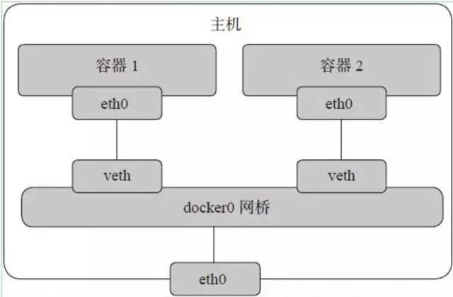

### 1. docker与虚拟机的关系

#### 1.0 docker是什么

Docker 是一个用于开发、发布和运行应用程序的平台，docker 可以将应用程序和基础架构分离，实现快速交付、测试和部署代码。

#### 1.1 相同点

Docker 和虚拟机一样，都是隔离资源，保证系统安全，并提高资源的利用率。

#### 1.2 不同点

虚拟机虚拟的是硬件，需要在上面安装一个操作系统才能运行程序。硬件虚拟机和操作系统都比较重，这就意味着要消耗大量的 CPU、内存和硬盘等系统资源。

而 docker 容器直接利用了下层的计算机硬件和操作系统，因此比虚拟机少了一层，CPU、内存和硬件就相对少一点，属于轻量级隔离。

所以 docker 的运行效率高很多，比如一个安装 ubuntu，在虚拟机上需要几个 G 的空间，而一个 ubuntu 镜像只有几十M，启动也非常快，在个人 PC 同时跑几十个镜像都是没问题的。


### 2. 镜像和容器

#### 2.1 docker 镜像

Docker 镜像是 docker 容器的源代码，镜像用于创建容器。镜像的构建命令是 “docker build”，也可以写成 Dockerfile 脚本来创建 docker 镜像。


#### 2.2 docker 容器

Docker 容器包括应用程序及其所有的依赖项，作为操作系统的独立进程运行。

### 3. DockerFile里有哪些重要参数，描述一下

- From：指定基础镜像，该脚本从哪个基础上创建
- Label：指定镜像标签
- Run：docker 脚本执行到这一步要运行哪些命令
- COPY/ADD：将虚拟机/服务机里的文件拷贝到容器中，其中 COPY 的 SRC 只能是本地文件

#### 1. CMD

CMD，docker 脚本执行完成后，容器生成好之后要执行的命令。指定一个容器启动时要运行的命令，类似于 docker run 里面的指令，一个 Dockerfile 脚本中只能有一条 CMD 指令有效。比如：

```shell
CMD ["/bin/bash", "-l"]
相当于
docker run -t -i test /bin/bash
```

PS：CMD 运行的命令放在一个数组结构内，否则，docker 会在命令前加上 /bin/sh -c 来执行它们。docker run 中添加指令时，会覆盖 CMD 中的指令。

#### 2.ENTRYPOINT

和 CMD 指令类似，唯一区别是：docker run 命令行中的指令会被当做参数再次传递给 ENTRYPOINT 指令中指定的命令。

```shell
ENTRYPOINT ["/usr/sbin/nginx", "-g", "daemon off;"]
相当于
ENTRYPOINT ["/usr/sbin/nginx"] + docker run -t -i test -g "daemon off;"
```

也可以和 CMD 搭配使用：

```shell
ENTRYPOINT ["/usr/sbin/nginx"]
CMD ["-h"]
相当于
docker run ... /usr/sbin/nginx -h
```

#### 3.WORKDIR

容器内部设置的工作目录，ENTRYPOINT、/ 及 CMD 指定的命令会在这个目录下执行，和 docker run -w 相似：

```shell
WORKDIR /opt/webapp
CMD ["/bin/bash"]
相当于
docker run -ti -w /opt/webapp test /bin/bash
```

#### 4.ENV

镜像构建过程中，设置环境变量

```shell
ENV PATH /home/rvm
RUN gem install unicorn
相当于
PATH /home/rvm RUN gem install unicorn
相当于
docker run ... -e "PATH=/home/rvm"
```

#### 5.VOLUME

为基于镜像创建的容器添加卷，一个卷是可以存在于一或多个容器内的特定目录，这个目录可以和宿主机共享数据并进行持久化。

1. 卷可以在容器间共享、重用；
2. 对卷的修改是实时生效的。

卷功能让我们可以对一些重要数据（源代码、数据库、日志）实时管理。

```shell
# 为基于此镜像创建的容器，创建一个/opt/project的挂载点，可指定多个
VOLUME ["/opt/project"]
# 同样地，docker run cp 也可以用于挂载
docker run ... cp /dir1 /dir2 
```

#### 6.ADD

ADD，可将构建环境（包括宿主机+环境网络）的文件和目录复制到镜像中。比如

```shell
# 将绝对路径下的文件复制到镜像中
ADD /data/1.txt /root/1.txt
# 将 last.tar.gz 自动解压缩到镜像的 /var/word 目录下
ADD last.tar.gz /var/word
```

除此之外，ADD 还支持 URL 比如 ADD http://google.com/last.zip /root

PS：ADD指令会让构建缓存无效，Dockerfile 中 ADD指令后续指令都将不能继续使用之前的构建缓存。

#### 7.COPY

COPY 和 ADD 非常类似，区别在于

- COPY 不能解压缩文件；
- COPY 源路径必须是一个文件或目录，且文件或目录在当前构建环境的相对路径下；
- COPY 目的位置必须是容器内部的一个绝对路径。

如果目的位置不存在，Docker 会自动创建所需要的目录结构。

#### 8.LABEL

Docker添加元数据，以键值对的形式展现：

```shell
LABEL version = "1.0" type = "Date" role = "web"
可在 docker insepct {容器ID} 中查看
```

#### 9.ARG

定义在 docker build 命令运行时的变量，构建之前需要添加 --build-arg 标志：

```shell
ARG build 
ARG webapp_user=user
```

其中，第二条 ARG 会附上默认值，可以在 docker run --build-arg build=123 -t test 修改。

#### 10.ONBUILD

该指令能为镜像添加触发器：当这个镜像被其它镜像作为基础镜像时，该镜像中的触发器便会执行。

触发器会在构建过程中加入新指令，这些新指令会紧跟 FROM 之后执行，如：

```shell
ONBUILD ADD . /app/src
ONBUILD RUN cd /app/src && make
# 将以上代码为Dockerfile构建的镜像被FROM引用时，ONBUILD生效
```


### 4. 容器的状态有哪些

四种状态：运行、已停止、重新启动、已退出

### 5. docker 常用命令

```shell
docker images # 查看本地镜像
docker search tomcat # 在 Docker Hub 上搜索 tomcat 镜像
docker pull tomcat[:version] # 下载特定版本的镜像，不指定version则下载最新版本
docker rmi -f [镜像id] # 删除镜像
docker run --name mynginx -d nginx:latest # 将镜像放入容器中运行
docker ps/docker ps -a # 查看运行中的容器/所有容器
docker stop/start/restart/rm [容器id or 容器名] # 停止/开始/重启/删除容器
docker cp [容器id]:/[文件路径] [宿主机文件路径] # 从容器拷贝文件到宿主机
docker cp /localfile [容器id]:/www/ # 从主机到容器
docker logs -f -t --tail 10 [容器id or 容器名] # 打印日志

docker run -d -p --name nginx -v /home/nginx:/usr/html nginx # 挂载本地文件目录到容器html目录
docker kill $(sudo docker ps -q) # 停止所有正在运行的容器，-q的意思是静默输出，只输出容器id
```

### 6. docker 网络模式

1）Bridge

即 Linux 的网桥模式，docker 安装完成后会在系统默认创建一个 Linux 网桥，名称为 docker0 并为其分配一个子网。针对由 docker 创建的每一个容器，均为其创建一个虚拟的以太网设备（veth peer）。其中一端关联到网桥，另一端映射到容器类的网络空间。然后从这个虚拟网段中分配一个 IP 地址给这个接口，其网络模型如下：



2）Hosts 模式

即共用主机的网络，它的网络命名空间和主机相同，使用宿主机的 Namespace、IP 和端口。


3）Container 模式

使用已存在的容器网络 Namespace，相当于多个容器使用同一个网络协议栈，k8s 的 pod 中多个容器之间的网络和存储就是使用的这种模式。


4）None 模式

容器创建时，不指定任何网络模式，由用户在适当的时候去指定。