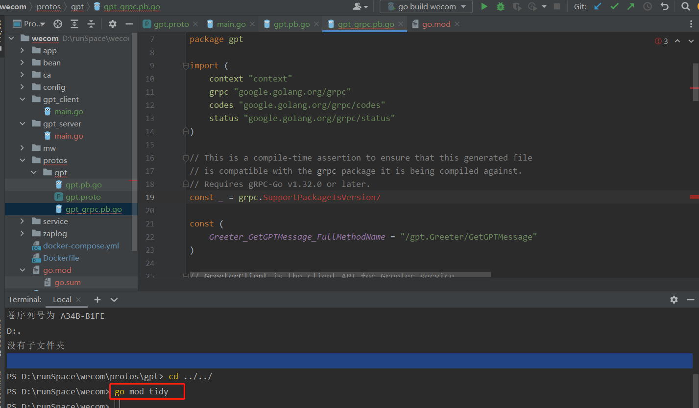

1.Protobuf 简介

Proto Buffer 协议（简称 protobuf，下文同）和 json、xml 一样，是一种数据序列化方式（序列化，就是把内存中一段数据转化成二进制的形式，然后进行网络传输或存储）。

* protobuf 是跨语言、跨平台的序列化协议；
* protobuf 不只是用于数据传输，还可以做数据存储；

不同于 json 和 xml ，protobuf在使用时需要先定义 IDL（数据定义规则），其好处是传输时数据体积更小，传输速度更快。

gRPC 的传输协议用的是 protobuf，所以我们要先学会 protobuf 文件的编写规则。


2.Protobuf 定义数据结构

message 是 protobuf 协议中最基本类型，相当于 Java 里面的 class 对象，Go 里面的 struct 结构体。每个 message 里有一或多个字段，相当于对象的参数。

```protobuf
syntax = "proto3";

/*现在很少用 proto2，所以需指定版本 proto3*/
package gpt;

message GPTRequest {
  uint64 biz_id = 1;
  string session_id = 2;
  float query = 3;
  bool need_dump = 4;
  enum Sport { //枚举类型
    Basketball = 0;
    Run = 1;
    Swim = 2;
  }
  Sport sport = 5;
  repeated string user_id = 6; //相当于[]string列表
  DriveParam client = 7; //对象类型
  repeated DriveParam drive_params = 8; //对象列表类型，相当于[]DriveParam
  map<uint64, string> assignments = 9; //map类型
  reserved "name", "age";
}

message DriveParam {
  string key = 1;
  string value = 2;
  string type = 3;
}
```

解释：


目录结构：


3.gRPC实现

步骤：

1. 编写 protobuf 文件
2. 生成 Go 语言代码
3. 编写客户端，端口监听
4. 编写服务端，请求数据

编写 protobuf【protos/gpt/gpt.proto】

```go
syntax = "proto3";

option go_package = "./;gpt";

package gpt;

service Greeter {
  rpc GetGPTMessage (GPTRequest) returns (GPTReply) {}
}

message GPTRequest {
  string content = 1;
}

message GPTReply {
  string message = 1;
}
```


使用 protoc 工具生成 Go 语言代码

安装 proto 包，不同的电脑系统安装包是不一样：

- [Windows 64位 点这里下载](https://link.juejin.cn/?target=https%3A%2F%2Fgithub.com%2Fprotocolbuffers%2FProtoBuf%2Freleases%2Fdownload%2Fv3.20.2%2Fprotoc-3.20.2-win64.zip)
- [Windows 32位 点这里下载](https://link.juejin.cn/?target=https%3A%2F%2Fgithub.com%2Fprotocolbuffers%2FProtoBuf%2Freleases%2Fdownload%2Fv3.20.2%2Fprotoc-3.20.2-win32.zip)
- [Mac Intel 64位 点这里下载](https://link.juejin.cn/?target=https%3A%2F%2Fgithub.com%2Fprotocolbuffers%2FProtoBuf%2Freleases%2Fdownload%2Fv3.20.2%2Fprotoc-3.20.2-osx-x86_64.zip)
- [Mac ARM 64位 点这里下载](https://link.juejin.cn/?target=https%3A%2F%2Fgithub.com%2Fprotocolbuffers%2FProtoBuf%2Freleases%2Fdownload%2Fv3.20.2%2Fprotoc-3.20.2-osx-aarch_64.zip)
- [Linux 64位 点这里下载](https://link.juejin.cn/?target=https%3A%2F%2Fgithub.com%2Fprotocolbuffers%2FProtoBuf%2Freleases%2Fdownload%2Fv3.20.2%2Fprotoc-3.20.2-linux-x86_64.zip)


再安装 golang 的插件：

> go install google.golang.org/protobuf/cmd/protoc-gen-go@latest

至此，我们的工具包就安装完成了。


安装完成之后，进入 proto 文件的目录：

> cd protos/gpt/

生成 Go 代码：

> protoc --go_out=. --go_opt=paths=source_relative     --go-grpc_out=. --go-grpc_opt=paths=source_relative gpt.proto


这时，当前目录下有 3 个文件：

> gpt.pb.go
>
> gpt.proto
>
> gpt_grpc.pb.go


添加依赖：

> go mod tidy




4.编写业务代码，实现服务端

导入 grpc 的包

> go get google.golang.org/grpc

编写服务端业务逻辑【gpt_server/main.go】

```go
package main

import (
	"context"
	"flag"
	"fmt"
	"google.golang.org/grpc"
	"log"
	"net"
	pb "wecom/protos/gpt"
)

var (
	port = flag.Int("port", 50051, "port")
)

type server struct{
	pb.UnimplementedGreeterServer
}

func (s *server) GetGPTMessage(ctx context.Context, in *pb.GPTRequest) (*pb.GPTReply, error) {
	return &pb.GPTReply{Message: "gpt response"}, nil
}

func main() {
	flag.Parse()
	list, err := net.Listen("tcp", fmt.Sprintf(":%d", *port))
	if err != nil {
		log.Fatalf("listen failed, %v", err)
	}
	s := grpc.NewServer()
	// 服务注册
	pb.RegisterGreeterServer(s, &server{})
	log.Printf("listen success, %v", list.Addr())
	if err := s.Serve(list); err != nil {
		log.Fatalf("server failed, %v", err)
	}
}
```

启动 main 函数，成功：


接下来，我们再实现一个客户端绑定到端口，以请求服务端的消息。

5.客户端逻辑

从上面的服务端实现来看，gRPC 实现是非常简单的，只要跟着 protobuf 生成的模板填写业务代码就可以了！这个过程，我们只需要关注服务端和客户端的连接，但它们的连接也没有很高深，和我们 HTTP 的监听及绑定是一样的原理。

客户端业务代码【gpt_client/main.go】

```go
package main

import (
   "context"
   pb "dm-lite/resource/proto/gpt"
   "flag"
   "google.golang.org/grpc"
   "google.golang.org/grpc/credentials/insecure"
   "log"
)

const defaultName = "world"

var (
   addr = flag.String("addr", "localhost:50051", "")
   name = flag.String("name", defaultName, "")
)

func main() {
   flag.Parse()
   conn, err := grpc.Dial(*addr, grpc.WithTransportCredentials(insecure.NewCredentials()))
   if err != nil {
      log.Fatalf("Dial failed, %v", err)
   }
   defer conn.Close()
   c := pb.NewGreeterClient(conn)
   ctx := context.Background()
   r, err := c.GetGPTMessage(ctx, &pb.GPTRequest{
      Content: "hello",
   })
   if err != nil {
      log.Fatalf("GetGPTMessage failed, %v", err)
   }

   log.Printf("get reply: %v", r.GetMessage())
}
```

当服务端监听 50051 端口时，我们运行客户端就可以调用 gRPC 的 GetGPTMessage 方法。运行客户端 main 函数，获取结果：


至此，我们的 gRPC 接口就实现了。


4.流式 RPC

上述实现了简单模式的 gRPC 接口，即：一问一答式。如果比作面试中的场景，简单模式是这样的：

> （面试官）问：你知道 gRPC 吗？
>
> （候选人）答：知道，gRPC 是 Google 发起的一个远程过程调用的系统
>
> （面试官）问：还有呢？
>
> （候选人）答：gRPC 基于 HTTP/2 协议传输
>
> （面试官）问：还有呢？
>
> （候选人）答：它使用 Protocol Buffers 作为接口描述语言
>
> （面试官）问：咱能不能一次性说完？！
>
> （候选人）答：......

那面试官有要求，咱也不能不做，于是，流式模式 RPC 出现了：

> （面试官）问：你知道 gRPC 吗？
>
> （候选人）答：知道，gRPC 是 Google 发起的一个远程过程调用的系统...它是基于 HTTP/2 协议传输...并且使用 Protocol Buffers 作为接口描述语言。
>
> （面试官）心想：不错！相比于挤牙膏，我更喜欢竹筒倒豆子！


接下来，我们在 proto 文件中添加一个客户端流式 RPC 接口

> ```protobuf
> rpc GetGPTStreamData (GPTRequest) returns (stream GPTReply) {}
> ```

完整代码【gpt/gpt.proto】

```protobuf
syntax = "proto3";

option go_package = "./;gpt";

package gpt;

service Greeter {
  rpc GetGPTMessage (GPTRequest) returns (GPTReply) {}
  rpc GetGPTStreamData (GPTRequest) returns (stream GPTReply) {}
}

message GPTRequest {
  string content = 1;
}

message GPTReply {
  string message = 1;
}
```

依据 gRPC 开发的三步走策略，我们还是先通过 proto 文件生成模板 Go 代码：

> protoc --go_out=. --go_opt=paths=source_relative     --go-grpc_out=. --go-grpc_opt=paths=source_relative gpt.proto


添加流式服务端逻辑【gpt_server/main.go，注意，下面代码是新增，不是覆盖】：

```go
func (s *RPCServe) GetGPTStreamData(in *pb.GPTRequest, gptStream pb.Greeter_GetGPTStreamDataServer) error {
   log.Printf("GetGPTStreamData Request: %v", in.GetContent())
   client := openai.NewClient(token) // token是OPENAI_API_KEY，需要到openai官网申请
   ctx := context.Background()

   // 请求GPT3.5的流式处理接口参数
   req := openai.ChatCompletionRequest{
      Model:     openai.GPT3Dot5Turbo,
      MaxTokens: 2048,
      Messages: []openai.ChatCompletionMessage{
         {
            Role:    openai.ChatMessageRoleUser,
            Content: in.GetContent(),
         },
      },
      Stream: true,
   }
   // 获取流式数据
   stream, err := client.CreateChatCompletionStream(ctx, req)
   if err != nil {
      log.Fatalf("ChatCompletion failed, %v", err)
      return err
   }
   defer stream.Close()

   log.Println("Send reply:")
   for {
      response, err := stream.Recv()
      // 数据传输完成标识
      if errors.Is(err, io.EOF) {
         log.Printf("Stream finished")
         break
      }

      if err != nil {
         log.Fatalf("Stream error, %v", err)
         return err
      }

      // 只需要文本内容
      data := &pb.GPTReply{
         Message: response.Choices[0].Delta.Content,
      }
      // 发送流式数据到客户端
      if err := gptStream.Send(data); err != nil {
         log.Printf("Send error, %v", err)
         return err
      }
   }
   return nil
}
```

> 服务端请求 GPT3.5 流式接口的 TOKEN 需要到 OPENAI 官网【https://platform.openai.com/docs/introduction，需要外网权限】去申请。


流式消息接收，客户端代码【gpt_client/main.go】

```go
package main

import (
   "context"
   pb "dm-lite/resource/proto/gpt"
   "flag"
   "fmt"
   "google.golang.org/grpc"
   "google.golang.org/grpc/credentials/insecure"
   "io"
   "log"
   "time"
)

const defaultName = "world"

var (
   addr = flag.String("addr", "localhost:50051", "")
   name = flag.String("name", defaultName, "")
)

func main() {
   flag.Parse()
   conn, err := grpc.Dial(*addr, grpc.WithTransportCredentials(insecure.NewCredentials()))
   if err != nil {
      log.Fatalf("Dial failed, %v", err)
   }
   defer conn.Close()
   c := pb.NewGreeterClient(conn)
   ctx, cancel := context.WithTimeout(context.Background(), 60*time.Second)
   defer cancel()
   steam, err := c.GetGPTStreamData(ctx, &pb.GPTRequest{
      Content: "写一篇500字的作文，题目为“梦想”",
   })
   if err != nil {
      log.Fatalf("GetGPTMessage failed, %v", err)
   }
   log.Println("Get reply:")
   for {
      res, err := steam.Recv()
      if err == io.EOF {
         break
      }
      if err != nil {
         log.Fatalf("Recv failed, %v", err)
      }
      fmt.Printf("%v", res.GetMessage())
   }
}
```

启动服务端和客户端的 main 函数，代码运行效果如下：

<video src="C:/Users/yangfengxin1048/Videos/Captures/GPTSteam.mp4"></video>


参考资料：

1. 写给go开发者的gRPC教程-protobuf基础：https://juejin.cn/post/7191008929986379836#heading-0

2. 【Go微服务】开发gRPC总共分三步：https://juejin.cn/post/7145262448159752229

3. 【Go微服务】一文带你玩转ProtoBuf：https://juejin.cn/post/7144948875613339685
4. OPENAI官网：https://platform.openai.com/docs/api-reference/completions/create#completions/create-stream