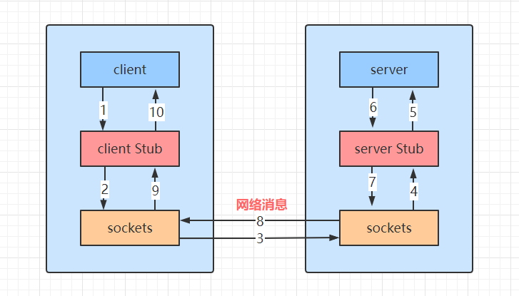
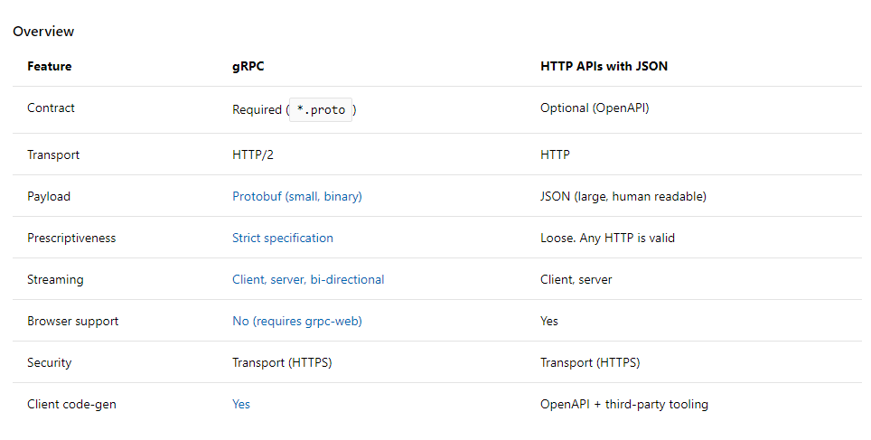
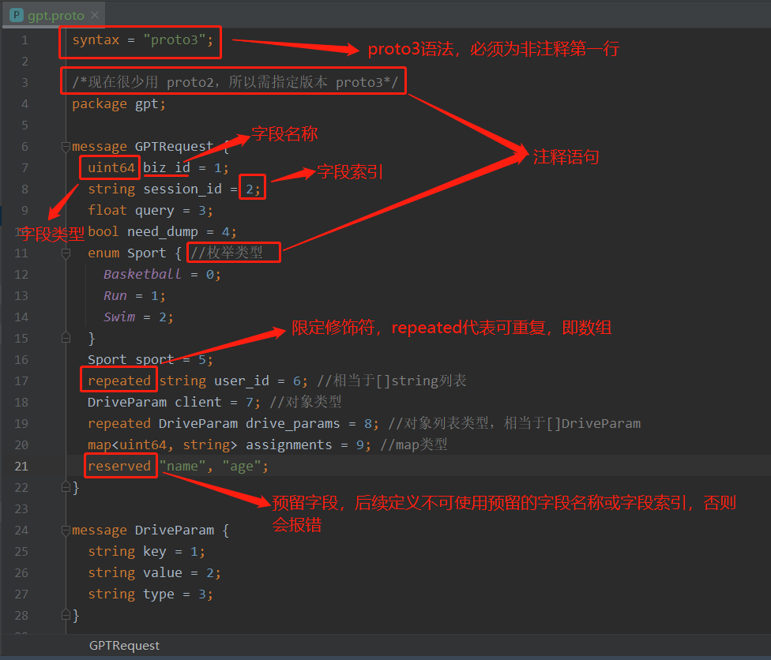
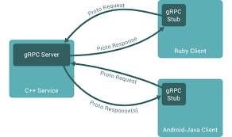
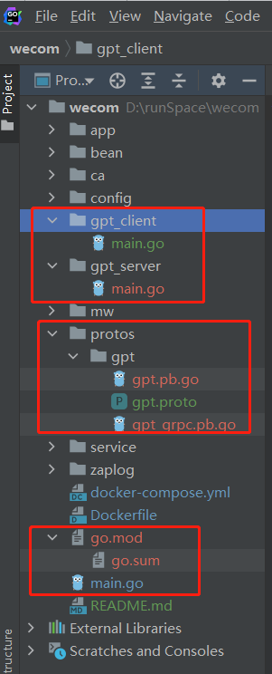
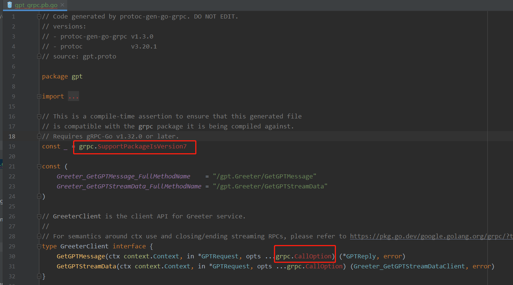
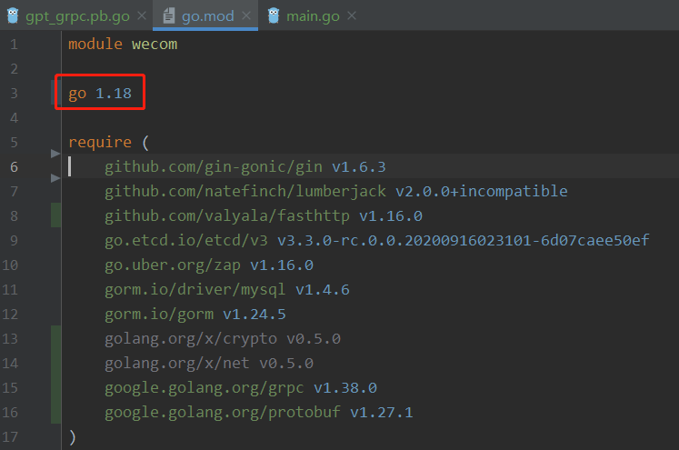
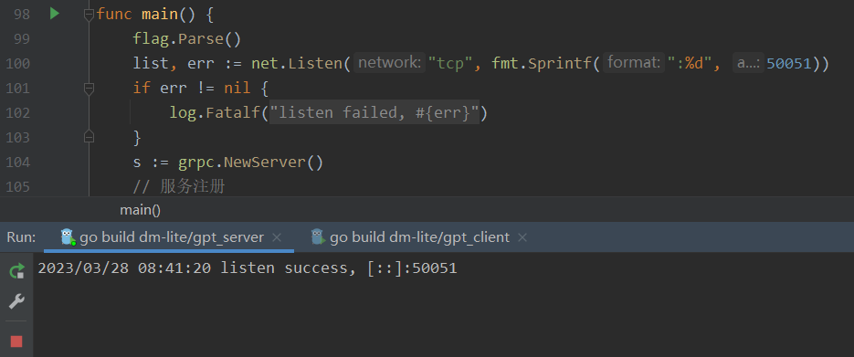
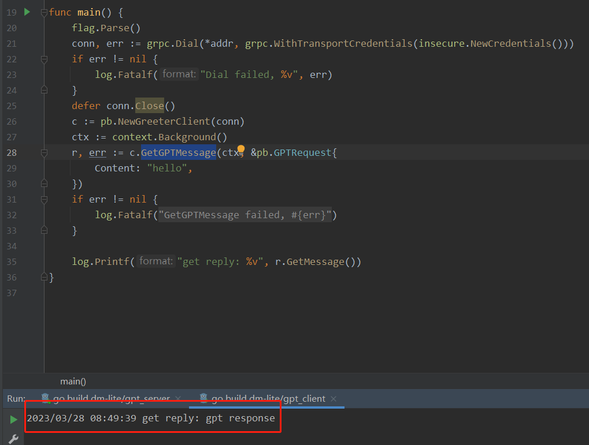
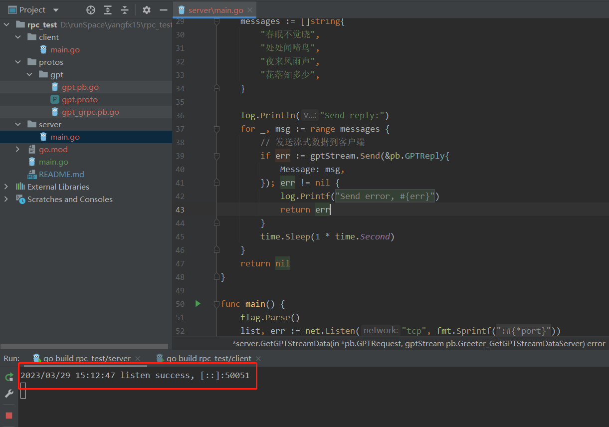

目录

> 1. 初始RPC
> 2. RPC与HTTP
> 3. 流行的RPC框架
> 4. Protobuf与gRPC
> 5. gRPC响应ChatGPT问答
> 6. 小结


## 1. 初始RPC

**RPC 是什么？**

> RPC（Remote Procedure Call，远程过程调用）是一个计算机通信[协议](https://zh.wikipedia.org/wiki/網絡傳輸協議)。该协议允许运行于一台计算机的[程序](https://zh.wikipedia.org/wiki/程序)调用另一个[地址空间](https://zh.wikipedia.org/wiki/地址空间)（通常为一个开放网络的一台计算机）的[子程序](https://zh.wikipedia.org/wiki/子程序)，而程序员就像调用本地程序一样，无需额外地为这个交互作用编程（无需关注细节）。——维基百科

通俗来讲，假设有两台服务器 A，B，有两个程序（程序 1 和程序 2）分别部署在这两台服务器上。由于是两台机器，因此它们的 IP 地址，内存空间等等肯定是不共享的，那程序 1 如何调用到程序 2 的方法呢？

这时我们就需要约定一个协议，让两台机器上的应用程序进行通信，RPC 就是这样一个协议，它通过以下几个步骤来让两个程序识别程序对方的身份：

1. 两台机器分别发送和接收数据，所以一个充当服务端，一个充当客户端，它们之间需**建立 TCP 连接**（按需调用，可以是短连接，也可以是长连接）；
2. 连接 TCP 连接前，客户端需要先知道**服务端的 IP 地址和端口号**，其中 IP 地址是网络中主机的唯一标识，端口号是主机上应用程序（又叫进程）的唯一标识；
3. 通信之前，服务端先运行应用程序，监听对应的进程端口号；
4. 客户端发起 RPC 远程过程调用，把程序交互的参数传给服务端，服务端根据接收的数据处理完成后再传输回客户端，断开此次 TCP 连接，调用结束。

整个过程如下图所示：



* Client Stub（客户端存根）：存放通信的服务器地址消息，并将客户端的请求**打包**成可以在网络中传输的消息体；
* Server Stub（服务端存根）：接收客户端发送的消息，并将返回结果打包成可以在网络中传输的消息体。

* Sockets（网络套接字）：应用程序的一组程序接口，可用在网络中不同主机之间进行数据交换。


## 2. RPC与HTTP

**HTTP & RPC，如何选择？**

了解完 RPC 之后，可能有些人还是疑惑：既然都是通信协议，那程序交互和应用开发时，我们该选择 HTTP（HyperText Transfer Protocol，超文本传输协议）还是 RPC 协议呢？

这就得从它们两者的属性说起了，首先，传输协议上：

* RPC 是一种基于 TCP 传输层或者 HTTP2 应用层的通信协议；
* HTTP 只基于 HTTP 协议，包括 HTTP1.x（即 HTTP1.0、1.1） 和 HTTP2，目前很多浏览器默认使用 1.x 来访问服务器数据。

性能消耗上（从数据类型对比）：

* RPC，可以基于 gRPC（一种 RPC 框架）实现高效的二进制传输；
* HTTP，大部分是通过 json 来实现的，字节大小和序列化都比 gRPC 更消耗性能。

负载均衡上：

* RPC，基本都自带了负载均衡策略；
* HTTP，需要配置 Nginx，HAProxy 来实现。

传输效率上：

* RPC，使用自定义的 TCP 协议，可以让请求报文体积更小，或者使用 HTTP2 协议，也可以很好的减少报文的体积，提高传输效率；
* HTTP，如果是基于 HTTP1.x 的协议，请求中会包含很多无用的内容；如果是基于 HTTP2.0，那么简单的封装后是可以作为 RPC 来使用的，这时标准 RPC 框架更多的优势是服务治理。

综上对比，我们不难发现，**RPC 从性能消耗和传输效率，以及负载均衡等方面都比 HTTP 强一些**。这时细心的朋友可能已经发现了，那为啥我们常见的系统和网站都是用的 HTTP 协议，不改成 RPC 通信呢？

举个通俗的例子，HTTP 好比普通话，RPC 好比地方方言，比如粤语，西南一带的云南话、贵州话、四川话。

讲普通话，好处就是谁都听得懂，大部分国人都会讲，所以 **HTTP 具有一定的通用性**。讲方言，好处是可以更精简、更保密、更加可定制，坏处就是要求“说”方言的另一方（特指 client 端）也要懂，而且一旦大家都说一种方言了，换方言就困难了。所以 **RPC 一般用于公司内部的服务调用**，比如阿里淘宝系统中的 A 服务和 B 服务之间。


## 3. 流行的 RPC 框架

>  目前流行的 RPC 框架有很多，下面介绍常见的三种。

1. `gRPC`：gRPC 是 Google 于 2015 年公布的开源项目，基于 HTTP2.0 协议，并支持常见的众多编程语言。其中 HTTP 2.0 协议是基于二进制的 HTTP 协议的升级版本，支持多路并发数据传输等特性。
2. `Thrift`：Thrift 是 Facebook 开发的一个内部系统跨语言 RPC 框架，于 2007 年贡献给 Apache 基金，成为 Apache 众多开源项目之一。
3. `Dubbo`：Dubbo 是阿里巴巴在 2011 年对外开源的一个 RPC 框架，在很多互联网公司和企业应用中广泛使用，提供了一系列协议和序列化框架，可插拔，但仅支持 Java 语言。

国外 RPC 评测上，基于各 RPC 框架的测试情况对比，从**吞吐率、响应时间和稳定性**上，gRPC 综合性能较好，也是国内很多公司在用的 RPC 框架。而且，gRPC 是由 go 语言实现的，随着微服务、云计算的普及，用 go 语言的公司和项目日益增多，所以 gRPC 也成了 go 语言内部系统通信的不二选择。

gRPC 基于 **ProtoBuf（Protocol Buffer）序列化协议**开发，它的原理是通过 IDL（Interface Definition Language，接口描述语言）文件来定义服务接口的参数和返回值类型，然后通过代码生成工具生成服务端和客户端的模板代码。这样，我们只需要实现一个 IDL 文件和业务交互代码，就可以使用 gRPC 进行通信了。

一张图看懂 gRPC 和 HTTP 的区别：




## 4. Protobuf与gRPC

### 4.1 Protobuf 简介

Proto Buffer 协议（简称 protobuf，下文同）和 json、xml 一样，是一种数据序列化方式（序列化，就是把内存中一段数据转化成二进制的形式，然后进行网络传输或存储）。

* protobuf 是跨语言、跨平台的序列化协议；
* 不仅限于 gRPC，protobuf 还可以用作其它场景的数据传输和存储；

不同于 json 和 xml ，protobuf 在使用时需要先定义 IDL（数据定义规则），其好处是传输时数据体积更小，传输速度更快。

gRPC 的传输协议用的是 protobuf，所以我们要先学会 protobuf 文件的编写规则。


### 4.2 Protobuf 定义数据结构

和 yaml、xml 文件类似，protobuf 文件也需要特定的格式编写，以下是 protobuf 文件的通用写法【gpt.proto】：



除了上述图片中的说明，protobuf 文件还有一些关键字段，比如 message 是 protobuf 协议中最基本类型，相当于 Java 里面的 class 对象，Go 里面的 struct 结构体。如上图所示，每个 message 里有一或多个字段及字段类型，相当于对象的参数和参数类型。

当我们编写好 protobuf 文件以后，就可以开始写 gRPC 的通信逻辑了。


### 4.3 gRPC实现



我们上面已经说过，gRPC 是跨语言通信的框架，所以服务端和客户端可以是不同的语言。接下来，我们演示一下用 go 语言实现 gRPC 通信的过程。

步骤：

1. 编写 protobuf 文件
2. 生成 Go 语言代码
3. 编写客户端，端口监听
4. 编写服务端，请求数据


首先，我们新建一个项目，目录结构如下【wecom 项目，是用来做 GPT 交互的，大家可以模仿一下，重要文件夹和文件名已经用红线圈出来了】：




#### 1）编写 protobuf 文件

根据上述的 protobuf 规则，我们首先编写此项目所使用的 protobuf 文件【protos/gpt/gpt.proto】

```go
syntax = "proto3";

option go_package = "./;gpt";

package gpt;

service Greeter {
  rpc GetGPTMessage (GPTRequest) returns (GPTReply) {}
}

message GPTRequest {
  string content = 1;
}

message GPTReply {
  string message = 1;
}
```


#### 2）生成 Go 语言代码

我们需要使用 protoc 工具生成 Go 语言代码，先下载工具包【根据不同的电脑系统安装 proto 包】：

- [Windows 64位 点这里下载](https://link.juejin.cn/?target=https%3A%2F%2Fgithub.com%2Fprotocolbuffers%2FProtoBuf%2Freleases%2Fdownload%2Fv3.20.2%2Fprotoc-3.20.2-win64.zip)
- [Mac Intel 64位 点这里下载](https://link.juejin.cn/?target=https%3A%2F%2Fgithub.com%2Fprotocolbuffers%2FProtoBuf%2Freleases%2Fdownload%2Fv3.20.2%2Fprotoc-3.20.2-osx-x86_64.zip)
- [Mac ARM 64位 点这里下载](https://link.juejin.cn/?target=https%3A%2F%2Fgithub.com%2Fprotocolbuffers%2FProtoBuf%2Freleases%2Fdownload%2Fv3.20.2%2Fprotoc-3.20.2-osx-aarch_64.zip)
- [Linux 64位 点这里下载](https://link.juejin.cn/?target=https%3A%2F%2Fgithub.com%2Fprotocolbuffers%2FProtoBuf%2Freleases%2Fdownload%2Fv3.20.2%2Fprotoc-3.20.2-linux-x86_64.zip)


再安装 golang 的插件【生成其它语言如 Java、Python 的插件是不一样的，详情可见 gRPC 官方文档 https://doc.oschina.net/grpc?t=58008】

> go install google.golang.org/protobuf/cmd/protoc-gen-go@latest

至此，我们的工具包就安装完成了。


安装完成之后，进入 proto 文件的目录：

> cd protos/gpt/

生成 Go 语言的代码【如果提示 protoc 不存在，说明 protoc 工具包没安装好或者环境变量设置有问题，可以看这篇文章解决：https://www.jianshu.com/p/00be93ed230c】

> protoc --go_out=. --go_opt=paths=source_relative     --go-grpc_out=. --go-grpc_opt=paths=source_relative gpt.proto


这时，当前目录下【protos/gpt】有 3 个文件：

> gpt.pb.go
>
> gpt.proto
>
> gpt_grpc.pb.go


#### 3）添加依赖



如果像我这样，在生成代码以后有标红的代码，可以在主目录下【/wecom】添加依赖：

> go mod tidy

如果执行完 go mod tidy 还有标红的情况，可能是 golang 的依赖版本较低导致，需要在 go.mod 里面修改 golang 的依赖版本：

> go 1.18




#### 4）编写业务代码，实现服务端

首先，在项目里导入 grpc 的插件包

> go get google.golang.org/grpc


然后编写服务端业务逻辑【gpt_server/main.go】

```go
package main

import (
	"context"
	"flag"
	"fmt"
	"google.golang.org/grpc"
	"log"
	"net"
	pb "wecom/protos/gpt"
)

var (
	port = flag.Int("port", 50051, "port")
)

type server struct{
	pb.UnimplementedGreeterServer
}

func (s *server) GetGPTMessage(ctx context.Context, in *pb.GPTRequest) (*pb.GPTReply, error) {
	return &pb.GPTReply{Message: "gpt response"}, nil
}

func main() {
	flag.Parse()
	list, err := net.Listen("tcp", fmt.Sprintf(":%d", *port))
	if err != nil {
		log.Fatalf("listen failed, %v", err)
	}
	s := grpc.NewServer()
	// 服务注册
	pb.RegisterGreeterServer(s, &server{})
	log.Printf("listen success, %v", list.Addr())
	if err := s.Serve(list); err != nil {
		log.Fatalf("server failed, %v", err)
	}
}
```

运行 main 函数，启动成功：



接下来，我们再实现一个客户端绑定到端口，以请求服务端的消息。


#### 5）客户端逻辑

从上面的服务端实现来看，gRPC 实现是非常简单的，只要跟着 protobuf 生成的模板填写业务代码就可以了！这个过程，我们只需要关注服务端和客户端的连接通信，而它们的连接也没有很高深，和我们 HTTP 的监听及绑定是一样的原理。

客户端业务代码【gpt_client/main.go】

```go
package main

import (
   "context"
   pb "dm-lite/resource/proto/gpt"
   "flag"
   "google.golang.org/grpc"
   "google.golang.org/grpc/credentials/insecure"
   "log"
)

const defaultName = "world"

var (
   addr = flag.String("addr", "localhost:50051", "")
   name = flag.String("name", defaultName, "")
)

func main() {
   flag.Parse()
   conn, err := grpc.Dial(*addr, grpc.WithTransportCredentials(insecure.NewCredentials()))
   if err != nil {
      log.Fatalf("Dial failed, %v", err)
   }
   defer conn.Close()
   c := pb.NewGreeterClient(conn)
   ctx := context.Background()
   r, err := c.GetGPTMessage(ctx, &pb.GPTRequest{
      Content: "hello",
   })
   if err != nil {
      log.Fatalf("GetGPTMessage failed, %v", err)
   }

   log.Printf("get reply: %v", r.GetMessage())
}
```

当服务端监听 50051 端口时，我们运行客户端就可以调用 gRPC 的 `GetGPTMessage` 方法。运行客户端 main 函数，获取结果：



普天同庆，gRPC 接口调用成功！


## 5. gRPC响应ChatGPT问答

**流式 RPC**

上述实现了实时响应的 gRPC 接口，即：一问一答的简单模式。如果比作面试中的场景，简单模式是这样的：

> （面试官）问：你知道 gRPC 吗？
>
> （候选人）答：知道，gRPC 是 Google 发起的一个 RPC 框架；
>
> （面试官）问：还有呢？
>
> （候选人）答：gRPC 基于 HTTP/2 协议传输；
>
> （面试官）问：还有呢？
>
> （候选人）答：它使用 Protocol Buffers 作为接口描述语言；
>
> （面试官）问：咱能不能一次性说完？！
>
> （候选人）答：......


那面试官有要求，咱也不能不做，于是，流式模式 RPC 出现了：

> （面试官）问：你知道 gRPC 吗？
>
> （候选人）答：知道，gRPC 是 Google 发起的一个RPC框架...它是基于 HTTP/2 协议传输...并且使用 Protocol Buffers 作为接口描述语言。
>
> （面试官）心想：不错！相比于挤牙膏，我更喜欢竹筒倒豆子！


接下来，我们在 proto 文件中添加一个客户端流式 RPC 接口：

> ```protobuf
> rpc GetGPTStreamData (GPTRequest) returns (stream GPTReply) {}
> ```


### 5.1 添加流式接口

完善 protobuf 文件【gpt/gpt.proto】

```protobuf
syntax = "proto3";

option go_package = "./;gpt";

package gpt;

service Greeter {
  rpc GetGPTMessage (GPTRequest) returns (GPTReply) {}
  rpc GetGPTStreamData (GPTRequest) returns (stream GPTReply) {}
}

message GPTRequest {
  string content = 1;
}

message GPTReply {
  string message = 1;
}
```

依据 gRPC 开发的三步走策略，我们还是先通过 proto 文件生成模板 Go 代码：

> protoc --go_out=. --go_opt=paths=source_relative     --go-grpc_out=. --go-grpc_opt=paths=source_relative gpt.proto


### 5.2 服务端

添加流式服务端逻辑【gpt_server/main.go】，注意，下面代码是新增，不是覆盖：

```go
func (s *server) GetGPTStreamData(in *pb.GPTRequest, gptStream pb.Greeter_GetGPTStreamDataServer) error {
   log.Printf("GetGPTStreamData Request: %v", in.GetContent())
   messages := []string{
      "春眠不觉晓",
      "处处闻啼鸟",
      "夜来风雨声",
      "花落知多少",
   }

   log.Println("Send reply:")
   for _, msg := range messages {
      // 发送流式数据到客户端
      if err := gptStream.Send(&pb.GPTReply{
         Message: msg,
      }); err != nil {
         log.Printf("Send error, %v", err)
         return err
      }
      time.Sleep(1 * time.Second)
   }
   return nil
}
```

首先，启动服务端的监听：




### 5.3 客户端

流式消息接收，客户端代码【gpt_client/main.go】

```go
package main

import (
   "context"
   "flag"
   "fmt"
   "io"
   "log"
   "time"
   pb "wecom/protos/gpt"

   "google.golang.org/grpc"
   "google.golang.org/grpc/credentials/insecure"
)

const defaultName = "world"

var (
   addr = flag.String("addr", "localhost:50051", "")
   name = flag.String("name", defaultName, "")
)

func main() {
   flag.Parse()
   conn, err := grpc.Dial(*addr, grpc.WithTransportCredentials(insecure.NewCredentials()))
   if err != nil {
      log.Fatalf("Dial failed, %v", err)
   }
   defer conn.Close()
   c := pb.NewGreeterClient(conn)
   ctx, cancel := context.WithTimeout(context.Background(), 60*time.Second)
   defer cancel()
   steam, err := c.GetGPTStreamData(ctx, &pb.GPTRequest{
      Content: "背一下古诗《春眠》",
   })
   if err != nil {
      log.Fatalf("GetGPTMessage failed, %v", err)
   }
   log.Println("Get reply:")
   for {
      res, err := steam.Recv()
      if err == io.EOF {
         break
      }
      if err != nil {
         log.Fatalf("Recv failed, %v", err)
      }
      fmt.Printf("%v", res.GetMessage())
   }
}
```

启动服务端和客户端的 main 函数，代码运行效果如下：

<video src="img/MyVideo_2.mp4"></video>

OK，流式 gRPC 也成功响应了。

由于最近项目在做 ChatGPT，有用户会用到流式响应问答，所以接下来我们调用 ChatGPT 的流式问答接口，展示一下流式接口的日常使用场景。


### 5.4 GPT流式问答展示

#### 1）服务端逻辑

```go
func (s *RPCServe) GetGPTStreamData(in *pb.GPTRequest, gptStream pb.Greeter_GetGPTStreamDataServer) error {
   log.Printf("GetGPTStreamData Request: %v", in.GetContent())
   client := openai.NewClient(OPENAI_API_KEY) // OPENAI_API_KEY，请求openAI接口的token，需要到openai官网申请
   ctx := context.Background()

   // 请求GPT3.5的流式处理接口参数
   req := openai.ChatCompletionRequest{
      Model:     openai.GPT3Dot5Turbo,
      MaxTokens: 2048,
      Messages: []openai.ChatCompletionMessage{
         {
            Role:    openai.ChatMessageRoleUser,
            Content: in.GetContent(),
         },
      },
      Stream: true,
   }
   // 获取流式数据
   stream, err := client.CreateChatCompletionStream(ctx, req)
   if err != nil {
      log.Fatalf("ChatCompletion failed, %v", err)
      return err
   }
   defer stream.Close()

   log.Println("Send reply:")
   for {
      response, err := stream.Recv()
      // 数据传输完成标识
      if errors.Is(err, io.EOF) {
         log.Printf("Stream finished")
         break
      }

      if err != nil {
         log.Fatalf("Stream error, %v", err)
         return err
      }

      // 只需要文本内容
      data := &pb.GPTReply{
         Message: response.Choices[0].Delta.Content,
      }
      // 发送流式数据到客户端
      if err := gptStream.Send(data); err != nil {
         log.Printf("Send error, %v", err)
         return err
      }
   }
   return nil
}
```

> PS：此项目中，服务端请求 GPT3.5 流式接口的 OPENAI_API_KEY 需要到 OPENAI 官网【https://platform.openai.com/docs/introduction，需要外网权限】申请。


#### 2）客户端逻辑

流式消息接收，客户端代码【gpt_client/main.go】

```go
package main

import (
   "context"
   pb "dm-lite/resource/proto/gpt"
   "flag"
   "fmt"
   "google.golang.org/grpc"
   "google.golang.org/grpc/credentials/insecure"
   "io"
   "log"
   "time"
)

const defaultName = "world"

var (
   addr = flag.String("addr", "localhost:50051", "")
   name = flag.String("name", defaultName, "")
)

func main() {
   flag.Parse()
   conn, err := grpc.Dial(*addr, grpc.WithTransportCredentials(insecure.NewCredentials()))
   if err != nil {
      log.Fatalf("Dial failed, %v", err)
   }
   defer conn.Close()
   c := pb.NewGreeterClient(conn)
   ctx, cancel := context.WithTimeout(context.Background(), 60*time.Second)
   defer cancel()
   steam, err := c.GetGPTStreamData(ctx, &pb.GPTRequest{
      Content: "写一篇500字的作文，题目为“梦想”",
   })
   if err != nil {
      log.Fatalf("GetGPTMessage failed, %v", err)
   }
   log.Println("Get reply:")
   for {
      res, err := steam.Recv()
      if err == io.EOF {
         break
      }
      if err != nil {
         log.Fatalf("Recv failed, %v", err)
      }
      fmt.Printf("%v", res.GetMessage())
   }
}
```

启动服务端和客户端的 main 函数，代码运行效果如下：

<video src="img/MyVideo_1.mp4"></video>

不难发现，在上述问答场景下如果没有流式响应，接口在慢速返回的情况下，就会极大影响用户体验。所以才有人说，爱是细水长流，大家悟了吗？

> 上述代码地址：https://github.com/yangfx15/rpc_test


## 6. 小结

本文，我们从 RPC 说起，提到了 RPC 的基本概念与 HTTP 通信协议的区别，及常用的 RPC 通信框架。然后，根据 gRPC 的特性编写了 protobuf 文件，运行了一个简单的 gRPC 通信程序。最后，由于项目中用到 ChatGPT，所以运用 gRPC 流式响应的特点结合 ChatGPT 做了个简单的流式问答 demo。

这个过程中，我们不难发现，其实 gRPC 的交互和 HTTP 是十分类似的，但 gRPC 的优势在于传输的数据包更小，通讯更为迅捷。

所以，在使用内部系统通信频繁的场景下，gRPC 是非常高效的交互方式。并且它和 go 语言一样，也是由谷歌开源，所以社区也十分活跃，平时遇到的常见问题都有了完善的解决方案。


**参考资料：**

1. 写给go开发者的gRPC教程-protobuf基础：https://juejin.cn/post/7191008929986379836#heading-0

2. 【Go微服务】开发gRPC总共分三步：https://juejin.cn/post/7145262448159752229

3. 【Go微服务】一文带你玩转ProtoBuf：https://juejin.cn/post/7144948875613339685
4. OPENAI官网：https://platform.openai.com/docs/api-reference/completions/create#completions/create-stream