k8s版本选择：Kubernetes 1.23.3，最后一个支持 docker 的大版本

课程：docker -> minikube -> kubeadm 搭建单机和多机 K8s 集群环境


**入门篇：**

从docker讲解k8s的基础技术：容器、docker命令、构建&运行容器；


一、镜像、容器与仓库

1）容器的定义：

* 广义：容器技术是动态容器、静态镜像以及远程仓库三者的组合；
* 狭义：静态镜像运行后就变成了容器（即动态容器），相当于托运的集装箱（docker图中可爱小鲸鱼搬运的箱子）

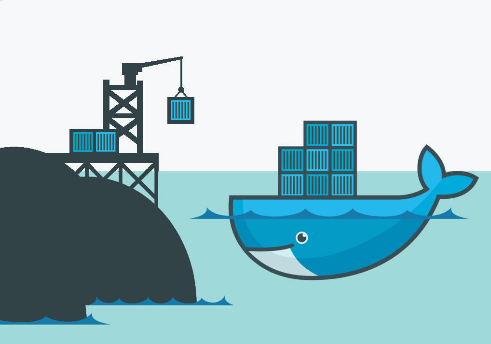


2）容器的作用：

* 标准化封装货物：一旦打包完成，就可以随意迁移；
* 隔离： 容器封装了进程，把它们从外界隔离开，让内外部系统和进程之间运行互不影响；


3）实践，容器里运行程序：

* 拉取新镜像，操作系统 Alpine：

  ``` shell
  docker pull aipine
  ```

* 运行此镜像，并进入容器：

  ``` shell
  # -it参数，会让我们暂时离开当前主机系统，进入容器内部
  docker run -it alpine sh
  ```

* 查看容器内进程：

  ``` shell
  # 查看容器的操作系统版本
  cat /etc/os-release
  ```

  如下截图所示，在容器内部查看系统信息，和外面的 CentOs Linux 主机系统不一样了

  图A：主机系统：

  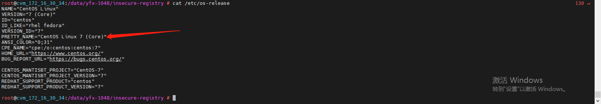

  

  图B：容器内

  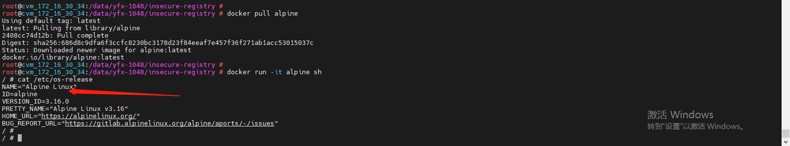

  可推论，容器内部和外界系统相互 “隔离” 了。


4）隔离的必要性

我们再复习下容器的定义：容器，就是一个特殊的隔离环境，它能让进程只看到这个环境里有限的信息，不能对外界环境施加影响。那么，为什么要让进程之间相互隔离呢？

* 安全：当今疫情环境下，我们对“隔离”这个词应该不陌生。隔离，就是为了不让病毒在人与人之间大肆传播。进程也是如此，如果一个应用中了病毒，进而影响整台机器，那后果是不堪设想的。所以，为了安全，进程需要隔离；
* 资源：进程与进程之间，虽然互不影响，但都会吃着主机的系统资源：包括内存和磁盘等等。正如皇帝生九子，为了防止打架，都要提前给他们划分疆域一样。所以，给隔离的进程划分资源，也是很有必要的事情。
* 还有 CPU 、网络等等资源，都不允许某个应用程序无限制地使用。


5）容器，就是小型的虚拟机？

这时，有经验的同学可能就看出来了，容器（即文中的 docker，下文同），不过就是常见 “沙盒” 技术中的一种，和虚拟机差不多嘛~  那么，它们之间有什么区别，容器相对虚拟机又有哪些优势呢？


图A：docker 与虚拟机对比，出自 docker 官网

* 相同点：docker 和虚拟机一样，都是隔离资源，保证系统安全，并提高资源的利用率；

* 不同点：虚拟机虚拟的是硬件，需要在上面安装一个操作系统才能运行程序。硬件虚拟机和操作系统都比较重，这就意味着要消耗大量的 CPU、内存和硬盘等系统资源；

  而 docker 容器直接利用了宿主机的计算机硬件和操作系统，在宿主机之上创建 docker 引擎，在引擎的基础上再安装应用。因此不需要重新虚拟化一个操作系统，比虚拟机少了一层，属于轻量级隔离。

  所以，容器并不是轻量级的虚拟机，因为它只打包系统必须的文件，并不包括内核与其它附件。虽然容器可以高效利用宿主机的资源，但是并不能像虚拟机那样完全隔离。

* docker的优势：相比虚拟机，docker 的运行效率高很多。比如一个安装 ubuntu，在虚拟机上需要几个 G 的空间，而一个 ubuntu 镜像只有几十M，启动也非常快。在个人 PC 装一个虚拟机就很卡了，但同时跑几十个镜像都是没问题的。

6）隔离的原理是什么？

从上文中“docker 与虚拟机对比”图中我们可以看出，虚拟机的隔离使用的是 Hypervisor（KVM、Xen等）。那么，docker 是怎么实现隔离的同时，又和下层计算机硬件及操作系统交互的呢？

其实，它主要依靠的是 Linux 系统内核的三种能力：

* namespace：可以创建出独立的文件系统、主机名、进程号、网络等资源空间：相当于对一个社区或者村落隔离，每家每户都能自给自足；
* cgroup：用来实现对进程的 CPU、内存等资源的优先级和配额限制：相当于居委会或上级领导，对隔离后的物资进行配送时，控制配送的先后顺序和物资的数量；
* chroot：可以更改进程的根目录，也就是限制访问文件系统：相当于每个村落安置一个检查员，进门需要核酸检查，如果发现进入了红码人员，就需要把该社区/村落加入集控领域（更改进程的根目录）；

有了这三种技术，容器的隔离得以完整地实现。正如疫情下的国家，有了隔离，才能更好地利用资源，防止公共安全问题威胁社会秩序。


二、Docker 实践

1）docker 镜像与容器

第一章我们提到，容器隔离的原理就是通过 Linux 的 namespace、cgroup、chroot 三种技术实现的，那么我们该如何操纵管理容器化应用呢？

这也是 docker 风靡全世界的原因：它提供了很多简洁易用的命令给用户，让我们可以轻易地拉取、构建自己的镜像，也可以通过简单的运行命令让镜像运行成为容器。

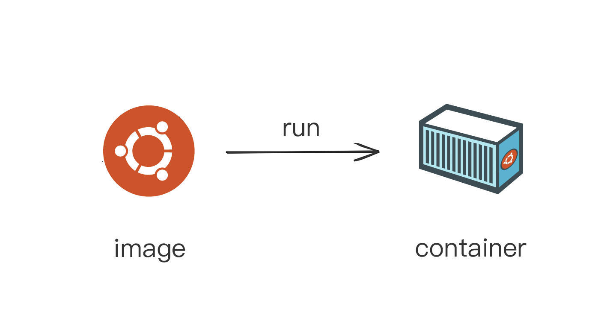

图：镜像运行成为容器

如果把运行着的容器当成商品房，那么镜像就是个模型“样板间”。容器包含了运行进程所需的文件系统、依赖库、环境变量、启动参数等打包整合，之后无论在何地何时何人来运行，操作系统都能根据这个“样板间”快速“装修”成标准的“商品房”了。

在没有使用容器技术之前，我们往往在开发、测试和生产环境上，因为环境参数、依赖包等问题导致运行不成功，每次上线前都要花大量的人力和时间去解决环境问题；

而有了 docker 之后，就可以把应用打包后跨平台部署，即“一次编写，到处运行”。现在，你知道为啥 docker 可以风靡全球了吗？


2）容器实践

* 拉取镜像

``` shell
# 获取一个打包了busybox应用的镜像，里面包含了busybox应用和它运行所需的完整环境
docekr pull busybox
```

* 容器运行

``` shell
# 提取镜像里的信息，运用namespace、cgroup、chroot技术创建隔离环境
# 再运行echo命令，输出hello world
docker run busybox echo hello world
```

这两步，基于标准的 Linux 系统调用和只读的镜像文件，所以，无论是在哪种操作系统，或者是用哪种容器技术实现，都会得到完全一致的结果。

因此，**容器化应用**，就是指应用程序不再直接和操作系统打交道，而是封装成镜像，再交给容器环境去运行。


3）镜像常用命令

* 搜索镜像

  ``` shell
  # 搜索docker hub官网里所有和redis相关的镜像
  docker search redis
  ```

  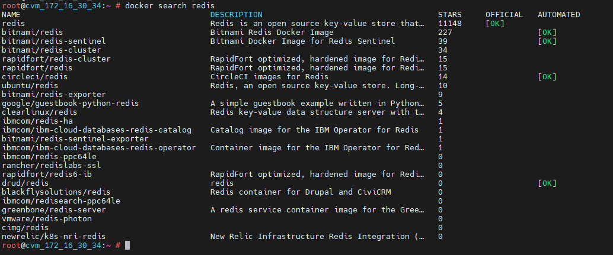

  从图可见，镜像的信息包含了“镜像名称 NAME，镜像描述 DESCRIPTION，镜像的点赞数 STARS，以及是否为官方指定镜像 OFFICIAL”。和 Github 中拉取代码一样，我们拉取镜像时一般考虑官方与否，点赞数，以及最新维护时间（可登陆 docker hub 官网https://hub.docker.com查看）来决定，我们应该拉取哪个镜像。


* 拉取一个官方redis镜像，标签为 latest，即最新版本

  ``` shell
  docker pull redis:latest
  ```

  

* 一个镜像由镜像名和版本号组成，当标签号为最新时，可以省略，所以下面这条命令和上一条会得到完全相同的结果

  ``` shell
  docker pull redis
  ```

  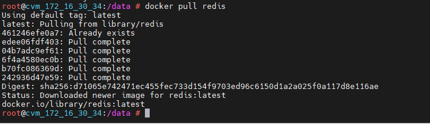

  从图中可以看出，拉取镜像时会有一些下载信息，这些都是镜像的各分层拉取提示，这个我们后面会讲到。

  

* 拉取一个nginx镜像，标签为1.21-alpine（通常地，标签=版本号+操作系统）

  ``` shell
  docker pull nginx:1.21-alpine
  ```

  

* 查看所有镜像

  ``` shell
  docker images 
  ```

  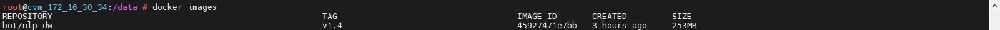

  

* 根据镜像名删除镜像

  ``` shell
  docker rmi redis
  ```


* 根据镜像ID （即上图中的IMAGE ID，可取前3位）删除镜像

  ``` shell
  docker rmi d4c
  ```

  

4）容器常用命令

* 运行容器

  ``` shell
  # 根据Redis镜像运行到容器
  docker run redis
  
  # 添加参数
  # --rm 当容器停止时，删除该容器
  # --name 指定容器名称
  # -d 后台运行容器
  # -p 指定端口映射，把redis容器6379端口映射到宿主机6378端口:
  docker run --rm --name redis -d -p 6378:6379 redis
  
  # -it 指运行完成后离开当前的操作系统，进入容器中
  docker run -it redis sh
  ```

  

* 当容器在**运行中**，进入容器（和 docker run -it 一样的结果，但只能在容器运行状态中才能使用）

  ``` shell
  docker exec -it redis sh
  ```

  

* 查看容器

  ``` shell
  # 查看所有容器
  docker ps -a
  
  # 查看所有运行中的容器
  docker ps
  
  # 根据参数搜索容器
  docker ps -a|grep 'redis'
  ```

  

* 改变容器状态

  ``` shell
  # 停止容器（注意：当运行容器时加了 --rm 参数时，停止容器后系统会自动删除这个容器）
  docker stop redis
  
  # 将停止状态下的容器启动
  docker start redis
  
  # 重启容器
  docker restart redis
  ```

  

* 删除容器

  ``` shell
  docker rm redis
  ```

  

三、使用 Dockerfile 构建容器

在上一章，我们学习了如何容器化应用，拉取打包成镜像的应用程序，再用 docker 命令运行和操纵它们。那么，如果我们在工作中需要将应用打包成镜像，用 docker 来管理它们，该怎么做呢？——答案就是这章的主题，Dockerfile.

首先，我们来看一下镜像内部机制，以及如何编写 Dockerfile 文件来打包镜像。

1）镜像的内部实现

我们已经知道，镜像就是一个打包文件，里面包含了应用程序还有它所依赖的环境，例如：文件系统、环境变量和参数等。

除了这些应用运行的所需的环境以外，不知道大家还记不记得之前我们对比过 docker 和虚拟机的区别：*docker 直接利用了宿主机的计算机硬件和操作系统，在宿主机之上创建 docker 引擎，在引擎的基础上再安装应用。因此它不需要重新虚拟化一个操作系统，比虚拟机少了一层*。所以，镜像必须把应用程序所在操作系统的根目录，也就是 rootfs 包含进来。

虽然，以上这些需要打包的不用包含操作系统的内核（上面已经说过，docker容器会和宿主机共享操作系统的内核）。但如果每个镜像都重复打包这些文件及系统目录，那么，一个 Linux 系统上打包 10 个镜像，就会复制 10 个 Linux 根目录。这对磁盘的空间和网络资源，都是很大的浪费。

所以，我们可以想到，应该把这些相同的部分抽取出来共用，这也是 docker 容器的一个创新点：术语叫分层实现，Layer。

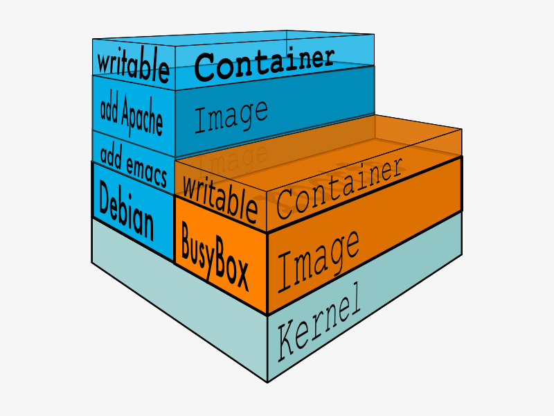

图：docker分层实现（来源：https://linoxide.com/wp-content/uploads/2015/03/docker-filesystems-busyboxrw.png）

图示可看出，容器镜像的内部是很多镜像层实现的。像房子的重叠结构一样，地基（下面的镜像层）都是固定不变（只读）的，也是上层镜像共用的。只有当镜像运行成容器（Container）后，最上层（容器层）是可写的。就像一个房子，建造完成后，只有顶层可以修整。


可以用 docker inspect 来查看镜像的分层信息（“RootFS”部分）：

``` shell
docker inspect redis
```

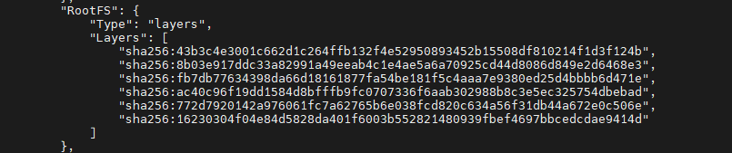

由图可知，redis:latest 镜像里一共有 6 层。现在，我们再看上面拉取镜像时的提示信息：


可以发现，正好是 6 层镜像的下载提示信息。


2）通过 Dockerfile，打包镜像


3）docker hub 使用

``` shell
# 传镜像到私有仓库时，需要打标签，前缀为私有仓库的用户名
docker tag redis yangfx15/redis:v1.0
```

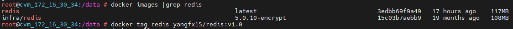


``` shell
docker login -u yangfx15
```

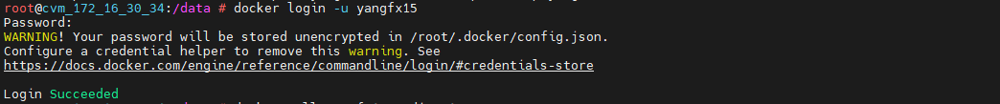


``` shell
docker push yangfx15/redis:v1.0
```

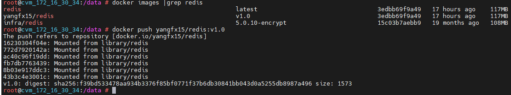


登录 docker.hub 查看：

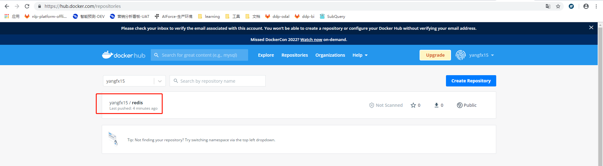


现在，可以让同事、朋友或者其它 PC 上下载个人镜像了：

``` shell
docker pull yangfx15/redis:v1.0
```


4）Dockerfile构建

Docker 好比汽车引擎，

Dockerfile 相当于汽车蓝图，

Docker image（镜像）就是汽车样板，

Docker container（容器）类似于一款商用汽车。


四、容器和宿主机交互

1）向运行中的容器拷贝宿主机目录中的文件：

``` shell
docker cp requirements.txt 87b:/tmp/a.txt
```

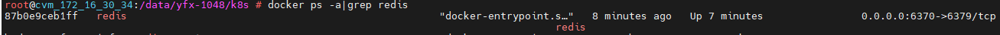

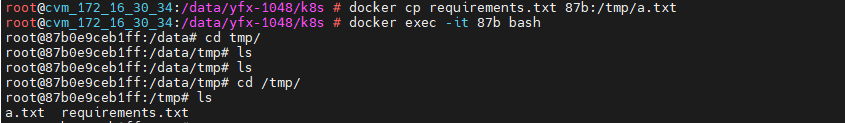

可以看到，进入容器后，在 /tmp 目录下新增了 "a.txt" 文件（注意：容器目录和 cp 操作的目录一致，绝对路径要在目录前面加 "/"）


从容器中拷贝文件到宿主机中：

``` shell
docker cp 87b:/tmp/a.txt ./tmp.txt
```

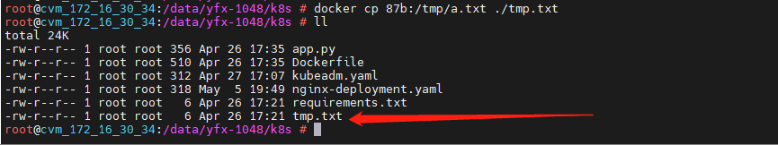

此时，我们可以看到，在宿主机的目录下多出一个 "tmp.txt" 文件。


2）容器运行时挂载目录

和上面从宿主机拷贝文件到容器中一样，如果我们有多个文件需要和容器共享，就可以把文件放到一个目录中，然后拷贝到容器中，术语叫“挂载”（volumes）：

``` shell
# 运行redis时将文件目录挂载到容器的/tmp目录下
docker run -d --rm -v /{文件目录}:/tmp redis
```

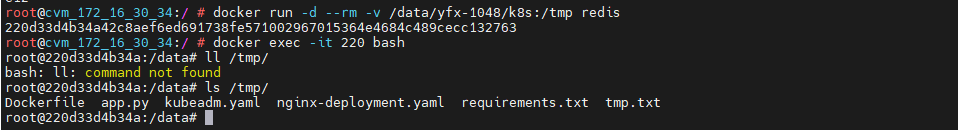

如图所示，运行时将 k8s 目录挂载到 /tmp 下，进入容器后执行 `ls /tmp/` 就可以看到挂载的文件了。

不论是用 Dockerfile 来构建镜像，还是我们日常开发测试，容器挂载都是很常用的操作。比如我现在需要开发一个项目依赖了 Golang1.17 版本，但是我主机是 Golang1.15 版本的，这时，如果盲目升级可以会导致之前的依赖版本出问题。为了方便，也没必要在本机安装两个版本的 Golang。

这时，我们可以先拉取一个 Golang 1.17 的镜像，由于它运行的环境都在镜像包里，所以不会对我们主机的 Golang1.15 版本产生任何影响：

``` shell
docker pull golang1.17
```

然后利用这个镜像来运行我们新项目的代码，比如我的项目代码放在 /data/src 目录下面：

``` shell
docker run -it --rm -v /data/src:/tmp golang1.17 sh
```

此时，我们就可以在容器中运行新项目了。不用重新安装版本包，不用配置环境变量，甚至当我们想临时再更换操作系统时，也可以用这个办法。如此，实现高效地开发测试工作，你 get 到了吗~


3）容器中的网络

null、host、bridge 三种模式：


* host，和宿主机共享同一个网络，网络地址为 0：

```  shell
# 以host网络模式运行redis
docker run --rm -d --net=host redis

# 根据容器ID查看容器的信息（出现报错信息：Error response from daemon: Multiple IDs found with provided prefix: e57，说明三位容器ID不足以定位唯一的容器，所以用前4位前缀)
docker insepct e571
```


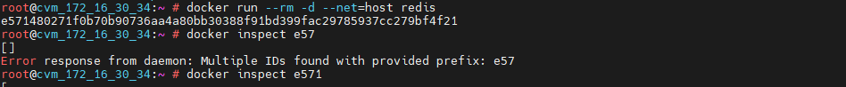


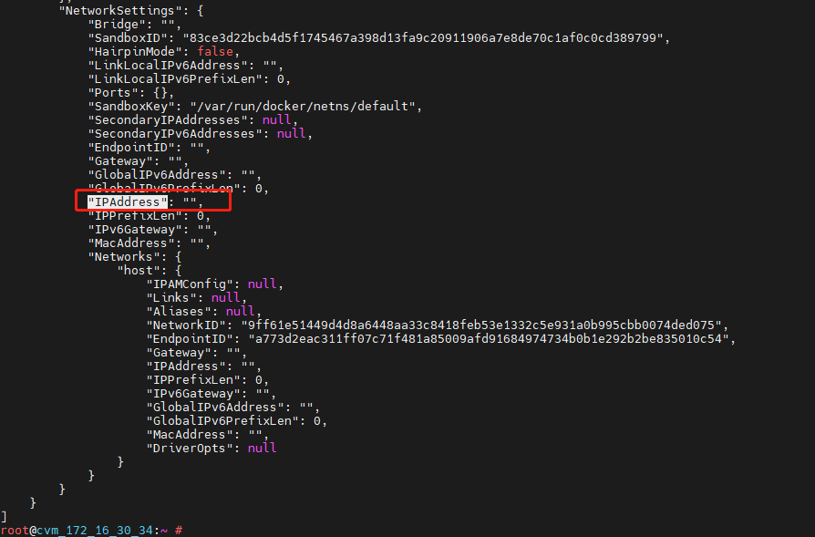


* bridge，默认的网络模式，运行时可以不加 `--net=bridge`，网络地址为容器分配的虚拟网段：

```  shell
# 以bridge网络模式运行redis
docker run --rm -d redis

# 根据容器ID查看容器的信息
docker insepct 220
```


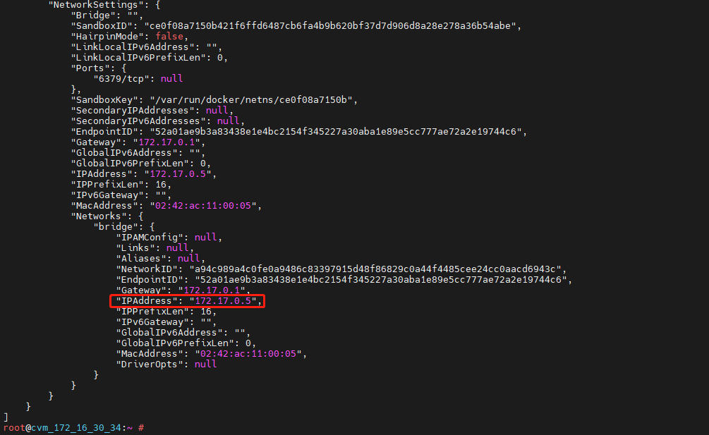

可以发现，容器虚拟网址和宿主机地址一样， 都在 172.17.0.0/16 这个网段下面，所以相互之间是可以正常通信的。

``` shell
ping 172.17.0.5
```

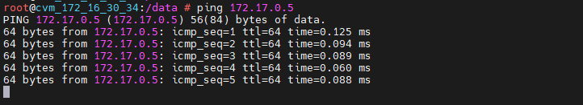


补充：host 和 bridge 模式对比

* host：简单粗暴效率高，适合小规模集群的简单拓扑结构；
* bridge：适合大规模集群和复杂的网络交互场景，它可以提供更多的可定制化服务，比如流量控制、灰度发布等等。


4）网络中的端口映射

上一节讲到容器和宿主机网络的交互，除此之外，容器中运行的服务器应用都需要端口号才能使用。例如 MySQL需要 3306 端口，Redis 需要 6379 端口。那么问题来了，如果宿主机安装了 MySQL，现在又要在容器中启动一个 MySQL，端口号不会冲突吗？

相信有同学已经发现，之前我们在运行 redis 服务时，有用到过 -p 参数（宿主机端口:容器端口）去做端口映射。这样，如果宿主机的 6379 端口号已经被占用，就可以把容器的端口映射到其它端口。格式为：

``` shell
# 容器6379映射到宿主机6380端口
docke run -d -p 6380:6379 redis
```

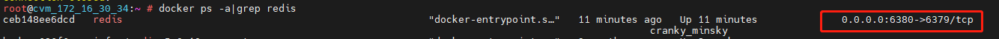

通过映射操作，就可以避免端口号冲突了。这样，我们在主机访问容器的 Redis 应用时，通过 6380 端口访问。


从过去以物理机和虚拟机为主体的开发运维环境，向以容器为核心的基础设施的转变过程，并不是一次温和的改革，而是涵盖了对网络、存储、调度、操作系统、分布式原理等各个方面的容器化理解和改造。


容器思维导图；


**初级篇：**

**学习链：**用单机minikube学习k8s，它解决了什么问题，基本架构咋样，YAML语言，Pod，Job/CronJob，ConfigMap/Secret；


PS：k8s 官网：https://kubernetes.io/zh/，有中文文档，非常全面，可以获取第一手知识。

国内镜像拉取慢：minikube start --image-mirror-country='cn'


**名词解释：**

容器编排：“编排” 指用户通过某些工具或配置来完成一组虚拟机以及关联资源的定义、配置、创建及删除等工作，然后由云计算平台按照这些指定的逻辑来完成的过程。容器编排指的是能够定义容器组织和管理规范的工具，典型的是 Docker 公司的 compose+swarm，还有 Google 和 RedHat 主导的 k8s 项目.


云原生：一种构建和运行应用程序的，技术体系和方法。在设计、开发阶段就要考虑云上部署、运行的特点，利用容器、微服务和 Devops 等思想，充分利用云平台的弹性和分布式优势，实现快速部署、按需伸缩，不停机交付等等。


一、Kubernetes 的奥秘

1）云计算时代的操作系统

Kubernetes（简称 k8s，下同）是一个**生产级别的容器编排平台和集群管理系统**，可以创建、调度容器，监控、管理服务器。容器是应用，是进程；服务器是硬件，是 CPU、内存、硬盘、网卡，那既可以管理软件，又可以管理硬件，这样的东西应该是什么？

也许你会脱口而出：这就是一个操作系统（Operating System）！


创建一个 pod 的 yaml 文件（busy-pod.yml）：

```  yaml
apiVersion: v1 # 版本值固定v1
kind: Pod # 类型值固定Pod
metadata: # metadata下必有name和labels
  name: busy-pod
  labels:
    owner: chrono
    env: demo
    region: north
    tier: back
spec: # 管理、维护Pod的基本调度单元
  containers: # 容器数组，里面是一或多个container（容器）对象，用image标示
  - image: busybox:latest # 必填，镜像拉取
    name: busy # 必填，容器名称
    imagePullPolicy: IfNotPresent # 拉取策略，Always/Never/IfNotPresent，一般是IfNotPresent，本地不存在才拉取远程镜像
    env: # 定义容器的环境变量
      - name: os
        value: "ubuntu"
      - name: debug
        value: "on"
    command: # 容器启动时要执行的命令，相当于Docker里面的ENTRYPOINT
      - /bin/echo
    args: # command运行时的参数，相当于Dockerfile里的CMD
      - "$(os), $(debug)"
```


``` shell
# 根据yml文件启动一个pod
kubectl apply -f busy-pod.yml

# 根据yml文件删除一个pod
kubectl delete -f busy-pod.yml

# 由于我们在 YAML 文件里定义了 “name” 字段，删除时可直接通过名字
kubectl delete busy-pod
```


和 Docker 启动不同，Pod 运行只能在后台，启动日志查看：

``` shell
kubectl logs busy-pod
```

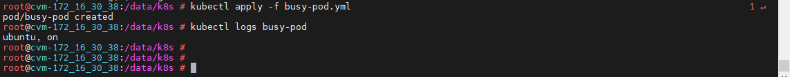


启动成功后，可以通过命令查看 Pod 运行状态：

``` shell
kubectl get pod
```

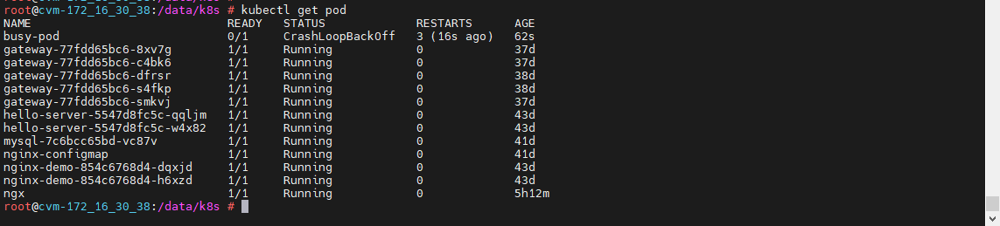

发现这个 Pod 运行状态不正常，为 "CrashLoopBackOff"，可通过命令检查它的详细状态（调试排错时很重要）：

``` shell
kubectl describe pod busy-pod
```

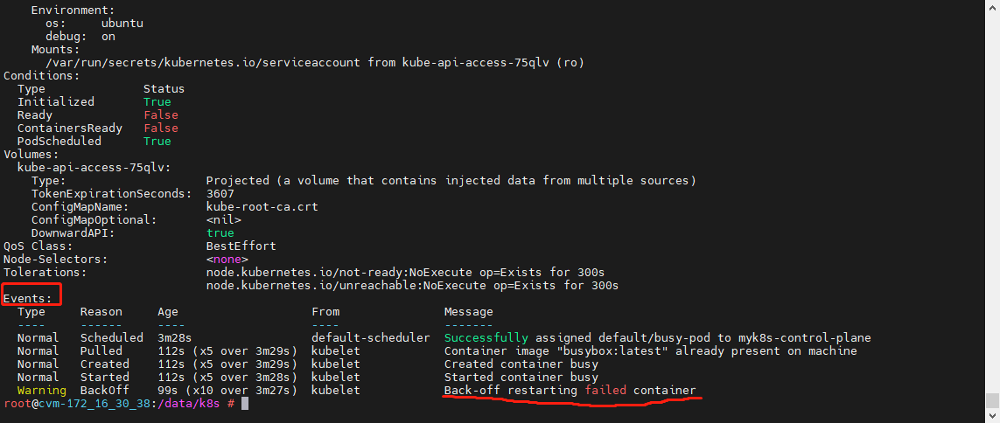

通常需要关注末尾 <Events> 的信息，它显示的是 Pod 运行过程中一些关键节点的事件，可以看到是重启失败了。由于当前 Pod 只执行了一条 echo 命令就退出了，而 k8s 默认会重启 Pod，所以就会进入一个退出 - 重启的循环错误状态。

而大多数 k8s 的应用，都是不会主动退出的服务。所以，我们重启一个 Pod，用 ngx-pod.yml，启动一个 Nginx 服务，就可以发现，它是正常启动（Running）状态了：

``` shell
kubectl apply -f ngx-pod.yml
kubectl get pod
```


另外，kubectl 和 docker 一样，可以用 cp 命令把宿主机的文件拷贝进 Pod，exec 命令从宿主机进入 Pod 内部执行 Shell 命令：

``` shell
# cp命令拷贝文件，比如：当前目录下有 a.txt 文件
kubectl cp a.txt ngx-pod:/tmp

# exec进入Pod内部（PS.和Docker进入容器不同，Pod多了--）
kubectl exec -it ngx-pod -- sh
```


**中级篇：**

用kubeadm搭建一个多节点的集群，模拟真实的生产环境，并介绍 k8s 的4个重要概念：Deployment、DaemonSet、Service、Ingress。明白 k8s 的优点和特点；


**高级篇：**

深层次知识点和高级应用技巧，包括持久化存储、有状态的对象、应用滚动更新和自动伸缩、容器和节点管理等。