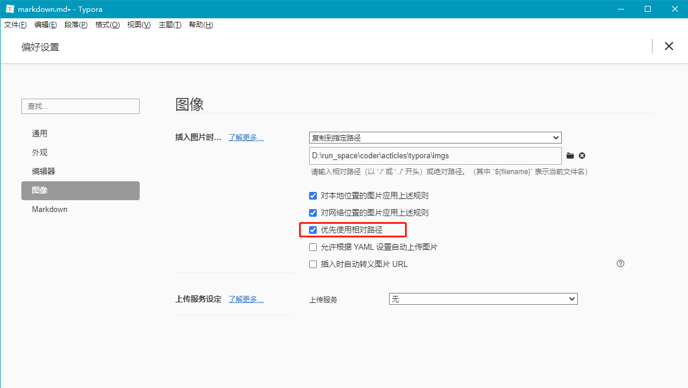
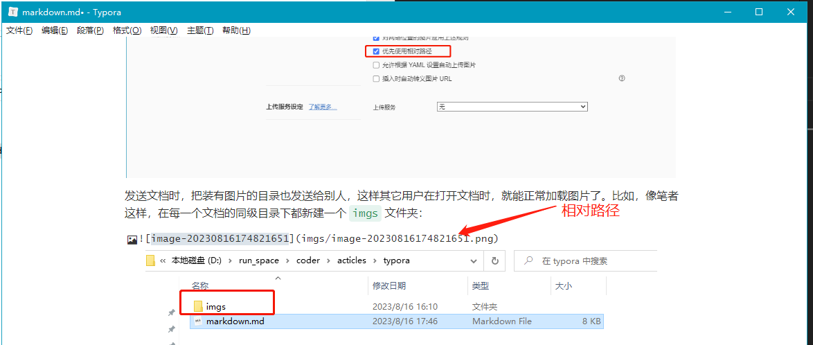

### Markdown 是什么？

使用 typora 以前，我们得先知道什么是 Markdown。Markdown 是一种轻量标记语言，和 Word、富文本格式一样，可以用作文章或网页的格式。


其中，Markdown 具备以下优势：

1. 易学易用；
2. 格式简介，辨识度高，可快速转换成 PDF、HTML 等格式文本；
3. 广泛应用于绝大多数互联网平台，如 GitHub、Wikipedia、公众号、知乎等；


### Typora 是什么？

Typora 是目前市面上最好用的 Markdown 编辑器工具，相当于 Office 于 Word。

从 Typora1.0 版本开始，该编辑器需要付费使用，官方下载地址：https://link.zhihu.com/?target=https%3A//typora.io/

如果免费且未激活的比付费版本功能稍微差一些。但我们只简单使用编辑文档的话，免费 Beta 版已经够用了。分享在我的百度盘子里，需者自取。


### 常用操作

安装完成以后，我们可以打开 Typora 练习 Markdown 格式。


#### 1. 标题

Typora 一共有六级标题

``` go
# 一级标题                   快捷键  ctrl+1
## 二级标题                  快捷键  ctrl+2
### 三级标题                 快捷键  ctrl+3
#### 四级标题                快捷键  ctrl+4
##### 五级标题               快捷键  ctrl+5
###### 六级标题              快捷键  ctrl+6
正文内容					 快捷键  ctrl+0 清除标题变为普通文本
```

`# + 空格 + 标题内容` 是一级标题，`## + 空格 + 标题内容` 是二级标题，以此类推一直到六级标题。

> PS：# 后面一定要跟空格，或者用鼠标选择标题文字后用 `ctrl+数字`快捷键来设置标题


#### 2. 列表

##### 2.1 有序列表

``` go
1. 一级有序列表              快捷键 ctrl+shift+[
2. 一级有序列表	           快捷键 一级有序列表下按回车
      二级有序列表           快捷键 换行后，按Tab，从一级自动调整为二级列表
3. 一级有序列表			   快捷键 换行后，按shift+Tab，从二级自动调整为一级列表
```

`数字 + 小数点 + 空格` 是一级有序列表的格式，也可以在该行使用快捷键 `ctrl+shift+[` 来设置有序列表。

如果想要跳出列表可以连续按两次回车，或向下的方向键【**注意，此时该行后面不能有内容，否则会自动转换为列表**】，效果如下：

> 1. 动物
>    1. 猴子
>    2. 大象
> 2. 植物
>    1. 向日葵
>    2. 荷花
>
> 石头
>
> 芭蕉


##### 2.2 无序列表

``` go
* 一级无序列表              快捷键 ctrl+shift+]
* 一级无序列表	          快捷键 一级有序列表下按回车
     二级无序列表           快捷键 换行后，按Tab，从一级自动调整为二级列表
* 一级有序列表			  快捷键 换行后，按shift+Tab，从二级自动调整为一级列表
```

`星号 + 空格 + 内容` 是一级无序列表格式，也可以在该行使用快捷键 `ctrl+shift+]` 来设置无序列表。和有序列表一样，想要跳出列表可以连续按两次回车，或向下的方向键，效果如下：

> * 动物
>   * 猴子
>   * 大象
> * 植物
>   * 向日葵
>   * 荷花
>
> 石头
>
> 芭蕉


##### 2.3 任务列表

``` go
- [ ] 一级任务列表              无快捷键
- [ ] 一级无序列表	          快捷键 一级任务列表下按回车
     	二级无序列表            快捷键 换行后，按Tab，从一级自动调整为二级列表
- [ ] 一级有序列表			  快捷键 换行后，按shift+Tab，从二级自动调整为一级列表
```

`短横线 + 空格 + 左中括号 + 空格 + 右中括号 + 内容` 是一级任务列表格式，和有序列表一样，想要跳出列表可以连续按两次回车，或向下的方向键，效果如下：

> - [ ] 动物
>   - [ ] 猴子
>   - [ ] 大象
> - [ ] 植物
>   - [ ] 向日葵
>   - [ ] 荷花
>
> 石头
>
> 芭蕉


### 3. 段落

#### 3.1 代码块

在软件文档的编写里，最重要的部分就是**代码块**的展示格式。

在 Typora 里，代码块的格式为 ```` + 空格 + {编程语言}`：

``` go
​``` go go语言的代码块内容      快捷键 ctrl+shift+k
​``` java java语言的代码块内容  快捷键 ctrl+shift+k
```

````（ESC下面的英文符号） + 空格 + {编程语言}`是代码块的格式，或者用快捷键 `ctrl+shift+k` 引用一段代码块。想要跳出引用块可以按回退键，或向下的方向键，效果如下：

> ``` c
> include<stdio.h>
>     int main()
> {
>     prinf("hello world");
>     return 0;
> }
> ```


#### 3.2 引用块

``` go
> 引用块1					    快捷键 ctrl+shift+Q
>> 引用块2						快捷键 引用块1下继续使用ctrl+shift+Q
>>> 引用块3					快捷键 引用块2下继续使用ctrl+shift+Q
```

`大于号 + 空格 + 内容` 是引用块的格式，和代码块一样，想要跳出引用块可以按回退键，或向下的方向键，效果如下：

> 引用块1
>
> > 引用块2
> >
> > > 引用块3


#### 3.3 数学公式块

数学公式块比较复杂，需要对 math 类函数进行操作，详细文档可以看看这位大佬写的：https://zhuanlan.zhihu.com/p/261750408

基本语法：

``` go
$$+回车，输入math语法，如：
\mathbf{V}_1 \times \mathbf{V}_2 =  \begin{vmatrix} 
\mathbf{i} & \mathbf{j} & \mathbf{k} \\
\frac{\partial X}{\partial u} &  \frac{\partial Y}{\partial u} & 0 \\
\frac{\partial X}{\partial v} &  \frac{\partial Y}{\partial v} & 0 \\
\end{vmatrix}
```

效果如下：
$$
\mathbf{V}_1 \times \mathbf{V}_2 =  \begin{vmatrix} 
\mathbf{i} & \mathbf{j} & \mathbf{k} \\
\frac{\partial X}{\partial u} &  \frac{\partial Y}{\partial u} & 0 \\
\frac{\partial X}{\partial v} &  \frac{\partial Y}{\partial v} & 0 \\
\end{vmatrix}
$$


### 4. 表格

在文档里插入表格：

``` gas
|语文|数学|英语| + 回车			  快捷键 ctrl+T
新增一行						 快捷键 ctrl+回车
```

通过 `竖线+列名+竖线+列名+竖线` 可添加表格，也可以用快捷键 `ctrl+T` 新增，效果如下：

| 语文 | 数学 | 英语 |
| ---- | ---- | ---- |
| 89   | 99   | 86   |
| 87   | 78   | 98   |


### 5. 图片

在文档里新增图片：

``` go
			快捷键 ctrl+shift+i
```

新增图片的格式为 `英文感叹号+左中括号+图片名称+右中括号+左小括号+图片路径+右小括号`，或者用快捷键 `ctrl+shift+i`，直接输入图片名称和路径。

同时，Typora 还支持直接复制一张图片到文档中。但需要注意，Typora 的图片是引用图片的路径来显示的，所以当文档发送给别的用户后，图片就看不到了，解决这个问题可以用图片相对路径。

**配置：文件 -> 偏好设置 -> 图像 -> 优先使用相对路径**



发送文档时，把装有图片的目录也发送给别人，这样其它用户在打开文档时，就能正常加载图片了。比如，像笔者这样，在每一个文档的同级目录下都新建一个 `imgs` 文件夹：


文档中引用图片时，使用相对路径：




### 6. 超链接


参考链接：

Markdown语法：https://support.typoraio.cn/zh/Markdown-Reference/

10分钟玩转typora：https://zhajianliang.github.io/2020/05/28/markdown%E8%AF%AD%E6%B3%95%E4%B9%8Btypora%E4%B8%80%E6%AC%BE%E5%BE%88%E5%A5%BD%E7%94%A8%E7%9A%84%E7%BC%96%E8%BE%91%E5%99%A8,%E6%95%99%E4%BD%A010%E5%88%86%E9%92%9F%E7%8E%A9%E8%BD%ACtypora/

