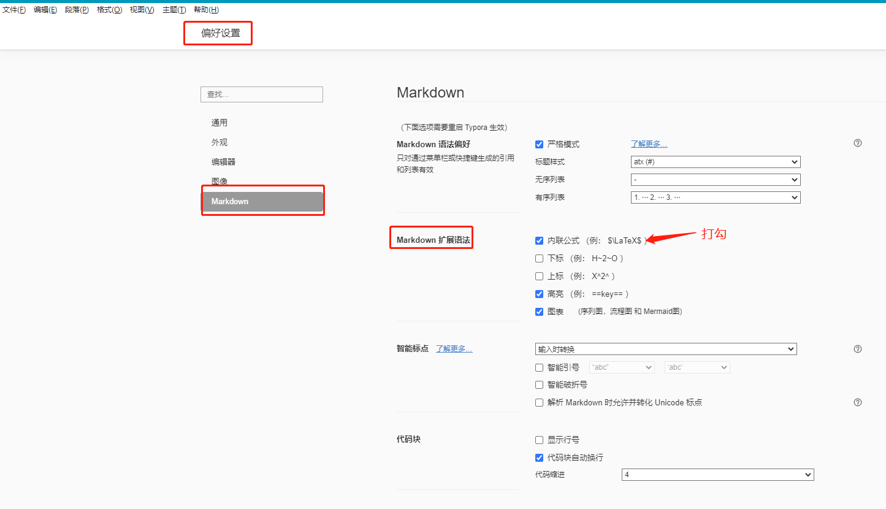

## 引言

作为**开发者**，你还在用 Word、Txt 去记录日常事项和文档吗？

你是否在编写这些文档的时候发现页面样式单一，显示杂乱。而且在引用代码时还会有各种各样的格式问题？

作为**汇报者**，你还在用 PPT、Excel 去展示文档吗？

你是否在引入图片或表格时发现风格不一，显示无章，每次都需要动手调整很久。而且大家的汇报文档长得都一样，毫无特色。

作为**应聘者**，你还在用 Word、PDF 去转换简历吗？

你是否在对齐，颜色，文本样式上花了大量的时间去折腾 Office 三件套。而且做出来的简历还平平无奇，难以被认可。

接下来我介绍的这款 Markdown 工具，或者可以有效解决这些难题。

无论你是学生，抑或是工作三五年的互联网打工人，还是像教师、公务员这样经常需要写文档和报告的群体。**只要你写过了 Markdown 样式的文档，就一定会爱不释手**。


## 什么是Markdown？

Markdown 是一种轻量标记语言，和 Word、PDF、HMTL 格式一样，可以用作文章或者网页的格式。


和其它的格式相比，Markdown 具备以下优势：

1. 易学易用，逼格满满；
2. 格式简洁，辨识度高，功能强大，不仅可平替掉 Office 三件套（Word、Excel 和 PPT），还能快速转换成 PDF、HTML 等格式文本；
3. 广泛应用于绝大多数互联网平台，如 GitHub、Wikipedia、公众号、知乎等。


## Typora 是什么？

Typora 是目前市面上最好用的 Markdown 编辑器工具，就像 Office 对于 Word 一样 。

从 Typora1.0 版本开始，该编辑器需要付费使用，官方下载地址：https://link.zhihu.com/?target=https%3A//typora.io/

虽然免费且未激活的比付费版本功能稍微差一些，但我们只简单使用编辑文档的话，免费 Beta 版已经够用了。

免费版的软件安装包已经分享在文末的百度盘子里了，需者自取。


## 常用操作

安装完成以后，我们可以打开 Typora 学习 Markdown 格式。


#### 1. 标题

Typora 一共有六级标题

``` go
# 一级标题                   快捷键  ctrl+1
## 二级标题                  快捷键  ctrl+2
### 三级标题                 快捷键  ctrl+3
#### 四级标题                快捷键  ctrl+4
##### 五级标题               快捷键  ctrl+5
###### 六级标题              快捷键  ctrl+6
正文内容					 快捷键  ctrl+0 清除标题变为普通文本
```

`# + 空格 + 标题内容` 是一级标题，`## + 空格 + 标题内容` 是二级标题，以此类推一直到六级标题。

> PS：# 后面一定要跟空格，或者用鼠标选择标题文字后用 `ctrl+数字`快捷键来设置标题

效果如下：

# 一级标题                   快捷键  ctrl+1
## 二级标题                  快捷键  ctrl+2
### 三级标题                 快捷键  ctrl+3
#### 四级标题                快捷键  ctrl+4
##### 五级标题               快捷键  ctrl+5
###### 六级标题              快捷键  ctrl+6


#### 2. 列表

##### 2.1 有序列表

``` go
1. 一级有序列表              快捷键 ctrl+shift+[
2. 一级有序列表	           快捷键 一级有序列表下按回车
      二级有序列表           快捷键 换行后，按Tab，从一级自动调整为二级列表
3. 一级有序列表			   快捷键 换行后，按shift+Tab，从二级自动调整为一级列表
```

`数字 + 小数点 + 空格` 是一级有序列表的格式，也可以在该行使用快捷键 `ctrl+shift+[` 来设置有序列表。

如果想要跳出列表可以连续按两次回车，或向下的方向键【**注意，此时该行后面不能有内容，否则会自动转换为列表**】，效果如下：

> 1. 动物
>    1. 猴子
>    2. 大象
> 2. 植物
>    1. 向日葵
>    2. 荷花
>
> 石头
>
> 芭蕉


##### 2.2 无序列表

``` go
* 一级无序列表              快捷键 ctrl+shift+]
* 一级无序列表	          快捷键 一级有序列表下按回车
     二级无序列表           快捷键 换行后，按Tab，从一级自动调整为二级列表
* 一级有序列表			  快捷键 换行后，按shift+Tab，从二级自动调整为一级列表
```

`星号 + 空格 + 内容` 是一级无序列表格式，也可以在该行使用快捷键 `ctrl+shift+]` 来设置无序列表。和有序列表一样，想要跳出列表可以连续按两次回车，或向下的方向键，效果如下：

> * 动物
>   * 猴子
>   * 大象
> * 植物
>   * 向日葵
>   * 荷花
>
> 石头
>
> 芭蕉


##### 2.3 任务列表

``` go
- [ ] 一级任务列表              无快捷键
- [ ] 一级无序列表	          快捷键 一级任务列表下按回车
     	二级无序列表            快捷键 换行后，按Tab，从一级自动调整为二级列表
- [ ] 一级有序列表			  快捷键 换行后，按shift+Tab，从二级自动调整为一级列表
```

`短横线 + 空格 + 左中括号 + 空格 + 右中括号 + 内容` 是一级任务列表格式，和有序列表一样，想要跳出列表可以连续按两次回车，或向下的方向键，效果如下：

> - [ ] 动物
>   - [ ] 猴子
>   - [ ] 大象
> - [ ] 植物
>   - [ ] 向日葵
>   - [ ] 荷花
>
> 石头
>
> 芭蕉


### 3. 段落

#### 3.1 代码块

在软件文档的编写里，最重要的部分就是**代码块**的展示格式。

在 Typora 里，代码块的格式为 ```` + 空格 + {编程语言}`：

``` go
​``` go go语言的代码块内容      快捷键 ctrl+shift+k
​``` java java语言的代码块内容  快捷键 ctrl+shift+k
```

````（ESC下面的英文符号） + 空格 + {编程语言}`是代码块的格式，或者用快捷键 `ctrl+shift+k` 引用一段代码块。想要跳出引用块可以按回退键，或向下的方向键，效果如下：

> ``` c
> include<stdio.h>
>     int main()
> {
>     prinf("hello world");
>     return 0;
> }
> ```


#### 3.2 引用块

``` go
> 引用块1					    快捷键 ctrl+shift+Q
>> 引用块2						快捷键 引用块1下继续使用ctrl+shift+Q
>>> 引用块3					快捷键 引用块2下继续使用ctrl+shift+Q
```

`大于号 + 空格 + 内容` 是引用块的格式，和代码块一样，想要跳出引用块可以按回退键，或向下的方向键，效果如下：

> 引用块1
>
> > 引用块2
> >
> > > 引用块3


#### 3.3 数学公式块

数学公式块比较复杂，需要对 math 类函数进行操作，文档链接：https://support.typoraio.cn/zh/Markdown-Reference/

基本语法：

``` go
$$+回车，输入math语法，如：
\mathbf{V}_1 \times \mathbf{V}_2 =  \begin{vmatrix} 
\mathbf{i} & \mathbf{j} & \mathbf{k} \\
\frac{\partial X}{\partial u} &  \frac{\partial Y}{\partial u} & 0 \\
\frac{\partial X}{\partial v} &  \frac{\partial Y}{\partial v} & 0 \\
\end{vmatrix}
```

效果如下：
$$
\mathbf{V}_1 \times \mathbf{V}_2 =  \begin{vmatrix} 
\mathbf{i} & \mathbf{j} & \mathbf{k} \\
\frac{\partial X}{\partial u} &  \frac{\partial Y}{\partial u} & 0 \\
\frac{\partial X}{\partial v} &  \frac{\partial Y}{\partial v} & 0 \\
\end{vmatrix}
$$

$$
\mathbf{V}_1 \times \mathbf{V}_2 =  \begin{vmatrix} 
\mathbf{i} & \mathbf{j} & \mathbf{k} \\
\frac{\partial X}{\partial u} &  \frac{\partial Y}{\partial u} & 0 \\
\frac{\partial X}{\partial v} &  \frac{\partial Y}{\partial v} & 0 \\
\end{vmatrix}
$$


注意，数学公式块需要先在勾选内联公式，重启 Typora 后才能显示出效果：


### 4. 表格

在文档里插入表格：

``` gas
|语文|数学|英语| + 回车			  快捷键 ctrl+T
新增一行						 快捷键 ctrl+回车
```

通过 `竖线+列名+竖线+列名+竖线` 可添加表格，也可以用快捷键 `ctrl+T` 新增，效果如下：

| 语文 | 数学 | 英语 |
| ---- | ---- | ---- |
| 89   | 99   | 86   |
| 87   | 78   | 98   |


### 5. 图片

在文档里新增图片：

``` go
			快捷键 ctrl+shift+i
```

新增图片的格式为 `英文感叹号+左中括号+图片名称+右中括号+左小括号+图片路径+右小括号`，或者用快捷键 `ctrl+shift+i`，直接输入图片名称和路径。

同时，Typora 还支持直接复制一张图片到文档中。但需要注意，Typora 的图片是引用图片的路径来显示的，所以当文档发送给别的用户后，图片就看不到了，解决这个问题可以用图片相对路径。

**配置：文件 -> 偏好设置 -> 图像 -> 优先使用相对路径**


发送文档时，把装有图片的目录也发送给别人，这样其它用户在打开文档时，就能正常加载图片了。比如，像笔者这样，在每一个文档的同级目录下都新建一个 `imgs` 文件夹：


文档中引用图片时，使用相对路径：


### 6. 超链接

当文档中需要为某段文字添加超链接时，Typora 支持两种实现方式，以及文档内跳转和文档外跳转两种类型。

#### 6.1 利用 Markdown 语法实现

##### 1）文档外链接跳转

``` go
[文本内容](超链接URL)			例如：[百度一下](www.baidu.com)
```

添加文档外的超链接，Markdown 的格式是 `左中括号+文本内容+右中括号+左括号+URL+右括号`，效果如下：

> [百度一下](www.baidu.com)

注意：我们在编写 Markdown 文档时，需要把鼠标放在链接内容上，按住 Ctrl 键点击链接才可以跳转。


##### 2）文档内跳转

文档内部跳转的格式和外部链接类似，不同的是 Markdown 格式下，内部链接跳转只支持跳转到标题：

``` go
[文本内容](#6.-超链接)
```

添加文档内的超链接，Markdown 格式是 `左中括号+文本内容+右中括号+左括号+#+标题+右括号`，注意：标题中的空格需要用中横线 “-” 代替，效果如下：

> [点击我跳转到【6. 超链接】标题位置](#6.-超链接)


#### 6.2 利用 HTML 语法实现

##### 1）文档外链接跳转

Typora 很强的一点就是，它完美支持了 HTML 的很多语法，比如：我们可以用标签 <a> 添加超链接

``` go
<a href="www.baidu.com">百度一下</a>
```

HTML 语法中，超链接用标签 `<a>` 表示，`href` 放入超链接地址，即可访问。效果如下：

> <a href="www.baidu.com">百度一下</a>


##### 2）文档内跳转

文档内部跳转的格式和外部链接类似，但是需要自己在文档内需要跳转的地方添加一个标签。同时，HTML 语法链接跳转支持跳转到**内部任意位置**：

``` go
<span name="tag1">跳转到我这里</span>
<a href="#tag1">点击我跳转到标签位置</a>
```

HTML 语法里面，`span` 元素是短语内容的通用行标识器，没有特殊语义，相当于给我们跳转的位置加了个唯一标识，让 `<a>` 链接知道我们想要跳转到哪里。<span name="back">效果如下</span>：

<a href="#end">点击跳转到文档尾部</a>


### 7. 文本+表情

##### 1）删除线

``` go
~~文字内容~~          快捷键 Alt+Shift+5
```

效果：

~~删除线~~


##### 2）斜体

``` go
*文字内容*             快捷键 Ctrl+I
```

效果：

*斜体*


##### 3）加粗

``` go
**文本内容**            快捷键 Ctrl+B
```

效果：

**文本内容已加粗展示**


##### 4）下划线

``` go
<u>文本内容</u>          快捷键 Ctrl+U
```

效果：

<u>下划线</u>


##### 5）表情符号

Typora 支持输出表情符号，语法是 `英文冒号+表情英文`，常见表情如下：

``` go
:smile // 微笑
:star  // 星星
:dog   // 旺财
```

效果：

:smile:
:star:
:dog:


##### 6）高亮

高亮是 Markdown 文档用来让文字更醒目的标记：

``` go
==文本内容==                快捷键 Ctrl+Shift+H
```

注意，第一次使用 Typora 时，高亮是默认不显示的。我们需要在 文件 -> 偏好设置中勾选开启高亮：


效果：

==文本内容已高亮展示==


### 8. Markdown主题

#### 8.1 Typora 默认主题

这时，聪明好学的朋友可能发现了，这篇文档中的加粗字体颜色，引用背景色、高亮颜色等，为什么和自己电脑里的 Markdown 样式不同呢？

这就是 **Typora主题** 的区别了！

Typora 为我们提供了多种文档主题可供选择，具体可在文档页面的左上角：主题(T) -> 选择你喜欢的主题。


#### 8.2 DIY 主题

除了 Typora 为我们提供的多种默认主题，我们还可以 DIY 自己的主题风格，Typora 和 HTML 的样式一样，都是用 `.css` 文件配置的：


打开我们的主题文件夹，修改目前使用的主题样式，或者从 github.css 复制一个【由于我们的主题风格会模仿 “思否” 网站的样式，所以将复制文件 `github - 副本.css` 改名为 `sifou.css`】：


在 `.css` 文件中，我们可以

##### 1）设置文档的字体大小


##### 2）修改标题大小和颜色


##### 3）字体加粗样式


比如文档中的加粗颜色为绿色【#00965e】，字体为 1.1em 大小。

> 颜色代码查询：https://htmlcolorcodes.com/zh/yanse-ming/


##### 4）还有高亮，代码块等样式设计


#### 8.3 推荐两款主题

我自己使用的主题，一款是思否的绿色清新主题，一款是在 `pie` 和 `ursine-polar` 基础上修改的商务风主题。

##### 1）思否主题概览【本文档用的】


##### 2）`ursine-polar` 商务风主题概览


这两种主题，我都已经放到我的 GitHub 和百度网盘里了，需要的可以自取。

> GitHub地址：
>
> 网盘地址：链接：https://pan.baidu.com/s/1n7Szy7OrnXlPzsMTrCiypA，提取码：qsac

后续找到更精美或者 DIY 出不同的风格主题时，会直接评论在同名 WXGZH 文章下面，有需要的可以关注一波。


### 9. 参考链接

**十分钟玩转 Typora：**https://zhajianliang.github.io/2020/05/28/markdown%E8%AF%AD%E6%B3%95%E4%B9%8Btypora%E4%B8%80%E6%AC%BE%E5%BE%88%E5%A5%BD%E7%94%A8%E7%9A%84%E7%BC%96%E8%BE%91%E5%99%A8,%E6%95%99%E4%BD%A010%E5%88%86%E9%92%9F%E7%8E%A9%E8%BD%ACtypora/

**Markdown语法大全：**https://support.typoraio.cn/zh/Markdown-Reference/

**精美的Typora主题：**https://zhuanlan.zhihu.com/p/133863913


<span name="end">文档尾部</span>

<a href="#back">点击跳转回刚才的位置</a>